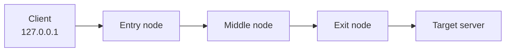
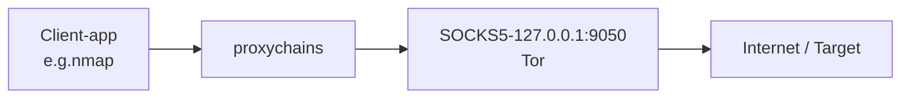

# TryHackMe – TOR, Proxychains & Tor Browser

---

## 0. Summary

**Goal of the room**: learn how to route traffic through the Tor network for anonymity, how to chain proxies with `proxychains`, and how to use Tor Browser safely.

**Key ideas**

* Tor provides **network‑level anonymity** by bouncing your traffic through multiple volunteer relays.
* `proxychains` forces arbitrary TCP‑based tools (e.g. `nmap`, `curl`, `firefox`) to use a proxy such as Tor’s local SOCKS5 listener.
* Tor Browser is a hardened Firefox + Tor bundle for web browsing; all traffic is already routed over Tor.
* Correct configuration is critical: DNS leaks or misconfigured chains can deanonymise you.

---

## 1. Threat model & high‑level view

### 1.1 What Tor gives you

Tor (The Onion Router) is a low‑latency anonymity network:

* Builds a **circuit** of typically 3 relays:

  * **Entry (guard) node** – sees your real IP, but not your final destination.
  * **Middle node** – just forwards encrypted cells.
  * **Exit node** – sees plaintext to the destination (unless you use end‑to‑end crypto like HTTPS), but not who you are.
* Uses layered encryption so each hop only knows **from whom** it got the packet and **to whom** it should send next.



Tor helps against:

* Local observers (ISP, campus network, hotel Wi‑Fi) linking you to specific sites.
* Simple IP‑based blocks and rate limits during **authorised** black‑box testing.

Tor does **not** magically solve:

* Browser fingerprinting / account‑level identity.
* Malware on your own host.
* Application‑layer identifiers (logins, cookies, custom headers, etc.).

For security work: Tor is a way to **separate your testing IP space from your personal one**, not a license to attack random targets.

---

## 2. Unit 1 – Tor service basics (CLI)

### 2.1 Install Tor on Debian/Ubuntu/Kali

```bash
sudo apt-get update
sudo apt-get install tor torsocks -y
```

Core components:

* `tor` – the daemon that talks to the Tor network.
* `torsocks` – wrapper to transparently send a program’s traffic over Tor (alternative to `proxychains`).

### 2.2 Service management

```bash
# Start Tor
sudo service tor start

# Check status
sudo service tor status

# Stop Tor
sudo service tor stop
```

On systemd systems you can also use:

```bash
sudo systemctl start tor
sudo systemctl status tor
sudo systemctl stop tor
```

Typical default listener:

* SOCKS5 proxy on `127.0.0.1:9050` (used later by `proxychains`).

Quick connectivity check from the box:

```bash
# Simple check through torsocks
sudo apt-get install curl -y

TORSOCKS_CONF_FILE=/etc/tor/torsocks.conf \
  torsocks curl https://check.torproject.org/
```

---

## 3. Unit 2 – Proxychains

### 3.1 Conceptual overview

`proxychains` is a **user‑space shim** that intercepts TCP `connect()` calls from an application and forces them through one or more proxies (SOCKS4/5, HTTP, HTTPS).



Why it matters for offensive security:

* Lets you run recon tools (e.g. `nmap -sT`, `nikto`, `wfuzz`, `sqlmap`) over Tor without those tools natively supporting SOCKS proxies.
* You can define **chains** of multiple proxies for extra indirection.

> Limitation: `proxychains` only handles **TCP**. Raw‑socket scans (e.g. `nmap -sS`, `ping`, many UDP tools) will not work through it.

### 3.2 Install proxychains

```bash
sudo apt-get install proxychains -y
```

On some distros the binary is `proxychains4`, but config concepts are identical.

### 3.3 Configure `/etc/proxychains.conf`

Open the config:

```bash
sudo nano /etc/proxychains.conf
```

Core changes used in the room:

1. **Chain type** – only keep `dynamic_chain` uncommented:

```conf
# proxychains.conf  VER 3.1

# dynamic_chain
# Strict - all proxies must be up, otherwise fail
#strict_chain

# Random - choose a random subset of proxies per connection
#random_chain

# For the room we use:
dynamic_chain
```

`dynamic_chain` semantics:

* Use proxies **in order**, skipping dead ones.
* More practical than `strict_chain` (which fails as soon as one proxy in the chain is down).

2. **Prevent DNS leaks** – uncomment `proxy_dns`:

```conf
proxy_dns  # resolve hostnames through the proxy chain
```

Without this, your system resolver (e.g. ISP DNS) might see all the domains you query, even though HTTP traffic goes through Tor.

3. **Define Tor as a SOCKS5 proxy** – at the bottom of the file:

```conf
[ProxyList]
# add proxy here ...
# meanwile
# defaults set to "tor"

socks5  127.0.0.1 9050
```

Save & exit:

* In `nano`: `Ctrl+O` (write), `Enter`, then `Ctrl+X`.

### 3.4 Using proxychains

Always prefix your command with `proxychains`:

```bash
# Start Tor if not already active
sudo service tor start

# Open Firefox through Tor
proxychains firefox

# Check external IP / DNS
proxychains firefox https://dnsleaktest.com/

# Example: TCP connect scan through Tor
proxychains nmap -sT -Pn -n  TARGET_IP

# Example: grab a page with curl via Tor
proxychains curl https://ifconfig.me/
```

Signs things are working:

* The terminal shows `|D-chain| 127.0.0.1:9050 <=> <exit-ip>:443 <=> OK` lines.
* Websites like `https://ifconfig.me` or `https://dnsleaktest.com` show a **Tor exit IP** and **non‑local DNS resolvers**.

### 3.5 Common pitfalls

* Forgetting to start the Tor service → connection timeouts.
* Mis‑editing `/etc/proxychains.conf` (commenting out the `socks5` line) → traffic is not proxied.
* Using scan types that don’t use TCP `connect()` (e.g. `nmap -sS`, raw ICMP) → they simply won’t be proxied.
* Assuming Tor makes you “untraceable” → traffic analysis, bad OPSEC or logging into personal accounts can still deanonymise you.

---

## 4. Unit 3 – Tor Browser

Tor Browser is a **pre‑configured Firefox + Tor** bundle maintained by the Tor Project.

Characteristics:

* All traffic automatically routed over Tor.
* Uniform user‑agent and fingerprinting‑resistant settings to make users look similar.
* Hardened privacy defaults (first‑party isolation, strict cookie policy, NoScript integration, etc.).

### 4.1 Install (general idea)

High‑level flow (host OS may differ):

1. Download Tor Browser from the official site: `https://www.torproject.org/`.
2. Verify signature if you care about supply‑chain integrity.
3. Extract and run the `start-tor-browser` launcher.

On some Linux distros there is also a `torbrowser-launcher` package.

### 4.2 Security Level: “Safer” (Level 2)

The room asks to set the security slider to **Level 2 – Safer**:

* Disables some JavaScript features on non‑HTTPS sites.
* Blocks some audio/video and JIT features that increase attack surface.
* Still usable for most modern websites.

Where: **hamburger menu → Settings → Privacy & Security → Security Level**.

### 4.3 Onion services (hidden services)

* Sites accessible only inside the Tor network, identified by a `.onion` address.
* Provide **mutual anonymity**: the user doesn’t know the physical location of the server, and the server doesn’t see the user’s real IP.

Example from the room:

* `https://duckduckgogg42xjoc72x3sjasowoarfbgcmvfimaftt6twagswzczad.onion/` → DuckDuckGo’s onion search service.

Use‑cases in offensive security:

* Safely access OSINT resources or paste sites without linking queries to your real IP.
* Communicate with infrastructure that is intentionally kept off the clearnet.

---

## 5. Operational hygiene for pentesters

Some practical rules of thumb when using Tor + proxychains for **authorised testing**:

* **Scope first**: only target systems you are explicitly authorised to test.
* **Segregate personas**: do not mix personal browsing sessions with assessment work in the same Tor Browser profile or circuit.
* Avoid logging into personal accounts (email, social media, banking) over the same Tor context you use for testing.
* Expect some targets to **block Tor exits** completely; have non‑Tor paths ready (VPN, client IP allow‑listing) for when anonymity is not required.
* Be aware of speed: Tor adds latency and reduces bandwidth; plan scans accordingly (fewer concurrent connections, focused scopes).

---

## 6. Quick command recap

```bash
# Install
sudo apt-get update
sudo apt-get install tor torsocks proxychains -y

# Tor daemon
sudo service tor start
sudo service tor status
sudo service tor stop

# Edit proxychains config
sudo nano /etc/proxychains.conf
  # -> enable dynamic_chain
  # -> enable proxy_dns
  # -> ensure: socks5 127.0.0.1 9050

# Run tools through Tor
proxychains firefox
proxychains curl https://ifconfig.me/
proxychains nmap -sT -Pn -n TARGET_IP
```

---

## 7. EN–ZH technical glossary

| Term                           | 中文对应           | Notes                                                  |
| ------------------------------ | -------------- | ------------------------------------------------------ |
| Tor (The Onion Router)         | 洋葱路由 / Tor 网络  | Low‑latency anonymity network                          |
| onion service / hidden service | 洋葱服务 / 隐藏服务    | `.onion` sites only reachable via Tor                  |
| relay / node                   | 中继节点           | Generic Tor node in a circuit                          |
| entry / guard node             | 入口节点 / 守门节点    | First hop that sees your real IP                       |
| middle node                    | 中间节点           | Only forwards encrypted traffic                        |
| exit node                      | 出口节点           | Last hop that connects to the destination              |
| SOCKS5 proxy                   | SOCKS5 代理      | Generic TCP proxy protocol used by Tor                 |
| proxy chain                    | 代理链            | Sequence of proxies in `proxychains`                   |
| proxychains                    | proxychains 工具 | LD_PRELOAD‑based tool to force traffic through proxies |
| dynamic_chain                  | 动态链模式          | Skip dead proxies, keep order                          |
| strict_chain                   | 严格链模式          | All proxies must be up, no skipping                    |
| random_chain                   | 随机链模式          | Random subset of proxies per connection                |
| DNS leak                       | DNS 泄露         | Real DNS resolver sees queried domains                 |
| black‑box testing              | 黑盒测试           | Testing without internal knowledge of the system       |
| OPSEC (operational security)   | 行动安全           | Practices that prevent deanonymisation                 |
