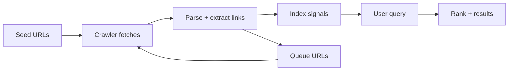

---

platform: tryhackme
room: Google Hacking
slug: google-hacking
path: notes/00-foundations/google-dorking.md
topic: 10-web
domain: [osint, web-recon]
skills: [search-engines, crawling-indexing, seo-basics, robots-sitemaps, google-dorking]
artifacts: [concept-notes, pattern-cards, cookbook]
status: done
date: 2026-02-28
---

0. Summary

* Search engines are *public, large-scale indexes* built by crawlers/spiders that fetch URLs, parse content, and store signals for retrieval.
* “Google dorking” is precision querying with operators (`site:`, `filetype:`, `intitle:`…) to shrink search space and surface exposed content.
* `robots.txt` controls *crawling behavior* (advisory), not access control; blocked URLs can still appear as “URL-only” results. Don’t treat robots as a secrecy mechanism.
* `sitemap.xml` accelerates discovery by listing canonical URLs; it has hard size/URL limits and supports sitemap index files.
* Defensive takeaway: periodically “dork your own org” to find exposures before others do.

1. Key Concepts (plain language)

1.1 Crawl → index → rank → serve (the pipeline)

* Crawling: fetch pages and discover new URLs.
* Indexing: extract content + metadata and store it in an index.
* Ranking: choose ordering of results based on relevance signals.
* Serving: return results for a query.



Key vocabulary

* Crawler/Spider: automated agent visiting URLs.
* Spidering: recursively following discovered links.
* Index: database mapping terms/signals → documents.
* SERP: Search Engine Results Page.

1.2 Google operators: what works and what drifts

Reality check:

* Google does not provide a single, complete, stable list of every operator.
* Operator support changes over time; some are “best-effort” and can be unreliable.
* Use Google’s Advanced Search UI as a reality anchor (it reflects supported query constraints).

Operator families you should actually use

* Exact / boolean control

  * Exact phrase: `"some phrase"`
  * Exclude term: `-term`
  * Grouping: `(A OR B)`

* Scope reduction (the most important step)

  * Domain/site scope: `site:example.com`
  * URL field: `inurl:admin` / `allinurl: ...`
  * Title field: `intitle:login` / `allintitle: ...`

* Artifact targeting

  * File types: `filetype:pdf` (or `ext:pdf` in some contexts)

Important nuance for `filetype:`

* It filters by file type/extension and indexable formats. If Google doesn’t index a format, `filetype:` won’t help.

1.3 robots.txt (Robots Exclusion Protocol; advisory)

What it is

* A plain text file at the *origin root* that provides crawl guidance to compliant bots.
* It is not authorization. Malicious bots can ignore it.

Where it lives

* `https://TARGET_DOMAIN/robots.txt`
* Scope is per *scheme + host + port* (each origin has its own rules).

Core directives you’ll see

* `User-agent:` bot name (or `*`)
* `Allow:` allow-path exception
* `Disallow:` disallow-path prefix
* `Sitemap:` optional sitemap pointer

Common security misunderstanding

* robots.txt cannot “hide” a sensitive endpoint. It can reduce crawl traffic, but it can also reveal interesting paths.

Practical OSINT heuristic

* Treat `Disallow:` entries as *high-signal leads* (admin panels, backups, staging, old paths). Verify carefully and ethically.

1.4 Meta robots and X-Robots-Tag (index control)

Crawling vs indexing

* `Disallow` controls crawling.
* “noindex” controls indexing (but only works if the crawler can fetch the page to see the directive).

Operational consequence

* If you block a page via robots.txt, Googlebot won’t crawl it and therefore won’t read `noindex` on the page.
* If you allow crawling but set `noindex`, Google can crawl and then drop it from results.

1.5 sitemap.xml (Sitemaps Protocol)

What it is

* An XML (or alternative supported formats) listing of URLs you want search engines to discover.

Limits (practical)

* Single sitemap: up to 50,000 URLs or 50MB uncompressed.
* Large sites: split into multiple sitemaps and publish a *sitemap index*.

Why it matters

* Sitemaps reduce discovery cost for crawlers and help with crawl efficiency.

1.6 Ethical boundary (OSINT vs intrusion)

* OSINT (including dorking) uses publicly reachable information.
* Crossing the line typically happens when you attempt access to restricted resources, mass-download sensitive data, or exploit what you find.
* In public notes: do not publish real targets or sensitive URLs; use placeholders.

2. Pattern Cards (generalizable)

2.1 Query design card (minimize → sharpen)

* Step 1: reduce scope

  * `site:TARGET_DOMAIN`
* Step 2: choose intent

  * `inurl:admin` / `intitle:login` / `"index of"`
* Step 3: focus artifact type

  * `filetype:pdf`, `filetype:sql`, `filetype:env`
* Step 4: add keywords (business-specific)

  * `"confidential"`, `"password"`, `"backup"`, `"api key"`

2.2 “robots + sitemap first” card

* Check early:

  * `https://TARGET_DOMAIN/robots.txt`
  * `https://TARGET_DOMAIN/sitemap.xml` (and any `Sitemap:` lines in robots)
* Extract interesting paths, then validate via dorks:

  * `site:TARGET_DOMAIN inurl:<path>`

2.3 Sensitive filetype shortlist (defensive awareness)

* Config/secrets: `env`, `ini`, `conf`, `yml`, `yaml`, `properties`
* Data dumps: `sql`, `bak`, `db`, `sqlite`, `csv`, `json`
* Keys/certs: `pem`, `key`, `pfx`, `p12`, `crt`
* “internal docs”: `pdf`, `docx`, `xlsx`, `pptx`

2.4 Defensive remediation mapping

* If it’s publicly accessible, fix at source:

  * move secrets out of web root
  * add authn/authz
  * add `noindex`/`X-Robots-Tag` where appropriate
  * remove/rotate exposed credentials

3. Command Cookbook (placeholders only)

3.1 Operator templates

```text
# Domain scoping
site:TARGET_DOMAIN

# Login pages
site:TARGET_DOMAIN intitle:login

# Directory listings
site:TARGET_DOMAIN intitle:"index of"

# Public docs
site:TARGET_DOMAIN filetype:pdf

# Backups and dumps (triage)
site:TARGET_DOMAIN (filetype:bak OR filetype:sql OR filetype:zip OR filetype:7z)

# Common secret markers (triage)
site:TARGET_DOMAIN ("BEGIN PRIVATE KEY" OR "AKIA" OR "DATABASE_URL" OR ".env")

# Narrow to a path prefix
site:TARGET_DOMAIN inurl:/admin/

# Exact phrase on a domain
site:TARGET_DOMAIN "incident report"
```

3.2 robots + sitemap retrieval

```bash
curl -s https://TARGET_DOMAIN/robots.txt | sed -n '1,200p'
curl -s https://TARGET_DOMAIN/sitemap.xml | sed -n '1,200p'
```

3.3 Defensive self-audit (run on your own assets)

```text
site:YOUR_DOMAIN filetype:env
site:YOUR_DOMAIN (filetype:sql OR filetype:bak)
site:YOUR_DOMAIN intitle:"index of" "backup"
site:YOUR_DOMAIN "BEGIN PRIVATE KEY"
```

4. Evidence (sanitized; assets/)

* This note was expanded from a walkthrough transcript provided by the user.
* If you later add screenshots, store under `assets/` and redact:

  * real domains (unless they are your own)
  * user identifiers
  * unique query outputs that expose sensitive paths

5. Takeaways

* Indexing turns “unknown paths” into “search queries.” Attackers can recon at scale with no scanning.
* The strongest dorks are not complicated; they are *well scoped*.
* robots.txt is not a lock; it is public metadata and often a recon hint.
* Defensive action item: schedule periodic “self-dorking” and treat findings like vuln reports.

6. References (official/docs-first; list titles in public notes)

* Google Search: Advanced Search page
* Google Search Central: File types Google can index (mentions `filetype:` operator)
* Google Search Central: Introduction to robots.txt
* Google Search Central: How Google interprets the robots.txt specification
* Robots Exclusion Protocol: RFC 9309
* Sitemaps Protocol: sitemaps.org
* Google Search Central: Build and submit a sitemap + sitemap index files
* Google Search Central: Control what you share on Search (noindex, robots meta, X-Robots-Tag)

CN–EN Glossary (mini)

* Search engine: 搜索引擎
* Crawler / spider: 爬虫/蜘蛛
* Spidering: 链接遍历
* Indexing: 建索引/索引化
* Ranking: 排名/排序
* SEO: 搜索引擎优化
* Operator: 搜索操作符
* robots.txt: 爬虫规则文件
* REP (Robots Exclusion Protocol): 机器人排除协议
* Sitemap: 网站地图
* noindex: 不收录指令
* X-Robots-Tag: HTTP 层机器人指令头
* OSINT: 开源情报
