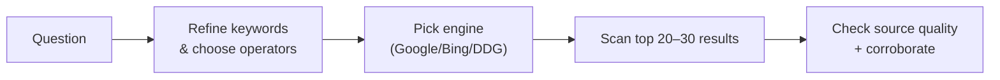

# Search Skills — TryHackMe Room Notes

> Room: **Search Skills** (TryHackMe)

> Focus: searching efficiently, assessing sources, and finding security‑relevant information.


---

## 0. High‑level summary

This room is about **search as a skill**, not just "typing into Google". Core ideas:

* Evaluate the **quality** of information, not only relevance.


* Use search operators to **control** what the engine returns.


* Leverage **specialized search engines** for devices, malware, and breaches.


* Track security issues via **CVE / NVD / Exploit‑DB / GitHub**.


* Use **manual pages and vendor docs** as primary technical references.


* Treat **social media and news** as both intel feeds and attack surface.


Goal: move from "I kind of remember reading that somewhere" to a repeatable **search workflow** you can apply in any security context.


---

## 1. Evaluating search results

Internet rule: **anyone can publish; very few are authoritative.**


When you land on a page, sanity‑check it quickly:


1. **Source (来源)**

   * Who runs this? Individual, company, vendor, university, random blog?


   * Is the author known in the field? Any contact/about page?


2. **Evidence & reasoning (证据 & 论证)**

   * Are there **concrete facts** (data, code, RFCs, CVEs, docs) or just vibes?


   * Is the logic consistent, or are there big leaps like "X therefore bank‑grade security"?


3. **Objectivity & bias (客观性 & 偏见)**

   * Is this secretly **marketing** or tribal flame‑war ("my framework vs yours")?


   * Look for strong claims with **no counter‑arguments** → red flag.


4. **Corroboration & consistency (佐证 & 一致性)**

   * Can you find at least **2–3 independent sources** that agree on the core point?


   * For commands/configs, you can often just **test in a lab** to confirm.


### Room check‑ins

* **Snake‑oil cryptography** = cryptographic methods/products that *claim* to be secure without solid design, peer review, or proofs.


* On modern Linux, `netstat` is largely replaced by **`ss` (socket statistics)**.


---

## 2. General search engines & operators

Most engines support a similar set of operators. On Google (and usually Bing/DuckDuckGo):


| Operator    | Example                                   | Effect                          |
| ----------- | ----------------------------------------- | ------------------------------- |
| `"phrase"`  | `"passive reconnaissance"`                | Match exact phrase only         |


| `site:`     | `site:tryhackme.com "Linux Fundamentals"` | Restrict to a domain            |


| `-term`     | `pyramids -tourism`                       | Exclude results containing term |


| `filetype:` | `filetype:ppt "cyber security"`           | Return specific file types      |


| `intitle:`  | `intitle:"SQL injection" cheat sheet`     | Require term in page title      |


> Example: *"Limit Google search to PDF files containing cyber warfare"*


> → `filetype:pdf "cyber warfare"`

### Search workflow (concept)



### Mini operator cheat sheet

```text
"exact phrase"        tighten vague concepts
site:example.com       limit to one domain
-site:example.com      explicitly exclude a domain
filetype:pdf           PDFs (reports, theses, slides)
filetype:xls OR xlsx   spreadsheets (breach dumps, stats)

( ) and OR             combine logic: ("cve-2024" OR "cve2024") exploit
```

---

## 3. Specialized search engines

### 3.1 Shodan — devices on the public Internet

* Think of Shodan as **Google for networked devices**:


  * Exposed services: HTTP(S), SSH, RDP, MQTT, industrial protocols, CCTV, etc.


  * Queries match **banner data** and metadata (headers, ports, geolocation, org, vulns).


* Typical uses (with permission!):

  * Count how many hosts run a specific server/version (e.g. `"Apache/2.4.1"`).


  * Find services with dangerous defaults (e.g. unauthenticated RDP/VNC).


  * Enumerate what your own organization exposes to the Internet.


Example Shodan dorks:

```text
http.title:"Login" country:"US"

product:"OpenSSH" port:22

vuln:CVE-2014-0160        # Heartbleed
org:"Example Corp"        # Attack surface of one org
```

Use cases: **attack surface mapping, IoT/ICS exposure, quick risk snapshots.**


> Legal reminder: treating Shodan like a telescope is fine; treating it like a crowbar is not. Only probe or exploit systems you **explicitly have permission** to test.


### 3.2 Censys — Internet assets & certificates

* Similar idea, but focused on **internet‑connected hosts, web properties, and certificates**.


* Strong at:

  * Mapping all hostnames, IPs, and TLS certs for a company.


  * Auditing which ports/services are open across an estate.


  * Detecting unmanaged or rogue assets.


Example ideas:

```text
apache AND services.port:443

parsed.names:*.example.com AND location.country:CN
```

Shodan feels like **"show me devices"**; Censys feels like **"show me internet‑visible assets and relationships"**.


### 3.3 VirusTotal — multi‑AV scanner & reputation

* Upload a **file**, **URL**, **domain**, **IP**, or **hash**.


* VT runs it through many antivirus engines + URL scanners and shows:


  * How many vendors mark it as malicious.


  * Categorization (trojan, phishing, PUA, test file, etc.).


  * Static metadata (imports, strings, file type) and sometimes behavior.


* Great for:

  * Triaging suspicious files/links.
  * Checking if a sample is **already known**.


  * Getting pivot points (similar files, same signer, same domain infra).


Caveats:

* False positives exist, especially on tools, red‑team frameworks, and EICAR‑like test files.


* Public submissions are **shared with the security community**; do not upload truly sensitive data.


### 3.4 Have I Been Pwned (HIBP) — breach & password intel

* Input an **email** or **domain** and check if it appears in known breaches.


* Shows:

  * Which sites leaked the address.
  * What types of data were exposed (passwords, phone, address…).


* Also provides:

  * A massive list of **pwned passwords** to block weak/reused ones.


Use it to:

* Audit your own exposure and reset reused passwords.


* Enforce password hygiene (reject passwords that appear in HIBP lists).


---

## 4. Vulnerabilities & exploits

### 4.1 CVE & NVD

* **CVE (Common Vulnerabilities and Exposures)**

  * A global dictionary of **publicly disclosed vulnerabilities**, each with an ID like `CVE-2014-0160`.


  * Managed by the CVE Program (MITRE + partners).


* **NVD (National Vulnerability Database)**

  * US‑government repository that **builds on CVE**, adding severity (CVSS), affected products (CPEs), and references.


Typical workflow:

1. See a vuln name in a blog / advisory.


2. Look up its **CVE ID**.
3. Check NVD for **severity, affected versions, references, and scoring**.


4. Map that to your asset inventory.


### 4.2 Exploit‑DB & GitHub

* **Exploit‑DB (Exploit Database)**


  * Archive of **public exploits and proof‑of‑concepts**, indexed by CVE where possible.


  * Very common in CTFs and real‑world pentests.


* **GitHub**

  * Hosts a huge number of PoCs, scanners, and exploit frameworks.


  * Quality varies; check stars, issues, last update, and references.


Usage pattern:

```text
1. Identify CVE ID (e.g., from vendor advisory).

2. Read NVD / vendor docs first → understand impact & patches.
3. If you have legal permission to test, search Exploit‑DB / GitHub
   for PoC code and see how exploitation works.

4. Use PoCs only in a lab or during an authorized engagement.
```

---

## 5. Technical documentation as a search target

### 5.1 Linux `man` and `--help`

* `man <command>` → full manual page (sections: NAME, SYNOPSIS, DESCRIPTION, OPTIONS…).


* Many tools also support `-h` or `--help` for a short summary.


Examples:

```bash
man ss              # learn socket statistics options

ip --help           # quick syntax reminder

man 5 crontab       # file format (section 5 = file formats)
```

### 5.2 Vendor & product docs

* **Microsoft Learn** for Windows/AD/PowerShell/Defender.


* Official docs for Apache, Nginx, Snort, Suricata, PHP, etc.


Search patterns:

```text
site:learn.microsoft.com "User Account Control"

site:docs.microsoft.com "netstat" "-b"       # show executable for each connection


"Official documentation" "Apache" "mod_security"
```

Rule of thumb: when behaviour looks weird, **trust the official docs first**, random blog posts later.


---

## 6. Social media & news as data sources

### 6.1 Social media

Useful but dangerous:

* **LinkedIn** — job roles, tech stack, org chart; good for OSINT and also a phishing target map.


* **Facebook/Instagram/X** — personal details, possible answers for "secret questions" (birthplace, school, pets, hobbies).


When doing defensive work:

* Educate users not to post **sensitive internal info** (screenshots, configs, badges).


* Assume attackers will scrape public profiles before phishing.


When doing authorized OSINT/red‑teaming:


* Use social media to **profile a target**, but stick to legal/contract boundaries.


### 6.2 News outlets & threat intel blogs

* Use security‑focused outlets and vendor blogs to track:


  * Major breaches and exploited CVEs.

  * New attack patterns (e.g. supply‑chain attacks, MFA fatigue).

* Combine with **RSS/Twitter/X lists** or newsletters for continuous learning.


---

## 7. Quick search playbook (security‑focused)

```text
1) Define the question in 1–2 sentences.
2) Choose scope:
   - generic web
   - devices/hosts (Shodan/Censys)
   - malware/file reputation (VirusTotal)
   - breach history (HIBP)
3) Build the first query with operators.
4) Skim → discard weak/marketing/SEO garbage.
5) Pin 2–3 high‑quality sources (docs, RFCs, reputable blogs).
6) Cross‑check commands / configs in a lab.
7) Save the best queries & links into your notes.
```

Example scenarios:

* **Find a PoC for a new CVE**
  `"CVE-2024-XXXX" exploit` → filter for GitHub + Exploit‑DB, then check quality.


* **Audit if your email/passwords were in breaches**
  Use **Have I Been Pwned**, then rotate passwords and enable password manager + MFA.


* **Research a command**
  `man <cmd>` + `site:learn.microsoft.com` or `site:man7.org` queries.


---

## 8. Glossary (EN / 简要中文)

* **Search operator** — special keyword like `site:` / `filetype:` that modifies how the engine matches results（搜索运算符）.
* **Snake‑oil cryptography** — crypto systems marketed as secure without solid design, peer review, or proofs（伪加密 / 江湖密码学）.
* **Shodan** — search engine indexing banners of internet‑facing devices and services（联网设备搜索引擎）.
* **Censys** — search engine indexing internet assets (hosts, websites, certs) for attack‑surface management（互联网资产搜索引擎）.
* **VirusTotal (VT)** — multi‑engine malware/URL reputation service（多引擎恶意软件/链接扫描）.
* **Have I Been Pwned (HIBP)** — service to check whether emails/passwords appeared in known breaches（数据泄露查询服务）.
* **CVE** — standardized identifier for a publicly disclosed vulnerability（通用漏洞披露编号）.
* **NVD** — vulnerability database that enriches CVEs with severity and product metadata（国家漏洞数据库）.
* **Exploit‑DB** — public archive of exploits and proof‑of‑concept code（漏洞利用代码库）.
* **PoC (Proof of Concept)** — minimal exploit/demo showing that a vulnerability is real and exploitable（概念验证代码）.

---

## 9. Related tools

* **Shodan** — [https://www.shodan.io/](https://www.shodan.io/)
* **Censys** — [https://search.censys.io/](https://search.censys.io/)
* **VirusTotal** — [https://www.virustotal.com/](https://www.virustotal.com/)
* **Have I Been Pwned** — [https://haveibeenpwned.com/](https://haveibeenpwned.com/)
* **CVE Program** — [https://www.cve.org/](https://www.cve.org/)
* **NVD** — [https://nvd.nist.gov/](https://nvd.nist.gov/)
* **Exploit‑DB** — [https://www.exploit-db.com/](https://www.exploit-db.com/)

---

## 10. Further reading

* Google search operators reference.

* Vendor docs: Microsoft Learn, Apache HTTP Server docs, man7.org Linux man‑pages.

* Shodan & Censys official query documentation.

* VirusTotal and HIBP documentation / FAQs.


