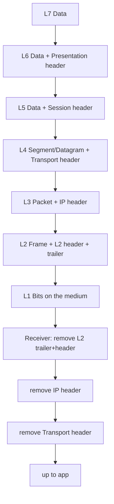

# Introductory Networking

## Summary

* OSI is a 7-layer *reference model* used to reason about networking; TCP/IP is the practical Internet stack.
* Encapsulation: as data goes down the stack, each layer adds headers (and L2 adds a trailer). De-encapsulation reverses it.
* TCP is connection-oriented (reliable stream semantics) and starts with a 3-way handshake (SYN → SYN/ACK → ACK).
* Basic tools:

  * `ping` (ICMP reachability/latency)
  * `traceroute`/`tracert` (path discovery via TTL + ICMP Time Exceeded)
  * `whois` (domain registration metadata)
  * `dig` (DNS troubleshooting; answers + TTL)

## Key Concepts

### 1.1 OSI Model (7 layers)

Mnemonic (pick any): *“All People Seem To Need Data Processing”*.

* L7 Application: app-facing networking (HTTP, FTP, SMTP…)
* L6 Presentation: encoding, compression, crypto transforms
* L5 Session: session state, synchronization, multiplexing
* L4 Transport: end-to-end transport (TCP/UDP), segmentation, ports
* L3 Network: routing, logical addressing (IP)
* L2 Data Link: local delivery, MAC addressing, frames, error detection
* L1 Physical: bits on wire/air; signaling

Quick “Which layer does what?” map (answers are stable)

* Choose TCP vs UDP → L4
* Check corruption on receipt (frame check) → L2
* Format for transmission (framing) → L2
* Transmit/receive raw signals → L1
* Encrypt/compress/transform data representation → L6
* Track/multiplex conversations between endpoints → L5
* Accept comms requests from applications → L7
* Logical addressing (IP) → L3
* TCP ‘bite-sized pieces’ → segments (UDP: datagrams)
* FTP communicates with → L7
* Live video best transport protocol (typical) → UDP

### 1.2 Encapsulation (why “the same data” changes names)

Protocol Data Units (PDUs):

* L7/L6/L5: Data
* L4: Segment (TCP) / Datagram (UDP)
* L3: Packet
* L2: Frame
* L1: Bits

Mermaid: encapsulation / de-encapsulation sketch



Why it matters (practically)

* Debugging: a Wireshark capture is literally “headers stacked”.
* Security: different devices enforce policy at different layers:

  * L3 ACLs (IP-based)
  * L4 firewalls (ports/state)
  * L7 proxies/WAF (application semantics)

### 1.3 TCP/IP Model (4 layers)

* Application
* Transport
* Internet
* Network Interface

Rough mapping to OSI:

* TCP/IP Application ≈ OSI L5–L7
* TCP/IP Transport ≈ OSI L4
* TCP/IP Internet ≈ OSI L3
* TCP/IP Network Interface ≈ OSI L1–L2

Note: Some teaching materials use a 5-layer TCP/IP model (splitting Network Interface into L1 + L2). Both are common in practice.

### 1.4 TCP three-way handshake (connection establishment)

Sequence:

1. Client → Server: SYN
2. Server → Client: SYN/ACK
3. Client → Server: ACK

Mermaid sequence diagram

```mermaid
sequenceDiagram
  participant C as Client
  participant S as Server
  C->>S: SYN
  S->>C: SYN + ACK
  C->>S: ACK
  Note over C,S: Connection established; data transfer can begin
```

Interpretation (high level)

* SYN: “I want to synchronize sequence numbers and start a connection.”
* SYN/ACK: “I heard you; here’s my synchronize + acknowledgement.”
* ACK: “Confirmed. Let’s talk.”

## Pattern Cards

### 2.1 Layering intuition card

* If your bug is “can’t reach host”: start low (L1/L2) and climb.
* If your bug is “DNS name doesn’t resolve”: that’s mostly Application-layer (DNS), but depends on Transport (UDP/TCP 53) and Internet (routing).
* If your bug is “website loads but video call is garbage”: likely Transport choice + loss/jitter (UDP sensitivity) or congestion.

### 2.2 Tool selection card

* Need *reachability + RTT* → `ping`.
* Need *path/hops* → `traceroute`/`tracert`.
* Need *ownership/registration metadata* → `whois`.
* Need *DNS truth* (records, TTL, which nameserver answered) → `dig`.

### 2.3 “Why traceroute works” card

* It manipulates the IP TTL (hop limit).
* Each hop decrements TTL; when TTL hits 0, the router sends back ICMP Time Exceeded.
* By increasing TTL stepwise, you learn the hop sequence.

### 2.4 Security angle card (defensive thinking)

* ICMP is useful for diagnostics, but also for recon; many orgs rate-limit or filter ICMP.
* Blocking ICMP entirely can break PMTU discovery and troubleshooting; prefer selective filtering + rate-limits.

## Command Cookbook

### 3.1 ping

```bash
# basic reachability
ping <domain_or_ip>

# interval (seconds)
ping -i 0.5 <target>

# IPv4 only
ping -4 <target>

# verbose (show non-echo ICMP too)
ping -v <target>

# stop after N requests
ping -c 4 <target>
```

### 3.2 traceroute / tracert

```bash
# Linux / Unix
traceroute <domain_or_ip>

# specify outgoing interface
traceroute -i <iface> <target>

# use TCP SYN probes (often helps through firewalls)
traceroute -T <target>

# force ICMP echo probes
traceroute -I <target>

# Windows equivalent
tracert <domain_or_ip>
```

### 3.3 whois

```bash
whois <domain>

# Tip: results are often privacy-redacted; parse for registrar, creation date, nameservers.
```

### 3.4 dig

```bash
# query A record

dig <domain>

# query a specific recursive resolver

dig <domain> @8.8.8.8

# show only answer section

dig +noall +answer <domain>

# query a specific type (e.g., NS, MX)

dig NS <domain>
dig MX <domain>
```

DNS resolution order (operational simplification)

1. Hosts file
2. Local DNS cache
3. Recursive resolver
4. Root → TLD → Authoritative

TTL note

* TTL is seconds.
* 24 hours = 86400.

## Evidence

* Suggested local assets (rename + store under repo `assets/`):

  * `assets/osi-encapsulation.png` (encapsulation stages)
  * `assets/osi-vs-tcpip.png` (model mapping table)
  * `assets/tcp-handshake.png` (SYN/SYN-ACK/ACK)

(Do not store any screenshots containing personal identifiers, unique IPs tied to you, or account tokens.)

## Takeaways

* OSI is a thinking tool; TCP/IP is the implementation reality.
* Encapsulation is the mental model behind “why packets look like stacked headers”.
* TCP reliability has a price (handshake, retransmissions); UDP speed has a price (loss/jitter sensitivity).
* Tooling is a workflow: validate reachability → map path → inspect DNS → inspect registration metadata.

## References

* RFC 1122 (Internet host requirements; Internet model layers)
* RFC 792 (ICMP)
* RFC 793 (TCP)
* RFC 1034 / RFC 1035 (DNS)
* Debian iputils `ping(8)` manpage
* traceroute manpage (`traceroute(8)`)
* RFC 3912 (WHOIS)
* Google Public DNS documentation

## CN–EN Glossary (mini)

* OSI model: OSI 模型（开放系统互连）
* Encapsulation: 封装
* De-encapsulation: 解封装
* Header / trailer: 头部 / 尾部
* Segment / datagram: 段 / 数据报
* Packet / frame / bits: 分组 / 帧 / 比特
* TCP (connection-oriented): 面向连接
* UDP (connectionless): 无连接
* Three-way handshake: 三次握手
* SYN / ACK: 同步 / 确认
* ICMP: 互联网控制报文协议
* DNS: 域名系统
* Recursive resolver: 递归解析器
* Authoritative nameserver: 权威 DNS
* TTL: 存活时间（秒）
