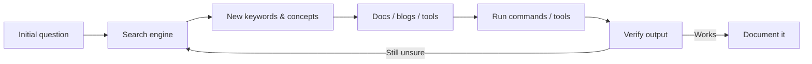

# Introductory Researching – Notes

## 1. Why research skill matters

In hacking and security work you constantly meet things you do **not** know yet:


* new services, protocols, CMSs
* strange file formats (images, logs, binaries)


* unfamiliar tools and error messages


Nobody “knows everything”. The real core skill is:


> Turn an unknown into a chain of questions you can answer with open sources, documentation, and experimentation.


If you can research efficiently, you can:


* understand how a target system works


* locate known vulnerabilities and public exploits


* learn syntax/options of tools on the fly


* debug your own mistakes instead of getting stuck


This room trains a minimal research methodology that scales from CTF to real-world pentesting.


---

## 2. Generic research workflow

A repeatable loop:



**Core habits:**

* Start from a **clear question**, even if it’s vague: “hide data in images”, “fuel cms rce”, “netcat listen port”.


* Skim results to extract **keywords / names** (e.g. *steganography*, *searchsploit*, *CVE*).


* Pivot your search using those new terms.


* Prefer **primary sources** first (docs, man pages, vendor advisories), then blogs / writeups as examples.


* Always test commands in a safe environment and adjust.


* Write down **minimal notes**: question → key terms → useful commands → pitfalls.


---

## 3. Case study – hidden data in an image

### Problem

You download a suspicious JPEG from a CTF target and suspect hidden data.


### Step 1 – Describe the problem in plain language

Search: `hiding things inside images` → quickly learn the term **steganography**.


New keyword: `steganography` → re‑search for: `steganography tools jpeg ctf`.


### Step 2 – Discover tools

You hit a curated list of CTF stego tools (e.g. 0xrick’s list) and notice **steghide**:


* supports JPEG/PNG/BMP, WAV/AU
* can both embed and extract data

Now the task becomes: *“Install and use steghide on Kali/Ubuntu.”*


### Step 3 – Install via package manager

New keyword: `apt` → search: `apt install package` → learn the generic pattern


```bash
sudo apt-get update
sudo apt-get install steghide
```

### Step 4 – Use the tool

The list and `man steghide` tell you two crucial commands:


```bash
# Show if there is embedded data
steghide info suspicious.jpg

# Extract embedded data (will prompt for passphrase if needed)
steghide extract -sf suspicious.jpg
```

If a passphrase is required, you then research `stegcracker`, wordlists, or look in the CTF for hints.


### Outcome

From **zero** knowledge to a working command sequence, purely by:


1. Turning the situation into search queries.

2. Mining new terminology.
3. Pivoting until you hit concrete tools and syntax.


This is exactly the pattern you will reuse with *any* unfamiliar topic.


---

## 4. Vulnerability searching

In real engagements or CTFs you will often identify specific software:


* WordPress plugin X.Y.Z
* FuelCMS 1.4.1
* Apache Tomcat on Debian

The research goal then becomes: **“Does this exact software + version have known vulnerabilities or public exploits?”**


### 4.1 Main data sources

* **CVE / MITRE** – global identifier space for vulnerabilities. Format: `CVE-YYYY-NNNNN`.

* **NVD (National Vulnerability Database)** – attaches CVSS scores, descriptions, sometimes CPEs.

* **ExploitDB** – community‐curated exploit database, often with PoCs.

* **searchsploit** – CLI wrapper around an offline copy of ExploitDB (ships with Kali).


Typical workflow:

1. **Fingerprint the application**

   * Check HTML source, comments, headers, `/README`, `/CHANGELOG`, login screens.

   * Use tools like `whatweb`, `wpscan`, `nmap --script http-enum`, etc.


2. **Search by product and version**

   * On ExploitDB web or with searchsploit:


     ```bash
     searchsploit "fuel cms"
     searchsploit "apache tomcat" debian
     ```

3. **Read exploit details**

   * Note:

     * CVE ID
     * affected versions / platforms
     * exploit type (RCE, LPE, XSS, SQLi, buffer overflow ...)

     * required conditions (auth / unauth, local / remote)


4. **Cross‑check in NVD / vendor advisories**

   * Confirm severity.
   * See if patches or config mitigations exist.


5. **Decide use‑case**

   * In CTF: exploit directly.
   * In real pentest: respect scope, PoC minimally, then report.


### 4.2 Example Q&A from the room

Some specific CVE lookups practised in this room:


* 2020 XSS in **WPForms** → `CVE-2020-10385`

* 2016 local privilege escalation in **Debian Apache Tomcat** → `CVE-2016-1240`

* First CVE for **VLC media player** → `CVE-2007-0017`

* 2020 buffer overflow in **sudo** (pwfeedback) → `CVE-2019-18634` (discovered 2019, actively discussed/exploited 2020)


The important thing is not to memorise the IDs, but to be fluent at **finding** them.


---

## 5. Linux manual pages as local docs

On Linux, `man` is your built‑in documentation browser.


### 5.1 Basic usage

```bash
man ssh        # full manual for OpenSSH client
man scp        # copy files over SSH
man fdisk      # manage partitions
man nano       # simple text editor
man nc         # netcat / ncat manual
```

Inside `man`:

* `Space` / `PgDn` / `PgUp` – scroll


* `/pattern` – search forward
* `n` – next match
* `q` – quit

You can also pipe a man page to `grep` for quick searches:


```bash
man ssh | grep -i "version"
```

### 5.2 Switches used in this room

These came directly from the manuals:


* **SCP – copy a directory recursively**

  ```bash
  scp -r dir/ user@host:/path/
  ```

* **fdisk – list partitions**

  ```bash
  fdisk -l
  ```

* **nano – create a backup when opening a file**

  ```bash
  nano -B filename
  ```

* **netcat – start a listener on port 12345**

  Common patterns (implementation‑dependent):


  ```bash
  # Classic syntax
  nc -l -p 12345

  # More verbose typical CTF usage
  nc -lvnp 12345
  ```

Again, the key idea: **when in doubt, ask `man` before you ask the internet.**


---

## 6. Practical research tips

1. **Extract keywords.**

   * From questions, error messages, screenshots, banners.

   * Example: `“Burp Suite mode repeat request”` → *Burp Repeater*.


2. **Prefer layered queries.**

   * Start broad: `hide data inside jpeg`.

   * Then targeted: `jpeg steganography extract tool`, `steghide extract`, `stegsolve ctf`.


3. **Use diverse sources.**

   * Official docs and man pages.
   * Vendor advisories, NVD, MITRE.
   * Blogs / writeups / walkthroughs for concrete command sequences.


4. **Treat writeups as tutorials, not answer keys.**

   * Read *why* a step works, not just *what* to copy.

   * Re‑implement on a different target if possible.


5. **Record your own mini‑cheatsheet.**

   * For each topic, store:

     * 2–3 canonical resources.
     * 1–2 core commands with comments.
     * Any “gotchas” you hit.

6. **Stay sceptical.**

   * Check timestamps of posts and tool versions.

   * Be careful with copy‑pasted exploit code.

   * Cross‑validate sensitive actions (e.g. destructive SQL, file‑system changes).


---

## 7. Micro‑reference – Q&A from the room

This section just collects the short factual answers Practised in the room.


### 7.1 General security / systems

* Burp Suite mode to manually resend/modify requests repeatedly: **Repeater**.

* Hash format for modern Windows login passwords: **NTLM**.

* Automated scheduled tasks on Linux: **cron jobs**.

* Shorthand number base often used around binary (base‑2): **hexadecimal (base‑16)**.


* Password hashes starting with `$6$` are **SHA‑512 crypt** hashes (glibc `crypt` format).


### 7.2 Tool syntax

* `scp -r` – copy a directory recursively.

* `fdisk -l` – list current partitions.

* `nano -B` – create a backup when opening a file.

* `nc -lvnp 12345` – typical listener pattern for CTFs.


---

## 8. Glossary (EN–ZH)

| Term (EN)                                  | 简体中文解释             |
| ------------------------------------------ | ------------------ |
| research question                          | 研究问题               |
| methodology                                | 方法论；系统化做法          |
| steganography                              | 隐写术（在文件中隐藏数据）      |
| package manager (apt)                      | 软件包管理器             |
| vulnerability                              | 漏洞；脆弱点             |
| CVE (Common Vulnerabilities and Exposures) | 公共漏洞与暴露编号体系        |
| NVD (National Vulnerability Database)      | 美国国家漏洞数据库          |
| ExploitDB                                  | 漏洞利用代码数据库          |
| searchsploit                               | ExploitDB 的命令行搜索工具 |
| content management system (CMS)            | 内容管理系统             |
| local privilege escalation (LPE)           | 本地权限提升             |
| buffer overflow                            | 缓冲区溢出              |
| manual pages (`man`)                       | Linux 手册页          |
| command‑line interface (CLI)               | 命令行界面              |
| cron job                                   | 定时计划任务（cron 任务）    |
| hash                                       | 哈希值；散列值            |
| listener (netcat listener)                 | 监听端口的服务/会话         |
| CTF (Capture The Flag)                     | 网络安全夺旗竞赛           |
