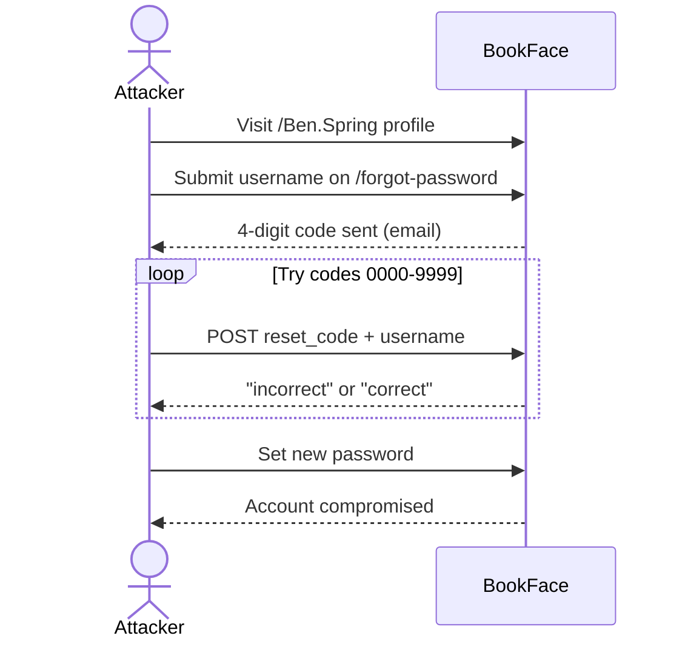

# Learning Cyber Security – Room Notes

> TryHackMe room: **Learning Cyber Security** – overview of web and network security fundamentals.

---

## 1. Room overview

* **Goal**: Give a high‑level taste of:

  * Web application security (BookFace password‑reset scenario)
  * Network security (Target retail breach case study)
  * The learning roadmap after this intro room
* Core idea: you cannot hack or defend what you don’t understand. First learn how the web and networks work; then learn to break and protect them.

---

## 2. Task 1 – Web Application Security

### 2.1 Why understanding the web matters

* Modern attacks against websites are rarely about “magic tools”. They are about:

  * Understanding how **HTTP, sessions, authentication and state** are implemented.
  * Spotting **assumptions, edge cases and missing checks**.
* A **vulnerability** is any weakness in design, implementation or configuration that can be abused to break confidentiality, integrity or availability.

### 2.2 BookFace scenario – weak password reset

Mini‑lab: a fake social network called **BookFace**.

1. **Public profile reveals the username**

   * Profile URL: `bookface.com/Ben.Spring`
   * The path leaks the username `Ben.Spring` to any visitor.

2. **Password reset flow**

   * User enters a username on `/forgot-password`.
   * Site sends a **4‑digit reset code** by email.
   * User must submit that code to continue and set a new password.

3. **Brute‑forcing the 4‑digit code**

   * Code space: `0000` – `9999` → only **10,000** possibilities.
   * The demo deliberately has **no rate‑limit, no lockout and no CAPTCHA**.
   * We can script or use the built‑in “Web Request Repeater” to test all codes:

```text
POST /accounts/reset_password/ HTTP/1.1
Host: bookface.com

reset_code=0001&username=Ben.Spring
```

* Eventually we hit the correct code (e.g. `0187`) and are allowed to set a new password → full account takeover.

### 2.3 BookFace attack chain (high‑level)



### 2.4 Security lessons from BookFace

Key mistakes in the design:

1. **Low‑entropy reset token**

   * 4 digits are trivial to brute‑force.
   * Tokens should be long, random and unguessable (e.g. 128‑bit value encoded as a URL‑safe string).

2. **No rate‑limiting or lockout**

   * Sensitive flows (login, MFA, password reset) must limit:

     * Number of attempts per account/IP/device.
     * Requests per time window.

3. **Poor visibility and alerts**

   * In real systems, repeated reset attempts for one account should be logged and alert security teams.

4. **User enumeration via URL / error messages**

   * Directly exposing the username in URLs and giving different responses for “valid vs invalid user” makes enumeration easier.

5. **Lack of multi‑factor verification**

   * A robust flow often combines:

     * Email link with high‑entropy token, **and/or**
     * MFA factors (TOTP, push, hardware key).

Takeaway: password‑reset flows are a common weak point. Treat them with the same security requirements as login.

---

## 3. Task 2 – Network Security

### 3.1 Why networking knowledge matters

For security work you constantly need to answer two questions:

1. **Who is talking to whom?**

   * Asset discovery, host and service enumeration, understanding trust boundaries.
2. **How are they talking?**

   * Protocols, ports, encryption, routing, segmentation, logging.

Use‑cases:

* Offensive: scan networks, identify exposed services, pivot between segments.
* Defensive: monitor network logs, detect lateral movement, investigate data exfiltration.

### 3.2 Target breach case (2013)

The room uses the famous **Target** retail breach as an example:

* HVAC (air‑conditioning) systems in stores were remotely manageable and connected to the **same flat internal network** as payment systems.
* Attackers compromised the HVAC vendor / units, then moved laterally to the **POS (Point‑of‑Sale) systems** handling credit cards.
* Result: data from about **110 million** customers’ payment cards was stolen.
* The incident reportedly cost Target around **$300 million** in breach‑related expenses and lawsuits.
* Target even had an expensive malware detection product deployed, but the attackers disguised their traffic as legitimate network activity.

Core lesson: tools alone are not enough; **network design and segmentation** are crucial.

### 3.3 Network‑security principles illustrated

1. **Network segmentation**

   * Critical systems (POS terminals, databases) should be on isolated VLANs or networks.
   * Third‑party‑managed devices (HVAC, IoT, cameras) should be strongly separated and tightly filtered.

2. **Least privilege on the network**

   * Only allow the minimal ports and directions required (e.g. HVAC → monitoring server only).

3. **Zero‑trust thinking**

   * Do not implicitly trust traffic just because it comes from “inside” the corporate network.

4. **Defense in depth**

   * Combine segmentation, strong authentication, logging, EDR/AV, anomaly detection and regular audits.

---

## 4. Task 3 – Learning roadmap

The room ends with a very high‑level roadmap:

1. **Complete Beginner / Pre‑Security path**

   * Linux/Windows basics, networking, web basics, intro labs.

2. **Then branch into one of two main directions**:

   * **Offensive Pentesting path** – focus on:

     * Reconnaissance, web exploitation, privilege escalation, AD attacks, CTFs.
   * **Cyber Defense path** – focus on:

     * SOC workflows, log analysis, incident response, detection engineering, threat intel.

3. **Long‑term reality**

   * The two directions are not mutually exclusive; good defenders understand offensive techniques, and good attackers understand defensive controls.

---

## 5. Key terms (quick glossary)

* **Vulnerability** – A weakness in design, implementation or configuration that can be exploited.
* **Brute‑force attack** – Systematically trying all possible values (e.g. all 4‑digit codes) until the correct one is found.
* **Rate limiting** – Restricting how many requests a client can make in a given period of time.
* **Account takeover (ATO)** – Gaining full control over someone else’s account.
* **Flat network** – A network with little or no segmentation; many systems share the same trust zone.
* **Network segmentation** – Splitting a network into isolated segments/VLANs with controlled communication paths.
* **Lateral movement** – Moving from one compromised system to others within a network to reach more valuable targets.

---

## 6. next actions

* Practise:

  * Re‑create a simple password‑reset flow in a test app and experiment with different protections.
  * Draw a small home‑network diagram and think about where segmentation or access control would help.
