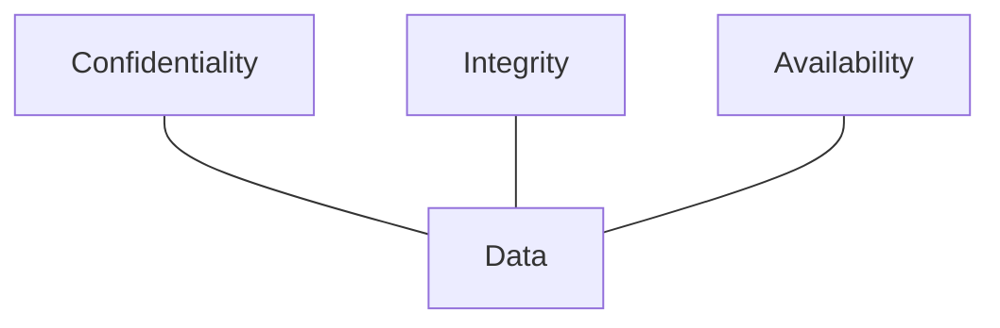
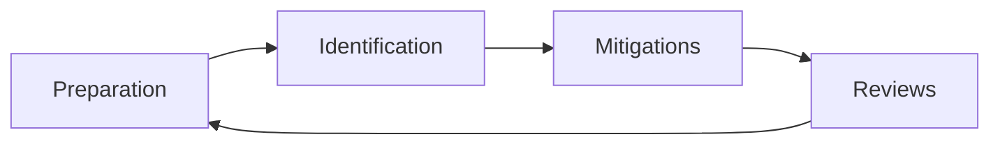

# Principles of Security – Notes

## 0. Big picture

* **Goal**: protect information systems against misuse and abuse.
* Core idea: **Defence in Depth（纵深防御）** – multiple, different layers of control so that if one fails, others still protect the system.
* Everything else in this room (CIA, privileges, models, threat modelling, IR) are different angles on the same question: *“Is our data actually safe?”*

---

## 1. CIA Triad

### 1.1 Confidentiality（机密性）

* Only authorised people/systems may access data.
* Typical controls:

  * Access control lists, IAM / RBAC
  * Encryption (at rest & in transit)
  * Network segmentation, VPN, DLP
* Examples:

  * HR records: only HR staff with vetting can read.
  * Government classification levels: Top Secret / Secret / Confidential.

### 1.2 Integrity（完整性）

* Data stays **correct & consistent** unless intentionally modified by authorised entities.
* Threats: careless edits, bugs, or unauthorised tampering.
* Typical controls:

  * Strong auth + authorisation on write operations
  * Hashes, checksums, digital signatures
  * Version control, audit logs, input validation

### 1.3 Availability（可用性）

* Data/services must be accessible to authorised users **when needed**.
* Often expressed as uptime targets (e.g. 99.99%).
* Typical controls:

  * Redundancy (HA clusters, backups, DR sites)
  * Capacity planning, rate‑limit & anti‑DoS
  * Robust ops: monitoring, alerting, patching

> If **any one** of C / I / A fails badly, the other two become much less valuable.

---

## 2. Principles of Privileges

### 2.1 PIM vs PAM

* **PIM – Privileged Identity Management（特权身份管理）**

  * Map a *person’s organisational role* → a *system role*.
  * Example: “Finance Manager” ⇒ role with access to accounting system, but not HR database.

* **PAM – Privileged Access Management（特权访问管理）**

  * Manage what a *privileged role* can actually do on systems.
  * Includes: password/secret rotation, session recording, approval workflows, just‑in‑time elevation.

| Question                                                          | Use     |
| ----------------------------------------------------------------- | ------- |
| “What rights should this UNIX group / AD role have?”              | **PAM** |
| “What role should this employee get when they join / change job?” | **PIM** |

### 2.2 Principle of Least Privilege（最小权限原则）

* Give users **only** the minimum permissions necessary to perform their duties – nothing more.
* Benefits:

  * Reduce blast radius of account compromise.
  * Reduce accidental damage.
  * Make auditing simpler (“if they wrote it, we can trust the context”).

---

## 3. Security Models for C & I

### 3.1 Bell–LaPadula Model（机密性优先）

* Focus: **Confidentiality**.
* Assumes hierarchical classification (Top Secret > Secret > Confidential).
* Rules (classic summary):

  * **No Read Up (NRU)** – subjects cannot read objects at a higher classification.
  * **No Write Down (NWD)** – subjects cannot write to lower classification.
* Intuition: high‑classified info must not leak to lower levels.
* Typical use: military & government, where staff are vetted and *trusted* once cleared.

### 3.2 Biba Model（完整性优先）

* Focus: **Integrity**.
* Rules (mirror of Bell–LaPadula):

  * **Can Read Up, Can’t Read Down** – subjects can read higher‑integrity data, but not lower.
  * **No Write Up** – they may write only at or below their integrity level.
* Intuition: lower‑integrity users should not contaminate higher‑integrity data.
* Typical use: environments where correctness matters more than secrecy:

  * Software development, financial transaction processing, safety‑critical systems.

> Military‑style organisation → Bell–LaPadula.
>
> Dev / integrity‑critical environment → Biba.

---

## 4. Threat Modelling（威胁建模）

Goal: **systematically think about what can go wrong** and design controls before incidents happen.

Typical cycle:

Key inputs:

* **Threat intelligence** – who attacks us and how.
* **Asset identification** – what we must protect.
* **Mitigation capabilities** – what controls we have / can build.
* **Risk assessment** – likelihood × impact.

### 4.1 STRIDE model（威胁分类）

| Letter | Name                       | Core idea / 防护要点                                                                               |
| ------ | -------------------------- | ---------------------------------------------------------------------------------------------- |
| S      | **Spoofing**               | Fake identity. Require strong authentication; protect keys & tokens.                           |
| T      | **Tampering**              | Unauthorised data modification. Use integrity checks, signatures, WORM logs.                   |
| R      | **Repudiation**            | “I didn’t do it.” Mitigate with detailed, integrity‑protected logs.                            |
| I      | **Information Disclosure** | Data leakage to wrong subjects. Enforce least privilege, encryption, careful access control.   |
| D      | **Denial of Service**      | Resource exhaustion so service unavailable. Rate limit, capacity, DoS protections.             |
| E      | **Elevation of Privilege** | Low‑priv user becomes high‑priv. Reduce attack surface, harden auth, patch vulns, enforce PAM. |

---

## 5. Incident Response（事件响应, IR）

Incidents still happen; **IR** is about limiting damage and returning to normal.

Six classic phases:

1. **Preparation** – plans, playbooks, tooling, CSIRT team, training.
2. **Identification** – detect & confirm incident; scope & attacker.
3. **Containment** – stop spread, isolate affected systems.
4. **Eradication** – remove malware, close exploited holes.
5. **Recovery** – *return to business as usual*; restore services, validate systems, monitor closely.
6. **Lessons Learned** – post‑mortem, improve controls & training.

Impact/Urgency matrix (conceptually):

* High impact + High urgency → **Priority 1** incident.
* Low impact + Low urgency → **Priority 5** (monitor, fix calmly).

---

## 6. Quick Q&A recap

* **Q:** What element of the CIA triad ensures data cannot be altered by unauthorised people?

  * **A:** Integrity.
* **Q:** What element ensures data is available to authorised users?

  * **A:** Availability.
* **Q:** What element ensures data is only accessed by authorised people?

  * **A:** Confidentiality.
* **Q:** PIM stands for?

  * **A:** Privileged Identity Management.
* **Q:** PAM stands for?

  * **A:** Privileged Access Management.
* **Q:** Managing what a system role can do → which methodology?

  * **A:** PAM.
* **Q:** Creating roles based on organisational responsibilities → which methodology?

  * **A:** PIM.
* **Q:** Model with “can’t read up, can read down”?

  * **A:** Bell–LaPadula.
* **Q:** Model with “can read up, can’t read down”?

  * **A:** Biba.
* **Q:** Model typically used by military / government?

  * **A:** Bell–LaPadula.
* **Q:** Model commonly used where integrity is critical (e.g., software dev)?

  * **A:** Biba.
* **Q:** STRIDE model that mentions Spoofing?

  * **A:** STRIDE itself; Spoofing is the S.
* **Q:** IR stands for?

  * **A:** Incident Response.
* **Q:** Adding measures to improve integrity of data – which STRIDE principle?

  * **A:** Tampering.
* **Q:** After data theft, returning the organisation to business as usual – which IR phase?

  * **A:** **Recovery**.
