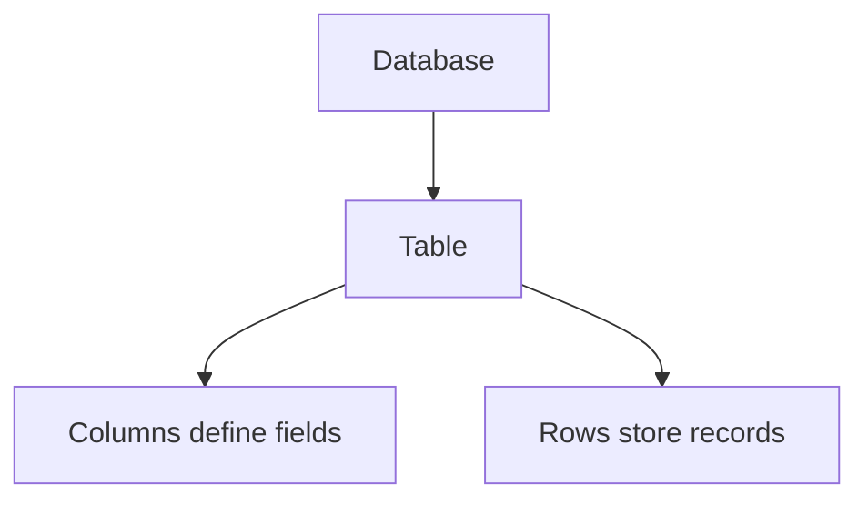
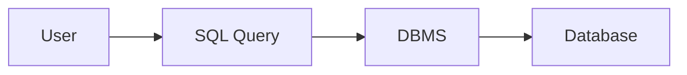
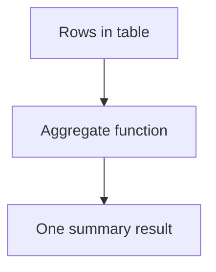
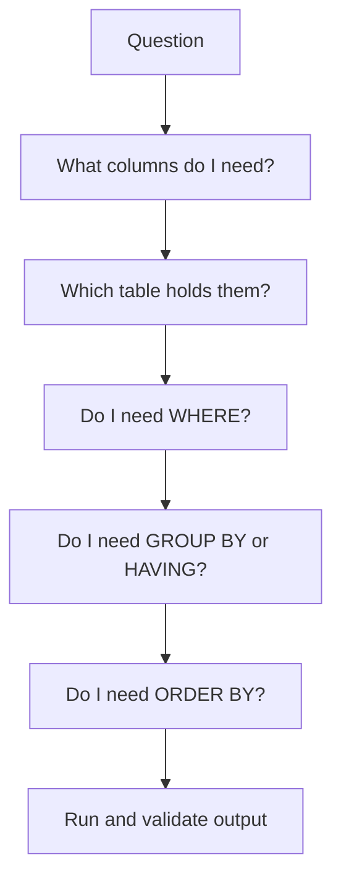

# SQL Fundamentals

## Summary

* This room is an introduction to **databases**, especially **relational databases**, and to **SQL** as the language used to work with them.
* The core mental model is simple: a **database** stores data, a **DBMS** provides the interface to manage it, and **SQL** is the language used to query and modify relational data.
* The room covers database basics, relational vs non-relational databases, tables, rows, columns, primary keys, foreign keys, database and table statements, CRUD operations, clauses, operators, and common built-in functions.
* The practical side of the room uses **MySQL/MariaDB-style CLI syntax**, so the commands feel close to what you will see in many labs and beginner environments.
* The real goal is not memorizing one-liners. It is learning how to **think in structured data**.

---

## 1. Why Databases Matter

Databases are everywhere.

They power:

* login systems,
* media platforms,
* banking systems,
* e-commerce,
* recommendation engines,
* inventory tracking,
* internal enterprise applications.

In practice, modern applications constantly read from and write to some form of structured storage.

### 1.1 Key takeaway

```text
If an application stores and retrieves data repeatedly, there is usually a database somewhere in the design.
```

That is why learning SQL matters even if your long-term direction is security, AppSec, SOC, DFIR, or backend development.

---

## 2. Relational vs Non-Relational Databases

This is the first real conceptual split in the room.

### 2.1 Relational databases

Relational databases organize data into:

* **tables**,
* **columns**,
* **rows**.

This is the classic SQL world.

A relational database is a good fit when the data is:

* structured,
* predictable,
* repeated in similar formats,
* connected through clear relationships.

#### Example mental model

A books table might contain:

* `book_id`
* `name`
* `publish_date`
* `description`

Each book is one row.

### 2.2 Non-relational databases

Non-relational databases do **not** require the same table-first structure.

Examples include:

* key-value stores,
* document stores,
* graph databases,
* wide-column stores.

They are often useful when the data format varies heavily or when the structure is less rigid.

#### Practical distinction

```text
Relational = structured, table-based, SQL-oriented
Non-relational = more flexible shape, not primarily table-based
```

This distinction aligns with how MySQL's tutorial material teaches relational workflows: create databases, create tables, load data, and retrieve data.

---

## 3. Core Table Vocabulary

The room uses a books example. This is the right way to teach the topic.

### 3.1 Table

A table is a structured collection of related records.

Example:

* one table for books,
* another for authors,
* another for orders.

### 3.2 Row

A row is one record.

Example:

* one book entry,
* one user entry,
* one transaction entry.

### 3.3 Column

A column defines one attribute of the record.

Example:

* title,
* publication date,
* price,
* category.

#### Compact model



---

## 4. Primary Keys and Foreign Keys

This is where "relational" actually becomes meaningful.

### 4.1 Primary key

A primary key uniquely identifies each row in a table.

Typical properties:

* unique,
* non-null,
* stable enough to identify one record.

The room uses an integer ID column with auto-increment. That is a very common beginner pattern.

### 4.2 Foreign key

A foreign key links one table to another by referencing a key in the related table.

#### Example

If a books table contains `author_id`, and that `author_id` points to an authors table primary key, then the books table can be joined to the authors table.

#### Why this matters

Without keys, data is just stored.

With keys, data becomes **related**.

That is what makes relational databases powerful.

---

## 5. What SQL Actually Is

SQL stands for **Structured Query Language**.

In practical terms, SQL is the language used to:

* define structures,
* retrieve data,
* insert data,
* update data,
* delete data,
* sort, filter, and aggregate results.

MySQL's documentation explicitly defines `SELECT` as the statement used to retrieve rows from one or more tables and documents aggregate functions such as `COUNT()`, `SUM()`, `MIN()`, and `MAX()` as operating on sets of values.

---

## 6. DBMS - The Missing Middle Layer

The room correctly emphasizes the **Database Management System (DBMS)**.

The DBMS is the software layer between the user and the stored data.

### 6.1 Simple model



Examples of DBMS products include MySQL, PostgreSQL, Microsoft SQL Server, Oracle Database, and SQLite.

In this room, the CLI usage is MySQL-style.

---

## 7. Creating and Selecting Databases

The room introduces a basic MySQL CLI workflow.

### 7.1 Create a database

Official MySQL syntax supports:

```sql
CREATE DATABASE db_name;
```

### 7.2 Show databases

In the MySQL CLI, `SHOW DATABASES;` lists available databases.

### 7.3 Select a database

```sql
USE db_name;
```

This sets the active or default database for the current session.

#### Important note on case

MySQL's tutorial notes that on Unix, database names and table names are case-sensitive, so consistent identifier naming matters.

#### Style lesson

`SELECT`, `CREATE`, `USE`, `WHERE`, and `ORDER BY` are often written uppercase for readability.

This is convention, not magic.

---

## 8. Creating and Inspecting Tables

### 8.1 Create a table

MySQL documents the standard `CREATE TABLE` statement and notes that tables are created in the default database unless specified otherwise.

A simplified pattern is:

```sql
CREATE TABLE table_name (
    column_name data_type,
    ...
);
```

### 8.2 Describe a table

`DESCRIBE table_name;` is commonly used in MySQL-like environments to inspect fields, types, nullability, keys, defaults, and extra attributes.

### 8.3 Show tables

`SHOW TABLES;` lists tables in the currently selected database.

### 8.4 Alter a table

The room introduces `ALTER TABLE` to add columns or modify structure. That is correct conceptually.

### 8.5 Drop a table

`DROP TABLE table_name;` deletes the table structure and data.

#### Practical lesson

Database structure is code-like infrastructure. Do not treat it casually.

---

## 9. CRUD Operations

This is the part where SQL starts feeling operational.

CRUD means:

* **Create**
* **Read**
* **Update**
* **Delete**

### 9.1 Create - `INSERT`

Used to add rows.

Typical form:

```sql
INSERT INTO table_name (col1, col2)
VALUES (val1, val2);
```

### 9.2 Read - `SELECT`

Used to retrieve rows.

Typical form:

```sql
SELECT * FROM table_name;
```

### 9.3 Update - `UPDATE`

Used to modify existing rows.

Typical form:

```sql
UPDATE table_name
SET column_name = value
WHERE condition;
```

### 9.4 Delete - `DELETE`

Used to remove rows.

Typical form:

```sql
DELETE FROM table_name
WHERE condition;
```

#### Critical caution

Never forget the `WHERE` clause in `UPDATE` or `DELETE` unless you genuinely mean "all rows."

That is one of the oldest beginner mistakes in SQL.

---

## 10. Clauses

Clauses refine the logic of a query.

### 10.1 `FROM`

Specifies the source table or tables.

### 10.2 `WHERE`

Filters rows before grouping or aggregation.

### 10.3 `DISTINCT`

Removes duplicates from the selected result set.

### 10.4 `GROUP BY`

Groups rows by one or more columns, usually for aggregate analysis.

MySQL's aggregate function documentation notes that such functions are often used with `GROUP BY` to group values into subsets.

### 10.5 `ORDER BY`

Sorts results.

Typical directions:

* `ASC`
* `DESC`

### 10.6 `HAVING`

Filters grouped or aggregated results.

#### Key distinction

```text
WHERE filters rows
HAVING filters grouped results
```

This is one of the first meaningful SQL distinctions learners must internalize.

---

## 11. Operators

Operators make filters expressive.

### 11.1 `LIKE`

Pattern matching.

Example:

```sql
WHERE name LIKE '%hack%'
```

This means:

* anything before `hack` is allowed,
* anything after `hack` is allowed,
* but `hack` must appear somewhere.

### 11.2 `AND`

Both conditions must be true.

### 11.3 `OR`

At least one condition must be true.

### 11.4 `NOT`

Negates a condition.

### 11.5 Comparison operators

Common forms:

* `=`
* `!=`
* `<`
* `>`
* `<=`
* `>=`

### 11.6 `BETWEEN`

Useful for inclusive range logic.

Example:

```sql
WHERE id BETWEEN 2 AND 4
```

---

## 12. Functions

Functions are built-in helpers for transforming or summarizing data.

### 12.1 String functions

#### `CONCAT()`

Joins strings together.

Useful for formatting output.

#### `GROUP_CONCAT()`

Concatenates grouped values into a single string.

Very useful for summaries.

#### `SUBSTRING()`

Extracts part of a string.

#### `LENGTH()`

Returns the character length of a string.

### 12.2 Aggregate functions

#### `COUNT()`

Counts rows or values.

#### `SUM()`

Adds numeric values.

#### `MIN()`

Returns the smallest value.

#### `MAX()`

Returns the largest value.

#### Aggregate summary model



---

## 13. How to Think Through SQL Questions

The room does something useful: it shows the query-building thought process instead of pretending the answer appears instantly.

That is exactly how SQL is learned.

### 13.1 Recommended process

1. Identify the output you need.
2. Identify the source table.
3. Decide whether you need filtering.
4. Decide whether you need grouping.
5. Decide whether you need sorting.
6. Decide whether you need a function.

#### Compact workflow



That is a better long-term skill than memorizing room answers.

---

## 14. Pattern Cards

### Pattern Card 1 - SQL is readable if you stop rushing

**Problem**
: beginners see SQL as symbolic noise.

**Better view**
: most beginner SQL can be read top-down like structured instructions.

**Reason**
: `SELECT ... FROM ... WHERE ... ORDER BY ...` is intentionally human-readable.

### Pattern Card 2 - Tables are not "just spreadsheets"

**Problem**
: people think a table is only visual storage.

**Better view**
: a table is a structured data model with keys, constraints, and query semantics.

**Reason**
: relationships and constraints matter more than the grid look.

### Pattern Card 3 - Primary keys are about identity

**Problem**
: people treat IDs as filler columns.

**Better view**
: the primary key is what lets the system identify one record precisely.

**Reason**
: uniqueness is foundational to updates, deletes, and joins.

### Pattern Card 4 - `WHERE` and `HAVING` are not interchangeable

**Problem**
: learners use both as generic filters.

**Better view**
: `WHERE` filters rows before grouping; `HAVING` filters grouped results after aggregation.

**Reason**
: query order matters.

### Pattern Card 5 - Aggregates answer summary questions

**Problem**
: people try to solve count, sum, or max problems with manual inspection.

**Better view**
: summary questions should immediately trigger aggregate thinking.

**Reason**
: SQL is built to summarize structured data efficiently.

---

## 15. Command Cookbook

> Lab-safe, learning-oriented examples only.

### Log into MySQL as root

```bash
mysql -u root -p
```

### Create a database

```sql
CREATE DATABASE example_db;
```

### List databases

```sql
SHOW DATABASES;
```

### Select a database

```sql
USE example_db;
```

### Create a table

```sql
CREATE TABLE books (
    book_id INT auto_increment PRIMARY KEY,
    name VARCHAR(255) NOT NULL,
    publish_date DATE,
    description TEXT
);
```

### List tables

```sql
SHOW TABLES;
```

### Describe a table

```sql
DESCRIBE books;
```

### Read all rows

```sql
SELECT * FROM books;
```

### Insert a row

```sql
INSERT INTO books (name, publish_date, description)
VALUES ('Example Book', '2024-01-01', 'Intro note');
```

### Update a row

```sql
UPDATE books
SET description = 'Updated description'
WHERE book_id = 1;
```

### Delete a row

```sql
DELETE FROM books
WHERE book_id = 1;
```

### Select unique categories

```sql
SELECT DISTINCT category FROM books;
```

### Count grouped values

```sql
SELECT category, COUNT(*)
FROM books
GROUP BY category;
```

### Sort ascending

```sql
SELECT name FROM books
ORDER BY name ASC;
```

### Pattern matching

```sql
SELECT name FROM books
WHERE name LIKE '%security%';
```

### Length-based ranking

```sql
SELECT name
FROM books
ORDER BY LENGTH(name) DESC;
```

### Sum numeric values

```sql
SELECT SUM(price) AS total_price
FROM books;
```

---

## 16. Common Pitfalls

### 16.1 Forgetting the semicolon

In CLI use, that usually means the statement has not executed yet.

### 16.2 Mixing identifier case carelessly

Keywords are conventionally uppercase; identifiers should be referenced consistently.

### 16.3 Using `=` when `LIKE` is needed

Exact-match logic and pattern-match logic are different tools.

### 16.4 Forgetting `WHERE` in `UPDATE` or `DELETE`

That can affect every row.

### 16.5 Confusing `DISTINCT` with counting

`DISTINCT` removes duplicate result values; it does not itself count them.

### 16.6 Treating `GROUP BY` as magic

It is not magic. It groups rows so aggregate functions can summarize them meaningfully.

---

## 17. Takeaways

* SQL Fundamentals is really a database-structure room first and a query-writing room second.
* Relational thinking means understanding tables, keys, and how data connects.
* The most durable beginner SQL model is: select what you want, from where it lives, filter what matters, group or sort when needed, and use functions for summary or formatting.
* MySQL's own documentation reinforces the exact concepts emphasized in this room: create and select databases, create tables, retrieve rows with `SELECT`, and summarize with aggregate functions.

---

## 18. References

* TryHackMe room content: *SQL Fundamentals*
* MySQL 8.4 Reference Manual: Creating and Using a Database
* MySQL 8.4 Reference Manual: `SELECT` Statement
* MySQL 8.4 Reference Manual: `CREATE DATABASE` Statement
* MySQL 8.4 Reference Manual: Creating and Selecting a Database
* MySQL 8.4 Reference Manual: `CREATE TABLE` Statement
* MySQL 8.4 Reference Manual: Aggregate Function Descriptions
* MySQL 8.4 Reference Manual: Built-In Function and Operator Reference

---

## 19. CN-EN Glossary

* Database - 数据库
* Relational Database - 关系型数据库
* Non-Relational Database - 非关系型数据库
* DBMS (Database Management System) - 数据库管理系统
* Table - 表
* Row / Record - 行 / 记录
* Column / Field - 列 / 字段
* Primary Key - 主键
* Foreign Key - 外键
* Query - 查询
* CRUD - 增删改查
* Clause - 子句
* Operator - 运算符
* Aggregate Function - 聚合函数
* `SELECT` - 查询
* `INSERT` - 插入
* `UPDATE` - 更新
* `DELETE` - 删除
* `DISTINCT` - 去重
* `GROUP BY` - 分组
* `ORDER BY` - 排序
* `HAVING` - 分组后过滤
* `LIKE` - 模糊匹配
* `CONCAT()` - 字符串拼接
* `COUNT()` - 计数
* `SUM()` - 求和
* `MIN()` - 最小值
* `MAX()` - 最大值
