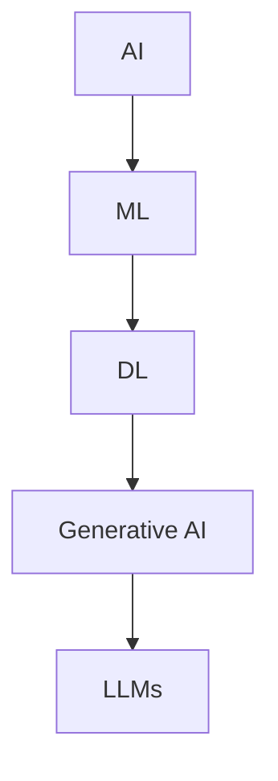
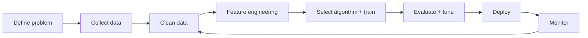
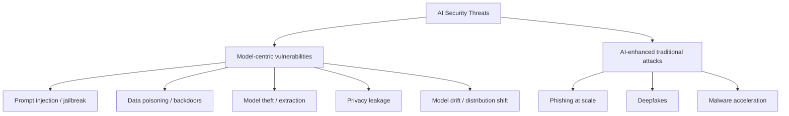

# AI/ML Security Threats — Notes 

> Scope: entry-level AI/ML concepts + how attackers/defenders use AI, with a security-first lens.

## Summary

* **AI** is the umbrella: systems that approximate human-like reasoning or creativity.
* **ML** learns patterns from data; **DL** uses multi-layer neural networks; **LLMs** are DL systems (often Transformer-based) optimized for **next-token prediction**.
* Security impact splits into two buckets:

  1. **New attack surface** introduced by AI systems (model/data/prompt/tooling risks).
  2. **Old attacks amplified** by AI (phishing, deepfakes, malware, recon automation).

---

## Mental model: how the terms nest

### Small intuition

* **ML**: “learn a rule from examples.”
* **DL**: “learn features + rule together” (more scale, less manual feature design).
* **LLM**: “predict the next token repeatedly” → fluent text generation.

---

## The ML lifecycle (iterative)

**Goal:** ship a model that performs in the real world, then keep it performing.

### What breaks in practice (security angle)

* Data pipelines become an **attack surface** (poisoning, leakage).
* Deployment adds **API** and **integration** risks (model extraction, prompt injection via tools).
* Monitoring must cover **accuracy + abuse signals**, not just metrics.

---

## What an ML algorithm “contains”

A useful decomposition:

* **Decision process**: how inputs map to outputs.
* **Error/Loss function**: how wrong the output is.
* **Optimization**: how parameters change to reduce loss (often gradient-based).

Practical translation:

* If you can change **inputs** (data/prompt), you can often change **outputs**.
* If you can change **training signal** (data/labels), you can change the model’s behavior.

---

## Learning paradigms (4 types)

* **Supervised learning**: labeled data → classification/regression.
* **Unsupervised learning**: unlabeled data → clustering, association, dimensionality reduction.
* **Semi-supervised learning**: a small labeled set + lots of unlabeled.
* **Reinforcement learning (RL)**: agent learns via reward/penalty signals.

Security note: RL-like loops appear in **LLM alignment** (human feedback shaping behavior).

---

## Neural networks & Deep Learning (DL)

### Core pieces

* **Layers**: input → hidden → output.
* **Weights**: strength of connections.
* **Training**: adjust weights to minimize loss (commonly via backpropagation).

### Why DL “exploded”

* Massive digitized data + GPUs + better architectures.

---

## LLMs in one page

### How they work (high level)

* Pre-train on large corpora using **next-token prediction**.
* Transformer architecture enables parallel processing and long-range dependencies via **attention**.
* Post-training alignment often uses **RLHF** (reinforcement learning from human feedback) to reduce harmful/unhelpful outputs.

### Practical implications

* LLMs are strong at: summarization, code assistance, pattern matching, natural language interfaces.
* LLMs are weak at: guaranteed factuality, safe tool use without guardrails, privacy by default.

---

# AI Security Threats

A clean split:

## 1) Model-centric vulnerabilities

### Prompt Injection (Prompt-based control failure)

**Idea:** attacker overrides intended instructions (system/dev policies) using crafted inputs.

* Common patterns: “ignore previous instructions”, role-play misdirection, indirect injection via retrieved documents (RAG).
* High-risk when the model can **call tools** (web, email, filesystem, ticketing).

**Defender mindset:** treat prompts as **untrusted input**, just like user input in web apps.

### Data Poisoning (Training/inference data integrity attack)

**Idea:** manipulate training data (or retrieval corpus) to bias or break outputs.

* Outcomes: targeted misclassification, hidden “backdoors”, biased decisions.

**Defender mindset:** protect data pipelines like production code: provenance, validation, versioning.

### Model Theft / Extraction

**Idea:** query an exposed model API, collect inputs/outputs, train a surrogate model.

* Motivations: steal IP, bypass safety layers, reproduce behavior offline.

**Defender mindset:** rate limiting, watermarking research, access control, anomaly detection on query patterns.

### Privacy Leakage

**Idea:** model reveals memorized sensitive information or enables inference about training data.

* Examples: regurgitating PII, membership inference signals, leakage via logs/prompts.

**Defender mindset:** minimize sensitive data exposure, apply privacy-preserving training where feasible, sanitize logs.

### Model Drift (Concept drift / data shift)

**Idea:** performance degrades as real-world data distribution changes.

* Security relevance: drift can look like a “model bug” while it’s actually a **business logic risk** (false negatives, missed alerts).

**Defender mindset:** monitoring must include drift detection and retraining triggers.

---

## 2) AI-enhanced traditional attacks

### Malware acceleration

* AI can reduce the skill barrier for writing/rewriting code, documentation, and lures.
* Most real-world advantage is **speed + iteration**, not “magical zero-days.”

### Deepfakes (synthetic identity)

* Attacks target **authentication-by-familiarity** (voice/video).
* Effective in business processes with urgent requests, weak verification, and social pressure.

### Phishing upgrades

* Better language fluency, personalization, and A/B testing.
* The “broken English” heuristic becomes unreliable.

---

# Defensive AI (why defenders still benefit)

## Where AI helps the most

* **Analyze**: anomaly detection, alert enrichment, log triage.
* **Predict**: automate classification/blocking where confidence is high.
* **Summarize**: reduce time-to-understanding for reports and incidents.
* **Investigate**: hypothesis generation, query suggestions, rapid troubleshooting.

## The catch

Defensive AI is only a net win if you also build **Secure AI**.

---

# Secure AI: a pragmatic checklist

## 1) Access & identity

* Enforce **RBAC** + **MFA** for model access.
* Separate roles: training, deployment, monitoring, incident response.

## 2) Data security

* Encrypt sensitive training data (at rest + in transit).
* Minimize PII exposure in prompts, logs, and retrieval corpora.

## 3) Prompt/tooling hardening

* Define a strict tool policy (allowlist, least privilege, sandboxing).
* Defend against indirect prompt injection in retrieved content.

## 4) Monitoring (accuracy + abuse)

Track:

* Metric drift (accuracy, false positives/negatives).
* Input distribution drift.
* Suspicious querying patterns (model extraction attempts).
* Safety signals (unexpected behaviors, prompt injection indicators).

## 5) Explainability (XAI)

* Use tools like **LIME** and **SHAP** to sanity-check drivers of predictions.
* Caveat: explanations can be misleading if you treat them as proofs.

## 6) Frameworks to anchor your thinking

* MITRE **ATLAS** (AI-adversary TTP knowledge base)
* OWASP Top 10 for **LLM Applications**
* NIST **AI RMF** (risk management vocabulary + governance)

---

# Practical prompt templates (defensive use)

> Keep prompts specific, supply context, and ask for *structured outputs*.

## Log analysis

* “Here is a log line: <log>. Explain what happened, likely cause, severity (low/med/high), and next 3 checks.”

## Phishing triage

* “Analyze this email for phishing indicators. Return: indicators, likely intent, recommended user guidance, and detection ideas.”

## Threat hunting brainstorming

* “Suggest 3 realistic hunting hypotheses for a corporate network. For each: data sources, queries (pseudo), and expected signals.”

## Regex generation (defensive)

* “Write a regex to match failed SSH login attempts in Linux auth logs. Include 3 test cases and explain edge cases.”

---

# Pitfalls (things that burn teams)

* Treating LLM output as ground truth (hallucination risk).
* Feeding sensitive data into prompts without a data policy.
* Letting LLMs call high-privilege tools.
* No monitoring after deployment (drift + abuse goes unnoticed).
* Evaluating on a dataset that leaks into training (over-optimistic metrics).

---

# Takeaways

* AI is not “magic”; it’s an engineering system with **inputs, optimization, and failure modes**.
* Attackers gain **speed and scale**; defenders can regain advantage with **secure adoption**.
* Think in lifecycle terms: most failures come from **integration + operations**, not just model training.

---

## Mini Glossary (EN → 中文)

* Artificial Intelligence (AI) → 人工智能
* Machine Learning (ML) → 机器学习
* Deep Learning (DL) → 深度学习
* Large Language Model (LLM) → 大语言模型
* Transformer / Attention → Transformer 架构 / 注意力机制
* Loss function → 损失函数
* Backpropagation → 反向传播
* Model drift / concept drift → 模型漂移 / 概念漂移
* Prompt injection → 提示注入
* Data poisoning → 数据投毒
* Model extraction/theft → 模型窃取/抽取
* Privacy leakage → 隐私泄露
* RBAC / MFA → 基于角色访问控制 / 多因素认证
* Explainable AI (XAI) → 可解释性 AI
