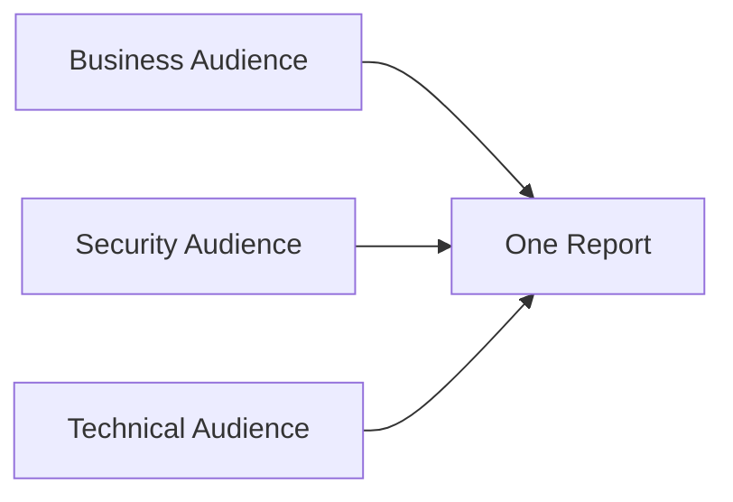
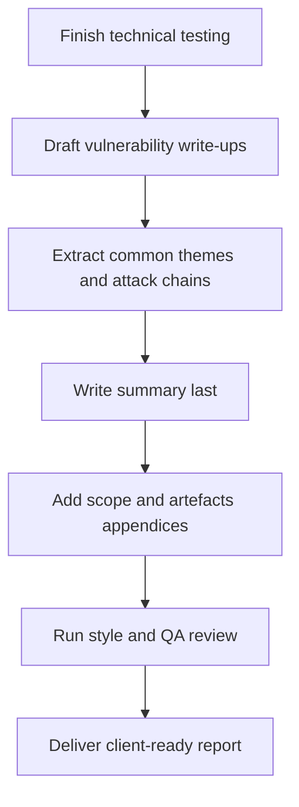

# Writing Pentest Reports

## Summary

* A pentest report is the **main durable deliverable** of an engagement. Access expires, shells die, screenshots get lost, but the report remains.
* Good reporting is not just documentation. It is **risk communication** for multiple audiences with different needs.
* This room is built around three report sections: **Summary** for business and security stakeholders, **Vulnerability Write-Ups** for technical stakeholders, and **Appendices** for audit trail, scope clarity, and follow-up work.
* The most important reporting habits are: write for the audience, explain business impact rather than bug names, make remediation actionable, keep tone formal and evidence-based, and QA the report before delivery.
* The room's practical value is high because it moves from theory into three concrete exercises: summary construction, write-up construction, and appendix QA.

---

## 1. Why Reporting Matters

A pentest that is not translated into a usable report has limited value.

### 1.1 Core reason

The report is the artifact that survives:

* tester turnover,
* system changes,
* remediation cycles,
* audits,
* later retests,
* post-incident reviews.

Operational reality:

```text
If it is not captured clearly in the report, it is very easy for the finding to be misunderstood, deprioritized, or forgotten.
```

A report therefore has two jobs:

* preserve what was found,
* convert technical work into decisions and action.

---

## 2. Audience-First Reporting

This room gets one thing very right: **a pentest report has more than one audience**.

### 2.1 Technical stakeholders

Usually:

* developers,
* IT support,
* infrastructure engineers,
* application owners.

They need:

* root cause,
* exact location,
* reproduction detail,
* reliable remediation guidance.

This is why most of the report typically targets them.

### 2.2 Security stakeholders

Usually:

* security team,
* AppSec,
* governance and risk personnel,
* remediation coordinators.

They need:

* prioritization guidance,
* attack-chain insight,
* common themes,
* what must be fixed before go-live versus what may be accepted temporarily.

### 2.3 Business stakeholders

Usually:

* project sponsors,
* product owners,
* leadership,
* non-technical decision-makers.

They need:

* what was tested,
* overall security posture,
* business impact,
* what needs investment or immediate action.

Key lesson:



One report, different levels of abstraction.

---

## 3. Anatomy of a Pentest Report

The room organizes the report into three major sections. That is a good beginner structure.

### 3.1 Summary

Targeted mainly at:

* business stakeholders,
* security stakeholders.

Purpose:

* what was tested,
* what was found,
* what it means,
* what to do next.

### 3.2 Vulnerability Write-Ups

Targeted mainly at:

* technical stakeholders.

Purpose:

* explain each issue clearly,
* show how it was found,
* provide enough detail to reproduce and fix it.

### 3.3 Appendices

Targeted mainly at:

* security stakeholders,
* future testers,
* blue team and incident triage teams.

Purpose:

* preserve scope detail,
* preserve leftover testing artefacts,
* document limitations and follow-up needs.

---

## 4. Section 1 - Summary

The room's summary model is strong and practical.

A good summary should answer:

* What was tested?
* What was found?
* Why does it matter?
* What should happen next?

### 4.1 Two-layer summary model

Sometimes one summary is not enough. The room suggests splitting it into:

#### Executive Summary

For business stakeholders.

Characteristics:

* minimal jargon,
* risk-focused,
* clear statement of security posture,
* immediate business implications.

#### Findings and Recommendations

For security stakeholders.

Characteristics:

* connects issues into themes or attack chains,
* explains why isolated medium or low findings may combine into high business risk,
* supports remediation prioritization.

### 4.2 Recommended summary structure

The room uses four sub-sections. This is a good pattern.

#### Overview

* what system was tested,
* what type of assessment was performed,
* scope and objective.

#### Results

* what categories of issues were found,
* overall security posture,
* headline findings.

#### Impact

* realistic business and system effect if issues remain.

#### Remediation Direction

* high-level next steps,
* investment magnitude,
* whether fixes are mostly architectural or mostly tactical.

### 4.3 Lab notes - TryBankMe summary challenge

From the provided screenshots, the high-scoring summary choices were:

#### Summary Example - Overview

> A black-box penetration test was performed against the TryBankMe platform, TryHackMe's new online banking system. The test focused on core banking features such as registration, login, and transaction processing, with the aim of identifying security risks before public launch.

#### Summary Example - Results

> The application showed good security in most areas tested, including login and access control. However, a race condition was discovered in the transaction feature that could allow users to manipulate balances.

#### Summary Example - Impact

> Exploiting the race condition may let attackers trigger multiple overlapping transactions, allowing them to bypass balance checks and generate unauthorised credits.

#### Summary Example - Remediation Direction

> Add transaction locking and atomic operations to prevent balance manipulation. Include monitoring for unusual patterns and validate the fix through a focused retest.

#### Why these are good

* clear,
* professional,
* concrete,
* business-aware without becoming vague,
* high-level enough for summary placement.

---

## 5. Section 2 - Vulnerability Write-Ups

This is the largest and most operationally important section for the fixing team.

### 5.1 Write-up structure

The room's structure is solid:

* **Title**
* **Risk Rating**
* **Summary**
* **Background**
* **Technical Details and Evidence**
* **Impact**
* **Remediation Advice**
* **References** (optional)

### 5.2 Why this structure works

Each heading answers a different stakeholder need.

#### Write-Up Title

Must be short, specific, and descriptive.

Bad:

* `Bank Bug Lets You Get More Money`

Good:

* `Race Condition in Transaction Handling Allows Balance Manipulation`

#### Write-Up Risk Rating

Needs consistency.

A public standard such as CVSS is useful when the client does not provide an internal matrix.

#### Write-Up Summary

One-paragraph plain-language description of the vulnerability and why it matters.

#### Write-Up Background

This is where you teach just enough security context so the fixing team understands the root cause.

#### Write-Up Technical Details and Evidence

This is where you prove the issue.

Typical content:

* request and response data,
* endpoints,
* parameters,
* steps to reproduce,
* screenshots,
* payloads,
* code snippets.

#### Write-Up Impact

This must be contextualized to the client's system.

The room is right to emphasize this. "`XSS` can steal cookies" is not enough if the app does not even use cookie-based sessions.

#### Write-Up Remediation Advice

The first recommendation should address the **root cause**, not just make exploitation harder.

Defence-in-depth is good, but it should not be presented as the full fix when it is not.

### 5.3 The "golden thread" idea

This is one of the best ideas in the room.

A good write-up should read like one connected argument:

```text
Here is the issue.
Here is why it exists.
Here is how it was proven.
Here is what it means here.
Here is how to fix it properly.
```

That flow matters more than headings alone.

### 5.4 Lab notes - TryBankMe race condition write-up

From the provided challenge screenshot, the final strong write-up was:

#### Write-Up Example - Title

**Race Condition in Transaction Handling Allows Balance Manipulation**

#### Write-Up Example - Risk Rating

**High (CVSS 3.1 Base Score: 8.6) - Exploitation allows unauthorised balance inflation with no authentication bypass required.**

#### Write-Up Example - Summary

**A race condition was discovered in the transaction endpoint that enables users to initiate multiple overlapping transfers, resulting in unauthorised increases in account balance.**

#### Write-Up Example - Background

**Race conditions occur when a system performs multiple operations simultaneously without proper handling, leading to unexpected outcomes. In web applications, this often affects financial systems where order and timing of requests are critical. Without transaction locking or atomic checks, users can exploit timing to create inconsistent states.**

#### Write-Up Example - Technical Details and Evidence

**The issue was confirmed by sending multiple concurrent POST requests to the `/transfer` endpoint using the same account balance. Using a script, five identical transfer requests were initiated simultaneously. All requests were processed, resulting in a final balance that did not reflect the deduction, effectively duplicating funds.**

#### Write-Up Example - Impact

**If left unaddressed, this vulnerability could allow malicious users to create funds out of nothing by exploiting timing gaps in transaction validation. This could lead to direct financial loss, reputational damage, and potential legal implications for failing to safeguard transaction integrity.**

#### Write-Up Example - Remediation Advice

**Implement transaction-level locking or atomic operations in the backend to prevent parallel processing of balance-altering actions. Additional safeguards like rate limiting and anomaly detection on rapid or duplicate transactions should also be considered. Validate fixes with targeted retesting.**

#### Why this scored well

* specific title,
* formal tone,
* strong root-cause explanation,
* evidence is reproducible,
* impact is contextualized to banking,
* remediation addresses both root cause and defence-in-depth.

---

## 6. Section 3 - Appendices

Appendices are where a report proves its discipline.

They are not filler.

### 6.1 Assessment Scope appendix

This should document:

* what was actually tested,
* what changed from original scope,
* what was inaccessible,
* what coverage limitations existed,
* whether retesting or additional assessment is needed.

This is vital when the performed coverage differs from the planned Rules of Engagement.

### 6.2 Assessment Artefacts appendix

This should document:

* accounts created,
* files uploaded,
* tools or scripts left behind,
* payloads placed on systems,
* changes that may still need cleanup,
* recommended cleanup steps.

#### Why this matters

This appendix is especially useful for:

* blue team analysts,
* incident responders,
* future testers,
* security stakeholders verifying cleanup.

If an artefact is rediscovered later, this appendix helps distinguish:

* legitimate pentest residue,
* actual malicious activity.

Room question takeaway:

* **Assessment Artefacts** is the most important appendix for blue teams trying to determine whether suspicious activity came from a pentest or a real attack.

---

## 7. Writing Style and QA

This room is unusually good at pushing the non-technical discipline of reporting.

### 7.1 Clear writing

Good reporting should be:

* direct,
* unambiguous,
* readable without deep product knowledge,
* concrete rather than decorative.

### 7.2 Professional writing

Key rules from the room:

* be objective,
* avoid slang,
* avoid emotional language,
* maintain consistent terminology,
* write in past tense,
* avoid first-person language,
* mask sensitive information.

### 7.3 QA process

The room's QA advice is simple and correct:

1. review your own work later with fresh eyes,
2. have someone else review it.

This is not just typo checking. It is report-quality control.

---

## 8. Lab Notes - Appendix QA Challenge

From the provided screenshots, the five QA mistakes and their classifications were:

### 8.1 Unprofessional language

Example:

> We also messed around with the transaction queue

Classification:

* **Unprofessional Language**

Better direction:

* replace with a formal phrase such as "conducted timing tests" or "performed concurrency testing".

### 8.2 Unprofessional language

Example:

> pwned through a stored injection

Classification:

* **Unprofessional Language**

Why:

* `pwned` is slang and inappropriate in formal client reporting.

### 8.3 Styling

Example:

> no checksum was calculated to confirm its deletion

Classification:

* **Styling**

Why:

* passive and vague.

Better direction:

* `No checksum was recorded to verify file removal.`

### 8.4 Spelling and grammar

Example:

> "Burp Suite" was used extensivly

Classification:

* **Spelling & Grammar**

Why:

* `extensivly` should be `extensively`.

### 8.5 Unprofessional and sensitive disclosure

Example:

> Password: PASSWORD_REDACTED

Classification:

* **Unprofessional Language** in the challenge UI, but the deeper issue is **unsafe disclosure of credentials**.

Why:

* credentials should not be presented in clear text in a report unless explicitly authorized and operationally necessary.

### 8.6 Full appendix QA lesson

The appendix screenshot shows several broader reporting mistakes worth remembering:

* real-looking credentials exposed,
* slang,
* vague passive phrasing,
* tool names and actions described casually,
* artefacts not described with cleanup precision.

---

## 9. Pattern Cards

### Pattern Card 1 - A pentest report is a decision document

**Problem**
: people think the report is just evidence storage.

**Better view**
: it is how stakeholders decide what to fix, accept, delay, or escalate.

**Reason**
: findings only matter if they drive action.

### Pattern Card 2 - Summary and write-up are different genres

**Problem**
: the same language is used everywhere.

**Better view**
: summaries communicate posture and business risk; write-ups communicate cause, proof, and fix.

**Reason**
: different audiences, different questions.

### Pattern Card 3 - Impact must be contextualized

**Problem**
: people paste generic impact text from textbooks.

**Better view**
: impact should describe what a realistic attacker could do in this client environment.

**Reason**
: business meaning is system-specific.

### Pattern Card 4 - Root-cause remediation comes first

**Problem**
: mitigations are presented as fixes.

**Better view**
: first fix the vulnerability at its core; then add defence-in-depth recommendations.

**Reason**
: weaker mitigations alone may leave the issue exploitable.

### Pattern Card 5 - Artefacts belong in the report

**Problem**
: testers clean up "as much as possible" and assume that is enough.

**Better view**
: anything created or modified that may matter later should be documented.

**Reason**
: future blue teams and retesters need that audit trail.

---

## 10. Mini Workflow



That is the reporting lifecycle this room is teaching.

---

## 11. Common Pitfalls

### 11.1 Writing the summary too early

You usually do not fully understand the engagement until the technical sections are already drafted.

### 11.2 Copy-pasting textbook remediation

If the advice does not match the client's stack or workflow, it is weaker than it looks.

### 11.3 Using report slang

Words like `pwned`, `messed around`, or `get rich quick` instantly damage credibility.

### 11.4 Confusing mitigation with remediation

Input validation may help, but parameterization fixes SQL injection at the root.

### 11.5 Forgetting artefact traceability

Two years later, a forgotten test file can become a fake incident if it was not documented.

---

## 12. Takeaways

* Pentest reporting is the most durable output of the engagement.
* A strong report is audience-aware, especially across business, security, and technical readers.
* The summary should explain posture, findings, impact, and next steps without drowning the reader in mechanics.
* Vulnerability write-ups should follow a consistent structure and maintain a golden thread from issue to fix.
* Appendices are critical for scope clarity and artefact traceability.
* QA is not optional. A sloppy report weakens even strong technical work.

---

## 13. References

* TryHackMe room content: *Writing Pentest Reports*
* OWASP Web Security Testing Guide - Reporting
* FIRST CVSS v3.1 Specification
* PTES - Reporting
* CREST Penetration Testing Guidance

---

## 14. CN-EN Glossary

* Pentest Report - 渗透测试报告
* Executive Summary - 管理层摘要 / 执行摘要
* Findings and Recommendations - 发现与建议
* Vulnerability Write-Up - 漏洞条目 / 漏洞详述
* Risk Rating - 风险评级
* CVSS - 通用漏洞评分系统
* Root Cause - 根因
* Remediation - 修复
* Mitigation - 缓解
* Defence in Depth - 纵深防御
* Assessment Scope - 评估范围
* Assessment Artefacts - 评估遗留物 / 测试产物
* Audit Trail - 审计轨迹
* Quality Assurance (QA) - 质量保证
* Technical Stakeholders - 技术干系人
* Security Stakeholders - 安全干系人
* Business Stakeholders - 业务干系人
* Golden Thread - 连贯主线 / 叙事主线
* Race Condition - 竞争条件
* Atomic Operation - 原子操作
* Transaction Locking - 事务锁定
