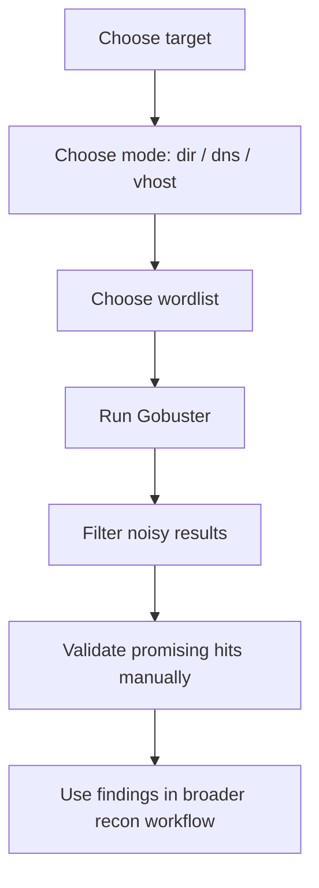

# Gobuster: The Basics

## Summary

* **Gobuster** is a fast brute-force enumeration tool commonly used to discover hidden web paths, DNS subdomains, and virtual host names.
* This room focuses on the three beginner-critical modes: `dir` for directories/files, `dns` for subdomains, and `vhost` for virtual hosts.
* Gobuster's operating model is simple: **take a target + take a wordlist + send many guesses quickly**.
* The most important flags to internalize early are `-u` for target URL, `-w` for wordlist, and `-t` for threads.
* In practice, Gobuster is noisy. It is useful for authorized enumeration, but it is also easy to misread results unless you understand filtering, wildcard behavior, and host-header logic.
* This room is best understood as a syntax-and-mental-model room, not a deep exploitation room.

## 1. Context

Gobuster is an enumeration tool. It is not an exploit framework, not a full network scanner, and not a magic recon engine.

Its job is narrower and very useful:

* guess likely names,
* ask the target whether they exist,
* report positive hits.

That makes it especially good for early web recon and target surface discovery.

### 1.1 What the official project says

The official project describes Gobuster as a high-performance tool for directory/file, DNS, and virtual host brute forcing. Kali's tool page lists the same core uses and notes additional modes beyond this room.

## 2. Why Gobuster Matters

When you look at a website in a browser, you usually see only the obvious front-end routes.

What you do **not** see immediately:

* hidden admin panels,
* backup directories,
* old API routes,
* forgotten test folders,
* alternate subdomains,
* virtual hosts bound on the same server.

Gobuster helps probe for those using a wordlist-driven approach.

### 2.1 Core principle

```text
Gobuster does not "discover" by intelligence.
It discovers by fast, structured guessing.
```

That is why wordlist quality matters.

## 3. Installation and Help Mentality

Before using any offensive-security tool, learn how to read its help output.

Typical first step:

```text
gobuster -h
```

Then for a specific mode:

```text
gobuster dir -h
gobuster dns -h
gobuster vhost -h
```

### 3.1 Why this matters

Gobuster has a consistent CLI structure:

```text
gobuster <mode> [flags]
```

So the tool becomes much easier once you stop memorizing full commands and start thinking in terms of:

* mode,
* target,
* wordlist,
* tuning and filtering flags.

The official README shows this same model and demonstrates the basic mode-specific syntax for `dir`, `dns`, and `vhost`.

## 4. Core Flags You Actually Need

These are the high-frequency flags that matter most in beginner labs.

### 4.1 `-u`

Target URL.

Common in:

* `dir`
* `vhost`

Example meaning:

* which website or server are we sending requests to?

### 4.2 `-w`

Wordlist path.

This is the source of all guesses.

If the word is not in the wordlist, Gobuster will not invent it for you.

### 4.3 `-t`

Thread count.

Higher threads means more concurrent requests and faster enumeration, but also more noise and potentially more instability depending on the target.

### 4.4 Filtering flags

This room references filters such as excluding certain response lengths.

Why that matters:

* many servers return "fake success" pages,
* wildcard or generic error pages can pollute results,
* filtering helps reduce noise.

Practical rule:

```text
Good Gobuster output is often filtered output.
```

## 5. Mode 1 - `dir` (Directories and Files)

This is the most commonly used Gobuster mode in beginner web enumeration.

### 5.1 What it does

It brute-forces likely paths on a target web server.

Examples of what it may find:

* `/admin`
* `/backup`
* `/uploads`
* `/api`
* `/robots.txt`
* `/config.php.bak`

### 5.2 Typical structure

```text
gobuster dir -u http://TARGET_HOST -w /path/to/wordlist.txt
```

The official Gobuster README shows this same pattern for directory brute forcing.

### 5.3 What the room is teaching

The room wants you to understand that `dir` mode is basically:

1. send a request for a guessed path,
2. inspect the response,
3. keep the hits that look meaningful.

### 5.4 Important caution

Status codes alone can mislead you.

A target may return:

* the same body for many invalid paths,
* `200` responses for custom error pages,
* redirects that need interpretation.

That is why filtering by length or status becomes important.

## 6. Mode 2 - `dns` (Subdomain Enumeration)

### 6.1 What it does

This mode brute-forces possible subdomains under a domain.

Examples:

* `dev.example.com`
* `api.example.com`
* `mail.example.com`
* `staging.example.com`

### 6.2 Typical structure

```text
gobuster dns -d example.com -w /path/to/wordlist.txt
```

The official README documents this same mode pattern, and Kali's tool page explicitly describes Gobuster as supporting DNS subdomains with wildcard support.

### 6.3 Why DNS setup matters in labs

In this room, DNS configuration matters because the lab environment wants your system to resolve names using the target-specific lab path rather than your default resolver. That is a lab-environment issue, not a universal Gobuster requirement.

### 6.4 Wildcard caveat

Some DNS setups respond positively to many guesses even when the guessed subdomain is not truly meaningful.

That creates false positives.

So in real work, `dns` results should be validated, not blindly trusted.

## 7. Mode 3 - `vhost` (Virtual Host Enumeration)

This is where many beginners get slightly confused.

### 7.1 What it does

`vhost` mode brute-forces **virtual host names** configured on a web server.

That means Gobuster sends requests to the same server or IP but changes the **Host header** to test whether different virtual hosts are configured there.

Kali's official tool page explicitly describes this mode as discovering virtual host names on target web servers.

### 7.2 Why `vhost` is not identical to `dns`

A subdomain is a DNS concept.

A virtual host is a web-server routing concept.

They often overlap in real life, but they are not the same layer.

Simple distinction:

```text
DNS asks: does this name resolve?
VHost asks: does this web server respond differently when I claim this host name?
```

### 7.3 Typical structure

A common pattern is:

```text
gobuster vhost -u http://TARGET_IP -w /path/to/wordlist.txt --append-domain
```

The official README includes `vhost` examples and documents `--append-domain`, which is useful when the wordlist contains just the left-hand label and you want Gobuster to append the base domain automatically.

### 7.4 Why the room repeats the target and domain idea

In `vhost` mode, Gobuster resolves the target once and then sends requests while manipulating the Host header. That is why the room ends up making you specify information that can feel slightly duplicated.

## 8. Gobuster Result Interpretation

A Gobuster run is not finished when it prints a line. The real work starts when you decide whether the hit is meaningful.

### 8.1 Things to verify

* response status code,
* response body size,
* redirect behavior,
* whether the page is unique or generic,
* whether the DNS or host-header behavior is real.

### 8.2 Why filtering matters

The room explicitly mentions excluding response lengths to reduce noisy output. This is a normal Gobuster habit: tune output so you are not drowning in false positives.

## 9. Workflow Diagram



This is the correct mental model.

## 10. Pattern Cards

### Pattern Card 1 - Gobuster is a guess engine, not a knowledge engine

* Problem: beginners expect Gobuster to be "smart."
* Better view: it is only as good as its mode choice, wordlist, and filtering.
* Reason: no word in the list means no hit.

### Pattern Card 2 - `dir` is about paths, not domains

* Problem: people mix file and directory brute forcing with hostname enumeration.
* Better view: `dir` stays inside one web target and probes paths.
* Reason: it is asking "what paths exist here?"

### Pattern Card 3 - `dns` and `vhost` are adjacent but different

* Problem: both can reveal names, so they get blurred together.
* Better view: `dns` tests resolution, `vhost` tests Host-header behavior on the web server.
* Reason: different protocol layers, different failure modes.

### Pattern Card 4 - Fast enumeration without filtering creates junk

* Problem: people accept every printed result as real.
* Better view: response size, redirects, and wildcard behavior must be checked.
* Reason: many servers lie in boring, generic ways.

### Pattern Card 5 - Help pages are part of the tool, not optional reading

* Problem: beginners memorize one-liners and get stuck when the syntax changes.
* Better view: use `-h` and mode-specific help routinely.
* Reason: the CLI is structured and readable once you stop guessing blindly.

## 11. Command Cookbook

> Authorized labs and owned or approved targets only.

### Show general help

```text
gobuster -h
```

### Show mode-specific help

```text
gobuster dir -h
gobuster dns -h
gobuster vhost -h
```

### Basic directory enumeration

```text
gobuster dir -u http://TARGET_HOST -w /path/to/wordlist.txt
```

### Basic DNS enumeration

```text
gobuster dns -d example.com -w /path/to/wordlist.txt
```

### Basic virtual host enumeration

```text
gobuster vhost -u http://TARGET_IP -w /path/to/wordlist.txt --append-domain
```

### Add thread tuning

```text
gobuster dir -u http://TARGET_HOST -w /path/to/wordlist.txt -t 50
```

### Save output

```text
gobuster dir -u http://TARGET_HOST -w /path/to/wordlist.txt -o results.txt
```

### Typical verification checklist

```text
- Did the response code change?
- Did the response size change?
- Is the content actually different?
- Is this a wildcard result?
- Can I validate the hit manually in a browser or with curl?
```

## 12. Common Pitfalls

### 12.1 Using the wrong mode

`dir`, `dns`, and `vhost` solve different enumeration problems.

### 12.2 Treating every `200` as success

A lot of web servers return friendly lies.

### 12.3 Ignoring filtering

Without status or length filtering, large runs become noisy fast.

### 12.4 Assuming `vhost` is just "subdomain mode again"

It is not. The Host header is the key difference.

### 12.5 Blaming Gobuster for bad wordlists

Weak wordlist input leads to weak enumeration output.

## 13. Takeaways

* Gobuster is a fast, wordlist-driven enumeration tool for web paths, DNS subdomains, and virtual hosts.
* The most important beginner concept is mode selection: `dir`, `dns`, and `vhost` answer different questions.
* `-u`, `-w`, and `-t` are the flags you should internalize first.
* Meaningful Gobuster use depends on result interpretation and filtering, not just running the command.
* This room is a strong intro because it teaches syntax plus mental model instead of just one-liner memorization.

## 14. CN-EN Glossary

* Gobuster - 基于字典爆破的枚举工具
* Enumeration - 枚举
* Wordlist - 字典 / 词表
* Directory Enumeration - 目录枚举
* File Enumeration - 文件枚举
* DNS Enumeration - DNS 枚举
* Subdomain - 子域名
* Virtual Host (VHost) - 虚拟主机
* Host Header - Host 请求头
* Wildcard DNS - 泛解析 DNS
* Response Length - 响应长度
* Status Code - 状态码
* Filtering - 过滤
* Threads - 线程数

## 15. References

* TryHackMe room content: *Gobuster: The Basics*
* Gobuster official README
* Kali Linux Gobuster tool page
