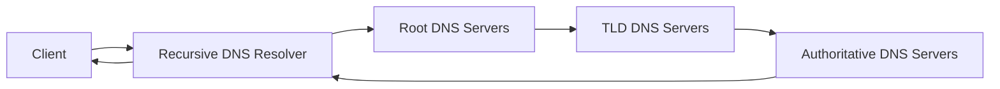

# DNS in Detail – Study Notes

Room: `DNS in Detail` (TryHackMe)

---

## 0. Big Picture

DNS (Domain Name System) = **Internet phonebook**.

* Maps **domain names** → **IP addresses** so humans don’t need to remember numbers.
* Example

  * IP: `104.26.10.229`
  * Domain: `tryhackme.com`
* Also stores many other records (mail servers, verification TXT, etc.).

Core ideas:

1. **Domain hierarchy** (root → TLD → second‑level domain → subdomain)
2. **Record types** (A, AAAA, CNAME, MX, TXT, …)
3. **Resolution path** (client → recursive resolver → root → TLD → authoritative NS)
4. **Caching & TTL** (performance + fewer external queries)

---

## 1. Domain Hierarchy

A domain is structured from **right to left**.

```text
jupiter.servers.tryhackme.com.
└── .           # Root (implicit trailing dot)
    └── com     # TLD (Top‑Level Domain)
        └── tryhackme   # Second‑Level Domain (SLD)
            └── servers  # Subdomain level 1
                └── jupiter  # Subdomain level 2 (host)
```

### 1.1 Root

* Written as `.` but usually **omitted** in everyday use.
* Served by a small set of **root DNS servers** – DNS “backbone”.

### 1.2 TLD – Top‑Level Domain

Right‑most visible label, e.g. `.com`, `.org`, `.edu`, `.gov`, `.mil`, `.uk`, `.io`.

Two main classes:

* **gTLD** (generic TLD)

  * `.com`, `.org`, `.net`, `.info`, `.online`, `.club`, `.website`, etc.
* **ccTLD** (country‑code TLD)

  * `.uk`, `.de`, `.cn`, `.fr`, `.ca`, `.jp`, `.br`, etc.
  * Composite like `.co.uk` is a ccTLD namespace controlled by the UK.

> Example: `.co.uk` → **ccTLD** (country‑code top‑level domain).

### 1.3 Second‑Level Domain (SLD)

* The part **left of the TLD**, e.g. `tryhackme` in `tryhackme.com`.
* Combined with TLD to form the “base domain”.
* Rules:

  * Length ≤ **63 characters** (per label)
  * Allowed chars: `a–z`, `0–9`, `-`
  * Cannot **start** or **end** with `-`
  * Cannot contain consecutive `--` in some reserved cases (IDN punycode).

### 1.4 Subdomains

* Any label(s) **to the left** of the SLD.

  * `admin.tryhackme.com`
  * `jupiter.servers.tryhackme.com`
* Same label rules as SLD: ≤ 63 chars, `[a‑z0‑9-]`, no leading/trailing `-`.
* Full domain (all labels + dots) must be **≤ 253 characters**.
* Unlimited number of subdomains under one registered domain.

---

## 2. DNS Record Types (Core)

Each domain can have multiple **resource records**.

### 2.1 A Record (Address)

* Maps name → **IPv4** address.
* Example:

```text
tryhackme.com.  IN  A   104.26.10.229
```

### 2.2 AAAA Record (Quad‑A)

* Maps name → **IPv6** address.

```text
example.com.  IN  AAAA  2001:db8:85a3::8a2e:370:7334
```

### 2.3 CNAME Record (Canonical Name)

* Alias: maps **name → another name**, not directly to IP.
* Client must then resolve the **target name**.
* Example (from room):

```text
store.tryhackme.com.  IN  CNAME  shops.shopify.com.
```

### 2.4 MX Record (Mail Exchange)

* Tells the world **which mail server(s)** handle email for this domain.
* Includes **priority** (lower number = higher priority).

```text
tryhackme.com.  IN  MX  10 alt1.aspmx.l.google.com.
tryhackme.com.  IN  MX  20 alt2.aspmx.l.google.com.
```

> Q: *What record type is used to advise where to send email?*
> A: **MX** record.

### 2.5 TXT Record (Text)

* Arbitrary text data associated with the domain.
* Common uses:

  * SPF / DKIM / DMARC for email anti‑spoofing.
  * Domain ownership verification for 3rd‑party services.

```text
example.com.  IN  TXT  "v=spf1 include:_spf.google.com ~all"
```

---

## 3. DNS Resolution Flow (Recursive Query)

High‑level pipeline:



### Step‑by‑Step

1. **Client check (local cache)**

   * Browser / OS cache (recent lookups, up to TTL).
   * If hit → immediately return IP.

2. **Recursive DNS server** (usually ISP, or public like 1.1.1.1 / 8.8.8.8)

   * Also has its own cache.
   * If cached → reply to client, done.
   * Else → start iterative resolution.

3. **Root DNS server**

   * Knows which **TLD servers** handle `.com`, `.org`, `.net`, `.uk`, etc.
   * For `www.tryhackme.com` → root sends back **“.com TLD server list”**.

4. **TLD DNS server**

   * Knows which **authoritative name servers** are responsible for the SLD.
   * For `tryhackme.com` → returns NS records, e.g.

```text
tryhackme.com.  IN  NS  kip.ns.cloudflare.com.
tryhackme.com.  IN  NS  uma.ns.cloudflare.com.
```

5. **Authoritative DNS server**

   * Stores the real DNS zone for `tryhackme.com`.
   * Returns the requested record(s): A / AAAA / MX / TXT / etc.

6. **Back to recursive → client**

   * Recursive resolver caches the answer (respecting TTL) and sends it to the client.

### TTL – Time To Live

* Each DNS record has a **TTL** (seconds).
* Defines **how long a DNS record may be cached** before it must be re‑queried.
* Trade‑off: higher TTL = fewer lookups but slower updates; lower TTL = more traffic but faster propagation.

> Q: *What field specifies how long a record should be cached?*
> A: **TTL (Time To Live)**.

> Q: *What type of DNS server is usually provided by your ISP?*
> A: **Recursive DNS server**.

> Q: *What type of server holds all records for a domain?*
> A: **Authoritative DNS server**.

---

## 4. Practical Queries (from the room)

The TryHackMe web helper showed equivalent CLI commands.

### 4.1 Using `dig`

```bash
# A record
$ dig A www.website.thm

# CNAME
$ dig CNAME shop.website.thm

# TXT
$ dig TXT website.thm

# MX
$ dig MX website.thm
```

Typical kinds of answers in the room:

* CNAME of `shop.website.thm` → some `shops.myshopify.com` style value.
* TXT record of `website.thm` → long token string (ownership / config).
* MX record priority → e.g. `30`.
* A record of `www.website.thm` → lab IP, e.g. `10.10.10.10`.

### 4.2 Mental mapping

* CNAME → alias; will **not** have its own A record in same reply.
* MX → mail routing; lower priority number first.
* TXT → flexible; often multiple TXT records per domain.

---

## 5. Quick Q&A Recap (Room‑style)

* **Q:** What does DNS stand for?
  **A:** Domain Name System.

* **Q:** Max length of a **single label** (e.g. subdomain or SLD)?
  **A:** 63 characters.

* **Q:** Which character **cannot** be used in a subdomain?
  **A:** `_` (underscore).

* **Q:** Max length of a full domain name (all labels + dots)?
  **A:** 253 characters.

* **Q:** What record type handles IPv6 addresses?
  **A:** AAAA.

* **Q:** What record type is used for email routing?
  **A:** MX.

* **Q:** Which servers are the "backbone" that redirect to TLD servers?
  **A:** Root DNS servers.

---

## 6. Takeaways for Security / OSINT

* Understanding DNS hierarchy & caching is critical for:

  * Subdomain enumeration & attack surface mapping.
  * Identifying misconfigured MX/TXT records (phishing, spoofing).
  * Detecting DNS tunneling / exfiltration patterns.
* Tools you’ll constantly use later:

  * `dig`, `nslookup`, `host`
  * wordlist‑based subdomain bruteforce (`dnsrecon`, `amass`, `subfinder`)

If you’re comfortable with everything on this page, you’re ready to use DNS as a basic recon weapon instead of just a black box phonebook.
