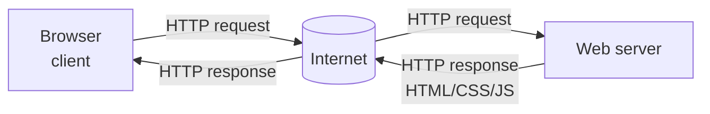

# How Websites Work — Notes

## 0. Snapshot / TL;DR

* Web apps follow a **request–response** pattern: browser (client) sends an HTTP request, server replies with an HTTP response (HTML/CSS/JS, JSON, etc.).
* Two major components:

  * **Front end / Client‑side**: what the browser renders (HTML + CSS + JavaScript).
  * **Back end / Server‑side**: logic on the server that processes requests and talks to databases and other services.
* Core technologies:

  * **HTML**: structure / content.
  * **CSS**: presentation / layout.
  * **JavaScript**: behaviour / interactivity.
* Intro security topics from this room:

  * **Sensitive data exposure** in page source.
  * **HTML injection** when user input is not sanitised.

---

## 1. High‑level architecture: request → response

### 1.1 Basic flow

1. User types a URL or clicks a link in the **browser**.
2. Browser builds an **HTTP request** (e.g. `GET /index.html HTTP/1.1`).
3. Request travels over the **Internet** to the **web server**.
4. Web server processes the request (may run server‑side code, query DB, etc.).
5. Server sends an **HTTP response** back (status code + headers + body).
6. Browser parses the body (HTML, CSS, JS) and renders the page.

### 1.2 Simple diagram



Notes:

* Browsers never talk directly to databases; they always go through a server.
* One page load can trigger **many** extra requests (images, CSS, JS, fonts, API calls).

---

## 2. Front end vs Back end

### 2.1 Front end (client‑side)

* Runs **inside the browser**.
* Built mainly with **HTML + CSS + JavaScript**.
* Responsible for:

  * Layout and visual appearance.
  * Handling user input (forms, clicks, key presses).
  * Making further HTTP requests (e.g. AJAX / `fetch`) to back‑end APIs.
* Security angle:

  * Everything sent to the browser is **visible** and **modifiable** by the user.
  * Never trust front‑end checks alone.

### 2.2 Back end (server‑side)

* Runs on the **web server**.
* Implemented in many possible languages/frameworks (Python, PHP, Node.js, Java, Go, etc.).
* Responsibilities:

  * Authenticate / authorise users.
  * Apply business logic.
  * Talk to databases, file storage, other internal services.
  * Generate responses (HTML templates, JSON APIs, file downloads, etc.).
* Security angle:

  * Real access control must live here.
  * Vulnerabilities like SQL injection, broken auth, insecure direct object references, etc.

---

## 3. HTML essentials

### 3.1 Role of HTML

* **HTML (HyperText Markup Language)** describes **structure** and basic semantics of a page.
* Browser reads HTML and builds the **DOM (Document Object Model)**, a tree of elements.

### 3.2 Basic document skeleton

```html
<!DOCTYPE html>
<html>
  <head>
    <title>Page Title</title>
  </head>
  <body>
    <h1>Example Heading</h1>
    <p>Example paragraph...</p>
  </body>
</html>
```

Key pieces:

* `<!DOCTYPE html>`: tells the browser to use HTML5 parsing rules.
* `<html>`: root of the document.
* `<head>`: metadata (title, charset, linked CSS/JS, etc.).
* `<body>`: content visible in the page.

### 3.3 Common tags

* Headings: `<h1>` … `<h6>`
* Paragraph: `<p>`
* Links: `<a href="https://example.com">link</a>`
* Images: ``
* Lists: `<ul>`, `<ol>`, `<li>`
* Forms: `<form>`, `<input>`, `<textarea>`, `<button>`

### 3.4 Attributes, `class` vs `id`

* General format: `<tag attr="value">content</tag>`
* **`class`**:

  * Non‑unique label.
  * Many elements can share the same class.
  * Used heavily by CSS and JS to style / select groups of elements.
  * Example: `<p class="bold-text">Hello</p>`
* **`id`**:

  * Must be **unique** within a page.
  * Used to target a specific element.
  * Example: `<p id="welcome-msg">Welcome</p>`

Other important attributes:

* `src` for images / scripts: where to load the resource from.
* `href` for links: where the link leads.
* `type`, `name`, `value` on form fields.

### 3.5 Viewing page source

* In a browser: **Right‑click → View Page Source** or use developer tools.
* You can see **all HTML** the server sent, including:

  * Comments (`<!-- like this -->`).
  * Hidden fields and unused elements.
  * Linked JS and CSS files (which can also leak info).

---

## 4. JavaScript basics

### 4.1 Purpose

* Adds **interactivity** and dynamic behaviour to pages.
* Runs in the browser (client‑side JavaScript).
* Can:

  * Read/modify the DOM.
  * React to events (clicks, keyboard, timers).
  * Make additional HTTP requests (AJAX / `fetch`).

### 4.2 Simple DOM manipulation example

```javascript
document.getElementById("demo").innerHTML = "Hack the Planet";
```

* `document` is the current page.
* `getElementById("demo")` finds the element with `id="demo"`.
* `innerHTML` controls the HTML content inside that element.

### 4.3 Event‑driven JS (onclick example)

```html
<button onclick="document.getElementById('demo').innerHTML = 'Button Clicked';">
  Click Me!
</button>
```

* When user clicks the button, JS code runs and updates the element with id `demo`.
* Same logic can also be placed inside `<script>` tags and bound via `addEventListener`.

Security angle:

* Anything the browser executes can be **modified** by the user.
* Dangerous patterns include:

  * `innerHTML` with untrusted input (leads to HTML/JS injection).
  * Embedding secrets (API keys, access tokens) in front‑end JS.

---

## 5. Intro security issues from this room

### 5.1 Sensitive Data Exposure (frontend)

**Definition**

* The application leaks **clear‑text sensitive information** to the user, typically via HTML/JS/CSS.

Examples:

* Developer leaves a comment like:

  * `<!-- TODO: remove test credentials admin:password123 -->`
* Hard‑coded API keys or tokens in front‑end JavaScript.
* Hidden links to admin panels or internal tools.

Why it is dangerous:

* Attacker can read page source and use leaked credentials to log in.
* Hidden links may expose unauthenticated admin functionality.

Basic checklist when you assess a site:

* Always **View Source** and search for strings like `TODO`, `pass`, `key`, `token`, `secret`.
* Inspect linked JS files as well.
* Assume anything shipped to the browser is public.

### 5.2 HTML Injection

**Definition**

* The website takes **user input** and reflects it into the page **without sanitising/escaping** it.
* The browser interprets this input as raw HTML instead of plain text.

Example pattern:

```javascript
function sayHi() {
  const name = document.getElementById('name').value;
  document.getElementById('welcome-msg').innerHTML = 'Welcome ' + name;
}
```

If the user enters:

```html
<a href="http://hacker.com">Click here</a>
```

and the code above uses `innerHTML` without sanitisation, the page will render a clickable malicious link, not literal text.

Risks:

* Visual defacement.
* Can be a stepping stone towards **Cross‑Site Scripting (XSS)** if scripts can be injected.

Defences (developer side):

* **Never trust user input.**
* Validate input on both client and server (length, allowed characters, etc.).
* Escape/encode special characters before inserting into HTML:

  * `<` → `&lt;`, `>` → `&gt;`, `"` → `&quot;`, `'` → `&#39;`.
* Prefer text‑only APIs (e.g. `textContent` instead of `innerHTML`) when possible.

---

## 6. Key answers / mental flashcards

* Component of a web app rendered by the browser:

  * **Front end / Client‑side**.
* Languages used primarily for building websites:

  * **HTML** (structure), **CSS** (style), **JavaScript** (behaviour).
* Example of simple credential leak:

  * Login details accidentally left in HTML comments or JS variables.
* Basic HTML injection exercise:

  * Input something like `<a href="http://hacker.com">malicious link</a>` into an unsanitised text field and see it rendered as a clickable link.

---

## 7. Quick Chinese glossary (术语小词汇)

* **Front end / Client‑side** — 前端 / 客户端
* **Back end / Server‑side** — 后端 / 服务器端
* **Request–response model** — 请求–响应模型
* **HTML (HyperText Markup Language)** — 超文本标记语言
* **DOM (Document Object Model)** — 文档对象模型
* **Sensitive data exposure** — 敏感数据泄露
* **HTML injection** — HTML 注入
* **Input sanitisation** — 输入清洗 / 过滤
