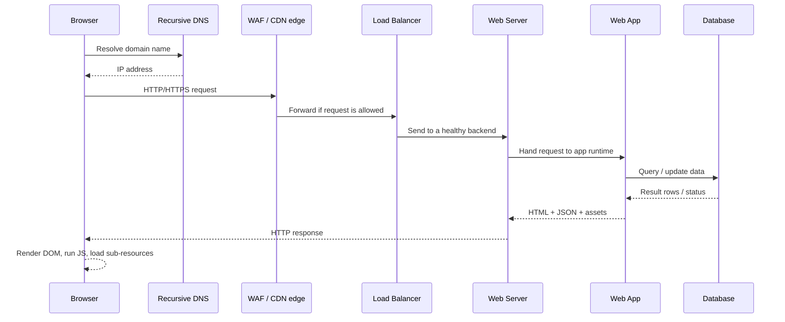

## 1. Big picture: from URL to page

High‑level mental model:



**Core idea:**

> URL → DNS resolution → TCP/TLS connection → HTTP request → application + database work → HTTP response → browser rendering.

Everything else (CDN, WAF, load balancer, caching, etc.) is optimization or protection wrapped around this pipeline.

---

## 2. DNS resolution chain

When I type `https://tryhackme.com` in a browser:

1. **Browser / OS cache** – Check local DNS cache and `/etc/hosts` (or Windows `hosts` file). If the IP is cached and not expired, use it directly.
2. **Recursive resolver** – If not cached locally, query the configured resolver (often the ISP resolver, corporate resolver, or a public one like 1.1.1.1 / 8.8.8.8).
3. **Root & TLD servers** – The recursive resolver walks the DNS hierarchy:

   * Ask a **root server** where `.com` names are handled.
   * Ask a **TLD server** (for `.com`) which **authoritative server** knows about `tryhackme.com`.
4. **Authoritative name server** – Returns the final answer (often a CDN or load balancer hostname/IP).
5. **Caching everywhere** – Each step caches results for the record’s TTL, so future queries are faster.

Result: browser now has an IP address (or multiple IPs) to connect to.

---

## 3. Extra infrastructure on the path

### 3.1 Load balancer

**Why:** one web server is not enough (traffic, availability, maintenance).

**Functions:**

* Sits in front of a **pool of web servers**.
* Accepts client TCP/HTTPS connections and forwards them to one backend.
* Uses an algorithm:

  * *Round‑robin* – rotate through servers.
  * *Least connections* / *least load* – send to the least busy.
  * *Weighted* – prefer more powerful servers.
* Runs **health checks** (heartbeats) to detect dead/unhealthy backends and stop sending traffic there.

Effect: users see one site; behind the scenes, many servers share the work.

### 3.2 CDN (Content Delivery Network)

**Goal:** move static content closer to users and offload origin servers.

* CDN edge nodes cache:

  * Images, video, CSS, JS bundles.
  * Sometimes pre‑rendered HTML or API responses.
* DNS often points the user to the **nearest edge node** (by Anycast / geo‑routing).
* If the edge cache doesn’t have the file (cache miss), it fetches from origin, stores it, then serves it.

Benefits:

* Lower latency (physically closer).
* Less bandwidth + CPU load on origin.
* Extra protection against volumetric DDoS.

### 3.3 WAF (Web Application Firewall)

**Position:** usually in front of the application (often combined with CDN or load balancer).

**Job:** inspect HTTP(S) traffic and block/flag suspicious patterns, for example:

* SQL injection payloads.
* Common XSS and command‑injection patterns.
* Obvious file‑inclusion or path‑traversal attempts.
* Abnormal rates of requests (basic rate‑limiting / bot filtering).

Important caveats:

* WAF ≠ magic shield. Clever payload encoding or application‑specific quirks can bypass many rules.
* Secure coding and proper input validation are still mandatory.

---

## 4. Web server, virtual hosts, and content types

### 4.1 Web server software

Typical daemons:

* **Apache HTTP Server**
* **Nginx**
* **Microsoft IIS**
* **Node.js**‑based frameworks acting as HTTP servers

Responsibilities:

* Listen on TCP ports **80 (HTTP)** and **443 (HTTPS)**.
* Terminate TLS (for HTTPS) or pass it to a reverse proxy.
* Map the incoming **Host** header and URL path to a site and a file or an application handler.
* Serve static files or hand off to an application runtime (PHP‑FPM, Python WSGI, Node, etc.).

### 4.2 Virtual hosts

One server IP can host many sites using **virtual hosts**:

* Match incoming requests based on `Host:` header (e.g., `example.com`, `api.example.com`).
* Each vhost has:

  * Its own **document root** (`/var/www/site1`, `/var/www/site2`, ...).
  * Its own TLS certificate and config.

### 4.3 Static vs dynamic content

* **Static content**

  * Files do not change per request.
  * Typical examples: `.html` pages, `.css`, `.js`, images, fonts.
  * Web server (or CDN) serves them directly.

* **Dynamic content**

  * Output depends on user, time, query, DB state, etc.
  * Implemented with **backend languages** (PHP, Python, Ruby, Node.js, Go, etc.).
  * App code reads request parameters, talks to databases / APIs, and generates HTML or JSON.

Simple PHP example (from THM):

```php
<?php // index.php
$name = $_GET["name"];           // read query parameter
?>
<html><body>Hello <?php echo $name; ?></body></html>
```

Request: `GET /index.php?name=adam` → Response body contains `Hello adam`.

The browser only sees the rendered HTML; the PHP source stays on the server.
This **server‑side execution** is where many security bugs live (injection, auth logic flaws, etc.).

---

## 5. End‑to‑end request timeline (expanded)

Another way to memorize the full chain:

1. **User action** – Type URL / click link.
2. **Local DNS check** – Browser / OS cache, then recursive resolver.
3. **DNS hierarchy** – Root → TLD → authoritative → final A/AAAA/CNAME.
4. **Optional: CDN / WAF front** – DNS points to edge; WAF/CDN may block, cache, or forward.
5. **Load balancer** – Chooses a healthy backend server.
6. **TCP + TLS** – 3‑way handshake and optional TLS handshake.
7. **HTTP request** – `GET /path HTTP/1.1` plus headers, cookies, body.
8. **Web server routing** – Map to vhost; decide static file vs app.
9. **Application logic** – Controller, business logic, authorization checks.
10. **Database / external services** – Queries, cache reads, API calls.
11. **Application response** – HTML/JSON built; status code chosen.
12. **Web server sends response** – Headers + body back over the connection.
13. **Browser rendering pipeline** – Parse HTML → build DOM/CSSOM → run JS → additional requests for images/JS/CSS/fonts.

At each step, logs and controls exist: DNS logs, WAF logs, web server access logs, application logs, DB audit logs, etc. This is the **observability surface** for defenders and the **attack surface** for attackers.

---

## 6. Security checkpoints to think about

When analysing or defending a web stack, mentally probe each layer:

* **DNS** – Cache poisoning, hijacked records, typo‑squatting domains.
* **TLS** – Expired/misissued certificates, weak ciphers, missing HSTS.
* **WAF/CDN** – Misconfigured rules, overly‑trusted IP ranges, origin leaks.
* **Load balancer** – Inconsistent headers, bypass via direct origin IP, missing health‑check hardening.
* **Web server** – Directory listing, outdated server, verbose error pages, unsafe default modules.
* **Application** – AuthZ bugs, input validation failures, injection, insecure session handling.
* **Database** – Over‑privileged app accounts, lack of backups, missing encryption at rest.

This is essentially **defence in depth** mapped onto the end‑to‑end request.

---

## 7. Mini glossary (EN → 中文)

* **Recursive resolver** → 递归解析器
* **Authoritative DNS server** → 权威 DNS 服务器
* **Load balancer** → 负载均衡器
* **Content Delivery Network (CDN)** → 内容分发网络
* **Web Application Firewall (WAF)** → Web 应用防火墙
* **Virtual host (vhost)** → 虚拟主机配置
* **Static content** → 静态内容
* **Dynamic content** → 动态内容
* **Backend language / runtime** → 后端语言 / 运行时
* **Defence in depth** → 深度防御 / 纵深防御
