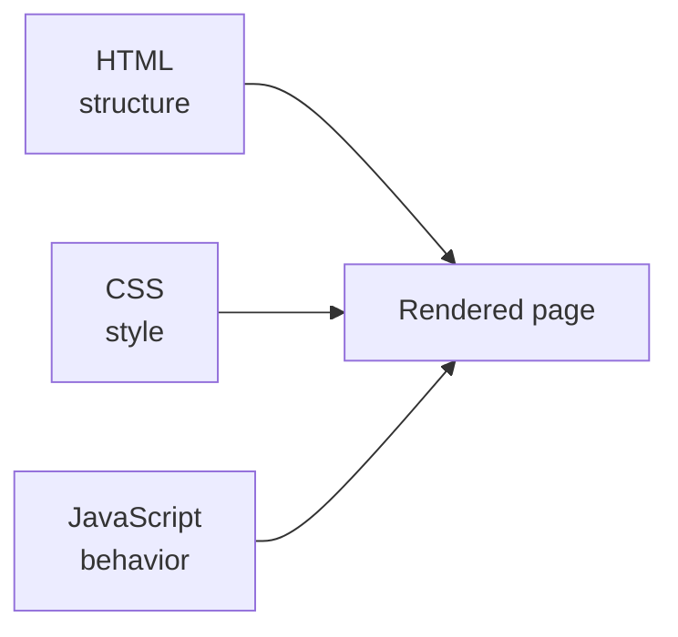
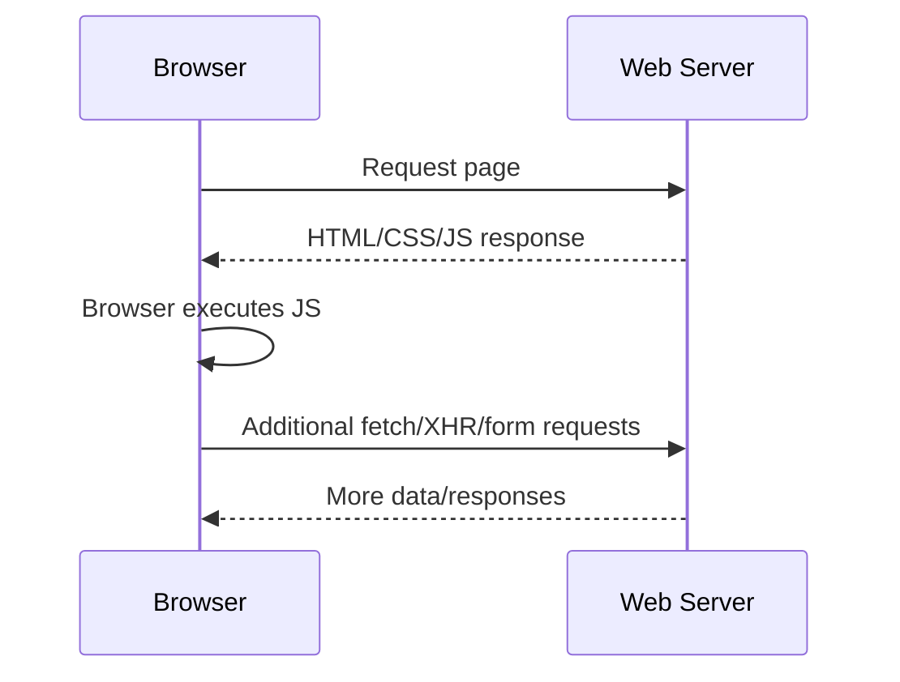

---

platform: tryhackme
room: JavaScript Essentials
slug: javascript-essentials
path: notes/10-web/javascript-essentials.md
topic: 10-web
domain: [javascript, client-side-security]
skills: [js-basics, script-integration, dialog-functions, control-flow-review, minification-obfuscation, source-analysis]
artifacts: [concept-notes, pattern-cards, cookbook]
status: done
date: 2026-02-28
---

0. Summary

* JavaScript (JS) is the browser’s main scripting language for client-side interactivity. It works with HTML and CSS rather than replacing them.
* Core building blocks in this room are variables, data types, functions, loops, conditional statements, and browser dialogue functions.
* JS can be embedded **internally** inside HTML or loaded **externally** through a separate `.js` file.
* From a security perspective, any logic enforced only in client-side JS is untrusted and potentially bypassable.
* Minification and obfuscation make code less readable, but they do **not** make it secret. Browser tooling and source maps can undo much of the difficulty.

1. Key Concepts

1.1 What JavaScript is doing in a web app

JavaScript is usually the layer that adds behavior to the front end:

* validating form input
* reacting to clicks and key presses
* updating page content dynamically
* sending or handling requests asynchronously
* controlling browser-side logic

Think of the front end as:

* HTML = structure
* CSS = presentation
* JavaScript = behavior



1.2 Variables and data types

JS variables store values under names you can reuse later.

Declaration styles:

* `var`

  * function-scoped, older style
* `let`

  * block-scoped, reassignable
* `const`

  * block-scoped, binding itself is not reassignable

Common data types:

* `string`
* `number`
* `boolean`
* `null`
* `undefined`
* `object`

Practical default:

* use `const` unless reassignment is required
* use `let` when reassignment is expected
* avoid `var` in modern code unless you have a specific reason

1.3 Functions

A function groups reusable logic into one callable unit.

Example idea:

```javascript
function greet(name) {
  console.log("Hello, " + name + "!");
}
```

Why it matters:

* reduces repetition
* improves readability
* isolates behavior for testing or review

1.4 Loops

Loops repeat code while a condition remains true.

Common loop forms:

* `for`
* `while`
* `do...while`

Security review angle:

* unbounded or poorly controlled loops can create denial-of-service-like browser behavior
* repeated dialog calls are a simple nuisance example

1.5 Control flow

Control flow determines which code path executes.

Common structures:

* `if / else`
* `switch`
* loops (`for`, `while`, `do...while`)

Security takeaway:

* if an access decision exists only in browser-side JS, a user can often inspect, modify, or bypass it
* client-side control flow is useful for UX, not as a security boundary

2. Integrating JavaScript in HTML

2.1 Internal JavaScript

Internal JS is written directly inside the HTML document using `<script>`.

Example pattern:

```html
<script>
  let x = 5;
  let y = 10;
  document.getElementById("result").innerHTML = x + y;
</script>
```

Pros:

* easy for beginners
* simple demos and small pages

Cons:

* mixes structure and behavior
* scales poorly in larger projects

2.2 External JavaScript

External JS is stored in a separate file and loaded with `src`.

Example pattern:

```html
<script src="script.js"></script>
```

Pros:

* cleaner separation of concerns
* easier maintenance
* better reuse across pages

Cons:

* introduces dependency management issues
* third-party external scripts expand attack surface

2.3 How to tell internal vs external quickly

In page source or DevTools:

* `<script> ... </script>` without `src` = internal script
* `<script src="...">` = external script reference

For pentest or code review work, always inspect both:

* inline scripts in HTML
* linked `.js` files

3. Browser Dialogue Functions

JS provides built-in browser dialogue APIs:

* `alert()`
* `prompt()`
* `confirm()`

3.1 `alert()`

Displays a message and waits for user dismissal.

Use case:

* informational message or warning

Security angle:

* can be abused for nuisance or proof-of-execution demos
* frequent use in training also overlaps with XSS proof-of-concept patterns

3.2 `prompt()`

Requests input from the user and returns entered text or `null`.

Use case:

* quick input collection

Security angle:

* any input collected must be treated as untrusted
* never confuse browser-side prompts with secure authentication logic

3.3 `confirm()`

Shows OK/Cancel choices and returns `true` or `false`.

Use case:

* simple confirmation workflow

Security angle:

* useful for UX, not authorization

Important browser behavior note:

* browsers may suppress or alter dialog behavior in some situations (for example tab switches or anti-abuse measures), so code that depends on them is brittle

4. Request-Response Cycle and JS

Although this room is about JS basics, the browser-side code still sits inside the web request-response cycle:

* browser requests HTML/JS/CSS from server
* browser receives resources
* JS executes in the browser context
* JS may update DOM or trigger new requests



This is why JS is so visible to users and testers: it is delivered to the client.

5. Client-Side Security Implications

5.1 Client-side validation is not trust

The room’s most important security lesson is this:

* client-side validation improves usability
* server-side validation enforces trust boundaries

If validation exists only in JS, a user can:

* disable JS
* alter inputs before sending
* edit code in DevTools
* replay requests without the browser UI

So browser-side checks should be treated as convenience, not protection.

5.2 Login logic in JS can be bypassed

If a login page “protects” access using only browser-side condition checks, that logic is exposed to the user and can be altered.

Review rule:

* authentication and authorization must be enforced on the server
* anything enforced only in the browser is presentation logic, not security logic

5.3 Untrusted libraries are supply-chain risk

Adding a third-party script means executing someone else’s code in your application’s trust boundary.

Risks include:

* compromised CDN or package source
* typo-squatted package names
* malicious updates in dependencies

Safer practice:

* pin and review dependencies
* restrict script origins with CSP
* avoid unnecessary third-party JS

5.4 Hardcoded secrets are exposure, not storage

Never place secrets in shipped client-side JS:

* API keys
* tokens
* passwords
* internal endpoints treated as private by assumption

If the browser can download it, the user can inspect it.

6. Minification, Obfuscation, and Source Review

6.1 Minification

Minification reduces file size by removing:

* whitespace
* line breaks
* comments
* some redundant syntax

Goal:

* performance and faster load times

6.2 Obfuscation

Obfuscation tries to make code harder for humans to understand by:

* renaming variables/functions to meaningless names
* flattening readable structure
* adding confusing or unnecessary logic patterns

Goal:

* raise reverse-engineering cost

6.3 What minification/obfuscation do **not** do

They do **not** provide real secrecy.

Reasons:

* browsers must still execute the code
* DevTools can still inspect loaded scripts
* beautifiers and deobfuscators exist
* source maps can reveal original structure if exposed

Correct security reading:

* minify for performance
* obfuscate only as a weak friction layer
* do not claim obfuscation is a security control

7. Pattern Cards

7.1 JS review card

When reading client-side JS, ask:

* What input sources exist?
* What DOM updates occur?
* What network requests are triggered?
* Are there hidden endpoints, tokens, or feature flags?
* Is any security decision enforced only in client-side code?

7.2 Script sourcing card

For each `<script>`:

* internal or external?
* same-origin or third-party?
* integrity checked?
* restricted by CSP?
* actually needed?

7.3 Obfuscated file review card

If JS is unreadable:

* pretty-print first
* inspect strings, URLs, endpoints, and function names
* check for source maps
* compare runtime behavior in DevTools

8. Command / Inspection Cookbook

8.1 Simple browser console examples

```javascript
let x = 5;
let y = 10;
console.log("The result is: " + (x + y));
```

```javascript
alert("Hello THM");
confirm("Do you want to proceed?");
prompt("What is your name?");
```

8.2 What to inspect in DevTools

Open DevTools and check:

* **Console**

  * test variables, functions, dialog behavior
* **Sources**

  * inspect loaded JS files
* **Network**

  * observe requests triggered by JS
* **Elements**

  * watch DOM changes caused by scripts

8.3 Safe review workflow for a page using JS

```text
View page source -> identify script tags -> open DevTools -> inspect Sources -> trace DOM changes -> watch Network -> decide what is client-only vs server-enforced
```

9. Pitfalls

* Treating `alert`, `prompt`, or `confirm` as secure workflow controls.
* Assuming minified code is “protected”.
* Relying only on client-side validation.
* Shipping secrets in browser-downloaded JS.
* Importing third-party libraries without trust review.

10. Takeaways

* JavaScript is essential for browser interactivity, but everything shipped to the browser must be treated as inspectable and modifiable by the user.
* The biggest security mistake in beginner web apps is trusting client-side logic for enforcement.
* Minification improves performance; obfuscation slows casual reading; neither replaces secure architecture.
* For web security work, JS review is not optional. It often reveals hidden endpoints, business logic, and weak trust assumptions.

11. References

* MDN JavaScript Guide: grammar, types, and declarations
* MDN `<script>` element / `HTMLScriptElement.src`
* MDN `window.alert()`, `window.prompt()`, `window.confirm()`
* MDN Source Map glossary and `SourceMap` header
* OWASP Third Party JavaScript Management Cheat Sheet
* OWASP AJAX Security Cheat Sheet
* OWASP Cross-Site Scripting Prevention Cheat Sheet

CN–EN Glossary (mini)

* JavaScript (JS): JavaScript 脚本语言
* Variable: 变量
* Data type: 数据类型
* Function: 函数
* Loop: 循环
* Control flow: 控制流
* Client-side validation: 客户端校验
* Source code: 源代码
* Internal script: 内联脚本 / 内部脚本
* External script: 外部脚本
* Minification: 压缩/最小化
* Obfuscation: 混淆
* Source map: 源映射
* DOM: 文档对象模型
* XSS: 跨站脚本
* CSP: 内容安全策略
* Third-party library: 第三方库
