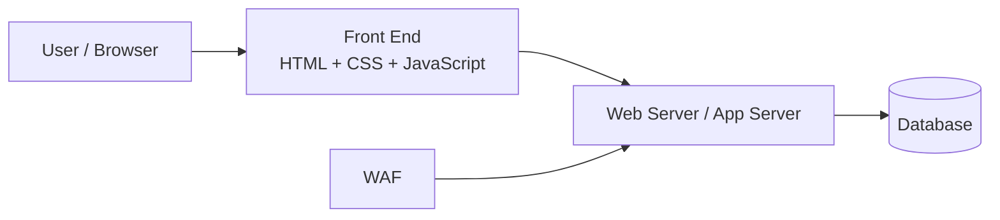

---

platform: tryhackme
room: Web Application Basics
slug: web-application-basics
path: 10-web/web-application-basics.md
topic: 10-web
domain: [web-fundamentals, http]
skills: [url-anatomy, http-messages, request-methods, response-codes, headers, security-headers]
artifacts: [concept-notes, pattern-cards, cookbook]
status: done
date: 2026-02-28
---

0. Summary

* A web application has two broad sides: the **front end** (what the browser renders and executes) and the **back end** (server-side logic, storage, and supporting infrastructure).
* A **URL** is a structured locator made of parts such as scheme, host, port, path, query, and fragment.
* HTTP communication is built from **requests** and **responses**. Each message has a start line, headers, an empty line, and optionally a body.
* The most important request methods to recognize early are `GET`, `POST`, `PUT`, `DELETE`, `PATCH`, `HEAD`, and `OPTIONS`.
* HTTP response codes are grouped into five classes: `1xx`, `2xx`, `3xx`, `4xx`, and `5xx`.
* Headers matter for both function and security. In practice, cookies, content types, caching rules, and browser security headers often decide whether an app is robust or fragile.

1. Web Application Overview

1.1 Front end vs back end

Front end components (browser-visible):

* **HTML**

  * structure and semantic content
* **CSS**

  * presentation and layout
* **JavaScript**

  * interactivity and client-side logic

Back end components (server-side / supporting):

* **Web server / application server**

  * hosts and delivers content, handles requests, routes logic
* **Database**

  * stores and retrieves persistent application data
* **Infrastructure**

  * storage, networking, load balancing, runtime services
* **WAF (Web Application Firewall)**

  * optional protective layer that filters or blocks malicious-looking traffic

Key room-style answers:

* Component responsible for hosting and delivering content: **web server**
* Tool used to access and interact with web apps: **web browser**
* Protective filtering layer: **WAF**



2. URL Anatomy

A URL is not “just a web address.” It is a structured locator.

Example:

```text
https://user@example.com:443/products/view?id=42#reviews
```

Breakdown:

* **Scheme**: `https`

  * protocol used to access the resource
* **User info**: `user`

  * rarely used today; risky if credentials are embedded in URLs
* **Host / Domain**: `example.com`

  * identifies the target server/site
* **Port**: `443`

  * identifies the service port
* **Path**: `/products/view`

  * identifies the resource or endpoint
* **Query string**: `?id=42`

  * sends additional key-value style input to the server
* **Fragment**: `#reviews`

  * points to a subsection/client-side location within the resource

Security notes:

* Prefer `https` over `http` because TLS protects confidentiality and integrity in transit.
* Typosquatting is a major phishing pattern: attackers register lookalike domains.
* Query strings are user-controlled input. Treat them as untrusted.
* Fragments are generally processed client-side, but they are still attacker-controlled input in browser logic.

Key room-style answers:

* Encrypted protocol: **HTTPS**
* Misspelled lookalike domain abuse: **typosquatting**
* Part used to pass extra information: **query string**

3. HTTP Messages

HTTP communication is built from two message types:

* **HTTP request**

  * sent by the client to ask the server to do something
* **HTTP response**

  * returned by the server after processing the request

General structure:

```text
Start-Line
Header: value
Header: value

[optional body]
```

Parts:

* **Start line**

  * request line or status line
* **Headers**

  * metadata and instructions in key-value pairs
* **Empty line**

  * separates headers from body
* **Body**

  * optional payload/data

Key room-style answers:

* Message returned by the server: **HTTP response**
* What follows headers: **an empty line**

4. HTTP Requests

4.1 Request line

Format:

```text
METHOD /path HTTP/version
```

Example:

```text
GET /login HTTP/1.1
```

Components:

* **Method**
* **Path**
* **HTTP version**

4.2 Request methods

Common methods:

* **GET**

  * retrieve data; should not change server state in normal design
* **POST**

  * submit data, often to create or trigger processing
* **PUT**

  * replace/update a resource
* **DELETE**

  * remove a resource
* **PATCH**

  * partial update
* **HEAD**

  * like GET, but headers only
* **OPTIONS**

  * asks what methods/options are supported
* **TRACE**

  * diagnostic echo behavior; often disabled for security reasons
* **CONNECT**

  * establishes a tunnel, commonly for HTTPS proxies

Security reminders:

* Never put sensitive secrets in URLs/GET parameters if avoidable.
* Validate and sanitize request bodies and parameters.
* Enforce authorization on modifying methods (`PUT`, `PATCH`, `DELETE`).
* Disable unnecessary methods where possible.

4.3 HTTP versions (high level)

* **HTTP/0.9**

  * extremely early, GET-only
* **HTTP/1.0**

  * headers and basic content negotiation improvements
* **HTTP/1.1**

  * persistent connections, chunked transfer, improved caching; still very widely used
* **HTTP/2**

  * multiplexing, header compression, performance improvements
* **HTTP/3**

  * uses QUIC over UDP, lower latency and modern transport behavior

Key room-style answers:

* Widely adopted version with persistent connections + chunked transfer: **HTTP/1.1**
* Method describing supported communication options: **OPTIONS**
* Component after domain that identifies the resource: **path**

5. Request Headers and Body

5.1 Common request headers

* **Host**

  * target domain/server name
* **User-Agent**

  * client software identity information
* **Referer**

  * source page URL
* **Cookie**

  * client-stored state previously set by server
* **Content-Type**

  * media type of the request body

Key room-style answer:

* Header specifying target domain: **Host**

5.2 Request body formats

Common formats:

* **application/x-www-form-urlencoded**

  * key=value pairs joined by `&`
* **multipart/form-data**

  * used for forms with file uploads and multiple parts
* **application/json**

  * structured JSON body
* **application/xml**

  * structured XML body

Examples:

URL-encoded:

```text
name=Aleksandra&age=27&country=US
```

JSON:

```json
{
  "name": "Aleksandra",
  "age": 27,
  "country": "US"
}
```

Key room-style answers:

* Default content type for key=value style form submission: **application/x-www-form-urlencoded**
* Part containing host, user agent, content type, etc.: **headers**

6. HTTP Responses

6.1 Status line

Format:

```text
HTTP/version status-code reason-phrase
```

Example:

```text
HTTP/1.1 200 OK
```

Key room-style answer:

* Part containing HTTP version, status code, and explanation: **status line**

6.2 Status code classes

* **1xx Informational**

  * request received, continue process
* **2xx Success**

  * request succeeded
* **3xx Redirection**

  * resource moved / additional action needed
* **4xx Client Error**

  * request problem on the client side
* **5xx Server Error**

  * server failed while processing a valid/attempted request

Common codes:

* `100 Continue`
* `200 OK`
* `301 Moved Permanently`
* `404 Not Found`
* `500 Internal Server Error`

Key room-style answers:

* Class indicating internal server problem: **5xx / Server Error Responses**
* Code for resource not found: **404**

7. Response Headers and Body

7.1 Common response headers

* **Date**

  * when the response was generated
* **Content-Type**

  * type of response body content
* **Content-Length**

  * size of body in bytes (when applicable)
* **Server**

  * server software identifier
* **Set-Cookie**

  * instructs browser to store a cookie
* **Cache-Control**

  * caching policy
* **Location**

  * redirect destination in 3xx responses

Security notes:

* `Server` can leak implementation details. Many deployments reduce or obscure it.
* Cookies should usually be hardened with `Secure`, `HttpOnly`, and often `SameSite`.
* Redirect logic must be validated to avoid open redirects.

Key room-style answers:

* Header that may reveal server software/version: **Server**
* Cookie flag for HTTPS-only transmission: **Secure**
* Cookie flag preventing JavaScript access: **HttpOnly**

8. Security Headers

These are HTTP response headers that harden browser behavior.

8.1 Content-Security-Policy (CSP)

Purpose:

* restricts which sources can provide scripts, styles, images, and other resources
* major mitigation layer against XSS and resource injection

Example:

```text
Content-Security-Policy: default-src 'self'; script-src 'self' https://cdn.tryhackme.com; style-src 'self'
```

Key directive from the room:

* **script-src**

  * defines where scripts can be loaded from

8.2 Strict-Transport-Security (HSTS)

Purpose:

* tells browsers to use HTTPS only for the site

Example:

```text
Strict-Transport-Security: max-age=63072000; includeSubDomains; preload
```

Important directive:

* **includeSubDomains**

  * applies HSTS to subdomains too

8.3 X-Content-Type-Options

Purpose:

* prevents MIME sniffing and forces browsers to respect declared content types

Example:

```text
X-Content-Type-Options: nosniff
```

Key room-style answer:

* Directive/header used to stop content type sniffing: **X-Content-Type-Options: nosniff**

8.4 Referrer-Policy

Purpose:

* controls how much referrer information is sent during navigation or subrequests

Examples:

```text
Referrer-Policy: no-referrer
Referrer-Policy: same-origin
Referrer-Policy: strict-origin
Referrer-Policy: strict-origin-when-cross-origin
```

Operational intuition:

* more restrictive policies leak less browsing context to other origins

9. Pattern Cards

9.1 URL review card

When reading a URL, inspect in this order:

1. scheme
2. host/domain
3. port
4. path
5. query string
6. fragment

This prevents “I only looked at the domain” mistakes.

9.2 Request triage card

If you are analyzing a request, ask:

* What method is used?
* What endpoint/path is targeted?
* Which headers change behavior?
* Is there a body, and what format is it in?
* Which user-controlled values reach the server?

9.3 Response triage card

If you are analyzing a response, ask:

* What status code class is it?
* What content type is returned?
* Are cookies set safely?
* Are security headers present?
* Does the body reflect unsanitized user input?

10. Command / Inspection Cookbook

Basic command-line inspection:

```bash
# Fetch headers only
curl -I https://example.com

# Fetch full response with headers
curl -i https://example.com

# Send JSON POST request
curl -i -X POST https://example.com/api/user \
  -H 'Content-Type: application/json' \
  -d '{"name":"Aleksandra","age":27,"country":"US"}'
```

Browser-side checks:

* Open DevTools → Network
* Inspect:

  * request line / URL
  * request headers
  * request body
  * response status
  * response headers
  * cookies

11. Pitfalls

* Treating query strings as trusted input.
* Assuming `GET` means “safe” in a security sense.
* Forgetting that cookies without `Secure` or `HttpOnly` are easier to abuse.
* Ignoring `Server` or `Location` header exposure.
* Adding CSP/HSTS incorrectly and assuming security is solved.

12. Takeaways

* Web app basics are really protocol basics plus browser behavior.
* If you understand URLs, requests, responses, methods, and headers, you can already read a large amount of web traffic intelligently.
* Security headers do not replace secure coding, but they add important browser-enforced defenses.

13. References

* RFC 9110: HTTP Semantics
* MDN: URL anatomy / What is a URL?
* MDN: Set-Cookie
* MDN: Content-Security-Policy
* MDN: Strict-Transport-Security
* MDN: X-Content-Type-Options
* MDN: Referrer-Policy

CN–EN Glossary (mini)

* Web application: Web 应用
* Front end: 前端
* Back end: 后端
* Web server: Web 服务器
* Browser: 浏览器
* URL (Uniform Resource Locator): 统一资源定位符
* Scheme: 协议方案
* Host / Domain: 主机 / 域名
* Port: 端口
* Path: 路径
* Query string: 查询字符串
* Fragment: 片段
* HTTP request: HTTP 请求
* HTTP response: HTTP 响应
* Request line: 请求行
* Status line: 状态行
* Header: 头部
* Body: 消息体
* Content-Type: 内容类型
* WAF: Web 应用防火墙
* CSP: 内容安全策略
* HSTS: 严格传输安全
* MIME sniffing: MIME 类型嗅探
* Referrer-Policy: 引用来源策略
