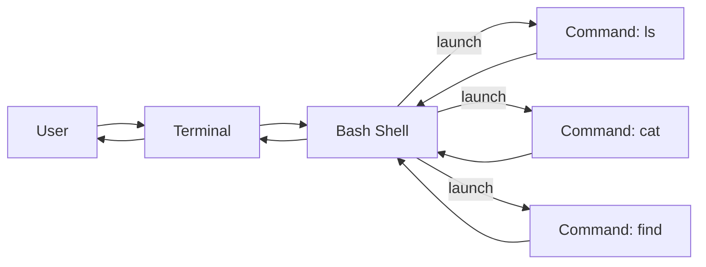

# Linux Fundamentals Part 1 — Notes

---

## 1. Context & Goals

**Room:** TryHackMe — *Linux Fundamentals Part 1*
**Focus:** first contact with Linux CLI and filesystem.

By the end of this room you should be able to:

* Recognise where Linux appears in real systems.
* Log into a shell and understand what the terminal actually is.
* Run basic commands (`echo`, `whoami`, `ls`, `cd`, `cat`, `pwd`).
* Navigate the filesystem and locate files efficiently (`find`, `grep`).
* Use basic shell operators (`&`, `&&`, `>`, `>>`).

---

## 2. Where Linux actually lives

Linux is not just “hackers’ desktops”. Typical deployment targets:

* **Servers:** web/app/db servers, cloud VMs, containers.
* **Embedded / devices:** routers, TVs, PoS terminals, car head-units.
* **Infra:** industrial controllers, traffic lights, sensors.

Because Linux is open-source and modular, you see many **distributions (distros)** built on top of the same kernel, e.g.:

* **Ubuntu, Debian** — general-purpose, common on servers and desktops.
* Security-tilted distros (Kali, Parrot, etc.) that just add tools.

For this room, the target is **Ubuntu**.

---

## 3. Terminal, shell and process model

You rarely get a full GUI on servers; you mainly interact via a **terminal**.

* **Terminal (emulator):** window/program that lets you type and see text I/O.
* **Shell:** program that parses your commands and runs other programs (here: `bash`).
* **Prompt:** usually looks like `user@host:~/path$` and shows:

  * user name
  * host name
  * current directory (`~` = home)

```text
tryhackme@linux1:~$  # type commands here
```

### Conceptual view



You type into the **terminal**, which passes text to the **shell**, which runs **programs** and routes their output back.

---

## 4. First commands

### 4.1 `echo` — print text

```bash
$ echo Hello
Hello

$ echo "Hello Friend!"
Hello Friend!
```

* No spaces → quotes optional.
* With spaces → wrap the whole string in quotes.

### 4.2 `whoami` — identify current user

```bash
$ whoami
tryhackme
```

Useful in multi-user systems and CTFs to confirm which account you’re in.

---

## 5. Interacting with the filesystem

Core mental model: Linux has a **single rooted tree** (`/`), with directories and files.

### 5.1 Listing contents: `ls`

```bash
$ ls
"Important Files"  "My Documents"  Notes  Pictures
```

* `ls` with no args → list current directory.
* `ls DIR` → list contents of `DIR` without cd’ing into it.

### 5.2 Changing directory: `cd`

```bash
$ cd Pictures
$ ls
 dog_picture1.jpg  dog_picture2.jpg  dog_picture3.jpg  dog_picture4.jpg
```

Special paths:

* `.` = current directory
* `..` = parent directory
* `~` = home directory (e.g. `/home/ubuntu`)

### 5.3 Printing current path: `pwd`

```bash
$ pwd
/home/ubuntu/Documents
```

Use this when you’re lost or when you want a full path you can re-use later.

### 5.4 Viewing file content: `cat`

```bash
$ ls
todo.txt
$ cat todo.txt
Here is something important for me to do later!
```

`cat` is short for **concatenate**; it can:

* Show a single file.
* Show multiple files one after another: `cat file1 file2`.
* Be combined with redirects (`>` / `>>`) to create new files.

---

## 6. Searching for files and content

At scale, manual `cd` + `ls` quickly becomes inefficient. Use `find` and `grep`.

### 6.1 `find` — search by name / pattern

**Basic patterns from the room:**

```bash
# Find file by exact name under current directory
$ find -name passwords.txt
./folder1/passwords.txt

# Find all .txt files
$ find -name '*.txt'
./folder1/passwords.txt
./Documents/todo.txt
```

Notes:

* By default `find` starts at the **current directory** (`.`).
* You can specify a starting path: `find /var -name '*.log'`.
* `*` is a wildcard that matches any string in the filename.

### 6.2 `grep` — search inside files

`grep` scans file contents and prints lines that match a pattern:

```bash
# Count lines first
$ wc -l access.log
244 access.log

# Then search for a specific IP
$ grep "81.143.211.90" access.log
81.143.211.90 - - [25/Mar/2021:11:17 +0000] "GET / HTTP/1.1" 200 417 "-" "Mozilla/5.0 (...)"
```

Typical use cases in security:

* Filter large logs (web, auth, firewall) by IP, username, or path.
* Find hardcoded secrets / patterns in source tree.
* Combine with `find` and `xargs` for recursive searches.

---

## 7. Shell operators (very small but very powerful)

### 7.1 Background execution: `&`

Run long operations in the background so your shell stays usable.

```bash
$ cp huge.iso /mnt/usb &
[1] 1234   # job id and PID
$  # prompt is free again
```

### 7.2 Command chaining: `&&`

Run command2 **only if** command1 succeeds (exit status 0).

```bash
$ mkdir reports && cd reports
```

Good pattern for safe chained operations.

### 7.3 Redirect output: `>`

Create/overwrite a file with the output of a command.

```bash
$ echo hey > welcome
$ cat welcome
hey
```

* If `welcome` exists, it will be **overwritten**.

### 7.4 Append output: `>>`

Append to a file instead of overwriting.

```bash
$ echo hello >> welcome
$ cat welcome
hey
hello
```

Useful for building logs, reports, or collecting findings.

---

## 8. Recap — what this Part 1 gives you

You now have enough to be **functional** on a basic Linux host:

* Identify yourself and your environment: `whoami`, prompt, `pwd`.
* Navigate and inspect the filesystem: `ls`, `cd`, `cat`.
* Locate files and signals of interest: `find`, `grep`.
* Capture and combine command output: `>`, `>>`, `&&`, `&`.

This is the minimum muscle-memory set you’ll reuse in basically every Linux-based CTF, THM/HTB box, or real-world server.

Next steps (beyond this room):

* Get comfortable moving *fast* in a shell (no mouse, pure keyboard).
* Start combining commands into simple one-liners.
* Begin writing very small shell scripts to automate repetitive actions.

---

## 9. Glossary (EN → ZH)

* Linux distribution (distro) → Linux 发行版
* Terminal → 终端
* Shell (bash) → Shell（命令行解释器 / Bash）
* Command prompt → 命令提示符
* Home directory → 家目录 / 主目录
* Working directory → 当前工作目录
* Filesystem → 文件系统
* Path → 路径
* Absolute path → 绝对路径
* Relative path → 相对路径
* Wildcard → 通配符
* Log file → 日志文件
* Background job → 后台任务
* Output redirection → 输出重定向
* Append (to file) → 追加（到文件）
* Standard output (stdout) → 标准输出
* Standard error (stderr) → 标准错误输出
* Search (files) → 搜索 / 查找（文件）
* Pattern matching → 模式匹配
