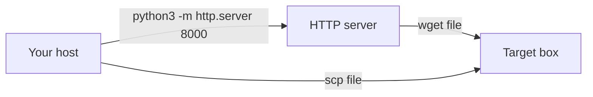
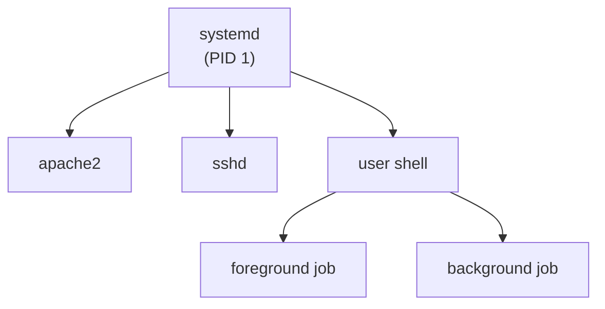

# TryHackMe – Linux Fundamentals Part 3

> Module: Linux Fundamentals (Part 3 of 3)
> Focus: utilities, processes, automation, package management, logging

---

## 1. Summary

Linux Fundamentals Part 3 is the final room in the TryHackMe Linux Fundamentals series. It assumes you can already navigate a Linux system and focuses on “day‑2” skills you will actually use during CTFs and in real environments:

* Using terminal text editors (`nano`, `vim`) instead of `echo` redirection hacks
* Moving files around between hosts (`wget`, `scp`, Python HTTP server)
* Inspecting and controlling processes (`ps`, `top`, `kill`, signals)
* Managing long‑running services via `systemd` / `systemctl`
* Scheduling recurring tasks with `cron` / `crontab`
* Installing and updating software using APT repositories
* Reading logs from `/var/log`, especially web server logs

If Parts 1–2 are about “Linux survival”, Part 3 is about “Linux operations”.

---

## 2. Room structure

Tasks in the room:

1. **Introduction** – what this part covers and how it fits into the module.
2. **Deploy your Linux machine** – deploy the box and SSH in as `tryhackme`.
3. **Terminal text editors** – `nano` basics and a short intro to `vim`.
4. **General / useful utilities** – `wget`, `scp`, `python3 -m http.server`.
5. **Processes 101** – `ps`, `ps aux`, `top`, signals, basic process model.
6. **Maintaining your system: automation** – `cron` and `crontab` syntax.
7. **Maintaining your system: package management** – APT, repos, GPG keys.
8. **Maintaining your system: logs** – `/var/log` and Apache2 logs.
9. **Conclusions & next steps** – recap and follow‑up rooms.

---

## 3. Key concepts

### 3.1 SSH recap (Task 2)

You log into the target machine with SSH:

```bash
ssh tryhackme@MACHINE_IP
# password: tryhackme
```

Basic SSH pattern:

```bash
ssh USERNAME@HOST
ssh -i id_ed25519 USERNAME@HOST   # with key
```

Once connected, all remaining commands are run *on the remote box*.

---

### 3.2 Terminal text editors: `nano` and `vim` (Task 3)

In earlier rooms you only used `echo` with redirection (e.g. `echo hi > file`). That does not scale to multi‑line editing. Here you switch to real terminal editors.

#### Nano essentials

Open or create a file:

```bash
nano filename
```

Key bindings (shown at the bottom of the nano screen):

* `Ctrl + X` – exit (will ask to save if modified)
* `Ctrl + O` – write file (save)
* `Ctrl + W` – search
* `Ctrl + K` – cut line
* `Ctrl + U` – uncut (paste)

Typical flag step in this room:

```bash
cd ~
nano task3
# read the flag inside the file
```

#### Vim at a glance

Vim is a modal editor:

* **Normal mode** – navigation and commands
* **Insert mode** – actual typing (`i`, `a`, `o` to enter)
* **Command‑line mode** – `:` to enter commands like `:wq`, `:q!`

Minimal flow:

```text
vim file
  i          # enter insert mode
  (type)     # edit text
  Esc        # back to normal mode
  :wq        # write and quit
```

If you plan to stay in terminals a lot, learn at least basic vim navigation. TryHackMe’s **Toolbox: Vim** room is the recommended follow‑up.

---

### 3.3 File transfer utilities (Task 4)

This task gives you several ways to move files between machines without a GUI.

#### `wget` – download over HTTP/HTTPS

```bash
wget http://IP:8000/file.txt
wget https://example.com/script.sh
```

* Saves into the current directory
* Works well with simple HTTP servers

#### `scp` – secure copy over SSH

Copy from local → remote:

```bash
scp important.txt username@10.10.10.10:/home/username/
```

Copy from remote → local:

```bash
scp username@10.10.10.10:/home/username/notes.txt ./notes.txt
```

Pattern:

```text
scp SOURCE DESTINATION
scp [local_path] USER@REMOTE_HOST:[remote_path]
scp USER@REMOTE_HOST:[remote_path] [local_path]
```

#### `python3 -m http.server` – quick ad‑hoc web server

From the directory you want to serve:

```bash
cd /path/to/share
python3 -m http.server 8000
```

* Serves the current directory over HTTP on port `8000` by default
* Blocks the current terminal until you `Ctrl + C`

Then, from another machine:

```bash
wget http://ATTACKER_IP:8000/somefile
```

A simple data‑flow of these tools:



---

### 3.4 Process management basics (Task 5)

#### What is a process?

A **process** is a running instance of a program. The kernel assigns each process a **PID** (Process ID).

* PIDs are integers; on a fresh system they start low and increment as new processes are created.

#### Viewing processes

Processes for *current* user/session:

```bash
ps
ps aux | head
```

* `ps` – snapshot of current user’s processes
* `ps aux` – shows processes for all users with extra info

Real‑time view:

```bash
top
# or, if installed
htop
```

Use `q` or `Ctrl + C` to exit `top` / `htop`.

#### Killing processes and signals

To terminate a process you send a **signal**:

```bash
kill PID           # default is SIGTERM (clean exit)
kill -SIGKILL PID  # force kill, no cleanup
kill -SIGSTOP PID  # stop (pause) process
```

Typical “levels of violence”:

* `SIGTERM` – “Please exit and clean up.” (preferred)
* `SIGKILL` – “Die now.” (process cannot ignore)
* `SIGSTOP` – pause; later resume with `SIGCONT`

#### systemd and services

Most modern distros (including the room) use **systemd** as PID 1, which manages services.

```bash
systemctl status apache2
systemctl start apache2
systemctl stop apache2
systemctl enable apache2   # start on boot
systemctl disable apache2
```

Minimal process tree illustration:



---

### 3.5 Foreground vs background (Task 5)

* **Foreground** – process attached to your terminal; it owns the screen
* **Background** – process still running but your prompt is free

Run a command in the background directly:

```bash
echo "hi THM" &
```

Suspend a running foreground job and background it:

```text
Ctrl + Z        # suspend current job
bg              # continue in background
jobs            # list jobs
fg %1           # bring job 1 back to foreground
```

This is essential when running long copy operations, HTTP servers, or scripts while keeping the same shell usable.

---

### 3.6 Automation with cron (Task 6)

**Cron** is a daemon started at boot that executes commands on a schedule. A user’s crontab can be edited with:

```bash
crontab -e   # edit
crontab -l   # list
```

Cron entries look like this:

```text
# ┌──────── minute (0-59)
# │ ┌────── hour (0-23)
# │ │ ┌──── day of month (1-31)
# │ │ │ ┌── month (1-12)
# │ │ │ │ ┌─ day of week (0-7, Sun=0 or 7)
# │ │ │ │ │
# * * * * *  command-to-run
```

Examples:

```text
0 */12 * * * cp -R /home/cmnatic/Documents /var/backups/
```

Interpretation:

* Minute `0`
* Every `12` hours
* Every day of month
* Every month
* Every day of week

So it runs at `00:00`, `12:00`, `00:00` next day, etc.

Special string example:

```text
@reboot /usr/local/bin/startup_script.sh
```

Runs once after every reboot.

---

### 3.7 Package management with APT (Task 7)

On Debian/Ubuntu systems, **APT** manages software packages.

#### Sources and repositories

APT reads repository definitions from:

* `/etc/apt/sources.list`
* `/etc/apt/sources.list.d/*.list`

Third‑party software can add its own `.list` file here and a GPG key so APT can verify package integrity.

Basic commands:

```bash
sudo apt update              # refresh package lists
sudo apt upgrade             # upgrade installed packages
sudo apt install htop        # install a package
sudo apt remove htop         # remove package (keep config)
sudo apt purge htop          # remove incl. configs
sudo apt autoremove          # cleanup unused deps
```

Adding a repository usually involves:

1. Importing the vendor’s GPG key (`wget ... | sudo gpg --dearmor` etc.)
2. Adding a `.list` file under `/etc/apt/sources.list.d/`
3. Running `sudo apt update`
4. Installing the package with `sudo apt install ...`

---

### 3.8 Logs and `/var/log` (Task 8)

System and application logs live under `/var/log`.

Quick tree for the interesting paths in this room:

```text
/var/log
 ├── auth.log        # authentication events
 ├── syslog          # general system messages
 └── apache2/
      ├── access.log # HTTP requests
      └── error.log  # web server errors
```

Typical commands:

```bash
cd /var/log/apache2
ls
less access.log
less error.log
```

From Apache access logs you can answer:

* Which IP visited the site?
* Which resource did they request (e.g. `catsanddogs.jpg`)?
* What status code did the server return (200/404/etc.)?

Use `/` inside `less` to search.

---

## 4. Commands cheat sheet

| Topic              | Command / Pattern                            | Notes                                    |
| ------------------ | -------------------------------------------- | ---------------------------------------- |
| SSH                | `ssh user@ip`                                | Remote login over SSH                    |
| Nano               | `nano file`                                  | Simple terminal editor                   |
| Vim                | `vim file`                                   | Modal editor, always installed (usually) |
| Download file      | `wget URL`                                   | HTTP/HTTPS download                      |
| Secure copy        | `scp SRC DST`                                | Copy files over SSH                      |
| Simple web server  | `python3 -m http.server 8000`                | Serve current dir on port 8000           |
| List processes     | `ps`, `ps aux`                               | Snapshot of running processes            |
| Live process view  | `top`                                        | Real‑time process stats                  |
| Kill process       | `kill -SIGTERM PID`                          | Cleanly ask process to exit              |
| Services           | `systemctl status/start/stop/enable SERVICE` | Manage `systemd` services                |
| Jobs list          | `jobs`                                       | Background jobs in current shell         |
| Background command | `CMD &`                                      | Run command in background                |
| Suspend to bg      | `Ctrl + Z`, then `bg`                        | Suspend and resume in background         |
| Foreground job     | `fg %1`                                      | Bring job 1 to foreground                |
| Edit crontab       | `crontab -e`                                 | Edit user cron jobs                      |
| List cron jobs     | `crontab -l`                                 | Show user cron jobs                      |
| Update packages    | `sudo apt update && sudo apt upgrade`        | Refresh and upgrade system               |
| Install package    | `sudo apt install PACKAGE`                   | Install via APT                          |
| Apache logs        | `less /var/log/apache2/access.log`           | Read web access log                      |

---

## 5. Typical workflow in this room

1. **Deploy and connect**

   * Start the machine from the TryHackMe task.
   * SSH in as `tryhackme@MACHINE_IP`.

2. **Editor practice**

   * Use `nano` to create a test file and edit `task3` in `$HOME`.
   * Read the flag to answer the text‑editor question.

3. **File transfer practice**

   * On the remote box, start `python3 -m http.server` in the home directory.
   * From the AttackBox, use `wget http://MACHINE_IP:8000/.flag.txt` (or similar) to pull a file.

4. **Process inspection**

   * Run `ps aux` and `top` to see what is running.
   * Identify processes related to the room’s flags.

5. **Service management**

   * Use `systemctl status myservice` / `systemctl stop myservice` to answer service questions.

6. **Cron analysis**

   * Run `crontab -e` (or inspect a provided cron file).
   * Interpret when jobs run and answer the scheduling question.

7. **APT and logs**

   * Skim `/etc/apt/sources.list` and `/var/log/apache2/*.log` to answer repo/log questions.

---

## 6. Pitfalls and tips

* **Forgetting you are on the remote box** – double‑check with `whoami` and `pwd` before editing or deleting files.
* **Blocking your shell** – `python3 -m http.server` and `top` occupy the terminal; use another tab or background them.
* **Cron syntax confusion** – always map each field carefully; do not guess. Use a crontab cheat sheet if needed.
* **Blindly using `SIGKILL`** – prefer `SIGTERM` first to avoid corrupting data.
* **Editing as wrong user** – for system files, use `sudoedit` or `sudo nano` and understand permission implications.

Practical habit: when you see a new tool in a room, immediately run `man TOOL` or `TOOL --help` and skim.

---

## 7. Practice ideas beyond the room

* Write a small backup script and schedule it with `crontab` (e.g. tar your notes every night).
* Serve a directory with `http.server` and pull files from another VM via `wget`.
* Use `ps aux | grep NAME` to find processes, then test killing them with different signals.
* Create and enable a simple systemd service that runs a Python script on boot.
* Explore `/var/log` and try to reconstruct what happened on the system over the last hour.

---

## 8. Glossary (EN → 中文)

Short bilingual glossary for key terms:

* **process** – 进程
* **PID (Process ID)** – 进程标识符
* **service / daemon** – 服务 / 守护进程
* **foreground / background job** – 前台 / 后台任务
* **signal (SIGTERM, SIGKILL, SIGSTOP)** – 信号（终止、强制终止、暂停）
* **cron / crontab** – 定时任务 / 定时任务表
* **package manager (APT)** – 软件包管理器
* **repository (APT repo)** – 软件源 / 仓库
* **log file** – 日志文件
* **HTTP server** – HTTP 服务器

---

## 9. Related tools and further reading

* TryHackMe **Linux Fundamentals Part 1 & Part 2** – foundations before this room.
* TryHackMe **Toolbox: Vim** – deeper dive into vim usage.
* TryHackMe rooms on **bash scripting** and **regular expressions** – for automation.
* `man` pages on your own box:

  * `man nano`, `man vim`
  * `man wget`, `man scp`, `man systemctl`
  * `man 5 crontab` for cron syntax
* Official Debian/Ubuntu docs on APT and `/var/log` structure.

These notes are meant as a compact operational reference; when stuck in a future CTF, scan this file for the relevant section (editors, file transfer, processes, cron, apt, logs) and adapt the examples to the new machine.
