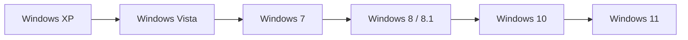
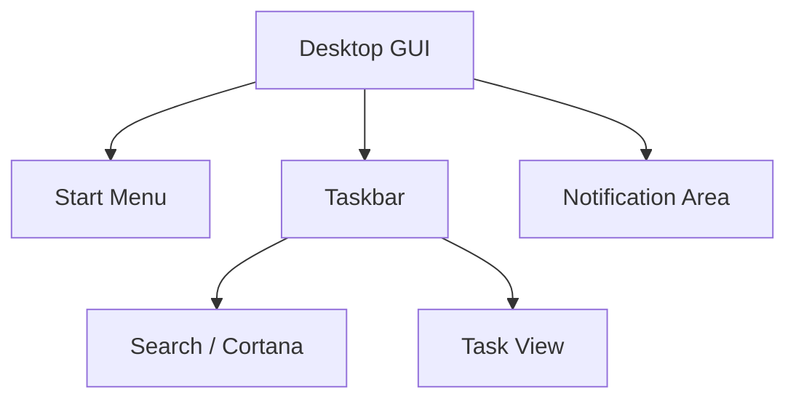
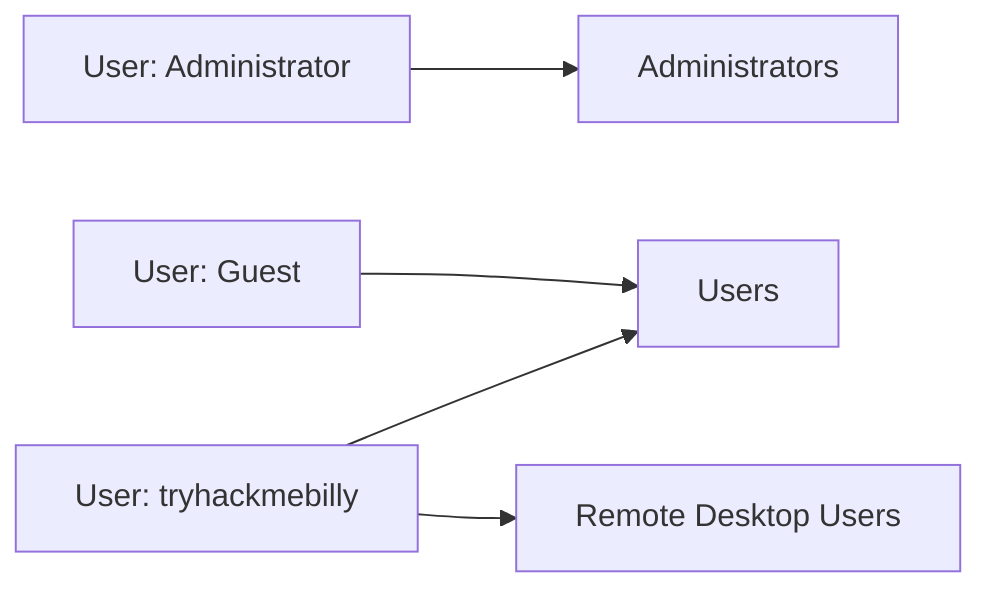

# TryHackMe – Windows Fundamentals 1

> Room: **Windows Fundamentals 1**
> Focus: Windows editions, desktop GUI, NTFS, System32, user accounts, UAC, Control Panel, Task Manager


---

## 1. Summary

This room is the **intro layer** for Windows on TryHackMe. It is not about exploitation yet; it is about becoming comfortable navigating and configuring a Windows machine:


* Recognise **Windows editions** and where BitLocker fits in


* Understand the **desktop GUI**: Start menu, taskbar, notification area


* Learn the **NTFS file system** and features (permissions, EFS, ADS)


* Know why `C:\Windows` and `C:\Windows\System32` are critical


* Understand **user accounts, groups, and profiles**


* See how **User Account Control (UAC)** prevents silent elevation


* Distinguish between **Settings** and **Control Panel**


* Use **Task Manager** as your basic monitoring tool


For offensive/defensive work later, these are the building blocks: where things live, how they are configured, and what a “normal” Windows system looks like.


---

## 2. Room structure

Tasks in the room:

1. **Introduction & VM access** – start the Windows VM via the THM interface / RDP.


2. **Windows Editions** – history from XP → 11, Windows 10/11 Home vs Pro, BitLocker.


3. **The Desktop (GUI)** – Start menu, taskbar, notification area, search, task view.


4. **The File System** – NTFS vs FAT, permissions, EFS, Alternate Data Streams.


5. **Windows / System32 folders** – `C:\Windows` and `C:\Windows\System32`.


6. **User Accounts, Profiles, Permissions** – admin vs standard user, `lusrmgr.msc`, profiles in `C:\Users`.


7. **User Account Control (UAC)** – elevation prompts and shield icon.


8. **Settings & Control Panel** – where to change which kind of settings.


9. **Task Manager** – processes, performance view, shortcut keys.


10. **Conclusion** – how this connects to later Windows rooms.


---

## 3. Key concepts by task

### 3.1 Windows editions & BitLocker (Task 2)

Key points:

* Windows desktop OS versions (simplified timeline):


  * **Windows XP** → **Vista** → **7** → **8.x** → **10** → **11**
* Support lifecycles forced enterprises to plan big migrations (XP→7, 7→10, etc.).

* **Home vs Pro**:

  * Home = for consumers, fewer enterprise features

  * Pro = adds **BitLocker**, domain join, Group Policy, etc.


Core question from the room:

> *What encryption can you enable on Pro that you can’t enable on Home?*
> **Answer:** **BitLocker** (full‑disk/device encryption).


Simple timeline view:



---

### 3.2 Desktop GUI (Task 3)

Components of a typical Windows 10/11 desktop:


1. **Desktop** – icons & shortcuts.

2. **Start menu** – apps, power options, account actions.

3. **Search box / Search icon** – search apps/files/settings.

4. **Task View** – virtual desktops, timeline.

5. **Taskbar** – running apps & pinned shortcuts.

6. **Toolbars** – optional (e.g. address, links).

7. **Notification area** – clock, volume, network, Action Center, etc.


Room questions map directly to right‑click options on the **taskbar**:


* Hide search box: `Taskbar → Search → Hidden`

* Hide task view button: `Taskbar → Show Task View button` (toggle off)

* Notification area: besides clock and network, you see **Action Center** (or its icon) in the THM VM.


Logical diagram:



---

### 3.3 File system – NTFS, FAT, ADS (Task 4)

Modern Windows installations use **NTFS (New Technology File System)**:


* Supports **files > 4 GB** (unlike FAT32).

* Supports **permissions** on files/folders.

* Supports **compression**.
* Supports **EFS (Encrypting File System)** per‑file encryption.

* Supports **ADS (Alternate Data Streams)**.


Other file systems in Windows history:


* **FAT16 / FAT32** – simple, common on USB/microSD, but 4 GB max file size.

* **HPFS** – older high‑performance file system (OS/2 era).


Room question:

> *What is the meaning of NTFS?*
> **Answer:** **New Technology File System**.

Alternate Data Streams (ADS):

* Every NTFS file has at least one data stream.

* ADS allows **hidden additional streams** (e.g. metadata, downloaded‑from‑internet flag, or even hidden payloads).

* Explorer does not show ADS; you use tools or PowerShell to inspect (`Get-Item -Path file -Stream *`).


---

### 3.4 `C:\Windows` and `C:\Windows\System32` (Task 5)

* The **Windows directory** is usually `C:\Windows`, but it can be on another drive.


* The system uses **environment variables** to refer to it generically:


  ```text
  %windir%  or  %SystemRoot%
  ```

* `C:\Windows\System32` holds **core OS binaries**, DLLs, and tools. Many tools used later in Windows rooms live here.


* Deleting or modifying files in `System32` can **break the OS**.


Room question:

> *What is the system variable for the Windows folder?*
> **Answer:** `%windir%`

---

### 3.5 User accounts, profiles, and groups (Task 6)

Two primary local account types:

* **Administrator** – can make system‑wide changes, install software, manage users.

* **Standard user** – limited to their own data, cannot change system settings without elevation.


When a user logs in **for the first time**:


* Windows creates a **profile** under `C:\Users\USERNAME`

* Standard sub‑folders: `Desktop`, `Documents`, `Downloads`, `Music`, `Pictures`, etc.


Local Users and Groups snap‑in:

```text
Win + R → lusrmgr.msc
```

* View **Users** and **Groups**.
* Each group has associated **permissions**.

* Users inherit permissions from all groups they belong to.


Room‑specific details:

* Another user account on the VM: `tryhackmebilly`.

* Groups `tryhackmebilly` belongs to: `Remote Desktop Users`, `Users`.

* Built‑in guest account: **Guest**.

* Guest account status: **Account is disabled** (in properties).


Conceptual view:



Effective permissions on files/folders = **union of group permissions + explicit user permissions**.


---

### 3.6 User Account Control (UAC) (Task 7)

Problem: Home users commonly run as **local administrators**, which makes any malware they execute run with full power.


Solution: **UAC (User Account Control)**.


High‑level behaviour:

* Even if you are an **administrator**, normal processes run with **standard** privileges.

* When a task needs elevation (e.g. installing software, changing system settings):


  * You see a **UAC prompt**.
  * You must explicitly approve, and possibly enter admin credentials.

* Programs that require elevation show a **shield icon**.


On the THM VM:

* Built‑in Administrator account is special; UAC prompts behave slightly differently.

* Standard user trying to run an installer sees a UAC prompt asking for admin credentials.


Room question:

> *What does UAC mean?*
> **Answer:** **User Account Control**.

---

### 3.7 Settings vs Control Panel (Task 8)

**Settings** (modern GUI, from Windows 8 onward):


* Designed for touch devices and ordinary users.

* Covers most everyday tasks: updates, personalisation, network, privacy, etc.


**Control Panel** (legacy but still critical):


* Traditional configuration interface.

* Still used for many deeper / legacy settings: adapter options, some admin tools, classic applets.


Often you **start in Settings** and end up in **Control Panel**. Example:


```text
Settings → Network & Internet → Change adapter options
  → opens classic Control Panel network connections
```

Room question:

* Change Control Panel view to **Small icons**; the last item alphabetically is **Windows Defender Firewall** (on the THM VM image).


---

### 3.8 Task Manager (Task 9)

Task Manager shows:

* Running **apps** and **background processes**.

* **Performance** data (CPU, memory, disk, network).

* Users, startup impact, services, etc.


Ways to open it:

* Right‑click taskbar → **Task Manager**.

* `Ctrl + Alt + Delete` → Task Manager.

* **Keyboard shortcut used in the room**:

  ```text
  Ctrl + Shift + Esc
  ```

In Windows 10/11:

* First opens in **simple view** (just apps).

* Click **More details** for full view (process tree, performance graphs, etc.).


---

## 4. Quick reference / cheat sheet

| Topic                   | Action / Path                                                | Notes                          |
| ----------------------- | ------------------------------------------------------------ | ------------------------------ |
| Start THM VM            | Use room’s *Start Machine* button                            | VM may take a few minutes      |

| Remote Desktop          | Use provided IP + credentials                                | Accept RDP certificate         |

| Check Windows edition   | `Start → System Information`                                 | See `OS Name`, `Edition`       |

| BitLocker availability  | Windows **Pro** and above                                    | Not in Home                    |

| Hide search box         | Taskbar → Search → **Hidden**                                | Room question                  |

| Hide Task View button   | Taskbar → toggle **Show Task View button**                   | Room question                  |

| Notification area icons | Bottom‑right: clock, network, **Action Center**, volume etc. |                                |

| File system type        | Right‑click `C:` → Properties                                | NTFS on modern installs        |

| Windows directory var   | `%windir%` or `%SystemRoot%`                                 | Typically `C:\Windows`         |

| User profiles root      | `C:\Users\USERNAME`                                          | Profile created at first login |

| Local users & groups    | `Win + R` → `lusrmgr.msc`                                    | Requires admin                 |

| UAC meaning             | **User Account Control**                                     | Elevation prompts              |

| Open Settings           | `Win + I`                                                    | Modern configuration UI        |

| Open Control Panel      | Start → search **Control Panel**                             | Legacy configuration UI        |

| Control Panel icon view | Top right: **View by** → Small icons                         | Room question                  |

| Open Task Manager       | **Ctrl + Shift + Esc**                                       | Direct shortcut                |


---

## 5. Typical workflow in this room

1. **Launch VM** from TryHackMe and optionally connect via RDP.

2. **Confirm Windows edition** (Server 2019 Standard in this room) and identify features like BitLocker (Pro vs Home concept).

3. **Play with the desktop GUI**: hide/show search box, task view button, inspect notification area.

4. **Inspect file system**: check that `C:` is NTFS, read about NTFS features and ADS.

5. **Explore `C:\Windows` and `C:\Windows\System32`**, but do not modify anything.

6. **Open `lusrmgr.msc`**, inspect `Users` and `Groups`, answer questions about `tryhackmebilly` and `Guest`.

7. **Trigger a UAC prompt** by running an installer as standard user; observe credential prompt.

8. **Compare Settings vs Control Panel**, jump from Settings to Control Panel via adapter options.

9. **Open Task Manager**, switch to full view, note the basic layout and shortcut.


---

## 6. Pitfalls & tips

* **Do not delete anything in `System32`** – this is not a prank; you can brick the VM, and on a real system you can break the OS.

* **Admin vs standard user context** matters: installing software, changing system time/network, managing users all require elevation.

* **BitLocker vs EFS**: BitLocker is full‑disk/volume encryption; EFS is per‑file/folder encryption within NTFS. Do not mix them up.

* **Settings vs Control Panel**: if you cannot find an option in Settings, use Start search and look for the classic Control Panel applet.

* **UAC prompts are a feature, not a bug**: if something unexpectedly triggers UAC, treat it as a signal to stop and think.


---

## 7. Practice ideas beyond the room

* On a personal lab VM (not production):


  * Create a **standard user**, log in, and try tasks like installing software, editing system time, changing network settings. Observe UAC.


  * Play with **NTFS permissions** on a test folder; see what happens when you remove `Users` group access.

  * Use PowerShell to list **ADS** on a file.

* Compare **Settings** and **Control Panel** coverage by trying to change the same setting via both.

* Use Task Manager’s **Startup** tab to inspect and disable non‑critical auto‑starting programs.


---

## 8. Glossary (EN → 中文)

Short bilingual reference for key terms used in this room:


* **Windows edition** – Windows 版本（Home / Pro / Enterprise 等）
* **BitLocker** – BitLocker 全盘加密（设备加密功能）
* **NTFS (New Technology File System)** – 新技术文件系统
* **FAT16 / FAT32 (File Allocation Table)** – 文件分配表文件系统
* **HPFS (High‑Performance File System)** – 高性能文件系统
* **ADS (Alternate Data Streams)** – 备用数据流 / 替代数据流
* **System32** – System32 系统核心目录
* **user profile** – 用户配置文件（`C:\Users\USERNAME`）
* **local group** – 本地用户组
* **User Account Control (UAC)** – 用户帐户控制
* **Control Panel** – 控制面板
* **Settings app** – 设置应用
* **Task Manager** – 任务管理器

---

## 9. Related tools & further reading

* TryHackMe **Windows Fundamentals 2** – system configuration, resource monitoring, registry, deeper UAC settings.

* TryHackMe **Windows Fundamentals 3** – Windows Updates, Windows Security, Defender, Firewall, BitLocker.

* TryHackMe **Windows & Active Directory Fundamentals** – stepping stone to domain environments.

* Microsoft Docs: official articles on **NTFS permissions**, **BitLocker**, **UAC**, and **Task Manager**.
