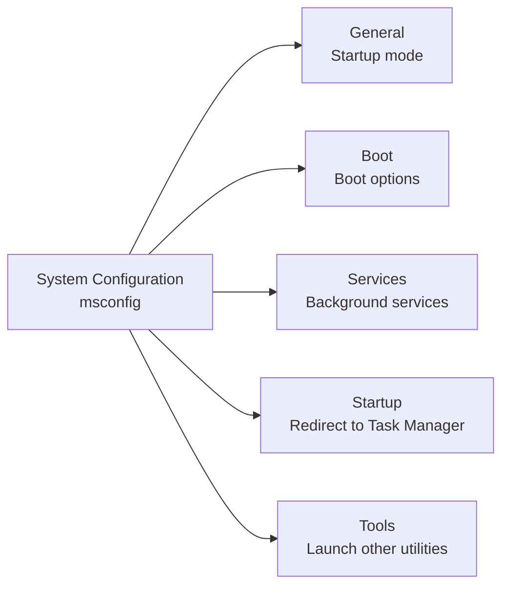
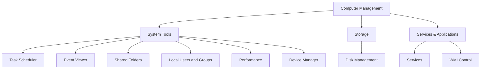

# TryHackMe – Windows Fundamentals 2


In part 2 of the Windows Fundamentals module you get familiar with more **built‑in administration tools** on Windows:

* System Configuration (`msconfig`)
* UAC settings
* Computer Management (`compmgmt.msc`)
* System Information (`msinfo32.exe`)
* Resource Monitor (`resmon.exe`)
* Command Prompt basics (`cmd.exe`)
* Registry Editor (`regedit.exe`)

These are the core GUI + CLI tools you’ll keep using on real Windows systems (both client and server).

---

## 0. Room structure

* **Task 1 – Introduction**
* **Task 2 – System Configuration**
* **Task 3 – Change UAC settings**
* **Task 4 – Computer Management**
* **Task 5 – System Information**
* **Task 6 – Resource Monitor**
* **Task 7 – Command Prompt**
* **Task 8 – Registry Editor**
* **Task 9 – Conclusion**

---

## 1. System Configuration (`msconfig`)

### 1.1 Purpose

**System Configuration** is an *advanced troubleshooting* utility. Typical scenarios:

* Diagnose **startup issues** (system can’t boot normally, hangs, crashes).
* Temporarily **disable services** or boot options.
* Quickly launch other admin tools via **Tools** tab.

You need **local administrator** rights to change most settings.

### 1.2 How to launch

* `Win + R` → `msconfig`
* Start menu → search **“System Configuration”**
* From other tools (e.g. some MMC snap‑ins) that expose it as a link.

### 1.3 Tabs overview



* **General**

  * *Normal startup* – load all device drivers and services (default).
  * *Diagnostic startup* – minimal services; similar to Safe Mode but not identical.
  * *Selective startup* – manually choose which items to load.

* **Boot**

  * Select which OS to boot if there are multiple entries.
  * Configure options like **Safe boot**, **boot log**, **no GUI boot**, **timeout**.

* **Services**

  * Lists all installed services with **Manufacturer**, **Status** and **Service name**.
  * You can hide Microsoft services to focus on 3rd‑party ones.
  * Example from the room: a service with Manufacturer **Sysinternals** (e.g. `PsShutdown`).

* **Startup**

  * On modern Windows: basically a stub that tells you to use **Task Manager → Startup**.
  * On the THM lab VM, the tab may be mostly empty; the idea is what matters: startup apps are no longer controlled here.

* **Tools**

  * A convenient **launcher** for other admin tools.

  * Columns:

    * **Name** – friendly tool name (e.g. *About Windows*, *Windows Troubleshooting*, *Computer Management*).
    * **Description** – short explanation.
    * **Selected command** – the *real* command line used, e.g.

      ```text
      C:\Windows\System32\control.exe /name Microsoft.Troubleshooting
      ```

  * You can either:

    * Click **Launch** inside msconfig, or
    * Copy the command and run it via `Win + R` / Command Prompt / PowerShell.

> Takeaway: `msconfig` is less about “tuning” Windows and more about **diagnosis + launching the right tools**.

---

## 2. Change UAC settings (`UserAccountControlSettings.exe`)

**UAC (User Account Control)** was introduced earlier in Windows Fundamentals 1. Here you mainly learn how to change its level.

### 2.1 Launch

* `Win + R` → `UserAccountControlSettings.exe`
* Start menu → search **“UAC”** / **“Change User Account Control settings”**
* `msconfig` → **Tools** tab → *Change UAC settings* → **Launch**

### 2.2 Slider levels (conceptual)

```text
[Top]  Always notify                (Most secure)
       ├─ Notify for app changes & Windows changes (default on many systems)
       ├─ Notify for app changes only (no desktop dimming)
[Bottom] Never notify               (Not recommended)
```

* **Higher** levels → more prompts, better protection, more annoying.
* **Lower** levels → fewer prompts, easier for malware to silently elevate.

> For normal users, keep UAC **on** (default or stricter). Turning it off is mainly for lab / debugging, not for real endpoints.

---

## 3. Computer Management (`compmgmt.msc`)

**Computer Management** is a central MMC console bundling several administrative snap‑ins.

### 3.1 Launch

* `Win + R` → `compmgmt.msc`
* Right‑click **This PC** → **Manage**
* Start menu → search **“Computer Management”**
* `msconfig` → **Tools** → *Computer Management* → **Launch**

### 3.2 Layout



### 3.3 System Tools

* **Task Scheduler**

  * Create and manage **scheduled tasks**.
  * Triggers: at logon, at startup, at specific time, every X minutes, etc.
  * In the room: task `GoogleUpdateTaskMachineUA` is configured to run daily at **06:15 AM**.

* **Event Viewer**

  * Access Windows event logs.
  * Classic **Windows Logs**:

    * *Application*, *Security*, *Setup*, *System*, *Forwarded Events*.
  * Event types: *Information*, *Warning*, *Error*, *Critical*, *Audit Success / Failure*.
  * This is one of the main data sources for **forensics & SOC** work.

* **Shared Folders**

  * **Shares** – list of shared folders and administrative shares.

    * Examples: `C$`, `ADMIN$`, and lab‑specific share like `sh4r3dF0ld3r$`.
    * Trailing `$` → **hidden share** (not visible in normal browse dialogs, but accessible if you know the name).
  * **Sessions** – users currently connected to shares.
  * **Open Files** – which files remote users have open.

* **Local Users and Groups**

  * Same UI you used in Windows Fundamentals 1 (`lusrmgr.msc`).
  * Manage local users, local groups, and group membership.

* **Performance**

  * Contains **Performance Monitor** and related views.
  * Used for deeper performance diagnostics (counters, data collector sets, etc.).

* **Device Manager**

  * See and manage installed hardware devices and drivers.
  * Enable/disable devices, update drivers, view hardware IDs.

### 3.4 Storage – Disk Management

* Tasks:

  * Create / delete / format partitions.
  * Extend or shrink volumes.
  * Assign / change drive letters.
* Often used when adding new disks or reorganizing storage.

### 3.5 Services and Applications

* **Services**

  * Same backing data as the Services MMC (`services.msc`).
  * Configure startup type (Automatic / Manual / Disabled), service account, dependencies.

* **WMI Control**

  * View / configure **Windows Management Instrumentation** settings.
  * Note: legacy `wmic` CLI is deprecated; modern tooling uses **PowerShell** (`Get-WmiObject`, `Get-CimInstance`) or remote management.

> Takeaway: `compmgmt.msc` = **one pane to rule many common admin tools**.

---

## 4. System Information (`msinfo32.exe`)

### 4.1 Launch

* `Win + R` → `msinfo32`
* Start menu → search **“System Information”**
* `msconfig` → **Tools** → *System Information* → **Launch**

### 4.2 Main sections

System Information is split into three top‑level areas:

* **System Summary**

  * OS name / version
  * System manufacturer & model
  * BIOS version
  * System name (hostname), boot device, etc.

* **Hardware Resources**

  * Low‑level information (IRQs, DMA, memory ranges, conflicts/sharing).
  * Mostly for deeper troubleshooting and driver/compatibility issues.

* **Components**

  * Sub‑nodes such as *Display*, *Storage*, *Network*, *Input*, *Multimedia*.
  * Useful for quickly seeing driver versions and device details.

* **Software Environment**

  * Running tasks, loaded drivers, environment variables, network connections, services, etc.

### 4.3 Search bar & environment variables

At the bottom there is a **Find** box you can use for quick search:

* Example: select **Components** and search **“IP Address”**.
* Example: search **“System Name”** to quickly locate the hostname.

Under **Software Environment → Environment Variables** you see key/value pairs, e.g.

```text
ComSpec = %SystemRoot%\system32\cmd.exe
```

This is how many programs learn where `cmd.exe` lives, without hard‑coding the full path.

---

## 5. Resource Monitor (`resmon.exe`)

### 5.1 Launch

* `Win + R` → `resmon`
* Start menu → search **“Resource Monitor”**
* From **Task Manager** → **Performance** tab → **Open Resource Monitor**
* From `msconfig` → **Tools** → *Resource Monitor* → **Launch**

### 5.2 Tabs & data

Resource Monitor provides **per‑process and aggregate** data for:

* **Overview** – a summary across all four resource types.
* **CPU** – CPU usage, per‑process usage, associated handles and modules.
* **Memory** – working set, commit, hard faults; which processes are heavy.
* **Disk** – which processes are doing reads/writes, queue length, response time.
* **Network** – which processes are sending/receiving data, which ports are being used.

On the right side you get **real‑time graphs** for each resource type.

> Typical blue‑team uses: spot a process with abnormal network traffic or disk I/O; confirm whether a system is genuinely “busy” or just stuck.

---

## 6. Command Prompt (`cmd.exe`)

### 6.1 Launch

* Start menu → search **“Command Prompt”**
* `Win + R` → `cmd`
* `msconfig` → **Tools** → *Command Prompt* → **Launch**

### 6.2 Basic info commands

From the room:

```text
hostname          # Print computer name
whoami            # Print current user (DOMAIN\username)

ipconfig          # Show IP config for all adapters
ipconfig /all     # Show detailed IP config

cls               # Clear the screen
```

**Help** pattern:

```text
<command> /?      # Show help for most classic commands
```

Example:

```text
ipconfig /?       # Show full syntax, including /all, /flushdns, etc.
```

### 6.3 Network‑related commands

* **`ipconfig`** – IP addresses, masks, gateways, DNS servers.
* **`netstat`** – protocol statistics and current TCP/IP connections.

  * `netstat -ano` is commonly used to see ports + owning PID.
* **`net`** – umbrella command to manage network resources.

  * `net user` – local users
  * `net localgroup` – local groups
  * `net share` – shares
  * `net session` – sessions
  * Help syntax: `net help` or `net help user`.

### 6.4 msconfig “Internet Protocol Configuration” entry

In the **Tools** tab, there is an entry that opens a command prompt and runs `ipconfig` automatically. The underlying command looks like:

```text
C:\Windows\System32\cmd.exe /k %windir%\system32\ipconfig.exe
```

* `cmd.exe /k <command>` = open a new cmd window, run `<command>`, **keep the window open**.

---

## 7. Registry Editor (`regedit.exe`)

### 7.1 Purpose & risks

The **Windows Registry** is a central hierarchical database storing configuration for:

* OS components
* Installed applications
* Hardware devices and drivers

Editing the registry can **break** applications or even make Windows unbootable, so any manual change should be:

* Backed up first (export key / create a restore point).
* Documented.
* Restricted to what you actually understand.

### 7.2 Launch

* `Win + R` → `regedit`
* Start menu → search **“Registry Editor”**
* `msconfig` → **Tools** → *Registry Editor* → **Launch**

### 7.3 Logical structure

```text
Registry
 ├─ HKEY_LOCAL_MACHINE   (HKLM) – machine‑wide settings
 ├─ HKEY_CURRENT_USER    (HKCU) – current user’s profile
 ├─ HKEY_CLASSES_ROOT    (HKCR) – file associations, COM classes
 ├─ HKEY_USERS           (HKU)  – all user profiles
 └─ HKEY_CURRENT_CONFIG  (HKCC) – current hardware profile
```

Malware and admin tools both rely heavily on the registry for **persistence** and **configuration**, which is why understanding its structure matters for security work.

---

## 8. Quick cheat sheet

A compact mapping from GUI to commands.

| Topic / Tool             | GUI path (example)                                     | Command / Run dialog                          |
| ------------------------ | ------------------------------------------------------ | --------------------------------------------- |
| System Configuration     | Start → search **System Configuration**                | `msconfig`                                    |
| UAC settings             | Start → search **UAC** / Control Panel → User Accounts | `UserAccountControlSettings.exe`              |
| Computer Management      | Right‑click **This PC** → Manage                       | `compmgmt.msc`                                |
| System Information       | Start → search **System Information**                  | `msinfo32.exe`                                |
| Resource Monitor         | Task Manager → Performance → Open Resource Monitor     | `resmon.exe`                                  |
| Control Panel            | Start → search **Control Panel**                       | `control.exe`                                 |
| Troubleshooting (legacy) | Control Panel → Troubleshooting                        | `control.exe /name Microsoft.Troubleshooting` |
| Command Prompt           | Start → search **Command Prompt**                      | `cmd.exe`                                     |
| Registry Editor          | Start → search **Registry Editor**                     | `regedit.exe`                                 |

---

## 9. Security / blue‑team perspective (very brief)

* **Event Viewer** and **Task Scheduler**


  * Check for suspicious scheduled tasks (e.g. weird `Update` jobs at odd hours).

  * Correlate events (logon, service failures, application crashes).


* **Shared Folders**

  * Review **hidden shares** and remove anything not needed.

  * Monitor sessions/open files on servers that host sensitive data.


* **Resource Monitor + netstat**

  * Look for processes with unexpected **outbound traffic** or sustained high disk activity.


* **Registry Editor**

  * Typical persistence locations: `Run` / `RunOnce` keys, service definitions, shell extensions.

  * For forensics, registry hives preserve a lot of history (USB devices, recent files, etc.).


---

## 10. Glossary (EN → 中文)

Short bilingual glossary for key terms in this room.


* **System Configuration (msconfig)** – 系统配置工具
* **Boot options** – 启动选项
* **Service** – 服务（后台进程）
* **Task Scheduler** – 任务计划程序
* **Event Viewer** – 事件查看器
* **Shared folder / share** – 共享文件夹 / 共享资源
* **System Information** – 系统信息
* **Resource Monitor** – 资源监视器
* **Command Prompt** – 命令提示符
* **Environment variable** – 环境变量
* **Registry / Registry Editor** – 注册表 / 注册表编辑器

---

## 11. Further practice / reading

* Continue with **Windows Fundamentals 3** on TryHackMe.

* Explore defensive / logging‑focused rooms (Windows Event Logs, Windows Forensics, etc.).

* For official details, check Microsoft Docs for:


  * System Configuration (`msconfig`)

  * Task Scheduler
  * Event Viewer & Windows logs
  * Registry basics and best practices.
