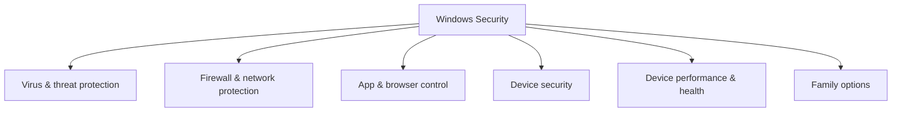

# TryHackMe – Windows Fundamentals 3


This room is the third part of the **Windows Fundamentals** series and focuses on **security features built into Windows**:

* Windows Update
* Windows Security & Microsoft Defender AV
* Firewall & network profiles
* SmartScreen (App & browser control)
* Device security & TPM
* BitLocker Drive Encryption
* Volume Shadow Copy Service (VSS)

These are core concepts for both **normal administration** and **blue‑team / security work**.

---

## 0. Room structure

* **Task 1 – Introduction**
* **Task 2 – Windows Updates**
* **Task 3 – Windows Security**
* **Task 4 – Virus & Threat Protection**
* **Task 5 – Firewall & Network Protection**
* **Task 6 – App & Browser Control**
* **Task 7 – Device Security**
* **Task 8 – BitLocker**
* **Task 9 – Volume Shadow Copy Service**
* **Task 10 – Conclusion / Living off the land**

---

## 1. Windows Updates

### 1.1 Purpose

**Windows Update** is the built‑in service that delivers:

* **Security updates** (vulnerabilities, Defender signatures)
* **Bug fixes & patches**
* **Feature updates** for Windows and some Microsoft products

Updates typically follow a cycle:

* **Patch Tuesday** – second Tuesday of each month is the regular bulk release.
* **Out‑of‑band updates** – critical fixes can be shipped **outside** Patch Tuesday.

### 1.2 Access paths

* **Settings** → **Update & Security** → **Windows Update**
* `Win + R` → `control /name Microsoft.WindowsUpdate`
* Start menu search: **“Windows Update”**

### 1.3 Update history

In the room VM you see:

* **Definition updates** for Microsoft Defender (signature updates)
* **View update history** → categories like *Quality updates*, *Definition updates*, *Driver updates*, etc.

> Real systems **must** keep Windows Update enabled. In Windows 10+, users can delay updates a bit, but not ignore them forever.

---

## 2. Windows Security overview

**Windows Security** is the central dashboard for local protection.



Each “protection area” has a **status icon**:

* **Green** – no issues, protection OK.
* **Yellow** – recommendations / minor actions.
* **Red** – urgent problems (e.g. AV disabled).

From the room screenshot, the area needing **immediate attention** was:

* **Virus & threat protection** (red status).

Launch methods:

* Start menu → search **“Windows Security”**
* Settings → Update & Security → Windows Security

---

## 3. Virus & Threat Protection (Defender AV)

This area is split into **Current threats** and **Virus & threat protection settings**.

### 3.1 Current threats

Scan options:

* **Quick scan** – common malware locations only.
* **Full scan** – all files and running programs (can take 1+ hour).
* **Custom scan** – specific drives/folders.

Threat history:

* **Last scan** – time and result of last scan.
* **Quarantined threats** – blocked and isolated items, scheduled for deletion.
* **Allowed threats** – *manually allowed* items previously flagged (dangerous unless you know exactly what they are).

### 3.2 Protection settings

`Virus & threat protection settings → Manage settings` includes:

* **Real‑time protection**

  * Scans files as they are accessed; blocks malware before execution.
  * Lab VM: turned **off** to avoid performance issues.
  * On real machines: should be **enabled**, unless replaced by another AV.

* **Cloud‑delivered protection**

  * Uses cloud intelligence for faster/more accurate detections.

* **Automatic sample submission**

  * Sends suspicious files to Microsoft for analysis.

* **Controlled folder access**

  * Protects specified folders from unauthorised modification (anti‑ransomware layer).

* **Exclusions**

  * Paths, file types, processes that Defender will **not** scan.
  * Security risk: malware can hide here if exclusions are too broad.

* **Notifications**

  * Controls how Defender alerts about detections and health issues.

### 3.3 Ransomware protection

* **Ransomware protection** is based on **Controlled folder access**.
* Requires **Real‑time protection** to be on.

Right‑click context menu:

* You can scan individual files/folders using **“Scan with Microsoft Defender”** in Explorer.

---

## 4. Firewall & Network Protection

### 4.1 What is a firewall?

Per Microsoft: a firewall controls what is (and isn’t) allowed to pass through network **ports**.

You can model it as:

```text
[Internet] ⇄ [Firewall rules] ⇄ [Local processes / services]
```

It decides which inbound/outbound connections are allowed.

### 4.2 Profiles: Domain / Private / Public

Windows Defender Firewall uses three profiles:

* **Domain**

  * Used when the system is joined to a domain and can contact a **domain controller**.

* **Private**

  * User‑designated *home / work* networks.
  * Looser rules (e.g. file sharing allowed) but only on trusted networks.

* **Public**

  * Default for untrusted networks.
  * Stricter rules, more inbound traffic blocked.
  * Example: **airport Wi‑Fi** → active profile = **Public network**.

Each profile screen allows:

* Turn firewall **on/off**.
* **Block all inbound connections** (even allowed apps) – very restrictive emergency mode.

### 4.3 Allow an app & advanced settings

* **Allow an app through firewall** – GUI to manage which executables can accept connections on which profiles.
* **Advanced settings** – opens the classic **MMC firewall console**.

Useful Run command:

* `Win + R` → `wf.msc` → opens Windows Defender Firewall with Advanced Security.

> Recommendation: keep the firewall **enabled**. Only disable or relax it when you fully understand the implications.

---

## 5. App & Browser Control (SmartScreen)

This section controls **Microsoft Defender SmartScreen**.

* Protects against:

  * Malicious or phishing websites
  * Malicious or unknown applications
  * Dangerous downloads

Key components:

* **Check apps and files**

  * Blocks or warns on unrecognised apps/files from the Internet.

* **SmartScreen for Microsoft Edge / other browsers (where supported)**

* **Exploit protection**

  * Built into Windows 10/Server 2019.
  * System‑wide and per‑app mitigations (DEP, CFG etc.).

Unless you have very specific tuning needs, leave all these at their **default (on)** states.

---

## 6. Device Security & TPM

### 6.1 Device Security

On modern Windows you may see:

* **Core isolation**

  * Uses virtualisation‑based security to isolate critical processes.

* **Memory integrity**

  * Prevents injection of malicious code into high‑security processes.

These options can increase security but may cause driver compatibility problems on very old hardware.

### 6.2 TPM – Trusted Platform Module

**TPM (Trusted Platform Module)** is a **hardware chip** providing security functions:

* Secure **key storage** (crypto keys never leave the chip in raw form).
* Random number generation and cryptographic operations.
* Protection against tampering – chip is designed to be **tamper resistant**.

TPM is heavily used by:

* **BitLocker** (disk encryption)
* **Secure Boot**
* Attestation and other security features.

---

## 7. BitLocker Drive Encryption

### 7.1 Concept

**BitLocker** is full‑disk encryption integrated with Windows.

* Protects data at rest if the device is lost or stolen.
* Tightly integrated with **TPM** for secure key unlocking.

In the lab VM, BitLocker is **not** enabled, but conceptually:

* With a **TPM 1.2+** chip, BitLocker can unlock the drive automatically when system integrity checks pass.
* Without a suitable TPM, the user must provide an external factor.

### 7.2 Without TPM

On computers without TPM 1.2 or later, BitLocker requires a **USB startup key**:

* USB device must be plugged in at boot for the system to decrypt the drive.

---

## 8. Volume Shadow Copy Service (VSS / VSSS)

### 8.1 What is VSS?

**Volume Shadow Copy Service** coordinates “shadow copies” of data:

* Snapshots at a **point in time**
* Used for:

  * System restore points
  * Backups

Shadow copies are stored under `System Volume Information` on each protected drive.

If VSS is enabled (system protection turned on), you can:

* Create a restore point
* Perform **System Restore** to a previous state
* Configure protection settings and delete existing restore points

### 8.2 Security angle

* Ransomware authors are well aware of VSS.
* Many strains **delete shadow copies** early in the infection chain:

  * Makes recovery via restore points impossible.
  * Forces victims to rely on **offline / off‑site backups**.

For hands‑on practice with VSS in a security context, the THM material references e.g. Advent of Cyber rooms.

---

## 9. Conclusion & “Living off the land”

This room emphasises that Windows ships with a lot of **security tooling by default**:

* AV & SmartScreen (**Windows Security**)
* Host firewall
* Device & disk protection (TPM, BitLocker)
* Backup & restore mechanisms (VSS)

But it also closes with an important idea:

> Attackers often use **built‑in Windows tools and utilities** to stay hidden.

This tactic is known as **Living off the Land (LoTL)**:

* Using `powershell`, `wmic`, `schtasks`, `reg`, `vssadmin`, `bitsadmin`, etc.
* Avoids dropping obvious malware binaries.
* Blends into normal admin activity unless you have **good logging and detection**.

Understanding the *legitimate* purpose of each tool is a prerequisite to spotting when they’re being abused.


---

## 10. Quick cheat sheet

| Topic / Feature                | GUI path / description                           | Key command / shortcut                              |

| ------------------------------ | ------------------------------------------------ | --------------------------------------------------- |
| Windows Update                 | Settings → Update & Security → Windows Update    | `control /name Microsoft.WindowsUpdate`             |

| Windows Security               | Settings → Update & Security → Windows Security  | Start → search **Windows Security**                 |

| Virus & threat protection      | Windows Security → Virus & threat protection     | Right‑click file → **Scan with Microsoft Defender** |

| Firewall & network protection  | Windows Security → Firewall & network protection | `wf.msc`                                            |

| App & browser control          | Windows Security → App & browser control         | Start → search **App & browser control**            |

| Device security                | Windows Security → Device security               | Requires supported hardware (TPM, virtualisation)   |

| BitLocker                      | Control Panel → BitLocker Drive Encryption       | `manage-bde` (CLI, elevated)                        |

| Volume Shadow Copy / System RP | Control Panel → System → System protection       | `SystemPropertiesProtection.exe`                    |


---

## 11. Glossary (EN → 中文)

* **Windows Update** – Windows 更新服务
* **Patch Tuesday** – 周二补丁日（每月一次的集中更新）
* **Windows Security** – Windows 安全中心
* **Real‑time protection** – 实时保护
* **Quarantine** – 隔离区
* **Firewall profile (Domain/Private/Public)** – 防火墙配置文件（域 / 专用 / 公共）
* **SmartScreen** – 智能屏幕过滤（应用/浏览器保护）
* **Device security** – 设备安全
* **TPM (Trusted Platform Module)** – 可信平台模块（安全芯片）
* **BitLocker Drive Encryption** – BitLocker 驱动器加密
* **Volume Shadow Copy Service (VSS)** – 卷影复制服务
* **System restore point** – 系统还原点
* **Living off the land (LoTL)** – 利用系统自带工具的攻击战术（“吃地里的粮”）

---

## 12. Further practice / reading

* TryHackMe: other **Windows** and **blue‑team** rooms (Windows Event Logs, Windows Forensics, Active Directory basics, etc.).

* Explore **Advent of Cyber** days on VSS, Defender, and LoTL techniques.

* Microsoft Docs for:

  * Windows Update & servicing channels

  * Microsoft Defender Antivirus & SmartScreen

  * BitLocker & TPM
  * Volume Shadow Copy Service and System Restore.
