# Active Directory Basics – THM Room Notes

> Mental model: **AD DS = central directory for identities + policies in a Windows domain.**

---

## 0. Big Picture

* **Active Directory Domain Services (AD DS)** stores information about *objects* in a Windows network (users, computers, groups, printers, etc.).
* A **Windows domain** = logical boundary where these objects are managed together.
* A **Domain Controller (DC)** is a Windows Server that runs AD DS and answers authentication / directory queries.
* Typical corporate flow:

  * User logs in on a domain-joined workstation.
  * Workstation forwards the logon to a DC.
  * DC checks credentials and returns an authentication token (Kerberos ticket or NTLM result).
  * Access to servers, file shares, printers, etc. is then granted based on **group memberships** and **policies**.

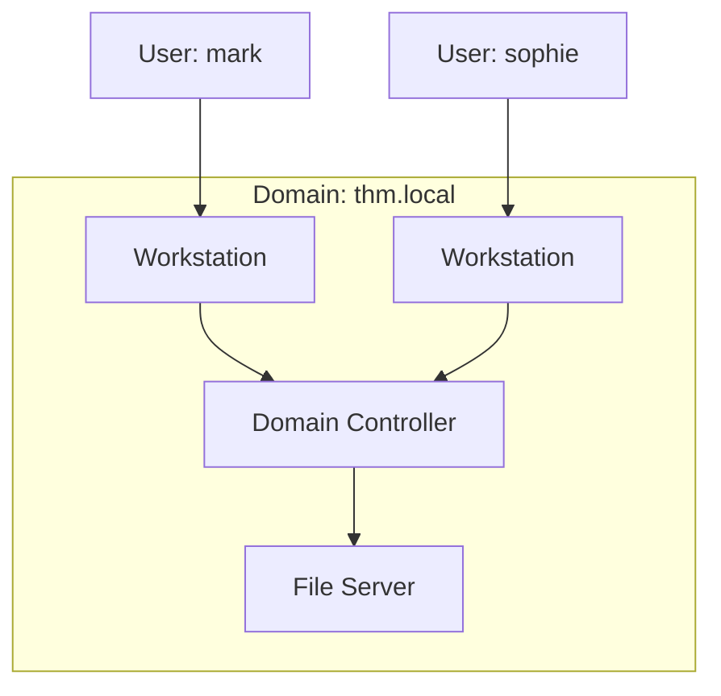

---

## 1. AD Objects & Security Principals

### 1.1 Object types

Key object types you meet in the THM room:

| Object type                   | Example                         | Notes                                                                                                              |
| ----------------------------- | ------------------------------- | ------------------------------------------------------------------------------------------------------------------ |
| **User**                      | `mark`, `sophie`, `phillip`     | Represents a person or a service account. Is a **security principal** (has SID, can log on, can have permissions). |
| **Machine / Computer**        | `DC01`, `LAPTOP01`              | Each domain-joined host has a machine account; also a security principal. Name in AD is `COMPUTERNAME$`.           |
| **Security Group**            | `Domain Admins`, `Domain Users` | Collection of users / computers. Used to grant permissions to many subjects at once. Also a security principal.    |
| **OU (Organizational Unit)**  | `THM/IT`, `THM/Sales`           | Container used to group objects for **administration & policy scoping**. Not a security principal.                 |
| **GPO (Group Policy Object)** | `Default Domain Policy`         | Not an AD *object* in the same sense, but stored in AD/SYSVOL and linked to OUs/domains to push settings.          |

### 1.2 Users

* **Human users** – staff accounts that log into workstations, mail, etc.
* **Service users** – accounts used by apps (e.g. MSSQL service account). They usually:

  * Don’t log in interactively.
  * Have only the privileges the service needs.

### 1.3 Machine accounts

* Created automatically when a computer joins the domain.
* Name in AD: **`<COMPUTERNAME>$`** (e.g. computer `TOM-PC` ⇒ account `TOM-PC$`).
* Acts as local admin **on that machine only**.
* Password is a long random value, rotated automatically by the OS.

### 1.4 Security groups (important built‑ins)

Some default domain groups you should recognise:

| Group                  | What it can do                                                                             |
| ---------------------- | ------------------------------------------------------------------------------------------ |
| **Domain Admins**      | Admin rights over **all** computers & DCs in the domain. Top power inside a single domain. |
| **Enterprise Admins**  | Admin rights across **all domains in a forest**.                                           |
| **Server Operators**   | Can administer DCs but cannot change membership of admin groups.                           |
| **Backup Operators**   | Can read any file (for backup), ignoring normal ACLs.                                      |
| **Account Operators**  | Can create / modify most user accounts.                                                    |
| **Domain Users**       | All normal user accounts.                                                                  |
| **Domain Computers**   | All computer accounts.                                                                     |
| **Domain Controllers** | All DCs.                                                                                   |

---

## 2. OUs vs Security Groups (very exam‑like distinction)

* **OUs (Organizational Units)**

  * Logically group objects (users, computers, groups) inside the directory tree.
  * Mainly used for:

    * Delegating admin control ("Phillip can manage passwords in OU=Sales").
    * Scoping **Group Policies** (link a GPO to OU=Workstations).
  * A user/computer is in **exactly one** OU (hierarchically) at a time.

* **Security Groups**

  * Collections of principals used for **permissions**.
  * Example: give `Sales-Share-Readers` read access to a share; then just add or remove users from the group.
  * One user can be in **many** groups simultaneously.

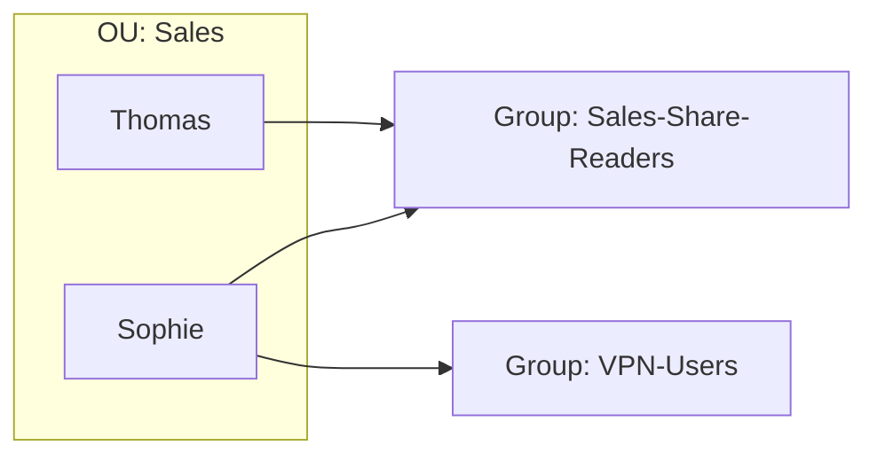

> Mental shortcut: **OU = where policies & admin scope live.  Group = who gets access to a resource.**

---

## 3. ADUC – "Active Directory Users and Computers"

* MMC snap‑in used on a DC / admin workstation to manage:

  * Users & groups
  * Computers
  * OUs
* Default containers you see right after domain creation:

  * **Builtin** – built‑in groups.
  * **Users** – default users & groups (Domain Admins, etc.).
  * **Computers** – new domain‑joined machines land here by default.
  * **Domain Controllers** – OU containing all DCs.
  * **Managed Service Accounts** – special accounts for services.

Typical corporate OU design mirrors the org chart plus device role split:

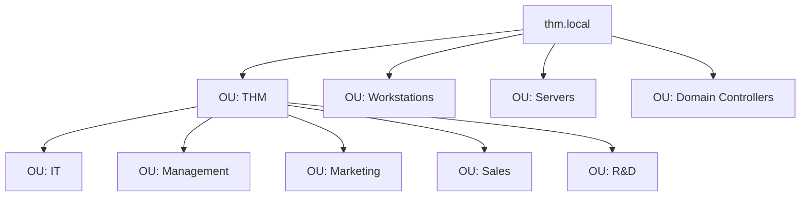

---

## 4. Managing Users & Delegation

### 4.1 Cleaning up OUs / users

Typical admin tasks you did in the room:

1. Identify obsolete OU (department closed) and delete it.

   * Need to enable **View → Advanced Features**.
   * In OU properties → *Object* tab → uncheck **Protect object from accidental deletion**.
2. Make sure users in each department OU match the org chart (create / delete / move users).

### 4.2 Delegation of control

Goal in the room: let **Phillip (IT)** reset passwords for users in Sales/Marketing/Management, without making him Domain Admin.

Workflow:

1. In ADUC, right‑click OU `Sales` → **Delegate Control…**.
2. Add user `phillip`.
3. Choose task: **Reset user passwords and force password change at next logon**.
4. Finish wizard.

Phillip then uses PowerShell on a domain‑joined machine:

```powershell
# As THM\phillip
Set-ADAccountPassword sophie -Reset -NewPassword (Read-Host -AsSecureString 'New Password')
Set-ADUser -Identity sophie -ChangePasswordAtLogon $true
```

Name of this whole idea: **delegation of control**.

---

## 5. Managing Computers & Role‑based OUs

Default behaviour: any non‑DC computer that joins the domain appears in the **Computers** container.

For better policy control, separate computers by **role** into OUs, e.g.:

* `OU=Workstations` – employee laptops & desktops.
* `OU=Servers` – app servers, file servers, DB servers.
* `OU=Domain Controllers` – already exists.

Then move machines accordingly. Later you can link different GPOs to each OU:

* Harder lock‑down for servers.
* Different firewall rules.
* Different patch / reboot policies.

---

## 6. Group Policy Objects (GPOs)

### 6.1 Concept

* **GPO = collection of settings** that apply either to **computers** or **users**.
* Stored partly in AD and partly in a special share on DCs called **SYSVOL**.
* Linked to:

  * Domain (e.g. `thm.local` root)
  * Specific OUs
* Processing rules (high level):

  * Computer configuration: Local → Site → Domain → OU (LSDOU order), later wins.
  * Same for User config.

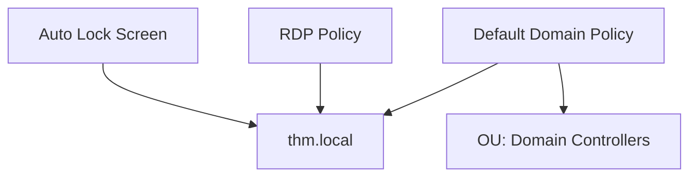

### 6.2 Default Domain Policy example

* Applies to entire domain.
* Common contents:

  * Password length / complexity
  * Account lockout

In the room, you edited:

> Computer Configuration → Policies → Windows Settings → Security Settings → Account Policies → Password Policy

and set **Minimum password length = 10**.

### 6.3 SYSVOL + gpupdate

* Policies are replicated via **`\\DC\SYSVOL`** share (physical path `C:\Windows\SYSVOL\sysvol`).
* Clients periodically pull changes; can take up to ~2 hours.
* To force refresh on a machine:

```powershell
gpupdate /force
```

### 6.4 Example GPOs from the room

1. **Restrict Control Panel Access** (User Configuration)

   * Policy: *Prohibit access to Control Panel and PC settings*.
   * Linked to: `OU=Marketing`, `OU=Management`, `OU=Sales`.
   * Result: only IT users can open Control Panel; others get an "operation has been cancelled" style message.

2. **Auto Lock Screen** (Computer Configuration)

   * Policy: *Interactive logon: Machine inactivity limit* = 5 minutes.
   * Linked to: **root domain** `thm.local` (affects all computers in child OUs like Workstations/Servers/DCs).

---

## 7. Authentication Protocols: Kerberos vs NetNTLM

Modern AD domains support **both**. Kerberos is default; NetNTLM is legacy but kept for compatibility.

### 7.1 Kerberos overview

Actors:

* **Client** – user’s workstation.
* **KDC (Key Distribution Center)** – lives on DC.
* **Service** – e.g. file server, SQL server.

#### Step 1 – Get TGT (Ticket Granting Ticket)

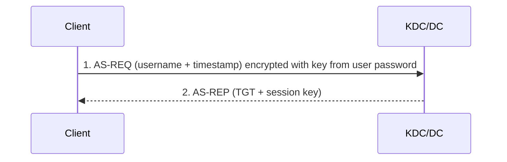

* Client sends username + timestamp encrypted with a key derived from its password.
* KDC validates and responds with:

  * **TGT** – encrypted with `krbtgt` account key (client cannot read).
  * **Session key** – shared between client and KDC.

#### Step 2 – Get TGS (service ticket)

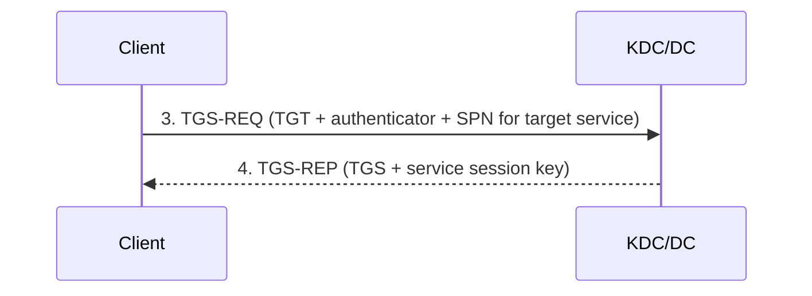

* Client wants to access service `MSSQL/SRV` etc (identified by SPN).
* Sends TGT + authenticator (username + timestamp encrypted with session key).
* KDC responds with:

  * **TGS** – encrypted with key derived from **service account’s password hash**.
  * **Service session key** – shared between client and service.

#### Step 3 – Access the service

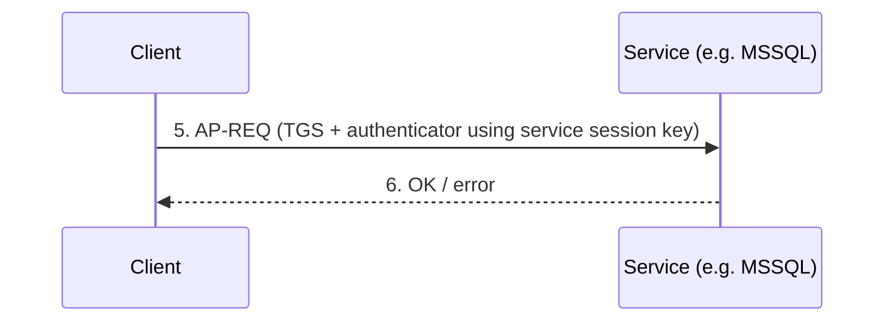

* Service decrypts TGS with its own key, gets service session key, validates authenticator.
* If valid, user is authenticated.

> Key memory point: **TGT lets you ask the KDC for more tickets (TGS).**

### 7.2 NetNTLM (NTLM over the network)

Legacy **challenge–response** protocol.

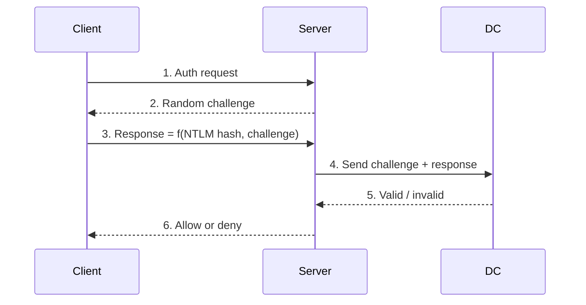

* Password itself is **never sent** over the wire.
* DC recomputes expected response using stored NTLM hash and compares.
* If using a *local* account, the server can verify using its local SAM without asking DC.

---

## 8. Domains, Trees, Forests & Trusts

### 8.1 Domain

* Basic security & administration boundary.
* Single AD database with DCs, users, computers, groups.

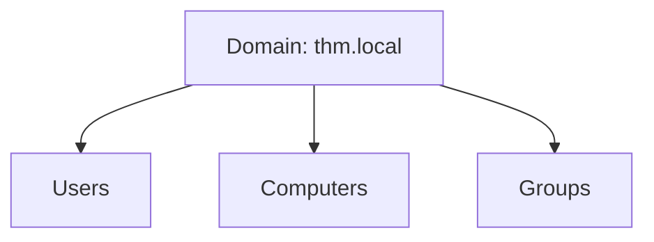

### 8.2 Tree

* Collection of one or more domains that **share a contiguous namespace**.
* Example from room: `thm.local` with child domains `uk.thm.local` and `us.thm.local`.

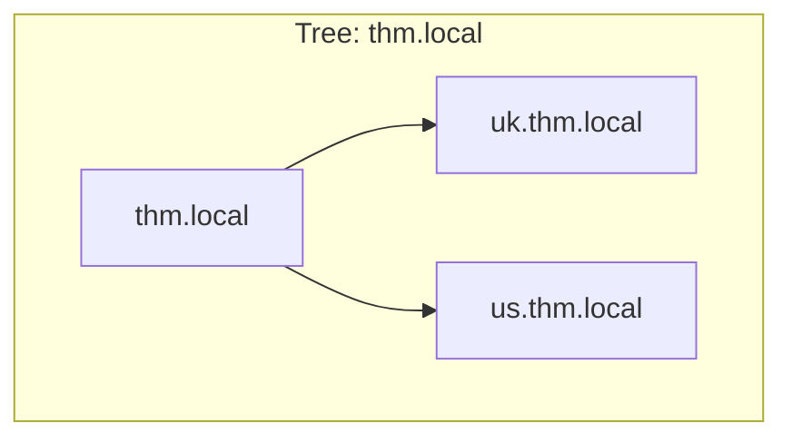

### 8.3 Forest

* Top‑level structure: **collection of one or more trees** that share:

  * Global catalog
  * Schema
  * Configuration
* Trees can have **different namespaces**: e.g. `thm.local` and `mht.local`.

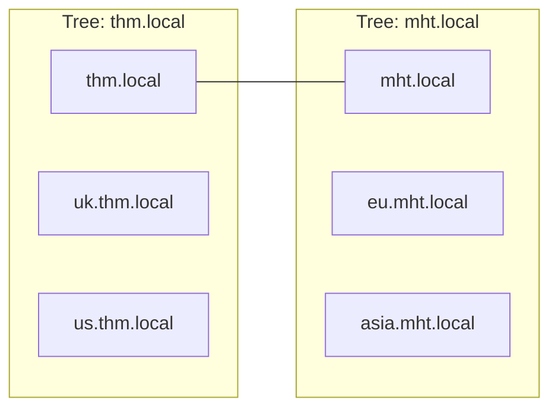

### 8.4 Trust relationships

* **Trust = agreement allowing users in one domain to be authenticated for resources in another.**
* Types you must know:

  * **One‑way trust** – *Domain A trusts Domain B*: users from **B** can be granted access to A’s resources, but not vice versa.
  * **Two‑way trust** – mutual; both sides can authorise the other’s users.
* Inside a forest, trusts between domains are usually **two‑way and transitive**.

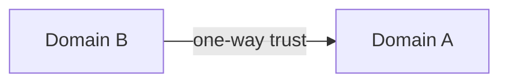

> For a user in Domain A to access a resource in Domain B, an appropriate **trust** must exist between the domains *and* permissions must be granted to that user or a group they belong to.

---

## 9. Quick THM‑style Concept Check

Use this as a mini cheat‑sheet when answering conceptual questions in the room.

1. **Which group normally administers all computers and resources in a single domain?**
   → `Domain Admins`

2. **Name of the machine account for computer `TOM-PC`?**
   → `TOM-PC$`

3. **New department (Quality Assurance) where you want consistent policies applied to its users – what container type do you create?**
   → An **Organizational Unit (OU)**.

4. **What is the network share used to distribute GPOs?**
   → `SYSVOL`

5. **Can a GPO target both users and computers?**
   → Yes – each GPO has a *Computer Configuration* section and a *User Configuration* section.

6. **Preferred / default auth protocol for modern domains?**
   → **Kerberos** (NetNTLM/NTLM kept only for compatibility).

7. **Kerberos ticket that lets you ask for TGS tickets later?**
   → **TGT – Ticket Granting Ticket**.

8. **Does NetNTLM ever transmit the cleartext password over the network?**
   → No – only challenge + response based on the hash.

9. **Group of domains that share the same namespace (`thm.local`, `uk.thm.local`, `us.thm.local`)?**
   → A **tree**.

10. **What must exist between Domain A and Domain B before A’s users can be authorised to B’s resources?**
    → A **trust relationship** (one‑way or two‑way, depending on direction of access).
