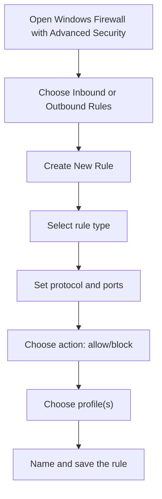
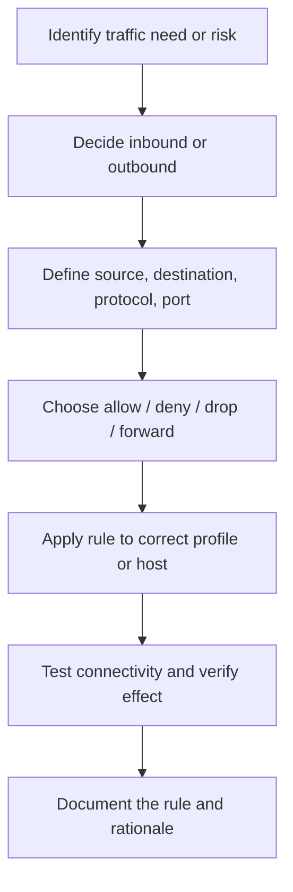

# Firewall Fundamentals

## Summary

* A firewall is a traffic-control security layer that filters **incoming and outgoing network traffic** based on defined policy.
* At a high level, firewalls answer one operational question: **should this traffic be allowed, denied, dropped, or redirected?**
* The room focuses on four conceptual firewall families: **stateless, stateful, proxy/application-layer, and next-generation firewalls (NGFWs)**.
* Practical rule design depends on a few core elements: **source, destination, protocol, port, action, and direction**.
* On Windows, the built-in firewall is **Windows Defender Firewall / Windows Firewall with Advanced Security**, where rules are commonly managed by **profiles**, **inbound/outbound rules**, and **action-based policy**.
* On Linux, packet filtering usually sits on the **Netfilter** framework, while user-facing tools such as **iptables**, **nftables**, and **ufw** provide different ways to manage that behavior.

## Why Firewalls Exist

A firewall is the network equivalent of a guard at an entry point.

Its job is not to make a network "safe" by itself. Its job is to act as a **policy enforcement point** between zones such as:

* the internet and a private network,
* one subnet and another subnet,
* a user workstation and the outside world,
* a host and its local services.

### Core idea

```text
Without a policy boundary, everything talks to everything.
With a firewall, traffic must justify itself.
```

That is the real purpose of a firewall.

## What a Firewall Actually Filters

At minimum, firewalls can make decisions based on attributes such as:

* source IP address,
* destination IP address,
* protocol,
* source port,
* destination port,
* direction,
* connection state,
* sometimes application identity or content.

This means a firewall can enforce rules like:

* allow web browsing out,
* deny inbound SSH from the internet,
* allow RDP only from an admin subnet,
* block traffic to a known bad host,
* forward web traffic to an internal server.

## Firewall Types

### 3.1 Stateless Firewall

A stateless firewall evaluates traffic **packet by packet** against predefined rules without remembering connection history.

#### Stateful characteristics

* fast,
* simple,
* rule-driven,
* limited context awareness.

#### Limitation

It does not inherently understand whether a packet belongs to an already-established legitimate conversation.

#### Stateful mental model

```text
Every packet is judged like a stranger at the door.
```

### 3.2 Stateful Firewall

A stateful firewall keeps track of active connections and makes filtering decisions using **connection state** in addition to rule matching.

#### Proxy firewall characteristics

* tracks session context,
* better at distinguishing legitimate return traffic,
* more intelligent than purely stateless filtering.

#### Practical value

This is why stateful inspection became standard in mainstream enterprise and host firewalling.

#### Mental model

```text
The firewall remembers the conversation, not just the packet.
```

### 3.3 Proxy / Application-Layer Firewall

A proxy firewall acts as an intermediary between a client and the requested resource.

#### Characteristics

* sits in the middle of communication,
* can inspect application-layer traffic,
* may hide internal addresses behind the proxy behavior,
* can apply content-aware policy.

#### Why nftables matters

This type of firewall operates closer to the application layer, so it is more useful when the question is not only "which port?" but also "what is being said?"

### 3.4 Next-Generation Firewall (NGFW)

An NGFW extends traditional/stateful firewalling with deeper inspection and additional security controls.

Typical capabilities include:

* application awareness,
* integrated intrusion prevention,
* deeper traffic inspection,
* threat intelligence integration,
* more granular policy control.

#### Practical point

The room describes heuristic and deeper inspection behavior in this category. That is directionally correct: NGFWs are meant to make richer decisions than simple port/protocol filtering.

## Comparing the Types

| Type | Main decision basis | Strength | Limitation |
| --- | --- | --- | --- |
| Stateless | packet fields only | fast, simple | no session memory |
| Stateful | packet fields + connection state | more accurate session handling | still limited compared with application-aware inspection |
| Proxy / application-layer | acts as intermediary, inspects higher-layer behavior | content/application control | more overhead, more complexity |
| NGFW | stateful filtering + advanced inspection features | higher visibility and policy depth | more resource usage, more tuning |

## Firewall Rules: Core Components

A firewall rule usually contains these elements.

### Source

Where the traffic originates.

Examples:

* `192.168.1.10`
* `10.0.0.0/24`
* `Any`

### Destination

Where the traffic is going.

Examples:

* a host,
* a subnet,
* a public IP,
* `Any`

### Protocol

Examples:

* TCP
* UDP
* ICMP

### Port

Examples:

* TCP 22 for SSH
* TCP 80 for HTTP
* TCP 443 for HTTPS

### Action

Most common:

* allow
* deny
* drop
* reject
* forward / redirect (depending on platform)

### Direction

* inbound
* outbound
* sometimes forwarded/transit traffic

## Rule Logic by Example

### 6.1 Allow outbound web traffic

```text
Source: internal subnet
Destination: any
Protocol: TCP
Ports: 80, 443
Action: allow
Direction: outbound
```

Use case:

* allow users to browse the web.

### 6.2 Deny inbound SSH from the internet

```text
Source: any external host
Destination: internal host/subnet
Protocol: TCP
Port: 22
Action: deny
Direction: inbound
```

Use case:

* do not expose remote shell access broadly.

### 6.3 Allow SSH only from one admin IP

```text
Source: ADMIN_IP
Destination: target host
Protocol: TCP
Port: 22
Action: allow
Direction: inbound
```

This is often paired with a more general deny rule.

### 6.4 Forward inbound web traffic to a web server

```text
Source: any
Destination: firewall/public interface
Protocol: TCP
Port: 80
Action: forward/redirect
Direction: inbound
Target: WEB_SERVER_IP
```

This is where firewalling intersects with routing/NAT behavior.

## Direction Matters

This is simple but operationally important.

### Inbound

Traffic entering the host or network.

Examples:

* internet user accessing your web server,
* attacker probing your SSH port,
* remote admin connecting inward.

### Outbound

Traffic leaving the host or network.

Examples:

* a user opening a website,
* a system sending updates,
* malware beaconing out.

### Why this matters

New learners often think firewalls only protect against inbound traffic. That is incomplete.

Outbound controls are important for:

* reducing misuse,
* limiting data exfiltration,
* constraining malware behavior,
* enforcing policy.

## Windows Defender Firewall / Windows Firewall with Advanced Security

On Windows, the built-in firewall is a real, policy-capable host firewall, not a decorative toggle.

### Key concepts

#### Profiles

Windows firewall policy is commonly organized by network profile, especially:

* Domain
* Private
* Public

The room simplifies this mainly to **Private** and **Public/Guest**, which is fine for beginner learning.

#### Inbound rules

Rules for traffic coming into the host.

#### Outbound rules

Rules for traffic leaving the host.

#### Advanced Security console

This is where detailed rule creation and inspection usually happen.

### Practical Windows rule workflow



This is the exact mental model you need when reading the room screenshots or using the VM.

## Linux Firewall Fundamentals

### 9.1 Netfilter

Netfilter is the packet filtering and network manipulation framework in the Linux kernel.

This is the underlying system that user-space firewall tools interact with.

#### Important distinction

```text
Netfilter = kernel framework
iptables / nftables / ufw = user-facing tooling or rule interfaces
```

That distinction is one of the most useful corrections for beginners.

### 9.2 iptables

`iptables` is the long-standing rule-management interface historically used by many Linux systems to control packet filtering, NAT, and related behavior through Netfilter.

It is powerful, but its syntax can feel more rigid and lower level than beginner-friendly wrappers.

### 9.3 nftables

`nftables` is the modern successor framework/tooling direction intended to replace the older `iptables` family.

#### Why it matters

* more modern rule model,
* unified approach compared with the older split tool family,
* actively positioned by the Netfilter project as the replacement direction.

### 9.4 UFW

`ufw` (**Uncomplicated Firewall**) is a simplified management tool commonly used on Ubuntu systems.

It exists so users do not need to write raw lower-level rules for common host-firewall tasks.

#### Why beginners like it

* readable syntax,
* quick allow/deny commands,
* easier defaults,
* less ceremony for host-level rules.

## UFW Basics

### 10.1 Status and enablement

Typical actions:

```text
ufw status
ufw enable
ufw disable
```

### 10.2 Defaults

A common beginner baseline is:

* deny incoming
* allow outgoing

That matches the common host model:

* do not let arbitrary systems connect in,
* let the local machine initiate most normal traffic out.

### 10.3 Simple rules

#### Deny SSH inbound

```text
ufw deny 22/tcp
```

#### Default deny outgoing

```text
ufw default deny outgoing
```

#### Allow outbound web traffic

```text
ufw allow out 80/tcp
ufw allow out 443/tcp
```

#### Show rules with numbers

```text
ufw status numbered
```

#### Delete by rule number

```text
ufw delete RULE_NUMBER
```

## Pattern Cards

### Pattern Card 1 - A Firewall Is a Policy Engine, Not Just a Blocker

**Problem**
: beginners think the firewall only says "yes/no" to the internet.

**Better view**
: it enforces specific network policy using rule criteria.

**Reason**
: good firewalling is selective, not binary.

### Pattern Card 2 - Stateless Is Fast Because It Is Forgetful

**Problem**
: stateless filtering seems simpler, so people overestimate it.

**Better view**
: it lacks session context.

**Reason**
: it judges packets without remembering the conversation.

### Pattern Card 3 - Stateful Inspection Is the Practical Baseline

**Problem**
: people hear "stateful" and treat it as exotic.

**Better view**
: remembering connection state is normal and useful.

**Reason**
: it makes return traffic handling and session logic much smarter.

### Pattern Card 4 - Host Firewalling Matters Too

**Problem**
: learners focus only on perimeter firewalls.

**Better view**
: Windows Defender Firewall and Linux host firewalls are real enforcement layers.

**Reason**
: not every threat is stopped at the perimeter.

### Pattern Card 5 - Linux Firewall Terminology Is Layered

**Problem**
: learners mix up Netfilter, iptables, nftables, and UFW.

**Better view**
: Netfilter is the underlying framework; the others are ways to manage or interact with it.

**Reason**
: vocabulary confusion causes configuration confusion.

## Common Pitfalls

### 12.1 Writing allow rules without considering direction

Allowing inbound 22 is very different from allowing outbound 22.

### 12.2 Forgetting the difference between source and destination

If you reverse them mentally, you write the wrong policy.

### 12.3 Overusing `Any`

Convenient rules often become weak rules.

### 12.4 Assuming a firewall only protects inbound traffic

Outbound filtering is often essential for real containment.

### 12.5 Confusing `nftables` with just "another command"

It is better understood as the modern replacement direction for the older `iptables` family.

## Mini Workflow



This is the right way to think about firewall administration.

## Takeaways

* Firewalls enforce network policy by filtering traffic according to rule criteria.
* The big conceptual distinction is between **stateless** and **stateful** filtering; after that, proxy/application-layer and NGFW add deeper visibility and control.
* Good rules are built from **source, destination, protocol, port, action, and direction**.
* Windows Defender Firewall is a real host firewall with inbound/outbound rule support and profile-based policy.
* On Linux, **Netfilter** is the kernel framework, while **iptables**, **nftables**, and **ufw** are ways to manage that behavior.
* `ufw` is the easiest beginner entry point for Linux host firewalling, while `nftables` is the modern replacement direction for older `iptables` workflows.

## CN-EN Glossary

* Firewall - 防火墙
* Packet Filtering - 包过滤
* Stateless Firewall - 无状态防火墙
* Stateful Firewall - 有状态防火墙
* Proxy Firewall - 代理防火墙
* Application-Layer Gateway - 应用层网关
* Next-Generation Firewall (NGFW) - 下一代防火墙
* Inbound Traffic - 入站流量
* Outbound Traffic - 出站流量
* Source Address - 源地址
* Destination Address - 目的地址
* Protocol - 协议
* Port - 端口
* Allow Rule - 允许规则
* Deny Rule - 拒绝规则
* Drop - 丢弃
* Forward / Redirect - 转发 / 重定向
* Netfilter - Linux 内核包过滤框架
* iptables - 传统 Linux 防火墙规则工具
* nftables - 新一代 Linux 防火墙规则框架/工具
* UFW - Uncomplicated Firewall, 简化防火墙管理工具
* Windows Defender Firewall - Windows Defender 防火墙
* Windows Firewall with Advanced Security - 带高级安全功能的 Windows 防火墙

## References

* TryHackMe room content: *Firewall Fundamentals*
* Microsoft documentation for Windows Firewall / Windows Firewall with Advanced Security
* Netfilter / nftables official documentation
* Ubuntu documentation for UFW
