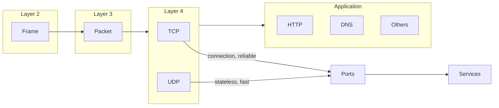

# Networking Fundamentals – Packets, TCP/UDP and Ports

> Source: Security Blue Team / networking module
> Scope: packets & frames, TCP three‑way handshake, UDP basics, ports 101 (practical)

---

## 1. Packets and Frames

### 1.1 Core definitions

* **Frame (Layer 2 – Data Link)**

  * Unit of data used on the local network segment.
  * Contains: **MAC addresses**, error‑checking (e.g. FCS), and an encapsulated Layer‑3 packet.
  * Analogy: the **envelope** used to move content from one hop to the next.

* **Packet (Layer 3 – Network)**

  * Unit of data used for **end‑to‑end delivery** across networks.
  * Contains: **IP header** (source/destination IP, TTL, etc.) + payload (which may itself contain TCP/UDP segments).
  * Analogy: the **letter** inside the envelope.

This wrapping process is **encapsulation**:

```text
Application data → TCP/UDP segment → IP packet → Ethernet/Wi‑Fi frame
```

At each hop:

* The frame is used to deliver the packet to the **next device**.
* The device strips the frame, inspects the packet, and re‑encapsulates it in a new frame for the next hop.

### 1.2 Why packets?

* Data is split into **small chunks** instead of sending one huge message.
* Benefits:

  * Better use of bandwidth; less risk of a single large transfer blocking the link.
  * Lost pieces can be resent individually (for reliable protocols like TCP).
  * Packets can take different routes and still be reassembled at the destination.

Example: loading an image from a website → the image is transmitted as many packets, then reassembled into the full picture on your device.

### 1.3 Example IP packet headers (IPv4)

Some important header fields:

* **Time To Live (TTL)** – hop limit; decremented at each router so stuck packets eventually expire instead of looping forever.
* **Checksum** – integrity check for parts of the header; if it doesn’t match, the packet is treated as corrupt.
* **Source Address** – IP of the sender.
* **Destination Address** – IP of the intended receiver.

---

## 2. TCP/IP and the Three‑Way Handshake

### 2.1 TCP/IP model refresher

TCP/IP is a practical networking model with **four layers**:

1. **Application** – protocols like HTTP, DNS, SSH, etc.
2. **Transport** – TCP, UDP (port numbers, end‑to‑end communication).
3. **Internet** – IP, routing between networks.
4. **Network Interface** – Ethernet, Wi‑Fi; frames on the local link.

Like the OSI model, each layer adds its own headers → **encapsulation**. Removing them on the way up the stack is **decapsulation**.

### 2.2 TCP characteristics

* **Connection‑oriented** – must establish a connection **before** data transfer.
* **Reliable** – guarantees ordered, loss‑free delivery (or signals failure).
* Uses **sequence numbers, acknowledgements (ACKs)**, and checksums.

**Pros:**

* High confidence in data integrity and ordering.
* Flow control and congestion control prevent one side from being overwhelmed.

**Cons:**

* Requires a stable connection between both hosts.
* Extra handshakes and checks make it **slower** and more resource‑intensive than UDP.

### 2.3 Key TCP header fields

* **Source Port** – ephemeral port chosen by the client (0–65535, unused at that moment).
* **Destination Port** – port where a service is listening on the server (e.g. 80 for HTTP).
* **Source IP / Destination IP** – end hosts’ addresses.
* **Sequence Number (SEQ)** – identifies the position of the first byte in this segment.
* **Acknowledgement Number (ACK)** – “I have received everything up to SEQ = N; please send the next byte after that”.
* **Checksum** – integrity check over header + data.
* **Flags** – bits that describe control information (SYN, ACK, FIN, RST, etc.).

### 2.4 The TCP three‑way handshake

Goal: establish a shared sequence‑number space and confirm both sides are ready.

Steps (client = Alice, server = Bob):

1. **SYN** – Alice → Bob

   * “Here is my Initial Sequence Number (ISN): e.g. 0. Let’s synchronise.”

2. **SYN/ACK** – Bob → Alice

   * “I acknowledge your ISN (0), and here is **my** ISN (e.g. 5000).”

3. **ACK** – Alice → Bob

   * “I acknowledge your ISN (5000). Here is data starting at my ISN+1 (1).”

After this, both sides agree on:

* How to number bytes (sequence space).
* What data has already been received (ACK numbers).

Then the connection switches to normal **DATA** transfer.

### 2.5 Closing a TCP connection

* When one side is done sending data, it sends **FIN**.
* The other side replies with **ACK**, then usually sends its own **FIN** when it is also done.
* Final **ACK** confirms the closure.

Summary sequence:

```text
FIN → ACK/FIN → ACK
```

A **RST** flag can be sent by either side to **abruptly reset** a connection when something is wrong (crash, misconfiguration, forbidden access, etc.).

---

## 3. UDP/IP

### 3.1 UDP characteristics

* **User Datagram Protocol (UDP)** – a simple, **connectionless** transport protocol.
* No three‑way handshake, no synchronisation, no built‑in reliability.
* UDP is **stateless**: the protocol doesn’t track sessions – it just sends datagrams.

**Pros:**

* Much **faster** and lower overhead than TCP.
* Does **not** reserve long‑lived connections or a lot of system resources.
* Allows the application layer to decide how to handle rate control, retransmission, etc.

**Cons:**

* No guarantee that data arrives, arrives once, or arrives in order.
* On unstable networks, this can produce a very poor user experience.

Use‑cases: where some loss is acceptable, or latency is more critical than reliability – e.g. **video/voice streaming, online games, DNS lookups**.

### 3.2 Typical UDP headers

UDP segments are simpler than TCP segments, but seen at the IP layer they still sit inside an IP packet.

Common fields (IP + UDP combined):

* **Time To Live (TTL)** – packet expiry.
* **Source Address** – sender IP.
* **Destination Address** – receiver IP.
* **Source Port** – port chosen by sender for this conversation.
* **Destination Port** – port where the receiving application is listening (e.g. 53 for DNS, 123 for NTP).
* **Data** – payload bytes.

There is **no handshake / ACK sequence** – the sender simply transmits datagrams and (optionally) the application may implement its own acknowledgements.

---

## 4. Ports 101

### 4.1 What is a port?

* Conceptually: a **numbered endpoint** on a host used by applications to send/receive data.
* Range: `0–65535` (16‑bit unsigned integer).
* Analogy: a busy **harbour** with many berths (ports). Each ship must dock at a compatible berth: if it doesn’t match, it can’t dock.

Why standardise?

* If every service used random ports, clients would not know where to connect.
* So common protocols have **well‑known ports**; software defaults to these.

### 4.2 Common ports (well‑known 0–1024)

Some important defaults:

| Protocol                          | Port | Description                                        |
| --------------------------------- | ---- | -------------------------------------------------- |
| **FTP** (File Transfer Protocol)  | 21   | Classic file‑sharing with a client–server model.   |
| **SSH** (Secure Shell)            | 22   | Encrypted, text‑based remote login and management. |
| **HTTP**                          | 80   | Unencrypted web traffic (World Wide Web).          |
| **HTTPS**                         | 443  | HTTP over TLS/SSL – encrypted web traffic.         |
| **SMB** (Server Message Block)    | 445  | File & printer sharing on Windows networks.        |
| **RDP** (Remote Desktop Protocol) | 3389 | GUI remote desktop to Windows systems.             |

> Note: services **can** run on non‑standard ports (e.g. HTTP on 8080). In that case the client must specify `host:port` explicitly.

### 4.3 Why ports matter in practice

* Ports allow multiple networked applications to coexist on one IP address.
* Firewalls, IDS/IPS, and security policies often match on **port numbers** to allow/deny traffic.
* Enumeration of open ports (e.g. with nmap) is a key recon step in security testing.

### 4.4 Practical challenge (from the room)

> Connect to IP `8.8.8.8` on port `1234` via the provided site to receive a flag.

This exercise reinforces that:

* A connection is defined by **IP + protocol (TCP/UDP) + port**.
* Choosing the wrong port means the targeted service simply is not reachable, even if the IP is correct.

---

## 5. Concept map



These notes summarise the key ideas from the *Packets & Frames*, *TCP three‑way handshake*, *UDP/IP*, and *Ports 101* tasks so they can be referenced later in a GitHub notes repo.
