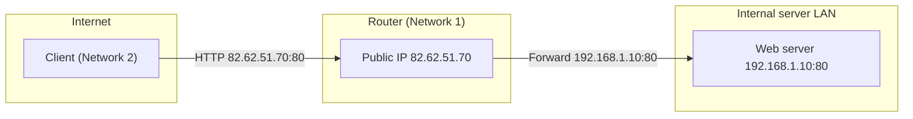
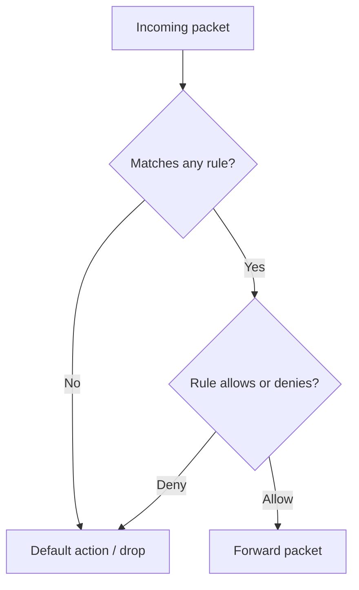
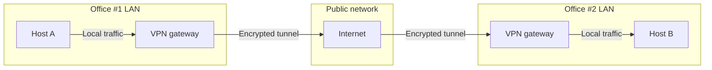
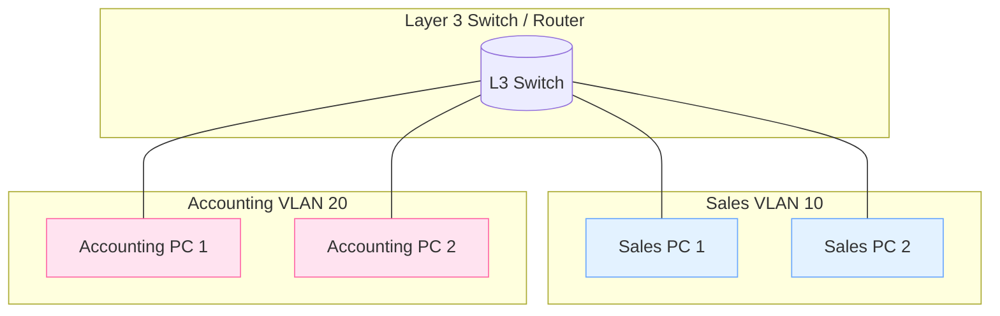

# Extending Your Network – Notes

> Topic: extending internal networks to the Internet and between sites
> Focus: port forwarding, firewalls, VPN basics, routers, switches & VLANs

---

## 1. Port Forwarding – exposing internal services

### 1.1 What problem does port forwarding solve?

* By default, services on a private IP (e.g. `192.168.1.10:80`) are only reachable from the **same local network** (intranet).
* If we want a service (e.g. web server) to be reachable from the **Internet**, we need a way to map **public IP + port → internal IP + port**.

This mapping is called **port forwarding** and is configured **on the router** that sits at the edge of the network.

### 1.2 Conceptual flow

Example: internal web server at `192.168.1.10:80`, router has public IP `82.62.51.70`.

* External user connects to: `82.62.51.70:80`.
* Router has a port‑forward rule: `82.62.51.70:80 → 192.168.1.10:80`.
* Router forwards the traffic to the internal server and returns responses back to the Internet client.

Result: devices on another network (Network #2) can access the web server on Network #1 using the public IP.

### 1.3 Port forwarding vs firewalls

* **Port forwarding:** decides **where** incoming traffic should be sent inside the network (opens a port mapping).
* **Firewall:** decides **whether** that traffic is allowed or blocked based on rules (even if the port is forwarded, firewall rules can still drop it).

Port forwarding is about *reachability*; firewalling is about *policy and control*.

---

## 2. Firewalls 101 – controlling traffic

### 2.1 Role of a firewall

A **firewall** is the network’s **border control**:

* Monitors traffic entering and leaving a network.
* Applies rules based on:

  * **Source** (where traffic comes from).
  * **Destination** (where traffic is going).
  * **Port** (which service/port number is targeted).
  * **Protocol** (TCP, UDP, etc.).

To decide, a firewall performs **packet inspection** and checks the traffic against its ruleset.

Firewalls can be:

* Dedicated hardware appliances (enterprise networks).
* Built into residential routers.
* Software firewalls (host‑based, e.g. on a server or workstation).

### 2.2 Stateful vs stateless firewalls

**Stateful firewall**

* Tracks the **state of the entire connection**, not just individual packets.
* Decisions are dynamic: can allow or block based on how a TCP session behaves as a whole.
* If it identifies a host as “bad”, it can block the whole connection from that host.
* **More resource‑intensive** (needs memory and logic to track sessions).

**Stateless firewall**

* Uses a **static set of rules**; evaluates each packet in isolation.
* A bad packet does not necessarily cause the whole host to be blocked.
* **Less resource usage**, but also “dumber” – only as effective as the rules you define.
* Useful for handling **very large volumes of traffic** (e.g. distributed denial‑of‑service situations) where per‑connection tracking is too expensive.

---

## 3. VPN Basics – private tunnels over the Internet

### 3.1 What is a VPN?

A **Virtual Private Network (VPN)** creates an **encrypted tunnel** over the Internet between two endpoints or networks:

* Devices at different physical locations behave as if they were on the **same private network**.
* Traffic inside the tunnel is **encrypted** and logically separated from other Internet traffic.

Example scenario:

* **Network #1:** Office #1
* **Network #2:** Office #2
* **Network #3:** The VPN tunnel – a virtual network formed by devices that join the VPN.

Devices in Network #3 are still part of their original networks but also share a **private overlay network** where only VPN‑connected devices can communicate.

### 3.2 Benefits

* **Connects distant networks**

  * Companies with multiple offices can share servers and infrastructure securely across sites.

* **Provides privacy**

  * Data in the tunnel is encrypted; only endpoints can read it.
  * Useful on public Wi‑Fi where the underlying network offers no encryption.

* **Provides some anonymity**

  * ISPs and intermediaries see encrypted traffic going to the VPN provider, not the final destinations.
  * Journalists/activists can use VPNs to reduce some tracking risks, depending on how the VPN provider handles logs.

* **Security for lab environments**

  * Platforms like TryHackMe use VPNs so that users can access vulnerable machines **without exposing them directly to the Internet**.

### 3.3 Example VPN technologies

* **PPP (Point‑to‑Point Protocol)**

  * Used for authentication and encryption of data.
  * Uses key/certificate concepts to establish secure links.
  * Not routable by itself (needs another protocol to carry it across networks).

* **PPTP (Point‑to‑Point Tunneling Protocol)**

  * Wraps PPP so it can travel across IP networks.
  * Easy to set up and widely supported, but **relatively weak encryption** compared to modern alternatives.

* **IPsec (Internet Protocol Security)**

  * Encrypts data at the IP layer.
  * More complex to configure but offers **strong security** and is well supported.

---

## 4. LAN Networking Devices – router, switch, VLAN

### 4.1 Router – connecting networks

* A **router** connects **different networks** and forwards packets between them.
* Operates at **Layer 3 (Network layer)** of the OSI model.
* Uses **routing** to decide which path packets should take to reach a destination network.

Routing decisions can consider:

* Shortest path
* Reliability of a route
* Medium used (e.g. copper vs fibre)

Routers often provide admin interfaces (web UI or CLI) to configure:

* Port forwarding
* Firewall rules
* Static/dynamic routes

### 4.2 Switch – connecting devices

A **switch** provides multiple network ports for devices to plug into the same LAN.

* **Layer 2 switches**

  * Forward **frames** based on **MAC addresses**.
  * Responsible only for delivering frames to the correct device on the same network segment.

* **Layer 3 switches**

  * Can do what Layer 2 switches do **and** perform some routing functions.
  * They forward frames locally and route **IP packets** between VLANs or subnets.

### 4.3 VLAN – Virtual Local Area Network

* A **VLAN** allows one physical switch to be split into **multiple logical networks**.
* Devices in different VLANs can:

  * Share common infrastructure (e.g. Internet connection).
  * Be **logically separated** so that traffic between them is limited or controlled.

Example:

* VLAN 10 – *Sales Department*
* VLAN 20 – *Accounting Department*

Both departments are plugged into the same physical switch, but VLAN rules enforce that:

* Both can access the Internet.
* Sales and Accounting **cannot directly talk to each other** unless policy allows.

This segmentation improves **security and control** inside the LAN by reducing unnecessary communication paths.

---

## 5. Mental model – extending and protecting networks

* **Port forwarding** exposes specific internal services to the Internet via a router.
* **Firewalls** decide which traffic is allowed or blocked at network boundaries.
* **VPNs** create encrypted tunnels that logically join distant networks or users.
* **Routers** join networks; **switches** join devices; **VLANs** segment devices into logical groups.

Together, these pieces explain how an organisation can:

* Safely expose selected services to the Internet.
* Connect multiple offices and remote users.
* Keep internal segments isolated while still sharing core resources.

---

## 6. Visual diagrams 

### 6.1 Port forwarding (public → private)

### 6.2 Firewall decision flow

### 6.3 VPN tunnel between two offices

### 6.4 Router, switch and VLAN segmentation

