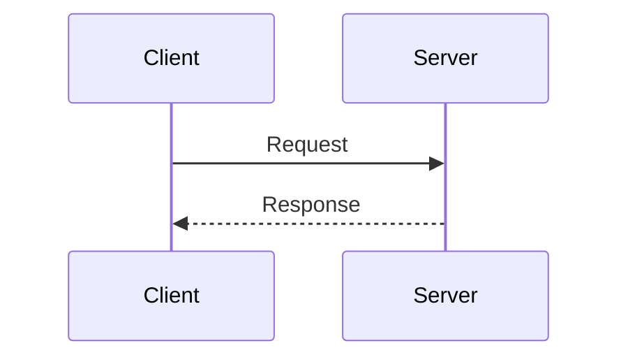

---

platform: tryhackme
room: Networking Core Protocols
slug: networking-core-protocols
path: TryHackMe/40-networking/networking-core-protocols.md
topic: 40-networking
domain: [networking]
skills: [dns, whois, http, ftp, email]
artifacts: [lab-notes, pattern-cards, command-cookbook]
status: wip
date: 2026-01-27
---

## 0) Summary

* Application-layer protocols are mostly “human-readable text over TCP/UDP” (until TLS enters the picture).
* DNS maps names to addresses (and mail routing) so humans don’t memorize IPs.
* WHOIS provides domain registration metadata (often privacy-protected).
* HTTP/HTTPS drives the web; FTP moves files; SMTP sends mail; POP3/IMAP retrieve mail.
* Many legacy protocols are plaintext by default; prefer TLS variants (HTTPS/STARTTLS/IMAPS/POP3S/FTPS).

## 1) Key Concepts

### 1.1 Quick protocol map (what / where / why)

| Protocol     | What it does                                         |                                                           Typical transport/port | Security note                                                               |
| ------------ | ---------------------------------------------------- | -------------------------------------------------------------------------------: | --------------------------------------------------------------------------- |
| DNS          | Resolve names ↔ IPs, plus mail routing records       |                                              UDP/53 (default), TCP/53 (fallback) | DNS itself is often plaintext; modern variants: DoT/DoH (out of scope here) |
| WHOIS        | Query domain registration metadata                   |                                                           TCP/43 (classic WHOIS) | Data may be redacted via privacy services                                   |
| HTTP / HTTPS | Browser ↔ web server request/response                |                                                                  TCP/80, TCP/443 | HTTPS = HTTP over TLS                                                       |
| FTP          | Transfer files (control + data channels)             |                                      TCP/21 (control) + separate data connection | Plaintext unless FTPS/SFTP (SFTP is SSH-based, not FTP)                     |
| SMTP         | Send mail (client→server, server→server)             | TCP/25 (server), TCP/587 (submission, common), TCP/465 (implicit TLS, sometimes) | Prefer STARTTLS/submission where available                                  |
| POP3         | Download mail to a client (often “pull then delete”) |                                                                          TCP/110 | Plaintext unless POP3S (995) / STARTTLS                                     |
| IMAP         | Synchronize mailbox state across devices             |                                                                          TCP/143 | Plaintext unless IMAPS (993) / STARTTLS                                     |

### 1.2 DNS record types you will actually touch

* **A record**: hostname → IPv4 address.
* **AAAA record**: hostname → IPv6 address.
* **CNAME record**: alias name → canonical name (name-to-name mapping).
* **MX record**: domain → mail exchanger (which server handles mail for that domain).

Mental model: browsers usually care about **A/AAAA**; mail systems care about **MX**.

### 1.3 WHOIS as “domain OSINT metadata”

* Whoever registers a domain controls its DNS configuration.
* WHOIS typically exposes registrar, creation/expiry dates, and (sometimes) registrant contact info.
* Modern reality: registrant fields are frequently redacted (privacy proxy / GDPR-related changes).

### 1.4 HTTP: request methods as intent

* **GET**: retrieve.
* **POST**: submit/create (commonly used for forms).
* **PUT**: replace/update a resource (semantics depend on the API).
* **DELETE**: delete a resource.

Also remember: HTTP is “headers + body”. The browser UI hides most of the exchange.

### 1.5 FTP: why it feels weird

FTP uses a **control channel** (commands) and separate **data channels** (LIST, RETR, STOR). This is why Wireshark often shows multiple TCP connections for a single “ftp session”.

### 1.6 SMTP vs POP3 vs IMAP (the email triangle)

* **SMTP**: sending/relaying.
* **POP3**: retrieve messages (simpler, often local-download oriented).
* **IMAP**: mailbox synchronization (flags, folders, multiple devices).

If you capture traffic for POP3/IMAP without TLS, you can often see credentials and message content in cleartext.

## 2) Pattern Cards

### Pattern Card A — “Name to address” workflow

1. Identify the DNS server in use (system config).
2. Query A/AAAA first.
3. If mail-related, query MX.
4. Validate whether answers are authoritative or recursive.

### Pattern Card B — “Text-based protocol recon via telnet/netcat”

When a service speaks plaintext commands over TCP:

* Connect to the port.
* Read the banner.
* Send minimal valid commands.
* Observe server responses.

This is a fast way to understand protocol structure without a dedicated client.

### Pattern Card C — “Capture → parse → explain” (pcap-first learning)

* Capture traffic (or use provided `.pcapng`).
* Filter by protocol/port.
* Identify the request/response pairs.
* Write down the smallest set of fields that explain what happened.

### Pattern Card D — “Security posture sanity check”

For every protocol you learn, ask:

* Is it plaintext by default?
* What is the TLS upgrade path (implicit TLS vs STARTTLS)?
* What secrets/PII would be exposed on the wire?

## 3) Command Cookbook

All commands use placeholders. Replace `DOMAIN`, `DNS_IP`, `MACHINE_IP` as needed.

### DNS

```bash
# Basic lookup (A/AAAA)
nslookup www.DOMAIN

# dig is often more explicit
# dig A www.DOMAIN @DNS_IP
# dig AAAA www.DOMAIN @DNS_IP
```

### WHOIS

```bash
# Domain registration metadata
whois DOMAIN
```

### HTTP

```bash
# Minimal request (shows headers)
curl -i http://MACHINE_IP/

# Verb demo
curl -X GET  http://MACHINE_IP/resource
curl -X POST http://MACHINE_IP/resource -d 'k=v'
```

### FTP (control channel)

```bash
ftp MACHINE_IP
# USER anonymous
# PASS <empty>
# ls (client) -> LIST (wire)
# get file.txt -> RETR file.txt
# put file.txt -> STOR file.txt
```

### SMTP (manual session)

```text
telnet MACHINE_IP 25
EHLO client.local
MAIL FROM:<user@client.local>
RCPT TO:<user@server.local>
DATA
Subject: test

Hello
.
QUIT
```

### POP3 (manual session)

```text
telnet MACHINE_IP 110
USER USERNAME
PASS PASSWORD_REDACTED
STAT
LIST
RETR 1
QUIT
```

### IMAP (manual session)

```text
telnet MACHINE_IP 143
A LOGIN USERNAME PASSWORD_REDACTED
B SELECT inbox
C FETCH 1 body[]
D LOGOUT
```

## 4) Evidence (sanitized)

* `assets/pcap/dns-query.pcapng`
* `assets/pcap/http-session.pcapng`
* `assets/pcap/ftp-session.pcapng`
* `assets/pcap/smtp-pop3-imap.pcapng`

For public notes: keep only minimal excerpts, redact credentials, and use placeholders.

## 5) Takeaways

* “Core protocols” are less about memorizing ports and more about recognizing **message patterns**.
* If a protocol is text-based, you can usually learn it quickly by reading a few request/response pairs.
* Email is a protocol stack, not a single protocol.
* Wire-level visibility is power: plaintext protocols leak secrets by design.

## 6) References

* RFC 1035 (DNS), RFC 3596 (AAAA)
* RFC 3912 (WHOIS)
* RFC 9110 (HTTP semantics)
* RFC 959 (FTP)
* RFC 5321 (SMTP)
* RFC 1939 (POP3)
* RFC 9051 (IMAP4rev2)

## Appendix — Mermaid quick fix (GitHub)

If you see: “No diagram type detected…”, check the first keyword.

Correct sequence diagram header is `sequenceDiagram` (not `diagramSequence`).


