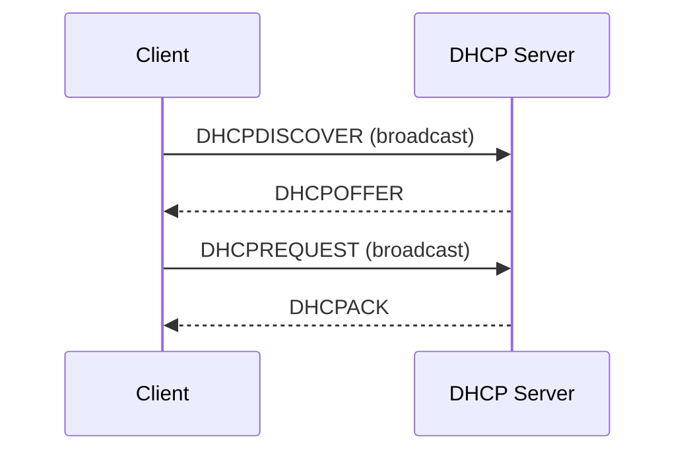
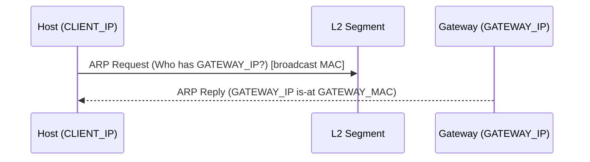
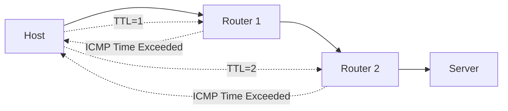

---

platform: tryhackme
room: "Networking Essentials"
slug: networking-essentials
path: "Network-Fundamentals"   
topic: "40-networking"         
domain: ["networking", "linux"]
skills: ["dhcp", "arp", "icmp", "nat", "traceroute"]
artifacts: ["lab-notes"]
status: "wip"
date: 2026-01-21
---

# Networking Essentials 

## 0) Summary 

* **What this room trains:** how endpoints get basic network config (DHCP), how IP talks to Ethernet/Wi-Fi (ARP), and how to troubleshoot reachability (ICMP ping/traceroute) plus how “many devices share one public IP” works (NAT).
* **Main concepts:** DORA, broadcast vs unicast, MAC vs IP addressing, ICMP Echo/Time Exceeded, TTL, NAT translation table.
* **What I will reuse elsewhere:** quick hypothesis-driven checks for “no internet”, “can’t reach gateway”, “DNS vs routing”, and reading pcaps with *tshark*/*Wireshark*.

## 📝 Glossary (EN–ZH)

| Term (EN)                                  | 中文            | Plain meaning                                                 |
| ------------------------------------------ | ------------- | ------------------------------------------------------------- |
| DHCP (Dynamic Host Configuration Protocol) | 动态主机配置协议      | auto-assigns IP/subnet/gateway/DNS when joining a network     |
| DORA                                       | 发现-提供-请求-确认   | DHCP’s 4-message handshake: Discover/Offer/Request/Ack        |
| Lease                                      | 租约            | “temporary ownership” time window for an IP assignment        |
| Broadcast                                  | 广播            | send to everyone on the local segment (e.g., 255.255.255.255) |
| MAC address                                | 物理地址 / MAC 地址 | L2 identifier for a NIC; used inside Ethernet/Wi-Fi frames    |
| ARP (Address Resolution Protocol)          | 地址解析协议        | maps an IPv4 address → MAC on the local network               |
| ICMP                                       | 网际控制报文协议      | diagnostics/errors for IP networks (ping/traceroute)          |
| TTL (Time To Live)                         | 生存时间 / 路由跳数上限 | hop limit; routers decrement it, traceroute leverages this    |
| NAT (Network Address Translation)          | 网络地址转换        | many private hosts share one public IP using port mappings    |
| Default gateway                            | 默认网关          | local router IP used to reach outside the subnet              |

## 1) Key Concepts 

* **“I have Wi-Fi but no IP”: DHCP likely failed.** DHCP gives at minimum: IP + subnet, gateway, DNS.
* **“I know the target IP but can’t send frames”: ARP is missing.** On a LAN, IP packets must be wrapped in Ethernet/Wi-Fi frames; frames need destination MAC.
* **Ping and traceroute are diagnostics, not guarantees.** Firewalls can block ICMP; “no reply” does not always mean “host is down”.
* **Traceroute’s core trick:** it forces routers to reveal themselves via TTL reaching 0 → ICMP Time Exceeded.
* **NAT changes what the server sees.** Internal host connects as `INTERNAL_IP:INTERNAL_PORT`, but the outside world observes `PUBLIC_IP:PUBLIC_PORT`.

## 2) Pattern Cards 

### Pattern 1 — “Joined a new network, got no working Internet”

* **Signal:** connected to Wi-Fi/Ethernet, but websites fail; IP config looks missing or wrong.
* **Hypothesis:** DHCP did not complete, or gateway/DNS is wrong.
* **Checks (minimal):**

  * `ip a` (does interface have an IPv4 + /mask?)
  * `ip r` (is there a default route via a gateway?)
  * `cat /etc/resolv.conf` or `resolvectl status` (is DNS present?)
  * Pcap-level sanity: `tshark -r DHCP_CAPTURE.pcap -n` (do I see DORA?)
* **Expected output:**

  * Successful DORA: Discover (0.0.0.0 → 255.255.255.255) → Offer → Request → ACK.
  * A default route to `GATEWAY_IP`.
* **Next step decision:**

  * No Offer/ACK → DHCP server unreachable or blocked (VLAN/Wi-Fi isolation / relay issue).
  * Offer exists but traffic still fails → validate gateway reachability + DNS.

### Pattern 2 — “Same subnet, but cannot reach the gateway/neighbor”

* **Signal:** `ping GATEWAY_IP` fails, but IP config exists.
* **Hypothesis:** ARP resolution failed (no MAC mapping), or L2 isolation.
* **Checks (minimal):**

  * `ip neigh` (Linux ARP cache): is there an entry for `GATEWAY_IP`?
  * `tshark -r ARP_CAPTURE.pcapng -n` (ARP Who-has + is-at?)
* **Expected output:**

  * ARP Request goes to broadcast MAC `ff:ff:ff:ff:ff:ff`.
  * ARP Reply unicast back with `GATEWAY_MAC`.
* **Next step decision:**

  * No ARP reply → wrong VLAN, gateway down, or L2 filtering.

### Pattern 3 — “Target host reachable? quantify the path”

* **Signal:** intermittent connectivity; want to know whether failures happen locally or upstream.
* **Hypothesis:** packet loss/latency on a specific hop; ICMP filtering may hide hops.
* **Checks (minimal):**

  * `ping -c 4 TARGET_IP` (RTT, loss)
  * `traceroute example.com` (hop visibility via TTL)
* **Expected output:**

  * Ping: ICMP Echo Request (Type 8) ↔ Echo Reply (Type 0).
  * Traceroute: hop-by-hop routers (some may be `*` due to ICMP blocked).
* **Next step decision:**

  * If first hop (gateway) fails → local issue.
  * If later hops fail → ISP/route/firewall issue; triangulate with DNS + TCP tests.

### Pattern 4 — “One public IP, many devices”

* **Signal:** internal devices use private IPs, yet all access the Internet.
* **Hypothesis:** NAT/PAT is rewriting source IP+port.
* **Checks (minimal):**

  * Know the mapping concept: `(INTERNAL_IP, INTERNAL_PORT) → (PUBLIC_IP, PUBLIC_PORT)`
  * In captures, verify different internal sources share the same external IP.
* **Expected output:** server sees the router’s public address, not the original private address.
* **Next step decision:** NAT helps address exhaustion, but complicates inbound connectivity and attribution.

## 3) Command Cookbook 

> Keep commands reproducible. Use placeholders.

```bash
# Placeholders
export CAP_DHCP=DHCP_CAPTURE.pcap
export CAP_ARP=ARP_CAPTURE.pcapng
export T=TARGET_IP

# DHCP: verify DORA in a capture
tshark -r "$CAP_DHCP" -n

# ARP: inspect request/reply exchange
tshark -r "$CAP_ARP" -Nn

# Alternate view of ARP packets
tcpdump -r "$CAP_ARP" -n -v

# ICMP reachability (stop after 4 pings)
ping "$T" -c 4

# Path discovery (example uses a public hostname; replace as needed)
traceroute example.com
```

Notes:

* Why `-n` in tshark/traceroute: avoids DNS resolution noise and speeds up analysis.
* What to look for in DHCP:

  * Discover/Request sourced from `0.0.0.0` to `255.255.255.255` (before the client has an IP).
  * Server Offer/ACK typically from `GATEWAY_IP`/DHCP server to the proposed client IP.
* What to look for in ARP:

  * Request “Who has `GATEWAY_IP`? Tell `CLIENT_IP`” sent to broadcast MAC.
  * Reply “`GATEWAY_IP` is at `GATEWAY_MAC`” unicast back.

## 4) Evidence 

* Store screenshots/pcaps under `assets/`.
* Remove usernames, real MACs, and any non-demo public IPs. Use placeholders.

Suggested asset names (example):

* `assets/dhcp-dora.png` (DORA mnemonic)
* `assets/dhcp-handshake.png` (Discover/Offer/Request/ACK arrows)
* `assets/arp-reply-wireshark.png` (ARP reply fields)
* `assets/icmp-echo-request.png` / `assets/icmp-echo-reply.png`
* `assets/nat-translation.png` (private→public mapping table)
* `assets/routing-topology.png` (multiple paths)

## 5) Takeaways (transfer learning)

* **1 thing I would do faster next time:** separate “IP config problem” (DHCP) from “L2 neighbor discovery” (ARP) from “upstream path” (ICMP/traceroute).
* **1 check I keep forgetting:** default route + DNS (it’s easy to blame “the Internet” when it’s just `resolv.conf`).
* **1 reference worth re-reading:** the mental model of encapsulation + where each protocol sits (DHCP over UDP; ARP at L2; ICMP inside IP).

## 6) References

* RFC 2131 — Dynamic Host Configuration Protocol (DHCP)
* RFC 826 — An Ethernet Address Resolution Protocol (ARP)
* RFC 792 — Internet Control Message Protocol (ICMP)
* RFC 1918 — Address Allocation for Private Internets (private IPv4 ranges)
* (Book) *Computer Networking: A Top-Down Approach* — Kurose & Ross (for TCP/IP stack framing)

---

## Appendix: Minimal diagrams 

### DHCP DORA 



### ARP resolution (LAN)



### Traceroute’s TTL trick (high level)


