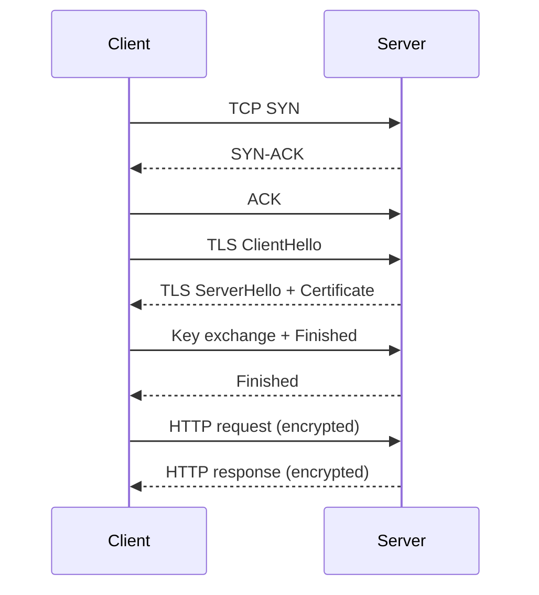
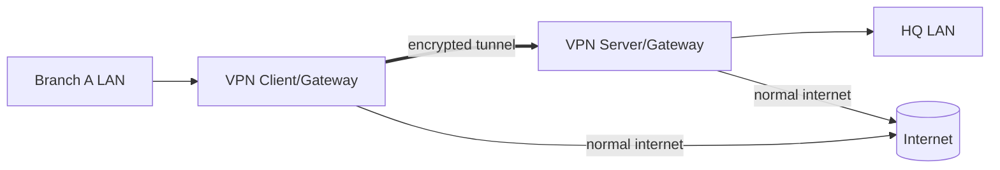

---

platform: TryHackMe
room: Networking Secure Protocols
slug: networking-secure-protocols
path: TryHackMe/40-networking/networking-secure-protocols.md
topic: 40-networking
domain: REF-Security
skills:* tls
* wireshark
* ssh
* vpn
artifacts: concept-notes
status: wip
date: 2026-01-31

---

## 0) Summary

* Plaintext (cleartext) protocols expose **confidentiality**, **integrity**, and **authenticity** risks when packets are observable on-path.
* Three pragmatic “upgrade paths”:

  1. **TLS** wrapping existing application protocols (HTTPS / IMAPS / POP3S / SMTPS / FTPS variants).
  2. **SSH** as a secure remote-access + secure transport substrate (SFTP, tunneling).
  3. **VPN** as an encrypted overlay network (site-to-site or remote-access).
* Operational mental model: **security is added as a layer**, mostly without changing TCP/IP semantics; key material and trust anchors become the new critical dependency.

## 1) Key Concepts

### CIA + Authenticity (confidentiality / integrity / authenticity)

* **Confidentiality**: observers cannot read payload (e.g., passwords, cookies, documents).
* **Integrity**: observers cannot silently modify traffic without detection.
* **Authenticity**: client verifies it’s talking to the intended server (not a fake).

### TLS (Transport Layer Security)

* TLS is a cryptographic protocol commonly described as “transport-layer security”. Practical effect: it **encrypts and authenticates** application data between client and server.
* TLS historically evolved from SSL; you still see “SSL” in product/UI labels, but modern deployments use TLS.

Trust model (high-level):

* Server presents a **certificate** (public key + identity claims) signed by a **Certificate Authority (CA)**.
* Client verifies signature using its local trust store.
* **Self-signed certificates** fail third-party authenticity unless you manually trust them.

### How TLS “upgrades” existing protocols

Think “application protocol over TLS”:

* HTTP → **HTTPS** (TCP/443)
* IMAP → **IMAPS** (TCP/993)
* POP3 → **POP3S** (TCP/995)
* SMTP → **SMTPS / Submission over TLS** (commonly TCP/465, TCP/587)

Cleartext vs Secure default ports (mnemonic table):

| Plaintext | Port | Secure variant              |      Port |
| --------- | ---: | --------------------------- | --------: |
| HTTP      |   80 | HTTPS                       |       443 |
| SMTP      |   25 | SMTPS / submission TLS      | 465 / 587 |
| POP3      |  110 | POP3S                       |       995 |
| IMAP      |  143 | IMAPS                       |       993 |
| TELNET    |   23 | SSH                         |        22 |
| FTP       |   21 | FTPS (implicit TLS, common) |       990 |

### HTTPS packet-level anatomy (what Wireshark shows)

After DNS resolution, the “stack” becomes:

1. TCP 3-way handshake
2. TLS handshake (negotiate ciphers, exchange keys, validate cert)
3. Application Data (HTTP/1.1 or HTTP/2 *inside* TLS)

Implication: without keys, Wireshark often labels encrypted payload as **TLS Application Data** (it cannot know it’s HTTP).

### SSH (Secure Shell)

* SSH replaced TELNET by providing:

  * encryption (confidentiality)
  * integrity checks
  * strong authentication (password, public key, MFA)
  * extensibility: **tunneling** and **SFTP**

### SFTP vs FTPS

* **SFTP**: “SSH File Transfer Protocol”, runs over SSH (port 22). Same trust/auth model as SSH.
* **FTPS**: FTP secured by TLS (common implicit port 990). Requires certificate management and is operationally trickier (control vs data channels).

### VPN (Virtual Private Network)

* VPN creates an encrypted “tunnel” over an untrusted network, producing a **private overlay**.
* Two common deployment shapes:

  * **Site-to-site**: connect offices/branches.
  * **Remote access**: connect a single endpoint user to a private network.

Operational notes:

* Some VPN configs route *all* traffic through the tunnel; others only route private subnets (split tunnel).
* Leak risks: DNS leak / IP leak depending on client+server policy.

## 2) Pattern Cards

### Pattern 1 — “Security as a wrapper layer”

* Observation: Many legacy protocols remain useful but unsafe in plaintext.
* Move: Add a security layer (TLS/SSH/VPN) *without rewriting the application protocol*.
* Risk shift: you reduce passive sniffing, but you now depend on (a) key management, (b) certificate trust, (c) endpoint hygiene.

### Pattern 2 — “What the sniffer can see”

* If protocol is plaintext (HTTP, POP3, TELNET, FTP), packet capture reveals credentials and content.
* If protocol is over TLS/SSH/VPN, capture reveals metadata (IP/ports/timing/packet sizes/SNI sometimes) but not payload content.

### Pattern 3 — “Authenticate the server, not just encrypt”

* Encryption without authenticity enables **MITM**.
* Practical checks:

  * browser certificate validation
  * SSH host key verification prompts

### Pattern 4 — “Debug decrypt in lab, not in production”

* Technique: log session keys (e.g., browser key log) and feed to Wireshark.
* Scope constraint: works when you control the endpoint (your lab VM). Not realistic against third-party services.

## 3) Command Cookbook (lab-safe placeholders)

### Inspect TLS/HTTPS endpoints (quick sanity)

```bash
# Show server cert chain and negotiated parameters (HTTPS)
openssl s_client -connect example.com:443 -servername example.com

# Show SSH server banner + key algorithms (no login)
ssh -vvv USERNAME@TARGET_HOST
```

### Wireshark: decrypt TLS with a key log file (lab)

1. Make the client log TLS secrets.

   * Chromium-style example:

```bash
chromium --ssl-key-log-file=$HOME/ssl-key.log
```

2. In Wireshark:

   * Edit → Preferences → Protocols → **TLS**
   * Set **(Pre)-Master-Secret log filename** to `~/ssl-key.log`
3. Reopen capture / reload; apply filters:

```text
# Useful display filters
http || http2
http.request || http2.headers
frame contains "password"   # coarse search
```

4. Locate the authentication request (usually POST or HTTP/2 HEADERS+DATA), then inspect form data / JSON body.

## 4) Evidence (sanitized)

* Screenshots captured in-room:

  * HTTP plaintext stream shows readable requests/responses.
  * HTTPS stream without keys is unreadable (TLS Application Data).
  * With key log file configured, HTTPS payload becomes inspectable.

Suggested local asset layout:

```
assets/
  wireshark-http-follow-stream.png
  wireshark-https-tls-handshake.png
  wireshark-tls-preferences-keylog.png
```

## 5) Takeaways

* “Secure protocol” usually means **same application semantics** transported inside TLS/SSH/VPN.
* If you can’t validate the server identity, “encrypted” traffic can still be attacker-controlled.
* Packet capture literacy: know what *must* be visible (IP/port/handshake metadata) and what *shouldn’t* be (credentials, content).

## 6) CN–EN Glossary

* 保密性 → confidentiality
* 完整性 → integrity
* 真实性/认证性 → authenticity
* 证书签名请求 → CSR (Certificate Signing Request)
* 证书颁发机构 → CA (Certificate Authority)
* 自签名证书 → self-signed certificate
* 三次握手 → TCP three-way handshake
* 会话密钥日志 → key log file / SSLKEYLOGFILE
* 隧道 → tunnel (SSH tunnel / VPN tunnel)

## 7) Diagrams (Mermaid, GitHub-compatible)

### HTTPS high-level flow



### Site-to-site VPN mental model



## 8) References

```text
TLS 1.3 (RFC 8446): https://www.rfc-editor.org/rfc/rfc8446.txt
SSH architecture (RFC 4251): https://www.rfc-editor.org/rfc/rfc4251.txt
Wireshark TLS decryption (key log): https://gitlab.com/wireshark/wireshark/-/wikis/TLS
OpenSSH project: https://www.openssh.com/
Let's Encrypt (free CA): https://letsencrypt.org/
Email submission (RFC 6409): https://www.rfc-editor.org/rfc/rfc6409.txt
Cleartext vs Implicit TLS for email (RFC 8314): https://www.rfc-editor.org/rfc/rfc8314.txt
```
