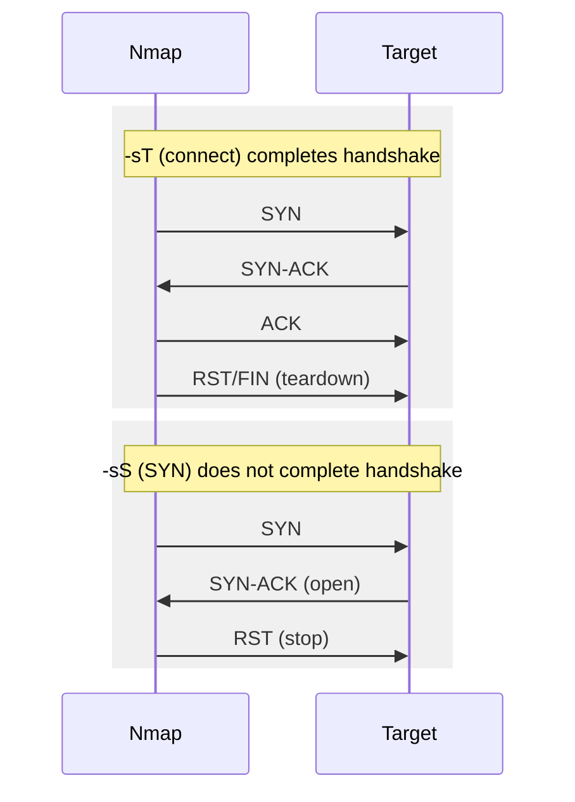

---

platform: tryhackme
room: "Nmap: The Basics"
slug: nmap-the-basics
path: notes/tryhackme/20-networking/nmap-the-basics.md
topic: 40-networking
domain: [network-scanning]
skills: [nmap, host-discovery, port-scanning, service-fingerprinting]
artifacts: [concept-notes, command-cookbook, pattern-cards]
status: done
date: 2026-02-14
---

## 0) Summary

* Nmap is a flexible network scanner for (1) discovering live hosts and (2) enumerating services on TCP/UDP ports.
* Core workflow: target specification → host discovery → port scanning → version/OS detection → output control.
* Practical knobs: scan type (`-sS/-sT/-sU`), host discovery (`-sn/-Pn`), port scope (`-F/-p`), timing (`-T*`, rate/parallelism), reporting (`-o*`, `-v/-d`).

## 1) Key Concepts (plain language)

### Target specification

* Range: `192.168.0.1-10`
* Subnet: `192.168.0.0/24`
* Hostname: `example.thm`

### Host discovery (Who is online?)

* `-sn` performs *host discovery only* (no port scan).
* “Local” network (directly connected via Ethernet/WiFi): discovery can leverage **ARP**.
* “Remote” network (one or more routers away): discovery relies on probes such as **ICMP** and **TCP** (and possibly others), since ARP does not traverse routers.
* `-sL` only lists targets (sanity check), does not scan.
* `-Pn` skips discovery assumptions and treats hosts as online (useful when discovery probes are blocked).

### Port scanning (Who is listening?)

* **TCP connect scan** `-sT`: completes the full TCP 3-way handshake; more likely to generate logs.
* **TCP SYN scan** `-sS`: sends SYN only; does not complete handshake; relatively stealthier.
* **UDP scan** `-sU`: probes UDP ports; closed ports may trigger ICMP “port unreachable” responses.

### Port scope

* Default: scans common ports (1000 by default).
* `-F`: fast mode (100 common ports).
* `-p<range>`: specify ranges

  * `-p10-1024`, `-p-25`, `-p1-1023` (well-known ports), `-p-` (all 1–65535).

### Version & OS detection (Extract more info)

* `-sV`: service/version detection (adds a VERSION-like dimension to results).
* `-O`: OS detection (best-effort; never perfectly accurate).
* `-A`: “aggressive” bundle (includes OS detection + version detection + additional features).

### Timing & performance

* Timing templates: `-T0..-T5` (paranoid → sneaky → polite → normal → aggressive → insane).
* Parallelism: `--min-parallelism <n>` / `--max-parallelism <n>`.
* Rate: `--min-rate <pps>` / `--max-rate <pps>`.
* Host time ceiling: `--host-timeout <time>`.

### Output control

* Verbosity: `-v`, `-vv`, or `-v<level>`.
* Debugging: `-d`, `-dd`, or `-d<level>` (max shown: `-d9`).
* Report formats:

  * `-oN <file>` normal
  * `-oX <file>` XML
  * `-oG <file>` grep-able
  * `-oA <basename>` all major formats

### Privileges matter

* Running with sudo/root unlocks more scan types.
* When run as a local (non-root) user, Nmap defaults to **TCP connect scan** (`-sT`) instead of SYN scan.

## 2) Pattern Cards (generalizable)

### Pattern: “Local vs Remote discovery”

* If you are scanning your own LAN, expect ARP-based discovery signals (MAC addresses are visible).
* If you are scanning beyond a router, do not expect ARP to work; discovery becomes probe-based.

### Pattern: “Discovery lies; ports still matter”

* If host discovery is blocked (ICMP filtered, etc.), Nmap may mark a host down.
* Use `-Pn` to force port scanning when you have external reasons to believe the host is up.

### Pattern: “Stealth vs fidelity trade-off”

* `-sS` tends to be quieter than `-sT` because connections are not established.
* `-A` and `-sV` extract more intelligence but increase noise and scan complexity.

### Pattern: “Scope first, then detail”

1. `-sn` to map live hosts.
2. `-F` or small `-p` ranges to get quick service hints.
3. Expand with `-p-` and add `-sV/-O` only when justified.

## 3) Command Cookbook (placeholders only)

> Replace `TARGET_SUBNET`, `TARGET_RANGE`, `TARGET_HOST`, and `MACHINE_IP` with your lab values.

### Target listing (no scan)

```bash
nmap -sL TARGET_SUBNET
```

### Host discovery only

```bash
sudo nmap -sn TARGET_SUBNET
sudo nmap -sn TARGET_RANGE
sudo nmap -sn TARGET_HOST
```

### TCP port scanning

```bash
# Connect scan
sudo nmap -sT MACHINE_IP

# SYN scan (stealth)
sudo nmap -sS MACHINE_IP
```

### UDP scanning

```bash
sudo nmap -sU MACHINE_IP
```

### Port scope control

```bash
sudo nmap -sS MACHINE_IP -F
sudo nmap -sS MACHINE_IP -p1-1023
sudo nmap -sS MACHINE_IP -p10-1024
sudo nmap -sS MACHINE_IP -p-
```

### Version / OS detection

```bash
sudo nmap -sS -sV MACHINE_IP
sudo nmap -sS -O  MACHINE_IP
sudo nmap -A      MACHINE_IP
```

### Force scanning “down” hosts

```bash
sudo nmap -Pn MACHINE_IP
```

### Timing templates

```bash
sudo nmap -sS MACHINE_IP -F -T0   # paranoid
sudo nmap -sS MACHINE_IP -F -T1   # sneaky
sudo nmap -sS MACHINE_IP -F -T2   # polite
sudo nmap -sS MACHINE_IP -F -T3   # normal
sudo nmap -sS MACHINE_IP -F -T4   # aggressive
sudo nmap -sS MACHINE_IP -F -T5   # insane
```

### Parallelism / rate / host timeout

```bash
sudo nmap -sS MACHINE_IP --min-parallelism 10 --max-parallelism 100
sudo nmap -sS MACHINE_IP --min-rate 100 --max-rate 1000
sudo nmap -sS MACHINE_IP --host-timeout 30s
```

### Output and troubleshooting

```bash
# Verbose / debug
sudo nmap -sS MACHINE_IP -v
sudo nmap -sS MACHINE_IP -d

# Save reports
sudo nmap -sS MACHINE_IP -oN report.nmap
sudo nmap -sS MACHINE_IP -oX report.xml
sudo nmap -sS MACHINE_IP -oG report.gnmap
sudo nmap -sS MACHINE_IP -oA report_basename
```

## 4) Minimal diagrams

### Scan pipeline (high level)


### TCP connect vs SYN scan (conceptual)



## 5) Check-yourself answers (from the task prompts)

* `192.168.0.1/27` spans `192.168.0.0–192.168.0.31`, so the last IP is `192.168.0.31`.
* Non-numeric name of `-T4`: `aggressive`.
* Enable debugging: `-d`.
* Local (non-root) default scan type: TCP connect scan (`-sT`).

## 6) Pitfalls

* False negatives in host discovery are common when ICMP/probes are filtered; `-Pn` exists for a reason.
* OS/version detection is probabilistic. Treat it as a hypothesis, not ground truth.
* Speed can trade reliability for noise. `-T5` is not “better”; it is just more aggressive.

## 7) Takeaways

* Nmap’s value is composability: scan type + scope + timing + output.
* If you can articulate your question (“who is online?”, “who is listening?”, “what version?”), Nmap has a dedicated switch cluster for it.

## 8) References

```text
Nmap Reference Guide (man pages):
- https://nmap.org/book/man-host-discovery.html
- https://nmap.org/book/man-port-scanning-techniques.html
- https://nmap.org/book/man-performance.html
- https://nmap.org/book/man-output.html
```

## Glossary (CN–EN)

* 主机发现 (Host discovery): 判断哪些主机在线
* 端口扫描 (Port scanning): 判断哪些端口在监听服务
* 服务指纹/版本探测 (Service/version detection): 推断端口上的服务类型与版本
* 操作系统探测 (OS detection): 推断目标 OS
* SYN 扫描 (SYN scan): 只发 SYN，不完成握手
* Connect 扫描 (TCP connect scan): 完整三次握手
* 时间模板 (Timing templates): 扫描速度预设（`-T0..-T5`）
* 报告格式 (Output formats): 正常/XML/grep/all（`-oN/-oX/-oG/-oA`）
