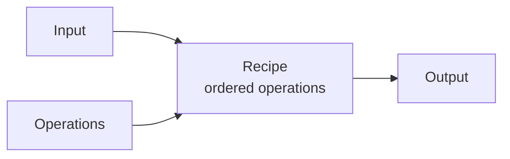

# CyberChef: The Basics

## Summary

* CyberChef is a browser-based data transformation toolkit. The core idea is simple: feed data into **Input**, chain **Operations** into a **Recipe**, then inspect **Output**.
* The tool is especially useful for DFIR, OSINT, malware triage, log analysis, indicator extraction, and quick decoding work.
* The safest mental model is: **objective first, recipe second**. Do not click random operations until you know what question you are trying to answer.
* Public-repo-friendly usage means writing down repeatable recipes, not just final answers.

## Key Concepts

### 1.1 What CyberChef is good at

CyberChef is best treated as a visual data-lab for:

* decoding and encoding
* extracting indicators from messy text
* converting timestamps and formats
* rapidly testing hypotheses about “gibberish” data
* chaining multiple transformations without writing code first

Typical use cases:

* pull IPs, URLs, domains, or emails from a blob of text
* decode Base64 / Base58 / Base85 / URL encoding
* convert UNIX timestamps into readable time
* test layered transformations such as `From Base64 -> Inflate -> From Hex`

### 1.2 The four interface areas

CyberChef is easiest to learn if you map the UI to four regions:

* **Operations**

  * searchable library of actions
* **Recipe**

  * ordered pipeline of actions to apply
* **Input**

  * raw text/file/folder you provide
* **Output**

  * processed result



### 1.3 The room’s four-step thought process

This room’s most useful lesson is not a specific operation. It is the workflow:

1. Set a clear objective.
2. Put the data into the input area.
3. Select plausible operations.
4. Check whether the output actually answers the question.

In practice this becomes:

```text
Question -> Input -> Candidate recipe -> Validate output -> Iterate
```

That is the correct way to use CyberChef during investigations.

### 1.4 Recipes

A **recipe** is an ordered list of operations.

Important properties:

* order matters
* one wrong step can make all later output meaningless
* saved recipes are reusable analytical procedures, not just convenience shortcuts

Good practice for GitHub notes:

* document the recipe in plain English
* include the operation names and critical parameters
* state what “success” looks like

### 2. Core Operation Families

#### 2.1 Extractors

High-value beginner operations:

* `Extract IP addresses`
* `Extract URLs`
* `Extract email addresses`
* `Extract domains`

Use these when the input is messy narrative text, logs, or pasted threat intel.

Analyst mindset:

* extraction is often the first pass, not the final answer
* once indicators are extracted, validate and normalize them elsewhere if needed

#### 2.2 Date / Time

Most relevant beginner operations:

* `From UNIX Timestamp`
* `To UNIX Timestamp`

Why this matters:

* forensic work constantly moves between human-readable timestamps and machine-friendly epoch formats
* timeline work becomes easier if you normalize time representation early

Rule of thumb:

* do not trust your intuition on time zones, offsets, or timestamp length
* convert explicitly and verify the resulting date/time

#### 2.3 Data Format / Encoding

High-frequency operations from this room:

* `From Base64`
* `URL Decode`
* `From Base85`
* `From Base58`
* `To Base62`

Security note:

* encoding is not encryption
* Base64, URL encoding, and similar formats are representation transforms, not confidentiality controls

#### 2.4 Base64 as the baseline mental model

Base64 is worth understanding because it appears everywhere:

* web tokens
* email content
* API blobs
* malware staging
* obfuscated scripts

Minimal logic:

* binary data is regrouped and mapped to a limited text alphabet
* result becomes easier to transport in text-oriented systems

What matters operationally:

* if a string looks plausibly Base64, test it
* if output is still structured/encoded data, continue peeling layers

## Pattern Cards

### 3.1 “Unknown gibberish” triage card

When you find an opaque string:

* check whether it resembles a known encoding family
* try the least destructive/common operations first:

  * `From Base64`
  * `URL Decode`
  * `From Hex`
  * `ROT13`
  * `From Base58 / Base85` when patterns fit
* validate whether output becomes more structured, readable, or semantically meaningful

Do not assume the first readable output is the final truth.

### 3.2 Indicator extraction card

If the input is a mixed text blob:

* first run extractors
* then deduplicate / normalize externally if needed
* then pivot on the extracted indicators

Typical sequence:

```text
Raw text -> Extract IP addresses / URLs / emails -> Review -> Enrich elsewhere
```

### 3.3 Timestamp conversion card

If a value may be a timestamp:

* determine likely format first
* test conversion
* verify whether the resulting date is plausible in context

A wrong timestamp interpretation can quietly poison the rest of an investigation.

### 3.4 Safe analytical workflow card

CyberChef is excellent for:

* prototyping transformations
* validating assumptions quickly
* documenting recipe logic

CyberChef is not ideal for:

* very large-scale batch pipelines
* full automation at enterprise scale
* treating browser-side processing as if it were evidence-safe by default

## 4. Public GitHub Repo Style Notes

For public notes, write CyberChef usage like a reproducible mini-playbook:

* **Objective**

  * what question are we trying to answer?
* **Input type**

  * text blob, IOC list, encoded string, timestamp, URL
* **Recipe**

  * exact operation order
* **Validation**

  * how do we know the output is correct?
* **Next step**

  * extract, enrich, decode further, or export

Good public-safe example:

```text
Objective: Extract indicators from a mixed-text sample.
Recipe: Extract IP addresses -> Extract URLs -> Extract email addresses.
Validation: Confirm outputs match expected formats and context.
Next step: Export indicators for enrichment.
```

Bad example:

```text
I clicked random operations until something readable came out.
```

## 5. Command / Recipe Cookbook

### 5.1 Simple extraction workflow

```text
Recipe:
1. Extract IP addresses
2. Extract URLs
3. Extract email addresses
```

Use case:

* pasted reports
* phishing lures
* malware notes
* threat intel blobs

### 5.2 Timestamp workflow

```text
Recipe A:
1. From UNIX Timestamp

Recipe B:
1. To UNIX Timestamp
```

Use case:

* timeline normalization
* converting logs into human-readable form

### 5.3 Encoding workflow

```text
Recipe:
1. From Base64
2. URL Decode
```

Use when:

* content looks layered
* a decoded result still contains escaped URL characters

### 5.4 URL normalization workflow

```text
Recipe:
1. URL Decode
```

Use when:

* percent-encoded strings obscure the original URL
* you need readable values before IOC review

### 5.5 Validation checklist

After every recipe, ask:

* Is the output syntactically valid?
* Does it make semantic sense?
* Does it match the objective I started with?
* Do I need another transformation layer?

## 6. Practical Exercise Notes

The provided task file is a good example of why CyberChef is useful: a normal-looking text blob can contain embedded indicators and values that are easy to miss by eye.

A sensible first-pass workflow is:

```text
Input sample -> Extract IP addresses -> Extract email addresses -> Extract URLs/domains -> Review manually
```

Then move into format conversion tasks such as:

* decimal to binary
* URL encoding / decoding
* UNIX timestamp conversion
* Base64 / Base85 decoding

This is the right separation:

* **extract first** when you suspect mixed content
* **decode first** when you suspect opaque encoding

## 7. Pitfalls

* Using CyberChef without a defined objective.
* Applying too many operations at once and losing track of what changed the data.
* Treating a readable output as automatically correct.
* Forgetting that Base64 and URL encoding are not security mechanisms.
* Relying on CyberChef alone for large-scale or evidence-sensitive workflows.

## Takeaways

* CyberChef is strongest as an interactive hypothesis-testing environment for data transformation.
* The real skill is not memorizing operations; it is recognizing which category of operation is plausible for the data in front of you.
* A clean recipe plus a short explanation is exactly the kind of artifact that belongs in a public GitHub repo.

## References

* GCHQ CyberChef web app and official GitHub repository
* CyberChef official wiki pages
* CyberChef release page
* Related CyberChef recipe collections for community examples

## 10. Appendix — Common CyberChef Recipes for DFIR / THM / Malware Triage

This appendix is meant to be copied into future notes as a quick-start set of reusable patterns.

### 10.1 IOC extraction from a mixed text blob

Objective:

* pull obvious indicators from pasted notes, phishing lures, copied chat logs, or incident summaries

Recipe:

1. `Extract IP addresses`
2. `Extract URLs`
3. `Extract email addresses`
4. `Extract domains` (optional, if you want domain-only output)

Validation:

* check whether extracted items match expected syntax and context
* remove obvious false positives before enrichment

### 10.2 Quick “gibberish string” triage

Objective:

* decide whether an opaque string is likely encoded and worth further decoding

Recipe candidates to try in sequence:

1. `Magic`
2. `From Base64`
3. `URL Decode`
4. `From Hex`
5. `ROT13`
6. `From Base58` / `From Base85` when patterns fit

Validation:

* stop only when the output becomes semantically meaningful, not merely readable

### 10.3 URL cleanup and de-tracking

Objective:

* turn messy percent-encoded or redirect-style links into readable values

Recipe:

1. `URL Decode`
2. `Regular expression` or `Extract URLs` if the input contains multiple links

Validation:

* confirm that the decoded result is a plausible URL and not just partially decoded noise

### 10.4 Base64 blob review

Objective:

* quickly inspect whether a Base64 string contains text, script, or another encoded layer

Recipe:

1. `From Base64`
2. `Magic` or `Detect File Type` (if the output is binary-looking)
3. `To Hexdump` (optional for binary inspection)

Validation:

* determine whether the decoded material is plain text, compressed data, executable content, or still another wrapper

### 10.5 Timestamp normalization for timeline work

Objective:

* move between human-readable time and UNIX epoch cleanly

Recipe A:

1. `From UNIX Timestamp`

Recipe B:

1. `To UNIX Timestamp`

Validation:

* confirm the timezone assumptions and whether the resulting date fits the event context

### 10.6 Safe beginner workflow for layered transformations

Objective:

* avoid losing track when multiple encodings are nested

Recipe discipline:

1. clone or save the current recipe
2. add one operation at a time
3. verify output after each step
4. name the layer you think you removed (for example: “base64 removed”, “URL encoding removed”)

Why this matters:

* layered decoding errors are easy to make and hard to spot if you change too much at once

### 10.7 Public GitHub documentation format for a recipe

Use this template:

```text
Objective: What question am I answering?
Input: What kind of data did I start with?
Recipe: Operation 1 -> Operation 2 -> Operation 3
Validation: How did I confirm the result makes sense?
Next step: Extract / enrich / decode further / export
```

### 10.8 Anti-patterns

Avoid these habits:

* adding many unrelated operations blindly
* treating the first readable output as final truth
* using CyberChef as if it were a secrecy-preserving environment
* documenting only the answer and not the recipe that produced it

## 11. Appendix — Recipe Patterns by Scenario

This section organizes recipe ideas by investigative scenario rather than by operation category.

### 11.1 Phishing email triage

Objective:

* pull indicators and quickly normalize suspicious content from a lure or copied email body

Suggested recipe patterns:

* `Extract email addresses`
* `Extract URLs`
* `URL Decode` (if links are percent-encoded)
* `Extract domains`

What to look for:

* sender domains that do not match the claimed brand
* redirect-style URLs
* encoded tracking links
* mismatches between visible text and actual destination

### 11.2 PowerShell blob triage

Objective:

* inspect suspicious one-liners or encoded command blobs commonly seen in Windows investigations

Suggested recipe patterns:

* `Magic`
* `From Base64`
* `To Hexdump` (optional for binary-looking output)
* `Regular expression` or `Extract URLs` / `Extract IP addresses` after decoding

What to look for:

* second-stage URLs
* IP addresses
* suspicious command fragments
* evidence that another layer of compression/encoding is still present

### 11.3 Malware string cleanup

Objective:

* turn mixed obfuscated text into something reviewable without writing code first

Suggested recipe patterns:

* `Magic`
* `From Base64` / `From Hex` / `URL Decode` as applicable
* `Extract URLs`
* `Extract IP addresses`
* `Extract domains`

What to look for:

* C2 indicators
* hard-coded paths
* suspicious user agents
* embedded configuration material

### 11.4 IOC cleanup and export

Objective:

* normalize rough indicators before enrichment in another tool

Suggested recipe patterns:

* `Extract IP addresses`
* `Extract URLs`
* `Extract email addresses`
* `Extract domains`

Output discipline:

* review false positives manually
* keep raw source text separately from extracted results
* export cleaned indicators as an intermediate artifact, not as final truth

### 11.5 Log timestamp conversion

Objective:

* convert timestamps quickly during triage or timeline building

Suggested recipe patterns:

* `From UNIX Timestamp`
* `To UNIX Timestamp`

What to verify:

* timezone assumptions
* whether the source uses seconds vs another unit
* whether the converted time actually fits the event sequence

### 11.6 URL and redirect cleanup

Objective:

* make wrapped, redirected, or encoded links human-readable

Suggested recipe patterns:

* `URL Decode`
* `Extract URLs`
* `Regular expression` when built-in extraction is too broad

What to look for:

* nested redirect parameters
* destination domain vs displayed domain mismatch
* embedded campaign identifiers or tokens

### 11.7 Multi-layer encoded string workflow

Objective:

* keep control when data has several nested transforms

Suggested workflow:

1. run `Magic`
2. apply one plausible decode step
3. validate output
4. save or note the intermediate layer
5. repeat only if the new layer still looks encoded

Why this works:

* CyberChef’s strength is iterative, visible transformation. Preserve that advantage instead of applying five operations blindly.

### 11.8 Browser-safety note

CyberChef is client-side and browser-based, which is part of why it is convenient. But for sensitive investigations:

* use the official build when possible
* be careful with unofficial hosted copies
* remember that very large datasets or sensitive evidence may be better handled in local, controlled workflows

## 12. Further Improvement Ideas for This Note

If this note becomes part of a larger DFIR/tooling repo, useful follow-on add-ons would be:

* a small table mapping common “gibberish string” patterns to likely encodings
* a separate appendix for regex-heavy recipes
* a private companion note with solved THM task answers, while keeping the public repo methodology-only

## CN–EN Glossary (mini)

* CyberChef: 网络安全数据变换工具
* Operation: 操作
* Recipe: 配方 / 操作链
* Input: 输入
* Output: 输出
* Extractor: 提取器
* Base64 / Base58 / Base85: 常见文本编码表示
* URL Decode: URL 解码
* UNIX Timestamp: Unix 时间戳
* Indicator: 指标 / IOC
* Data transformation: 数据变换
* Normalization: 规范化
* Validation: 验证
