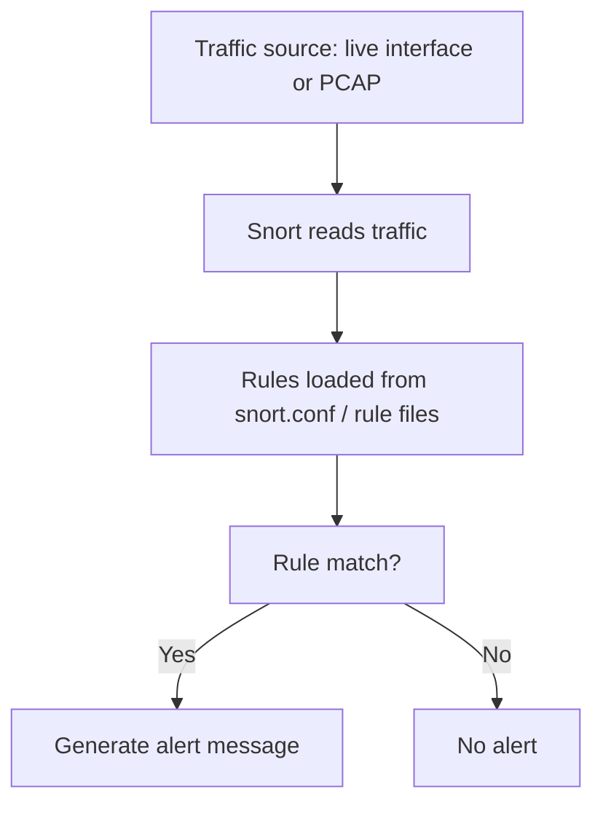

# IDS Fundamentals

## Summary

* An **Intrusion Detection System (IDS)** is a detection technology that watches activity and raises alerts when suspicious behavior matches signatures or abnormal patterns.
* IDS is different from a firewall in both **position** and **role**: a firewall mainly controls traffic flow, while an IDS mainly **observes and alerts** after or during traffic movement.
* The two major deployment models are **HIDS** for host-level visibility and **NIDS** for network-wide visibility.
* The major detection approaches are **signature-based**, **anomaly-based**, and **hybrid**.
* This room uses **Snort** as the practical example. Snort is a widely used open-source detection tool and supports multiple operating modes.
* The practical heart of the room is understanding Snort directory layout, rule anatomy, how to add local rules, and how to run Snort against live traffic or a PCAP file.

---

## 1. What an IDS Actually Does

The room starts with the right distinction: a firewall is not enough by itself.

A connection can look legitimate at the perimeter and still be abused afterward.

That is the gap IDS tries to address.

### 1.1 Core function

An IDS:

* monitors traffic or host activity,
* compares what it sees against rules, baselines, or both,
* generates alerts for analysts.

### 1.2 Important negative definition

```text
IDS detects.
IDS does not inherently prevent.
```

That is why the answer to the room's first question is **Nay**.

If a tool both detects and automatically blocks, you are moving toward **IPS** or related prevention-capable controls.

---

## 2. Mental Model - Firewall vs IDS

A simple way to remember the difference:


### 2.1 Practical distinction

* **Firewall**: gatekeeper and traffic control
* **IDS**: surveillance and detection layer

This matches Snort's official framing that it can inspect traffic and generate alerts, while inline deployments are what give it prevention-like behavior.

---

## 3. IDS Deployment Models

### 3.1 HIDS - Host Intrusion Detection System

Installed on individual hosts.

Strengths:

* detailed host visibility,
* strong endpoint-level context,
* ability to observe local artifacts such as processes, file changes, registry changes, and local authentication events.

Weaknesses:

* host-by-host deployment and management overhead,
* resource cost at scale,
* weaker network-wide central perspective unless combined with aggregation tooling.

### 3.2 NIDS - Network Intrusion Detection System

Positioned to watch traffic across segments or whole networks.

Strengths:

* centralized monitoring,
* broad visibility across hosts,
* strong fit for network traffic analysis and shared choke points.

Weaknesses:

* less detailed host-internal context,
* encrypted traffic can reduce visibility,
* placement matters a lot.

Room takeaway:

* The type of IDS deployed to detect threats throughout the network is **NIDS**.

---

## 4. IDS Detection Models

This is the second major classification axis.

### 4.1 Signature-Based IDS

Matches traffic or events against known bad patterns.

Strengths:

* fast,
* efficient for known attacks,
* easier to reason about operationally.

Weaknesses:

* weak against true zero-days,
* only as strong as the rule or signature set.

### 4.2 Anomaly-Based IDS

Builds or uses a baseline of normal behavior and flags deviations.

Strengths:

* can catch previously unseen patterns,
* useful against some zero-day or low-signature scenarios.

Weaknesses:

* more false positives,
* depends heavily on good baselining and tuning,
* can be computationally heavier.

### 4.3 Hybrid IDS

Combines signature-based and anomaly-based methods.

This is the answer to the question about which IDS leverages both detection techniques.

#### Practical lesson

```text
Signature-based = fast and precise for known bad
Anomaly-based = broader but noisier
Hybrid = trade-off combination
```

---

## 5. Snort as the Room's Example IDS

Snort is the room's practical vehicle.

The room describes it as a popular open-source IDS, and that aligns with Snort's own official material. Snort's official FAQ describes it as an open-source network intrusion prevention system capable of real-time traffic analysis and packet logging, and its FAQ also describes its classic uses as packet sniffer, packet logger, and full network intrusion prevention deployment modes.

### 5.1 Why Snort matters

Snort is useful pedagogically because it makes detection logic visible.

You do not just "turn on IDS."

You see:

* where rules live,
* how they are written,
* how alerts are generated,
* how PCAP-driven review works.

---

## 6. Snort Modes

The room presents three operational modes.

### 6.1 Packet Sniffer Mode

Reads and displays packets without doing full IDS-style analysis.

Good for:

* troubleshooting,
* visibility,
* quick traffic observation.

### 6.2 Packet Logging Mode

Captures traffic to files such as PCAP for later analysis.

Good for:

* incident review,
* forensic workflow,
* offline inspection.

Room answer:

* The mode that helps log network traffic to a PCAP file is **packet logging mode**.

### 6.3 NIDS Mode

The main detection mode.

Snort watches traffic in real time, evaluates rules, and generates alerts on matches.

Room answer:

* The primary mode of Snort in this room is **NIDS mode**.

---

## 7. Snort Directory Layout

The room identifies `/etc/snort` as the main Snort directory in the lab environment.

That is consistent with traditional Linux packaging layouts for Snort 2.x-style installs, where configuration and rules are commonly stored under `/etc/snort`.

### 7.1 Important files and directories from the room

* `/etc/snort/snort.conf`
* `/etc/snort/rules/`
* `/etc/snort/rules/local.rules`

### 7.2 `snort.conf`

Main configuration file.

Used for:

* network variables such as `HOME_NET`,
* loading rule files,
* tuning behavior.

### 7.3 `rules/`

Directory containing rule files.

### 7.4 `local.rules`

Custom rule file used for local additions.

Room answer:

* The file that contains custom rules is **local.rules**.

---

## 8. Snort Rule Anatomy

This is the most important technical part of the room.

The room's sample structure is conceptually correct, and Snort's official rule-writing guide confirms that a rule header defines the action, protocol, network addresses, port numbers, and direction, while the rule body contains message and matching logic.

### 8.1 Example rule from the room

```text
alert icmp any any -> $HOME_NET any (msg:"Ping Detected"; sid:10001; rev:1;)
```

### 8.2 Header fields

Action example:

* `alert`

Snort's official rule actions include `alert`, `block`, `drop`, `log`, and `pass`.

Protocol example:

* `icmp`

Snort's official documentation lists `ip`, `icmp`, `tcp`, and `udp` as supported rule-header protocol values.

Source IP and source port example:

* `any any`

Direction operator example:

* `->`

This means the left side is the source and the right side is the destination. Snort's rule guide documents `->` and `<>` as valid direction operators.

Destination IP and destination port example:

* `$HOME_NET any`

### 8.3 Rule options and metadata

These live inside the parentheses.

`msg`:

* human-readable alert message.

`sid`:

* unique signature ID.

`rev`:

* revision number.

Room answers:

* The field indicating the revision number is **rev**.
* The protocol used in the sample rule is **ICMP**.

---

## 9. Local Rules Used in the Room

From the provided room material, the `local.rules` file contains three simple examples:

```text
alert icmp any any -> $HOME_NET any (msg:"Ping Detected"; sid:1000001; rev:1;)
alert tcp any any -> $HOME_NET 22 (msg:"SSH Connection Detected"; sid:1000002; rev:1;)
alert icmp any any -> 127.0.0.1 any (msg:"Loopback Ping Detected"; sid:100003; rev:1;)
```

These are useful because they show three different detection ideas:

* any ping to the home network,
* any TCP traffic to destination port 22,
* loopback ping traffic specifically.

### 9.1 Observation

These are intentionally simple pedagogical rules.

They are not tuned production rules.

That is good for learning.

---

## 10. Running Snort Against Live Traffic

The room uses a live command similar to:

```bash
sudo snort -q -l /var/log/snort -i lo -A console -c /etc/snort/snort.conf
```

### 10.1 Meaning of the important switches in the room context

* `-q` for quieter operation,
* `-l /var/log/snort` for the log directory,
* `-i lo` for the interface, using loopback in the example,
* `-A console` to show alerts on the console,
* `-c /etc/snort/snort.conf` to specify the config file.

The room then validates the loopback ICMP rule by pinging `127.0.0.1`.

That is a good minimal detection test.

---

## 11. Running Snort on a PCAP File

This is where the room becomes practically useful for DFIR-flavored workflows.

The room uses a command pattern like:

```bash
sudo snort -q -l /var/log/snort -r Task.pcap -A console -c /etc/snort/snort.conf
```

### 11.1 Key difference

* live traffic mode uses `-i <interface>`
* historical traffic mode uses `-r <pcap file>`

This matches Snort's official documentation that it can inspect traffic from packet captures as well as live interfaces.

### 11.2 Practical meaning

This is not only "IDS in real time."

It is also:

* offline validation,
* historical review,
* forensic triage.

---

## 12. Practical Lab Notes - Room Answers

The room's practical lab asks you to analyze `/etc/snort/Intro_to_IDS.pcap` using the local rules.

From the room output shown in the provided material, the console alerts clearly show repeated matches for:

* `SSH Connection Detected`
* `Ping Detected`

### 12.1 IP address that tried to connect using SSH

The SSH alert lines show traffic from:

* **10.11.90.211**

to:

* `10.10.161.151:22`

So the answer is:

* **10.11.90.211**

### 12.2 Other rule message besides SSH

Another alert message shown is:

* **Ping Detected**

### 12.3 SID of the SSH rule

The output shows:

```text
[1:1000002:1] SSH Connection Detected
```

So the SSH rule SID is:

* **1000002**

---

## 13. Pattern Cards

### Pattern Card 1 - IDS is not IPS

**Problem**
: beginners often think "detect" implies "block."

**Better view**
: IDS raises alerts; IPS or inline controls enforce blocking.

**Reason**
: detection and prevention are related but distinct functions.

### Pattern Card 2 - NIDS sees broad traffic, HIDS sees host detail

**Problem**
: learners compare them as if one replaces the other.

**Better view**
: they answer different visibility questions.

**Reason**
: network-level breadth and host-level depth are complementary.

### Pattern Card 3 - Signature rules are only as strong as their coverage

**Problem**
: people treat signature IDS as universally sufficient.

**Better view**
: great for known bad, weak for unseen bad.

**Reason**
: no prior pattern means no direct signature match.

### Pattern Card 4 - Rule anatomy is half the skill

**Problem**
: people memorize commands but not rule logic.

**Better view**
: if you understand action, protocol, IPs, ports, direction, `msg`, `sid`, and `rev`, you can read and write basic Snort rules.

**Reason**
: the rule is the detection logic.

### Pattern Card 5 - PCAP mode turns IDS into a forensic assistant

**Problem**
: learners think Snort only matters on live networks.

**Better view**
: replaying PCAP files is extremely useful for retrospective validation and incident analysis.

**Reason**
: many investigations begin with captured traffic, not live access.

---

## 14. Mini Workflow



That is the fundamental detection loop.

---

## 15. Command Cookbook

> Lab-safe and learning-oriented. Use only on authorized systems and datasets.

### List Snort main directory

```bash
ls /etc/snort
```

### Edit local rules

```bash
sudo nano /etc/snort/rules/local.rules
```

### Example local rule

```text
alert icmp any any -> 127.0.0.1 any (msg:"Loopback Ping Detected"; sid:100003; rev:1;)
```

### Run Snort on live interface with console alerts

```bash
sudo snort -q -l /var/log/snort -i lo -A console -c /etc/snort/snort.conf
```

### Generate loopback ICMP traffic

```bash
ping 127.0.0.1
```

### Run Snort on a PCAP file

```bash
sudo snort -q -l /var/log/snort -r /etc/snort/Intro_to_IDS.pcap -A console -c /etc/snort/snort.conf
```

### Read the key logic inside a simple rule

```text
alert tcp any any -> $HOME_NET 22 (msg:"SSH Connection Detected"; sid:1000002; rev:1;)
```

Interpretation:

* action: `alert`
* protocol: `tcp`
* source: `any any`
* direction: `->`
* destination: `$HOME_NET 22`
* message: `SSH Connection Detected`
* sid: `1000002`
* revision: `1`

---

## 16. Common Pitfalls

### 16.1 Confusing detection with blocking

If the room says IDS, do not assume automatic prevention.

### 16.2 Writing overly broad rules without realizing it

`any any -> $HOME_NET any` is useful for demos, but very noisy in real networks.

### 16.3 Forgetting to preserve existing local rules

The room warns not to delete earlier rules because later tasks depend on them.

### 16.4 Using the wrong interface

Loopback examples need the loopback interface. Live network detection needs the correct actual interface.

### 16.5 Treating SIDs casually

A SID is not decoration. It is the unique rule identifier and is essential for tracking, tuning, and investigation.

---

## 17. Takeaways

* IDS exists to detect suspicious or malicious activity that a perimeter firewall may not stop or may not even notice as malicious at connection time.
* HIDS and NIDS solve different visibility problems.
* Signature-based IDS is strong for known threats but weak for unseen threats; anomaly-based and hybrid approaches extend coverage with trade-offs.
* Snort is an excellent learning platform because it exposes detection logic through readable rules.
* If you understand Snort rule anatomy and PCAP replay workflow, you already have a solid beginner foundation in IDS operations.

---

## 18. References

* TryHackMe room content: *IDS Fundamentals*
* Snort FAQ: What is Snort?
* Snort FAQ: What can I do with Snort?
* Snort 3 Rule Writing Guide: The Basics
* Snort 3 Rule Writing Guide: Rule Headers
* Snort 3 Rule Writing Guide: Rule Actions
* Snort 3 Rule Writing Guide: Protocols
* Snort 3 Rule Writing Guide: Direction Operators
* Snort 3 Rule Writing Guide: `sid`
* Snort 3 Rule Writing Guide: `rev`
* Snort 3 Rule Writing Guide: Reading Traffic

---

## 19. CN-EN Glossary

* IDS (Intrusion Detection System) - 入侵检测系统
* HIDS - 主机型入侵检测系统
* NIDS - 网络型入侵检测系统
* Signature-Based Detection - 基于特征 / 签名的检测
* Anomaly-Based Detection - 基于异常的检测
* Hybrid IDS - 混合型 IDS
* Snort - 开源 IDS / IPS 工具
* Rule Header - 规则头
* Rule Options - 规则选项
* Action - 动作
* Protocol - 协议
* Source IP / Port - 源 IP / 源端口
* Destination IP / Port - 目标 IP / 目标端口
* Direction Operator - 方向操作符
* `msg` - 告警消息字段
* `sid` - 签名 ID
* `rev` - 规则修订号
* PCAP - 报文捕获文件格式
* Loopback - 回环地址 / 本地回环接口
* `HOME_NET` - Snort 中表示受保护本地网络的变量
