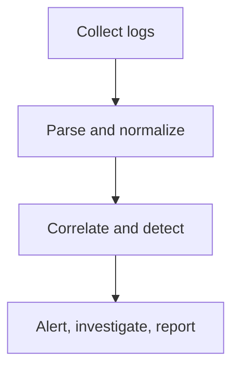
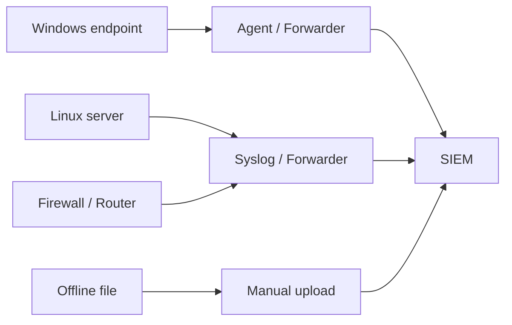
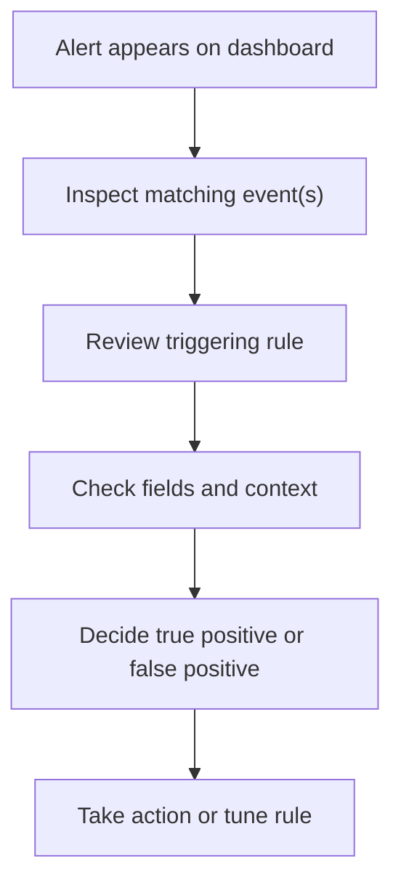
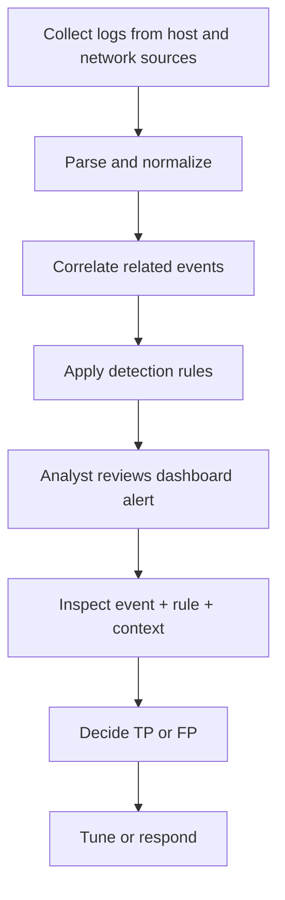

# Introduction to SIEM

## Summary

* A **SIEM** (Security Information and Event Management) platform collects security-relevant logs from many sources, standardizes them, correlates them, and helps analysts detect and investigate threats.
* The room is built around one core pain point: **logs exist everywhere, but answers do not** unless the data is centralized, normalized, searchable, and correlated.
* Log sources are broadly split into **host-centric** and **network-centric** categories. This distinction matters because detection logic often depends on combining both.
* SIEM value comes from a few core capabilities: **centralized log collection, parsing/normalization, correlation, rule-based alerting, and dashboards/reporting**.
* Detection rules are usually just logical conditions over normalized fields. The sophistication comes from choosing the right fields, thresholds, and correlations.
* The lab section reinforces an analyst workflow: **observe dashboard -> inspect alert -> review triggering rule -> decide true/false positive -> take action**.

## Context

This room is a foundational blue-team room. It is not trying to turn you into a Splunk engineer or a detection engineer in one sitting. It is trying to give you a correct mental model for why SIEM exists and how analysts use it during daily monitoring and investigations.

A useful way to frame the room is:

* **Task 2** explains the problem.
* **Task 3** explains why SIEM solves that problem.
* **Task 4** explains where the data comes from and how it gets in.
* **Task 5** explains how rules become alerts.
* **Task 6** simulates the analyst workflow around a triggered alert.

## Logs Everywhere, Answers Nowhere

### 2.1 Why raw logs are not enough

In a real network, many systems generate security-relevant records at the same time:

* endpoints,
* servers,
* routers,
* firewalls,
* VPN concentrators,
* web servers,
* authentication systems.

The room's key observation is correct: **the problem is not lack of data; the problem is operational overload**.

#### Main challenges

* too many log sources,
* no centralization,
* limited context in one isolated event,
* manual analysis does not scale,
* different log formats increase analyst burden.

#### Analyst lesson

```text
A single event may be harmless.
A correlated sequence may be an intrusion story.
```

That sentence is basically the reason SIEM exists.

## Log Source Categories

### 3.1 Host-centric log sources

These are logs generated by activity **on or within a host**.

Examples:

* file access,
* logon attempts,
* process execution,
* registry changes,
* PowerShell execution,
* local security events.

Common host sources:

* Windows endpoints,
* Linux endpoints,
* servers.

### 3.2 Network-centric log sources

These are logs generated by **communication between systems or through network controls**.

Examples:

* SSH connections,
* FTP access,
* web traffic,
* VPN activity,
* network file sharing,
* firewall / IDS / router records.

Common network sources:

* firewalls,
* IDS/IPS,
* routers,
* VPN devices,
* proxies,
* web gateways.

### 3.3 Why the distinction matters

A mature detection almost always benefits from both perspectives.

Example:

* host log says `powershell.exe` ran,
* VPN log says the user connected from a new IP,
* file share log says sensitive documents were accessed,
* network log says a large outbound connection followed.

Individually: maybe normal.
Together: suspicious.

## What SIEM Is

A SIEM platform centralizes security-relevant event data and makes it useful.

At a high level, SIEM performs four major functions:



That is the room in one sentence.

### 4.1 Core capabilities

#### Centralized log collection

Bring logs from many systems into one platform.

#### Parsing and normalization

Break raw events into fields and convert unlike formats into a more consistent representation.

#### Correlation

Link multiple events together to identify patterns rather than isolated records.

#### Real-time alerting

Trigger detections when rule conditions are met.

#### Dashboards and reporting

Provide summarized visibility and operational context.

## Parsing, Normalization, and Correlation

These three words are easy to blur together, so they deserve explicit separation.

### 5.1 Parsing

Parsing means extracting structured fields from raw log text.

Example:

From a raw Windows event or web log, parse out:

* timestamp,
* user,
* hostname,
* process name,
* IP address,
* event code,
* destination port.

### 5.2 Normalization

Normalization means mapping different raw log formats into a more consistent schema or field model.

Why it matters:

* a Windows event and a Linux auth log do not look the same,
* but the analyst still wants to search things like `user`, `host`, `process`, `src_ip`, `event_id`, or similar logical fields.

### 5.3 Correlation

Correlation links related events across sources and time.

Example pattern from the room:

1. user logs in via VPN from a new IP,
2. user accesses files,
3. PowerShell runs,
4. outbound connection follows.

That sequence is much more meaningful than any one event alone.

## Log Sources and Ingestion

### 6.1 Windows logs

Windows produces event logs that analysts commonly inspect through **Event Viewer**.

The room's point is straightforward and important:

* Windows activity is already richly logged,
* forwarding those logs into a SIEM makes them operationally useful at scale.

### 6.2 Linux logs

Common Linux logging locations mentioned in the room include:

* `/var/log/httpd`
* `/var/log/cron`
* `/var/log/auth.log`
* `/var/log/secure`
* `/var/log/kern`

These locations vary somewhat by distro and service, but the room's examples are operationally correct as common reference points.

### 6.3 Web server logs

Web servers are high-value log sources because they capture request patterns, status codes, user agents, and access behavior that can indicate:

* exploitation attempts,
* scanning,
* brute force,
* suspicious automation,
* webshell usage,
* application abuse.

## Common Ingestion Methods

The room introduces several common ways logs enter a SIEM.

### 7.1 Agent / forwarder

A lightweight component on the endpoint collects and forwards data to the SIEM.

This is common because it is scalable and controllable.

### 7.2 Syslog

A standard network logging protocol often used by Linux systems, network appliances, firewalls, and many infrastructure products.

### 7.3 Manual upload

Useful for offline or ad hoc analysis, incident retrospectives, and one-off datasets.

### 7.4 Port-forwarding / listening input

The SIEM or data collector listens on a port and the log source forwards data to it.

### 7.5 Practical ingestion diagram



## Why Dashboards Matter

Dashboards are not decoration. They compress huge amounts of data into a human-readable operational view.

Typical dashboard content:

* alert highlights,
* event ingestion volume,
* failed logons,
* top hosts,
* top processes,
* top destinations,
* rule triggers,
* health notifications.

### Dashboard lesson

Dashboards answer the question:

```text
Where should I look first?
```

That is their real job.

## Detection Rules

A SIEM rule is usually a logical condition over fields.

The room gives several examples that are exactly the kind of beginner-friendly logic analysts should understand early.

### 9.1 Rule structure

A simple rule usually needs:

* log source or index,
* one or more field-value conditions,
* sometimes a threshold or time window,
* an action when matched.

Example structure:

```text
IF source = X AND event_id = Y AND field Z contains value V
THEN trigger alert A
```

### 9.2 Example use cases from the room

#### Event log cleared

* source: Windows event logs
* event id: 104
* meaning: event logs were cleared

#### `whoami` execution detection

* source: Windows event logs
* event id: 4688 (process creation)
* process name contains `whoami`

#### Threshold example

* 5 failed logins in 10 seconds

These examples matter because they show the difference between:

* one exact event match,
* and a more behavioral/time-window rule.

## Alert Investigation Workflow

The room's investigation process is simple and correct.



### 10.1 True positive vs false positive

#### False positive

The alert fired, but the activity is benign or expected.

Typical response:

* document context,
* tune rule logic,
* reduce future alert noise.

#### True positive

The alert correctly identified suspicious or malicious activity.

Typical response:

* escalate investigation,
* contact asset owner if needed,
* isolate affected host,
* block suspicious IPs,
* preserve evidence.

## Lab Notes

The provided screenshots reveal enough to reconstruct the core logic of the lab, even if not every field is fully readable.

### 11.1 Confirmed findings visible in the screenshots

#### Suspicious process

* `cudominer.exe`

This is visible in the dashboard table and is clearly the highlighted suspicious process.

#### Rule logic shown

The screenshot displays a rule equivalent to:

```text
Alert "Potential CryptoMiner Activity"
If EventID = 4688 AND Log_Source = WindowsEventLogs AND ProcessName = (*miner* OR *crypt*)
```

#### Matching term visible from the process name

From `cudominer.exe`, the visible matching keyword is most plausibly:

* `miner`

because it directly matches the rule pattern `*miner*`.

#### Best event classification

The screenshots indicate the correct disposition is:

* **True Positive**

#### Action choice

The screenshot indicates the correct action is:

* **True positive and isolate the host**

### 11.2 What the lab is really teaching

This is not just "spot the bad process."

It is teaching the workflow:

1. observe a suspicious dashboard element,
2. find the raw event,
3. understand the rule,
4. validate whether the event meaningfully matches the rule,
5. choose a response action.

That is actual analyst thinking, just compressed into a beginner lab.

### 11.3 Fields not fully legible from the provided screenshots

The screenshots provided here do not fully expose every field cleanly enough to recover the suspect username and hostname with high confidence. Those two values should be verified directly in the live lab table view if you want a full answer key.

## Pattern Cards

### Pattern Card 1 - Isolated Logs Are Weak; Correlated Logs Are Narrative

**Problem**
: one event often looks normal.

**Better view**
: events become meaningful when linked by time, user, host, and behavior.

**Reason**
: SIEM's real power is narrative reconstruction, not raw storage.

### Pattern Card 2 - Parsing Enables Correlation

**Problem**
: raw logs are too inconsistent to compare directly.

**Better view**
: parse them into fields first.

**Reason**
: rules need reliable field-value pairs.

### Pattern Card 3 - Normalization Reduces Cognitive Tax

**Problem**
: every source has its own format.

**Better view**
: normalize events into a more consistent schema.

**Reason**
: analysts cannot efficiently reason across ten unrelated formats all day.

### Pattern Card 4 - Good Alerts Are Just Good Logic

**Problem**
: SIEM is treated like magic analytics.

**Better view**
: alerts are logical expressions over fields and time windows.

**Reason**
: detection engineering is mostly disciplined logic, not mysticism.

### Pattern Card 5 - Triage Outcome Matters as Much as Detection

**Problem**
: new analysts stop at "the alert fired."

**Better view**
: the alert is the start of the work, not the end.

**Reason**
: true positive vs false positive determines whether you tune, escalate, or contain.

## Mini Practical Workflow



This is the room condensed into one operational loop.

## Common Pitfalls

### 14.1 Treating SIEM as just a log bucket

A SIEM that only stores logs but has poor parsing, bad rules, and no triage discipline is expensive storage, not real detection.

### 14.2 Confusing parsing and normalization

Parsing extracts fields. Normalization makes unlike logs more comparable.

### 14.3 Writing rules without field discipline

If your fields are unreliable, your detection logic is fragile.

### 14.4 Ignoring host + network combination

Many higher-value detections depend on combining both perspectives.

### 14.5 Stopping at the alert

A triggered alert does not automatically mean malicious activity. Analyst judgment still matters.

## Takeaways

* SIEM solves the problem of distributed, inconsistent, high-volume logs by centralizing, parsing, normalizing, correlating, and alerting on them.
* Host-centric and network-centric logs are both necessary for meaningful investigations.
* Rules are usually straightforward logic over normalized fields and time conditions.
* Dashboards matter because they compress complexity into analyst-prioritized views.
* The lab's real lesson is triage discipline: inspect event, inspect rule, decide true/false positive, then act.

## CN-EN Glossary

* SIEM - 安全信息与事件管理
* Log Source - 日志源
* Host-centric Log - 主机侧日志
* Network-centric Log - 网络侧日志
* Ingestion - 日志接入 / 摄取
* Parsing - 解析
* Normalization - 规范化 / 标准化
* Correlation - 关联分析
* Detection Rule - 检测规则
* Alert - 告警
* Dashboard - 仪表盘 / 看板
* Event ID - 事件 ID
* Event Viewer - 事件查看器
* Forwarder / Agent - 转发器 / 代理
* Syslog - 系统日志协议
* False Positive - 误报
* True Positive - 真阳性 / 有效命中
* Tuning - 规则调优
* Data Exfiltration - 数据外泄
* Process Execution - 进程执行
* Field-Value Pair - 字段-值对

## References

* TryHackMe room content: *Introduction to SIEM*
* Splunk official documentation for add-data methods and data inputs
* Microsoft documentation for Windows Event Viewer / Event Logs
* Red Hat documentation for Apache log locations under `/var/log/httpd`
