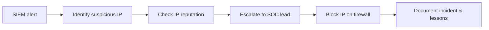

# Junior Security Analyst Intro – Notes

## 1. Room Overview

**Goal:** simulate a typical day of a Junior Security Analyst (SOC Level 1) and practice the basic workflow:

1. Monitor security alerts in a SIEM dashboard.
2. Identify a suspicious event and extract the key indicator (malicious IP).
3. Check IP reputation using external threat‑intel / OSINT sources.
4. Escalate the incident to the right person in the SOC.
5. Block the malicious IP on the firewall.

The room connects three big themes:

* **Web / cyber news →** understand that breaches are daily, not rare events.
* **SOC operations →** teamwork and clear roles.
* **Hands‑on mini‑incident →** from alert to containment.

---

## 2. Role: Junior Security Analyst (SOC L1)

**Position:** first line of defence in a 24/7 Security Operations Center.

Core responsibilities:

* **Triage alerts** – decide what is noise vs. truly dangerous.
* **Monitor SIEM dashboards** for suspicious activity.
* **Collect context** – IPs, usernames, timestamps, geolocation, etc.
* **Document & escalate** – open tickets, add notes, hand off to seniors.
* **Continuous learning** – keep up with new attacks, tools, and procedures.

Mindset:

* Treat each alert like a potential patient in an emergency room.
* Move fast, but with enough context to avoid panic or over‑reaction.

---

## 3. SOC Team & Roles

The room introduces typical SOC roles around the junior analyst.

* **Junior Security Analyst (you)** – triage specialist, investigates basic alerts.
* **Senior Analyst – Will Griffin (SOC Team Lead)**
  Helps with complex cases, validates your analysis, owns escalation decisions.
* **SOC Engineer – Corey Stevens**
  Builds & maintains the tooling: SIEM, log pipelines, alert rules, dashboards.
* **SOC Manager – Emily Conway**
  Manages people and process, reports SOC performance, aligns with business.
* **Incident Responder – Daniel Herrera**
  Joins when there is a major incident (ransomware, large data breach, etc.).

Key idea: **you never work alone** – SOC is a team sport.

---

## 4. Mini‑Incident Walkthrough

### 4.1 SIEM Alert Triage

You start on the **SIEM Dashboard**.

* Multiple alerts with different **severity levels**: Critical, Medium, Low.
* Look for patterns and context:

  * Critical alerts mention **SSH logins** and **unauthorized login attempts**.
  * The same **source IP** appears in more than one alert: `221.181.185.159`.

Reasoning:

* Repeated failed logins + a later successful SSH login from the same IP →
  strong signal of a potential **brute‑force attack that finally succeeded**.
* This IP becomes your **indicator of compromise (IOC)**.

Action:

1. Copy the suspicious IP from the alert.
2. Move to the **IP Hunter** / reputation page.

### 4.2 IP Reputation Check (IP Hunter)

On the IP reputation page you simulate using public threat‑intel sources
(AbuseIPDB, Cisco Talos, etc.).

Findings for ` IP  `:

* **Status:** malicious – found in database.
* **ISP / domain:** China Mobile, `chinamobile.thm` (in room context).
* **Country:** China.
* **Categories:** Port scan, C2 server, PlugX malware.

Conclusion:

* The IP is not just noisy; it has a **history of malicious activity**.
* This justifies treating the alert as a real incident.

### 4.3 Escalation

Next you go to the **Escalation** screen and must choose whom to notify.

Reasoning:

* This is an active attack with confirmed malicious IP.
* Needs someone who understands alerts and can coordinate response.

Correct choice in the room: **Will Griffin – SOC Team Lead / Senior Analyst**.

Principle:

* Escalate to the person **responsible for your team’s incident handling**, not
  to random technical staff (e.g., developers, sales, etc.).

### 4.4 Containment via Firewall Block List

After escalation, you get permission to **block the IP**.

Steps:

1. Go to the **Firewall** tab / admin page.
2. Enter `221.181.185.159` and an optional comment (e.g., `SSH brute force`).
3. Add it to the **block list**.
4. The lab reveals a final message / flag from the attacker, confirming
   that traffic from this IP is now blocked.

Take‑aways:

* Blocking on the firewall is a **network‑level control** to stop or slow
  an active attack.
* Always make sure escalation + approval are done before making such changes
  in real life (change control).

---

## 5. End‑to‑End Workflow Summary

This is a minimal **incident handling loop** for a junior analyst:

1. **Detect** – SIEM raises an alert.
2. **Validate** – gather context, check threat‑intel.
3. **Escalate** – pass to the right person with a clear summary.
4. **Contain** – help apply technical controls (firewall, account lock, etc.).
5. **Document** – notes, tickets, and post‑incident learning.

---

## 6. Concepts Reinforced by the Room

* **SIEM (Security Information and Event Management)**
  Central platform that aggregates logs and generates alerts.

* **Indicators of Compromise (IOCs)**
  Artifacts associated with malicious activity, e.g. IPs, hashes, domains.

* **IP reputation / OSINT**
  Using external data sources to decide whether an IP is benign or hostile.

* **Escalation path**
  Clear chain of who to notify for which type of incident.

* **Firewall block list**
  List of IPs that are denied by perimeter / host firewalls.

* **Blue‑team thinking**
  Focus on detection, investigation, and containment instead of exploitation.

---

## 7. Personal Checklist for Future Labs

When doing similar SOC labs or real‑world triage:

* [ ] Read all alert fields (time, source IP, destination, message, severity).
* [ ] Look for recurring indicators (same IP, same username, same host).
* [ ] Use at least one **external** intel source for every suspicious IP.
* [ ] Summarize findings in 3–4 bullet points before escalating.
* [ ] Know the names / roles of people in your escalation chain.
* [ ] After containment, think about **detection improvements**:
  - Can we tune alerts to fire earlier or with better context?
  - Do we need additional logging?
* [ ] Capture notes in your GitHub `cyber-notes` repo to build a portfolio.

---

### Glossary (mini)

* **SOC (Security Operations Center)** – central team that monitors and
  responds to security events.
* **Triage** – quickly assessing and prioritising alerts by severity & impact.
* **SIEM** – tool that aggregates logs and raises alerts.
* **IOC** – Indicator of Compromise; technical sign of malicious activity.
* **Containment** – actions to stop or limit an attack (e.g. blocking an IP).
