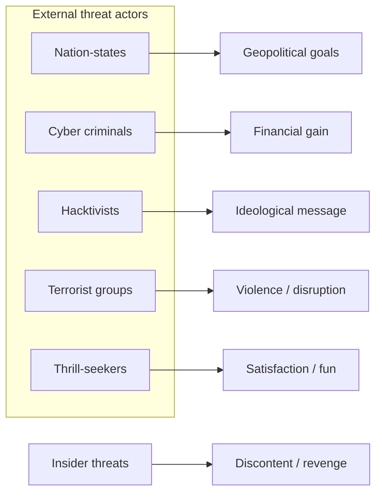

# Security Awareness – Study Notes

> TryHackMe room: **Security Awareness** – summary & Q/A.

---

## 1. What is Security Awareness?

**Security awareness** = understanding common cyber threats and adjusting everyday behaviour to reduce risk for yourself and your organisation.

Key ideas:

* Humans are the main attack surface: IBM reports that around **95%** of successful cyber attacks involve some kind of human error.
* Any employee with access to data, systems or knowledge of internal processes can be a target.
* Goal is not "zero risk" but **lowering probability and impact** of incidents via better habits.

**Who is security awareness for?**
Everyone: management, IT, HR, finance, interns, remote workers – *anyone* who touches company systems or data.

---

## 2. Why Security Awareness is Essential

### 2.1 Modern work patterns

* **Remote work / BYOD** (bring-your-own-device) means more use of personal laptops and home networks.
* Company data now flows through:

  * Home Wi‑Fi routers
  * Personal email / cloud storage
  * Messaging apps and video‑conferencing platforms
* This widens the **attack surface** and weakens the clear boundary between "corporate" and "home" environments.

### 2.2 Business impact of cyber attacks

Typical consequences of a serious breach:

* **Financial loss** – direct theft, fraud, ransom payments, incident response costs.
* **Legal penalties** – lawsuits, regulatory fines (e.g. GDPR) for mishandling personal data.
* **Operational disruption** – systems offline, business unable to trade, loss of productivity.
* **Reputational damage** – lost customer trust, partner hesitation, long‑term brand impact.

### 2.3 Benefits of security awareness training

Security awareness training helps to:

* Prevent or reduce **data breaches**.
* Lower overall **risk level** and improve detection / reporting of suspicious activity.
* Strengthen **IT defences** by making technical controls and user behaviour work together.
* Increase **customer and partner confidence**.

Example results from Proofpoint case studies (after awareness training):

* **95% reduction** in malware & viruses in a financial institution; users better at spotting threats.
* **90% reduction** in attempted phishing in an educational institution.
* **80% reduction** in fraud attacks against government employees.

---

## 3. Data and Account Security

### 3.1 What counts as sensitive data?

Typical sensitive data categories:

* **Personal Identifiable Information (PII)** – names, addresses, phone numbers, email, birth dates, ID numbers.
* **Financial data** – bank account details, card numbers, payroll information.
* **Credentials** – usernames, passwords, authentication tokens, recovery codes.
* **Business confidential** – contracts, pricing, internal strategy, source code, incident reports.
* **HR data** – employment history, performance reviews, medical / benefits information.

Different departments hold different parts of this:

* HR: full employee records.
* Finance: customer billing, credit‑card and bank details.
* IT / security: access logs, encryption keys, configuration backups.

### 3.2 Top data breaches (infographic recap)

Notable points from the “Top 10 data breaches” diagram:

* Many large companies (online retailers, payment processors, gaming platforms, insurance providers, etc.) have experienced **massive** breaches.
* Breaches often leak multiple categories of data at once (names + addresses + credit card details + passwords, etc.).
* Attackers can combine leaked data from multiple breaches for **highly targeted phishing** or identity theft.

**Room Q&A**

* **Q:** How many people were affected by **eBay** being hacked?
  **A:** **145 million** users affected.

* **Q:** What data was leaked from **PlayStation** being hacked?
  **A:** **Names, addresses, email addresses, birth dates, passwords and logins.**

### 3.3 Practical guidelines

* Only store data you **actually need**, and delete it securely when no longer required.
* Use strong, unique **passwords** for each account; use a **password manager** to keep track.
* Turn on **multi‑factor authentication (MFA)** wherever possible.
* Be careful with where data is copied: screenshots, exports to Excel, USB sticks, personal cloud storage.

---

## 4. Checking if you were in a breach

Service example: **Have I Been Pwned** (HIBP).

Basic workflow:

1. Go to the HIBP website.
2. Enter your email address or phone number.
3. Review any breaches listed:

   * Which companies were breached.
   * What data types were exposed (e.g. emails, passwords).
4. For each affected service:

   * Change your password immediately.
   * If same password was reused elsewhere, change it there too.
   * Enable MFA if available.

Takeaway: leaked data is often used for **credential stuffing** and **targeted phishing** – not just one‑off compromises.

---

## 5. Cyber Threat Actors

**Cyber threat actor** = individual or group that intentionally attempts to exploit security weaknesses.

Main categories and motivations:

* **Nation‑states**

  * Motivation: **geopolitical** goals, espionage, strategic advantage.
  * Targets: other governments, critical infrastructure, large companies.

* **Cybercriminals**

  * Motivation: **profit**.
  * Targets: businesses and individuals with valuable data or money.

* **Hacktivists**

  * Motivation: **ideology / political message**.
  * Targets: websites or organisations they oppose; defacements, data dumps.

* **Terrorist groups**

  * Motivation: **ideological violence and fear**.
  * Targets: critical infrastructure, public services, symbolic targets.

* **Thrill‑seekers**

  * Motivation: **fun, challenge, reputation in underground communities**.
  * Targets: personal computers, small websites, anything they can reach.

* **Insider threats**

  * Motivation: **discontent, revenge, financial gain**.
  * Actors: disgruntled employees, contractors, or partners with legitimate access.

**Room Q&A**

* **Q:** Who would most likely be interested in exploiting a **business**?
  **A:** **Cybercriminals** (financially motivated).

* **Q:** Who would most likely be interested in exploiting a **personal computer for fun**?
  **A:** **Thrill‑seekers**.

* **Q:** Who would most likely be interested in exploiting a **website to deliver a message**?
  **A:** **Hacktivists**.

---

## 6. Threat Actors – Mermaid Diagram

This diagram maps each actor group to its primary motivation.

---

## 7. Personal Security Checklist (Quick Reference)

* Use a **password manager** and unique passwords.
* Enable **MFA** on email, banking, social media, and work accounts.
* Treat unexpected **emails / links / attachments** with suspicion.
* Lock your devices and encrypt storage where possible.
* Keep operating systems, browsers and software **up to date**.
* Regularly back up important data to a secure location.
* Report suspicious activity (emails, login prompts, device behaviour) to your security or IT team.

---

## 8. Mini Glossary (EN / 简体中文)

* **Security awareness 安全意识** – understanding threats and behaving to reduce risk.
* **Data breach 数据泄露** – unauthorised access, exfiltration or disclosure of data.
* **Cyber threat actor 威胁行为者** – person or group conducting malicious activity.
* **Phishing 网络钓鱼** – fraudulent messages pretending to be trustworthy to steal data.
* **Social engineering 社会工程** – manipulating people rather than systems to bypass security.
* **Malware 恶意软件** – software designed to damage, disrupt or gain unauthorised access.
* **Multi‑factor authentication (MFA) 多因素认证** – login using password + extra factor (code, token, biometrics).
