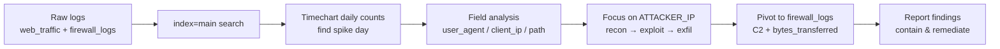

# Splunk Basics – "Did you SIEM?" (TryHackMe AoC 2025 Day 3)

Study notes for the TryHackMe Advent of Cyber room **“Splunk Basics – Did you SIEM?”**. Focus: using Splunk as a lightweight SIEM to investigate a web‑server ransomware incident.

---

## 0. Scenario & Goals

**Story:**

* TBFC’s web server has been hit by King Malhare’s Bandit Bunnies.
* SOC analysts must use **Splunk** to reconstruct the attack: from first probe → exploitation → data theft → C2.

**Learning objectives:**

* Ingest & interpret custom log data in Splunk (already pre‑ingested in the room).
* Use basic **SPL (Search Processing Language)** to:

  * Filter events.
  * Aggregate & visualise activity over time.
  * Hunt anomalies across fields.
* Correlate **web logs** and **firewall logs** to confirm compromise and C2.

Room data is in index `main` with two sourcetypes:

* `web_traffic` – HTTP access logs (client IP, path, status, user_agent, etc.).
* `firewall_logs` – firewall decisions (src_ip, dest_ip, dest_port, action, bytes_transferred, reason).

---

## 1. Splunk Basics Refresher

Key concepts:

* **Index** – logical bucket of events, e.g. `index=main`.
* **Sourcetype** – format / log type label, e.g. `sourcetype=web_traffic` or `firewall_logs`.
* **Event** – one log line after parsing.


* **Fields** – key–value pairs such as `client_ip`, `user_agent`, `path`, parsed from events (often auto‑extracted for web logs). citeturn0search29
* **SPL search** – pipeline of commands separated by `|` (search → stats / timechart → sort → table, etc.).
* **`timechart`** – aggregates over time buckets: e.g. `| timechart span=1d count` = daily event counts. citeturn0search27
* **`stats`** – generic aggregation (sum, count, avg, …) over search results. citeturn0search28

Interface pieces:

* **Search bar:** write SPL, e.g. `index=main`.
* **Time picker:** set to **All time** for this room initially, then narrow later.
* **Timeline histogram:** shows number of events over time (good to spot spikes).
* **Fields sidebar:**

  * *Selected fields* – always shown in event list (here: `host`, `source`, `sourcetype`).
  * *Interesting fields* – automatically extracted ones (e.g. `client_ip`, `user_agent`, `path`, `status`, `bytes_transferred`, …).

---

## 2. Load All Logs & Identify Sourcetypes

```spl
index=main
```

1. Set time range: **All time**.
2. Run the query – you should see ~18k events.
3. In left sidebar → click **`sourcetype`** to confirm there are exactly two types:

   * `web_traffic`
   * `firewall_logs`

This tells us we’ll do:

* Primary investigation in `web_traffic`.
* Validation / C2 correlation in `firewall_logs`.


---

## 3. Initial Triage on Web Logs

Search only the web access logs:

```spl
index=main sourcetype=web_traffic
```

What to read on the screen:

* **Timeline:** distribution of ~17k HTTP events – look for an obvious spike window.
* **Selected fields:** `host`, `source`, `sourcetype` → confirm parsing source (e.g. `access.csv`).
* **Interesting fields:** verify presence of

  * `client_ip` – external IPs hitting server.
  * `path` – requested URL / resource.

  * `user_agent` – browser / tool signature.
  * `status` – HTTP status code (200, 404, 504…).

These fields will drive most of the hunting.

---

## 4. Visualising Daily Volume & Finding the Peak Day

Goal: detect abnormal daily volume → candidate attack day.

```spl
index=main sourcetype=web_traffic
| timechart span=1d count
```

* `timechart span=1d count` builds a series of daily counts.
* In **Statistics** tab you see a table `_time` vs `count`.
* In **Visualization** → switch to column chart to eyeball spikes.

To sort by volume (highest first):

```spl
index=main sourcetype=web_traffic
| timechart span=1d count
| sort by count
| reverse
```

* Top row = day with **peak traffic** (answer for the “Which day was peak traffic?” question, format `YYYY-MM-DD`).

---

## 5. Field‑Based Anomaly Detection

Still on `index=main sourcetype=web_traffic`, switch back to **Events**.

### 5.1 user_agent

1. Click **`user_agent`** under interesting fields.
2. Splunk shows **Top 10 Values**:

   * Normal browsers: long `Mozilla/5.0 (...)` strings for iPhone, Windows, Mac, etc.
   * Clearly non‑browser tools: `curl/7.88.1`, `wget/1.21.4`, `zgrab/0.x`, `Havij/1.17 (Automated SQL Injection)`, `sqlmap/...`, `python-requests/...`.

These non‑browser agents are strong **IOC candidates**.

### 5.2 client_ip

1. Click **`client_ip`**.
2. Look for an IP with **~7,8k events** – obviously higher than any other.
3. Treat this as **ATTACKER_IP** (write it down; used later where the room text uses `<REDACTED>`).

### 5.3 path

1. Click **`path`** field.
2. Observe top URLs:

   * Normal pages: `/index.html`, `/blog`, `/shop`, `/contact`, `/static/app.css`, `/search?q=test`, `item.php?id=1`, etc.
   * Suspicious payloads:

     * `/item.php?id=1 AND SLEEP(5)--`
     * `/download?file=../../etc/passwd`

We already see **SQL injection** and **path traversal** behaviour.

---

## 6. Filter Out Benign User Agents

We know King Malhare’s bunnies prefer tools, not normal browsers. Remove common browser agents to focus on scripted traffic:

```spl
index=main sourcetype=web_traffic \
  user_agent!=*Mozilla* \
  user_agent!=*Chrome* \
  user_agent!=*Safari* \
  user_agent!=*Firefox*
```

* Remaining events are mostly scanners / exploit tools.
* Click `client_ip` again → now **all remaining events** come from **ATTACKER_IP**.

To summarise which IPs are doing non‑browser traffic in a real environment:

```spl
sourcetype=web_traffic \
  user_agent!=*Mozilla* \
  user_agent!=*Chrome* \
  user_agent!=*Safari* \
  user_agent!=*Firefox* \
| stats count by client_ip \
| sort -count \
| head 5
```

* `stats count by client_ip` → number of suspicious events per IP.
* `sort -count` or `| sort by count | reverse` → highest first.
* `head 5` → only top offenders.

Top row is the **primary attacker IP** used by the Bandit Bunnies.

---

## 7. Tracing the Attack Chain (by ATTACKER_IP)

For the rest of the queries, always plug in the ATTACKER_IP discovered above.

### 7.1 Recon / Footprinting

Look for early probing of config files and env info:

```spl
sourcetype=web_traffic client_ip="ATTACKER_IP" \
  AND path IN ("/.env", "/*phpinfo*", "/.git*") \
| table _time, path, user_agent, status
```

* Tools used: `curl`, `wget`, `zgrab`, etc.
* Status codes: mostly `401`, `403`, `404` (unauthorized / forbidden / not found).
* Interpretation: classic **reconnaissance** and **tech‑stack fingerprinting**.

### 7.2 Enumeration – Path Traversal & Redirects

Initial quick search:

```spl
sourcetype=web_traffic client_ip="ATTACKER_IP" \
  AND (path="*..*" OR path="*redirect*")
```

More precise (escaping `../` so Splunk treats it literally) and counting by path:

```spl
sourcetype=web_traffic client_ip="ATTACKER_IP" \
  AND (path="*..\/..\/*" OR path="*redirect*") \
| stats count by path
```

* Paths with `../../` show **directory traversal attempts**, e.g. trying to read `/etc/passwd` or other sensitive files.
* The `count` column gives the answer for: *“How many path traversal attempts to access sensitive files?”*

### 7.3 SQL Injection (sqlmap / Havij)

Search for automated SQLi tools via user_agent and show relevant events:

```spl
sourcetype=web_traffic client_ip="ATTACKER_IP" \
  AND user_agent IN ("*sqlmap*", "*Havij*") \
| table _time, path, status
```

* `path` shows payloads like `item.php?id=1 AND SLEEP(5)--`.
* `status=504` indicates **gateway timeout** – often evidence that a time‑based SQL injection using `SLEEP()` actually executed.
* The **number of events with `Havij` in user_agent** answers the question: *“What is the count of Havij user_agent events?”*

### 7.4 Exfiltration Attempts (backup/log archives)

Look for downloads of compressed archives:

```spl
sourcetype=web_traffic client_ip="ATTACKER_IP" \
  AND path IN ("*backup.zip*", "*logs.tar.gz*") \
| table _time, path, user_agent
```

* Shows which archives were pulled (likely via `curl`, `wget`, `zgrab`).
* These are **high‑value artefacts** for data theft and double‑extortion.

### 7.5 Webshell & Ransomware Execution (RCE)

Search for indicators of webshell and ransomware binary:

```spl
sourcetype=web_traffic client_ip="ATTACKER_IP" \
  AND path IN ("*bunnylock.bin*", "*shell.php?cmd=*") \
| table _time, path, user_agent, status
```

Interpretation:

* `/shell.php?cmd=...` → attacker deployed a **webshell**.
* `cmd=./bunnylock.bin` → webshell is used to execute the ransomware binary.
* At this point the attacker has **Remote Code Execution (RCE)** and fully controls the web server.

---

## 8. Pivoting to Firewall Logs – C2 & Data Volume

The compromised web server’s local IP (per room text) is:

```text
10.10.1.5
```

We now investigate whether it talked to ATTACKER_IP over the internet.

### 8.1 Confirm C2 Connection

```spl
sourcetype=firewall_logs \
  src_ip="10.10.1.5" \
  AND dest_ip="ATTACKER_IP" \
  AND action="ALLOWED" \
| table _time, action, protocol, src_ip, dest_ip, dest_port, reason
```

* Shows outbound connections from compromised server to ATTACKER_IP.
* `action=ALLOWED` → firewall did **not** block the traffic.
* `reason=C2_CONTACT` (room‑specific field) → explicit flag that this is **command‑and‑control**.

### 8.2 Calculate Total Data Exfiltrated

```spl
sourcetype=firewall_logs \
  src_ip="10.10.1.5" \
  AND dest_ip="ATTACKER_IP" \
  AND action="ALLOWED" \
| stats sum(bytes_transferred) AS total_bytes by src_ip
```

* `total_bytes` = total exfiltrated data to the C2 server.
* This answers the question: *“How many bytes were transferred to the C2 server IP from the compromised web server?”*
* Even if the value is only ~0.1 MB, remember these are **compressed text logs** – could still contain thousands of credentials or records.

---

## 9. Summary of the Kill Chain

High‑level reconstruction:

1. **Reconnaissance** – scripted requests for `/.env`, `phpinfo`, `.git`, etc., using `curl/wget/zgrab`.
2. **Enumeration** – path traversal (`../../`) and redirect tests.
3. **Exploitation** – automated SQL injection with sqlmap/Havij; time‑based payloads like `SLEEP(5)` → database compromise.
4. **Establish Persistence / RCE** – upload `shell.php`, achieve webshell.
5. **Payload Execution** – run `bunnylock.bin` ransomware via webshell.
6. **Exfiltration + C2** – download `backup.zip`, `logs.tar.gz`; outbound C2 connection from `10.10.1.5` → ATTACKER_IP with non‑trivial `bytes_transferred`.

As a SOC analyst, Splunk gives you:

* Fast filtering via SPL.
* At‑a‑glance timelines for spotting spikes.
* One‑click field statistics to highlight anomalous values.
* Easy pivot between data sources (web vs firewall) to complete the story.

---

## 10. Diagram – Investigation Flow



---

## 11. Room Questions – How To Derive Answers


> In my own write‑up I keep the **exact values** out and only note **how to obtain them** inside Splunk.


1. **Attacker IP**

   * Query: `index=main sourcetype=web_traffic user_agent!=*Mozilla* ...` (exclude common browsers).


   * Click `client_ip` → the single IP with ~7,8k events = **ATTACKER_IP**.


2. **Peak traffic day (YYYY-MM-DD)**

   * Query: `index=main sourcetype=web_traffic | timechart span=1d count | sort by count | reverse

`.

   * Top `_time` row = date with highest `count`.


3. **Count of Havij user_agent events**

   * Either click `user_agent` and read the count for `Havij/1.17 (Automated SQL Injection)`.


   * Or: `sourcetype=web_traffic user_agent=*Havij* | stats count`.


4. **Number of path traversal attempts**


   * Query:
     `sourcetype=web_traffic client_ip="ATTACKER_IP" AND path="*..\/..\/*" | stats count


`.
   * That `count` value is the answer.


5. **Total bytes transferred from web server to C2**


   * Query:
     `sourcetype=firewall_logs src_ip="10.10.1.5" AND dest_ip="ATTACKER_IP" AND action="ALLOWED" | stats sum(bytes_transferred) by src_ip


`.
   * `sum(bytes_transferred)` is the answer.


---

## 12. Mini Glossary (中英术语对照)

* **SIEM (Security Information and Event Management)** – 安全信息与事件管理平台。
* **SPL (Search Processing Language)** – Splunk 查询语言。
* **index** – 索引，日志事件的逻辑存储区。
* **sourcetype** – 源类型，标记日志格式/来源的标签。
* **timechart** – 按时间聚合统计的命令（时间序列图）。
* **stats** – 聚合统计命令（sum/count/avg 等）。
* **user_agent** – 用户代理字符串，标识浏览器或脚本工具。
* **path traversal** – 路径遍历攻击，通过 `../` 访问越权文件。
* **webshell** – 部署在 Web 服务器上的后门脚本，用于远程执行命令。
* **RCE (Remote Code Execution)** – 远程代码执行。
* **C2 (Command and Control)** – 攻击者用于控制受害主机的命令与控制通道。
