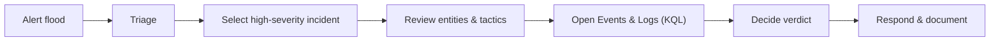

# SOC Alert Triaging – Tinsel Triage (Microsoft Sentinel)

> Notes based on the *Tinsel Triage* lab (TryHackMe Advent of Cyber) and Microsoft Sentinel documentation.


---

## 1. Scenario & Story

* **Company:** The Best Festival Company (TBFC) – running their workloads in an **Azure tenant**.
* **Tooling:** **Microsoft Sentinel** as cloud‑native SIEM/SOAR, collecting telemetry from VMs, services, and apps.
* **Threat actors:** Evil Easter Bunnies targeting TBFC during peak season.
* **Symptom:** “It’s raining alerts” – dashboards full of high/medium alerts across multiple resources.

Goal of the analyst (McSkidy / us):

* Avoid drowning in noise.
* Systematically **triage alerts**, identify real incidents, and reconstruct the attack path using **Sentinel incidents + logs**.

---

## 2. Learning Objectives

1. **Understand alert triage & prioritisation**
   → How to decide what to look at *first* when alerts flood the SOC.

2. **Use Microsoft Sentinel to review & analyse alerts**
   → Work with **Incidents**, **Analytics rules**, and **Logs**.

3. **Correlate logs to identify real attacker activity & decide a verdict**
   → Use **KQL (Kusto Query Language)** to pivot on host/user/IP and build a timeline.


---

## 3. Alert Triage Fundamentals

When many alerts fire at once, we don’t click them randomly. The lab uses four core dimensions:


| Factor       | Guiding question                   | Notes (EN / 简注)                                                |
| ------------ | ---------------------------------- | -------------------------------------------------------------- |
| **Severity** | How bad could this be?             | From Informational → Critical. 高危优先。                           |

| **Time**     | When did it start? Is it ongoing?  | Look at creation time *and* underlying event timestamps.       |

| **Context**  | Where in the **attack lifecycle**? | Recon / Initial Access / PrivEsc / Persistence / Exfiltration… |


| **Impact**   | Who/what is affected?              | Critical server? Domain account? Internet‑exposed host?        |


These four questions = quick mental checklist:


* **Severity** – is this worth waking someone up?

* **Time** – burst of events or single spike?

* **Context** – stage of attack = how far the attacker got.

* **Impact** – if this asset falls, what breaks?


Triage output per alert/incident:

* *Escalate now* (likely active compromise)

* *Investigate soon* (suspicious, needs more data)

* *Close / suppress* (false positive or accepted risk)


---

## 4. Sentinel Objects & Navigation

High‑level objects inside Sentinel used in this lab:


* **Analytics rules** – detection logic that runs on log data and raises **alerts**.

* **Incidents** – one or more alerts grouped into a single case for investigation.

* **Entities** – objects involved in an incident (hosts, accounts, IPs, etc.).

* **Logs** – raw data in tables (here: `Syslog_CL` custom log table).


### 4.1 Preparing the environment

1. **Go to Sentinel** → select the provided workspace.

2. **Configuration → Analytics**:

   * Select all deployed rules.
   * **Disable** then **Enable** again to force them to fire in the lab.

3. Wait until notifications confirm rules are enabled and incidents start appearing.


### 4.2 Incidents view

Path: **Microsoft Sentinel → Threat management → Incidents**


For each incident we see:

* **Severity** (High / Medium / Low / Informational)

* **Creation time** (incident time ≠ exact attack time)

* **Number of events** (evidence count)

* **Entities** (e.g. `backup-02`, `websrv-01`, `app-02`)

* **Tactics/Techniques** (MITRE ATT&CK mapping – e.g. Privilege Escalation / T1068)


Click **View full details** to open:


* **Incident timeline** – ordered list of related alerts.

* **Similar incidents** – other incidents that share entities (same host/user/IP).


This is where correlation starts: multiple incidents on the same machine often mean **different stages of the same intrusion**, not random noise.


---

## 5. Case Study – Linux PrivEsc: Kernel Module Insertion

We focus on the **“Linux PrivEsc – Kernel Module Insertion”** incident.


### 5.1 What we see from the incident pane

* **Severity:** High.
* **Tactic:** Privilege Escalation (exploitation for higher privileges).

* **Entities:** three Linux hosts (`backup-02`, `websrv-01`, `app-02`).

* **Evidence:** 3 events showing `insert_module` actions in kernel logs.


Already from triage view we know:

* Someone loaded **non‑standard kernel modules** on multiple servers.

* This is rarely benign → strong PrivEsc / persistence indicator.


### 5.2 Evidence → Events view

From **Evidence → Events**:

* Table shows columns like `TimeGenerated`, `host_s`, `Message`, `program_s`.

* `Message` contains kernel audit lines such as:


  * `audit: ... op=insert_module name=malicious_mod.ko ...`
  * `audit: ... op=insert_module name=netmon.ko ...`

This gives us concrete IOCs:

* Suspicious kernel module names (`malicious_mod.ko`, `netmon.ko`).

* Exact times each host loaded them.


### 5.3 Reconstructing the attack path around **app-02**

We pivot to raw logs to see what happened **before and after** the module insertion.


Steps:

1. From Events → open **Logs** for the incident.

2. Switch from **Simple mode** to **KQL mode**.

3. Start from the auto‑generated query and adapt it.


Example query used in the lab:

```kusto
set query_now = datetime(2025-10-30T05:09:25.9886229Z);
Syslog_CL
| where host_s == "app-02"
| project _timestamp_t, host_s, Message
```

This returns all syslog messages for host `app-02` in the relevant time range.


From the results we can see a suspicious sequence:


1. **Backup of `/etc/shadow`** to a temporary path (e.g. `/tmp/shadow.bak`).

   → Credential‑access behaviour: attacker wants password hashes.

2. **User `alice` added to `sudo` group** (`usermod ...`).
3. **Password for `backupuser` changed by root.**
   → Likely creating or modifying privileged accounts.

4. **Kernel module inserted** (`malicious_mod.ko`).
5. **Successful SSH login as root** from a remote IP.

   → Confirms the attacker owns valid creds + has interactive access.


Taken together, this is **not** normal admin work. It fits a classic pattern:


* Initial access → credential access → privilege escalation → persistence.


---

## 6. KQL Basics Used in This Lab

Key pieces of **Kusto Query Language** syntax that show up:


### 6.1 Tables and `where`

```kusto
Syslog_CL
| where program_s == "kernel" and Message has "insert_module"
| project TimeGenerated, host_s, Message
```

* `Syslog_CL` – table name (custom Syslog logs).

* `where` – filter rows.

  * `program_s == "kernel"` → only kernel messages.

  * `Message has "insert_module"` → substring match.

* `project` – choose which columns to output.


### 6.2 Pivoting on a single host

```kusto
Syslog_CL
| where host_s == "app-02"
| project _timestamp_t, host_s, Message
```

* Focuses on one host.
* Use this pattern to pivot on any entity:


  * `host_s == "websrv-01"`
  * `Account == "alice"`
  * `IPAddress == "203.0.113.45"`

### 6.3 Adding more filters

```kusto
Syslog_CL
| where host_s == "websrv-01"
| where Message has "ops"
| project _timestamp_t, host_s, Message
```

* Multiple `where` lines are just additional filters.

* Very common pattern: **host → user → action**.


> Mental model: KQL pipelines are like `grep` → `grep` → `cut` in Linux, but typed and structured.


---

## 7. Mini Sentinel Triage Playbook

A compact workflow you can reuse:

1. **Prepare rules & incidents**

   * Confirm Analytics rules are enabled.

   * Wait for incidents to appear; sort by **Severity** and **Created time**.

2. **Quick triage per incident**

   * Severity (High/Medium/Low).
   * Number of events & entities.
   * Tactic/technique (MITRE).
   * Business criticality of affected hosts/users.

3. **Correlation & context**

   * Use **Incident timeline** and **Similar incidents**.

   * Look for repeated hits on the same host/user/IP.

4. **Drill into evidence**

   * Open **Events** → check raw messages.

   * Pivot to **Logs (KQL)** for the main host.

   * Expand timeframe around the alert and look for:


     * Auth attempts, sudo usage, password changes.

     * File operations on sensitive paths.

     * New services / modules / processes.

5. **Decide verdict**

   * **True positive (TP):** attacker behaviour confirmed → escalate, contain, eradicate.

   * **Benign / false positive (FP):** explain why; consider tuning rule.

   * **Suspicious but unclear:** mark as under investigation; gather more data.

6. **Document & improve**

   * Record what happened, which queries you used, and which IOCs you found.

   * Feed back into better detections and playbooks.


---

## 8. Suspicious Patterns from This Lab (Detection Ideas)

Things that should almost always raise eyebrows on Linux servers:


* Copying `/etc/shadow` or `/etc/passwd` to unusual locations (e.g. `/tmp`).

* Non‑maintenance changes to privileged users:


  * New user suddenly added to **`sudo`** group.

  * Service / backup account passwords changed by root without change ticket.


* Loading unknown **kernel modules** (`*.ko`) on application servers.


* Root SSH logins from **external IPs** or from unusual internal IPs.


* Shell or command lines that initiate outbound connections to uncommon IP:port pairs


  (typical reverse‑shell behaviour using `/dev/tcp/remote_ip/port`).


Each single event may be explainable; the **sequence** is what proves compromise.


---

## 9. Glossary (EN–ZH)

* **SOC (Security Operations Center)** – 安全运营中心
* **SIEM (Security Information and Event Management)** – 安全信息与事件管理平台
* **SOAR (Security Orchestration, Automation & Response)** – 安全编排 / 自动化 / 响应
* **Alert triage** – 警报分诊 / 分级处理
* **Incident** – 安全事件（由一个或多个警报组成的案例）
* **Analytics rule** – 分析/检测规则
* **Entity** – 实体（主机、账户、IP 等被检测对象）
* **KQL (Kusto Query Language)** – Sentinel 使用的查询语言
* **Syslog_CL** – 自定义 Syslog 日志表
* **Privilege Escalation** – 权限提升
* **Persistence** – 持久化（维持长期访问）

---

## 10. Simple Flow Diagram (Triaging → Investigation → Response)




Use this diagram as a mental map when working in Microsoft Sentinel: always move from **high‑level view → focused host/user → concrete log evidence → documented decision**.

