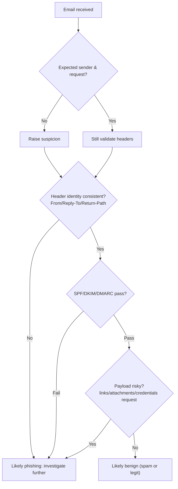

# Overview

Room focus: **phishing triage** (spam vs phishing), common attacker techniques, and how to validate suspicious emails using **headers + intent analysis**.


## Learning objectives

* Spot phishing signals in real-ish email samples

* Understand **trending phishing** (credential theft via legit platforms)

* Use **SPF / DKIM / DMARC** and header fields to validate sender identity


---

# Task 1 — Introduction

## Why phishing still works

Phishing remains the easiest **initial access vector** because it targets the only “unpatchable” surface: **humans**.


## Phishing vs spam

* **Spam** = high-volume, low-precision *digital noise* (marketing / engagement / low-effort scams).

* **Phishing** = targeted or persuasive message designed to obtain:


  * **Credentials** (passwords / tokens / VPN)

  * **Malware execution** (attachments / scripts)

  * **Sensitive data** (internal docs / PII)

  * **Financial fraud** (fake invoices / payroll changes)


**Key heuristic**: classify by **intent** (目的) + **signals** (特征), not by “annoying vs not annoying”.


---

# Task 2 — Spotting Phishing Emails

## A practical triage checklist

### 1) Context & intent (fast, human layer)

* Was I expecting this request? Is the timing plausible?
* Does it create **urgency**, **fear**, **secrecy**, or **helpfulness pressure**?
* Does it ask for anything abnormal (credentials, payment approval, policy exceptions)?

### 2) Identity validation (technical layer)

Check **sender identity consistency** across:

* `From` (display name + address)
* `Reply-To` (does it divert replies?)
* `Return-Path` (envelope sender; often exposes the *real* origin)
* `Authentication-Results` (SPF/DKIM/DMARC)

### 3) Payload & execution surface

* Links: domain lookalikes, redirects, URL shorteners, external hosting
* Attachments: extension mismatch (`.mp3.html`), scripts, archives
* “Legit platform” abuse: OneDrive/Dropbox/Google Docs leading to **fake login pages**

---

## Core phishing techniques in this room

### Impersonation (冒充)

Attacker pretends to be a real person/team/service to borrow credibility.
攻击者伪装成真实人物/团队/服务，以窃取信誉。


### Social Engineering (社会工程)

Psychological manipulation (fear/urgency/helpfulness/curiosity) + plausible story.


### Typosquatting & Punycode (域名抢注 / Punycode)

* **Typosquatting**: register common misspells (e.g., `glthub.com`).


* **Punycode**: Unicode lookalikes encoded as `xn--...` (IDN homograph). Example: replacing Latin letters with visually similar non-ASCII characters.


### Spoofing (伪造)

Email “looks” internal but headers prove origin is external.


**Strong indicator**: SPF/DKIM/DMARC failures + `Return-Path` mismatch.


### Malicious attachments (恶意附件)

Classic delivery vector. In this room, an **HTML** file masquerades as audio.


### Trending phishing (现代趋势)

Instead of directly dropping malware, attackers often:


* move victims **outside the secure perimeter**


* abuse **legitimate sharing apps** (Dropbox/OneDrive/Google Drive)


* push users into **fake login pages** to steal credentials


---

## Email authentication: what to read, not what to memorize

* **SPF (Sender Policy Framework / 发信服务器授权列表)**

  * Domain publishes which servers may send on its behalf.


* **DKIM (DomainKeys Identified Mail / 域名签名验真)**

  * Cryptographic signature: proves integrity + domain-level legitimacy.


* **DMARC (Domain-based Message Authentication, Reporting & Conformance / 策略与处置)**

  * Policy using SPF/DKIM results to decide **reject/quarantine/none**.


> Rule of thumb: **SPF+DMARC fail** → spoofing highly likely.


---

## Triage decision flow (operational)



---

# Lab — Email-by-email classification

Below summarizes the **6 emails** and the minimum **3 signals** used for phishing items.


## Email #1 — “Invoice from Santa Claus (4103)”

**Classification**: Phishing

* **Fake Invoice** (financial fraud lure)

* **Sense of Urgency** (“call immediately” style pressure)

* **Spoofing** (SPF/DKIM/DMARC fail + `Return-Path` not PayPal)


## Email #2 — “New Audio Message from McSkidy”

**Classification**: Phishing

* **Impersonation** (pretends to be internal call notifier)
* **Spoofing** (`Return-Path` external; auth failures)
* **Malicious Attachment** (`.mp3` name but actually `.html`)

## Email #3 — “URGENT: McSkidy VPN access for incident response”

**Classification**: Phishing

* **Impersonation** (claims to be McSkidy)
* **Sense of Urgency** (“urgent / immediately”)
* **Social Engineering Text** (incident-response story + credential workflow abuse)

## Email #4 — “TBFC HR Department shared ‘Annual Salary Raise Approval.pdf’ with you”

**Classification**: Phishing

* **Impersonation** (HR identity borrowed)
* **External Sender Domain** (Dropbox delivery + suspicious HR reply channel)
* **Social Engineering Text** (salary raise as a high-click lure)

## Email #5 — “Improve your event logistics this SOC-mas season”

**Classification**: Spam (marketing)

* Intent is promotional; no abnormal request, no risky payload.

## Email #6 — “TBFC-IT shared ‘Christmas Laptop Upgrade Agreement’ with you”

**Classification**: Phishing

* **Typosquatting/Punycodes** (`tbƒc.com`, and `Return-Path` shows `xn--...`)
* **Impersonation** (pretends to be TBFC-IT)
* **Social Engineering Text** (“laptop upgrade agreement” is an attractive proposal)

### Extra signals worth noticing (not required but useful)

* Domain reputation camouflage: “looks like internal IT” but uses IDN tricks.
* Legit-platform lure pattern: “shared agreement” → often leads to **fake login**.

---

# Defensive takeaways

## Operator-level habits (blue-team muscle memory)

* **Verify before you act**: treat urgent internal requests as suspicious until confirmed.
* Use **out-of-band verification** (known phone / internal ticket system), not attacker-provided channels.
* Never enter credentials from email links; **navigate manually** to official portals.
* Treat “file share + HR/IT lure” as a default high-risk pattern.

## What I would log / report in a real SOC

* Indicators: sender domains, punycode `xn--`, `Return-Path`, auth failures, attachment hashes.
* User impact: who clicked/opened; endpoint telemetry; email campaign scope.

---

# Chinese mini-glossary

* Phishing：网络钓鱼
* Spam：垃圾邮件
* Impersonation：冒充
* Social Engineering：社会工程
* Spoofing：伪造/欺骗（邮件身份伪造）
* Typosquatting：域名抢注（拼写相似域）
* Punycode / IDN homograph：Punycode 编码 / 国际化域名同形攻击
* Return-Path：返回路径（envelope sender）
* SPF/DKIM/DMARC：发信授权/域名签名/策略与处置

---

# (Optional) Flags (spoiler)

If you keep a public repo, consider removing these to avoid spoiling the room.

```text
#1 THM{yougotnumber1-keep-it-going}
#2 THM{nmumber2-was-not-tha-thard!}
#3 THM{Impersonation-is-areal-thing-keepIt}
#4 (captured in lab)
#5 (captured in lab)
#6 (captured in lab)
```
