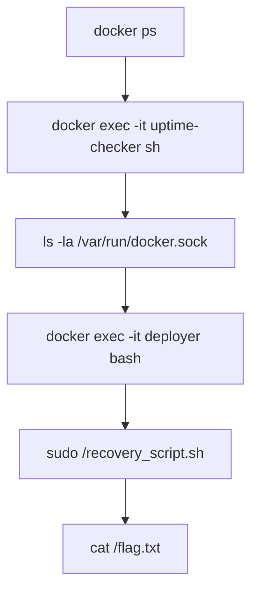

# Containers - DoorDasher's Demise (Docker Socket Escape Lab Notes)

## Summary

This lab is a compact demo of **container security**: containers are lightweight and fast, but the isolation boundary is weaker than a full VM because containers **share the host kernel**. The core failure mode here is an exposed **Docker daemon Unix socket** (`/var/run/docker.sock`) inside a container. If a process in a container can talk to that socket, it can effectively control Docker on the host (create/exec privileged containers, mount host paths, etc.).

> **Ethics / ROE (Rules of Engagement):** Only do the following in environments you own or have explicit permission to test (CTF, training VM).

---

## Key Concepts

### Container vs VM (high-level)

* **VM (Virtual Machine / 虚拟机):** each VM ships a full **guest OS**. Stronger isolation, heavier footprint.
* **Container (容器):** ships *app + deps*; shares the host **OS kernel**. Faster start, higher density, but you must harden the runtime boundary.

### Microservices (微服务) and scaling

* Modern apps often split into **microservices**: many small services instead of one monolith.
* Containers fit microservices because they are quick to replicate and scale.

### Container engine (容器引擎): namespaces + cgroups

* A container engine (e.g., **Docker**) orchestrates containers using kernel features:

  * **Namespaces（命名空间）**: isolate views (PID, mount, network, user, etc.).
  * **cgroups（控制组）**: limit and account resources (CPU/mem/IO).

### Docker daemon + socket = “control plane”

* Docker CLI is basically a client talking to the **Docker daemon**.
* The daemon exposes an API via a Unix socket (`/var/run/docker.sock`).
* If a container can access this socket, that’s a classic **misconfiguration** leading to **container escape / privilege escalation**.

---

## Lab Objective

Restore the defaced web service back to the original **DoorDasher** app.

You discover multiple containers; the key pivot is **uptime-checker** which has access to Docker socket, allowing you to reach a more privileged container (**deployer**) and run the recovery script.

---

## Workflow

### 1) Enumerate running containers

```bash
docker ps
```

What to look for:

* container **names**
* **ports** mapping (e.g., `0.0.0.0:5001->...`)

### 2) Identify the initial foothold container

In this lab:

* `uptime-checker` is accessible and provides a shell.

```bash
docker exec -it uptime-checker sh
```

### 3) Check for Docker socket exposure

```bash
ls -la /var/run/docker.sock
```

If you can see (or even write to) this socket from inside the container, you likely have a path to control Docker.

**Why it matters:** Docker socket access is effectively “root on the Docker host” in many setups.

### 4) Pivot to a privileged container

In this lab:

```bash
docker exec -it deployer bash
```

Confirm identity:

```bash
whoami
```

### 5) Restore the service

Locate and run the recovery script from the container root:

```bash
cd /
sudo /recovery_script.sh
```

### 6) Capture the lab flag

```bash
cat /flag.txt
```

---

## Attack Surface Analysis (what actually went wrong)

### Root cause

* A container (uptime-checker) had access to **`/var/run/docker.sock`**, meaning it could issue Docker API commands that affect the whole host.

### Why it’s dangerous (conceptual)

Once you can talk to the Docker daemon, you can often:

* exec into other containers
* start containers with elevated privileges
* mount host paths into a container
* read/write sensitive files on the host (depending on daemon configuration)

This turns “app compromise inside a container” into “platform compromise”.

---

## Hardening & Mitigations

### Runtime-level mitigations

* **Do not mount** `/var/run/docker.sock` into containers unless absolutely necessary.
* Prefer **rootless Docker** or at least avoid giving the container user membership in `docker` group.
* Apply **least privilege**:

  * drop capabilities (`--cap-drop=ALL` + add back only what’s needed)
  * no `--privileged`
  * read-only FS where possible
  * restrict mounts

### Architectural mitigations

* If you *must* provide a build/run capability to containers:

  * use a separate build service (CI runner) isolated from production
  * use scoped APIs / policy engines
  * isolate workloads across hosts/nodes (blast-radius reduction)

### Detection ideas

* Alert on containers that mount `docker.sock`.
* Monitor Docker daemon API calls from unexpected containers.

---

## Pitfalls (common failure modes)

* Confusing `docker ps` output ports: always map **host_port -> container_port**.
* Entering the wrong container name (case / hyphen matters).
* Assuming containers are “VM-level isolation” (they are not).
* Leaving recovery credentials / secret codes inside web pages or logs (easy leakage).

---

## Takeaways

* Containers are fast and portable, but isolation relies on careful runtime configuration.
* **Docker socket exposure** is a critical anti-pattern; treat it as a production incident.
* Security mindset: harden the *control plane* (daemon + API), not just individual apps.

---

## Quick Q&A (from the lab)

* **Command that lists running containers:** `docker ps`
* **File that defines build instructions for an image:** `Dockerfile`

---

## Minimal Diagrams

### Boundary model

```text
[Container: uptime-checker]
  |  (has access)
  v
/var/run/docker.sock  --->  [Docker daemon on host]  --->  control other containers
```

### Lab flow (Mermaid)



---

## Glossary (CN mini)

* **Containerization（容器化）**: packaging app + deps into isolated runtime units
* **Hypervisor（虚拟机管理程序）**: software that runs/manages VMs
* **Namespace（命名空间）**: kernel feature for isolation (PID/mount/net/user…)
* **cgroups（控制组）**: kernel feature for resource limits/accounting
* **Daemon（守护进程）**: background service (Docker daemon)
* **Unix socket（Unix 套接字）**: local IPC endpoint (e.g., `docker.sock`)
* **Container escape（容器逃逸）**: breaking isolation to impact host/other containers

---

## Related Tools

* Docker CLI: `docker ps`, `docker exec`, `docker logs`, `docker inspect`
* Linux basics: `ls`, `cat`, `whoami`, `id`, `find`, `ps`

## Further Reading

* Docker security: protecting daemon access, socket hardening, rootless mode
* Linux container internals: namespaces, cgroups, capabilities
* Container runtime threat models (STRIDE for platform components)
