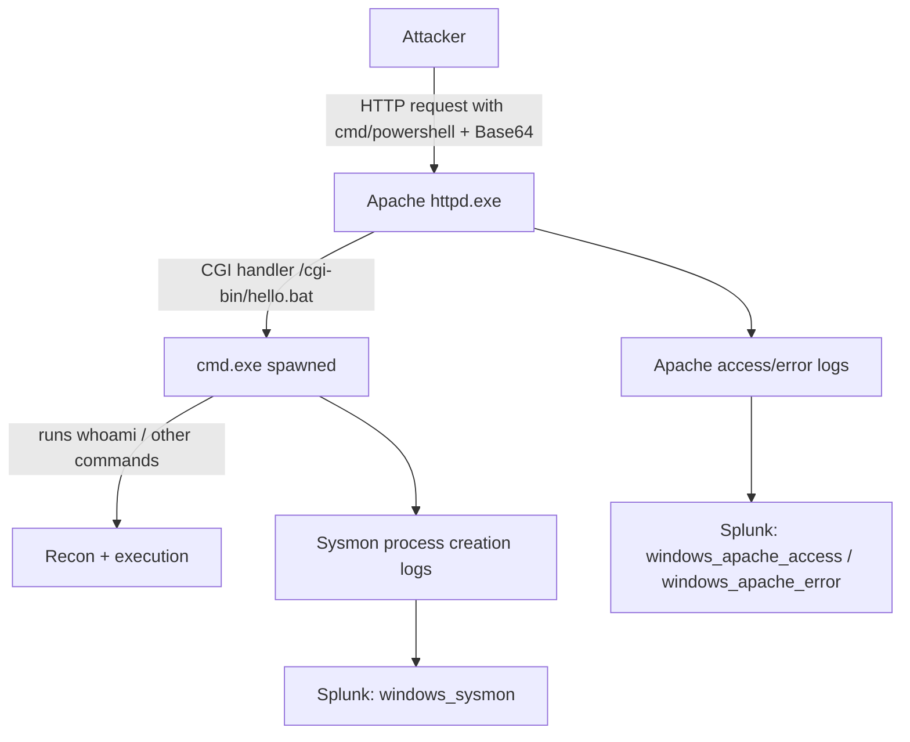

# Web Attack Forensics with Splunk (TryHackMe AoC 2025 · Day 15)

## Summary

This lab is a **blue-team triage** exercise: detect suspicious HTTP requests, pivot into Apache error logs, then validate **OS-level execution** via Sysmon process telemetry. The core hypothesis is **command injection** through a CGI script (`/cgi-bin/hello.bat`) that causes Apache (`httpd.exe`) to spawn `cmd.exe` and run attacker-supplied commands, including Base64-obfuscated PowerShell.

## Scenario & Data Sources

**Symptom:** long HTTP requests with Base64 chunks; Splunk alert indicates unusual processes spawned by Apache.

**Telemetry streams (Splunk indexes):**

* `windows_apache_access`: Apache access logs (request-level visibility)
* `windows_apache_error`: Apache error logs (server-side execution failures / 500s)
* `windows_sysmon`: Sysmon process creation and related host telemetry (OS-level proof)

## Operational Baseline

* Use `Time range` = **Last 7 days** or **All time** (narrow ranges are a common reason for “No results found”).
* Prefer **Verbose / Table view** for hunting; switch to **Raw** when you need the exact log payload.

---

## Investigation Workflow

### 1) Detect suspicious web commands (access logs)

Goal: find web requests that *look like command execution attempts*.

```spl
01  index=windows_apache_access (cmd.exe OR powershell OR "powershell.exe" OR "Invoke-Expression")
02  | table _time host clientip uri_path uri_query status
03  | sort 0 -_time
```

**What to look for**

* `uri_path` like `/cgi-bin/hello.bat`
* `uri_query` containing `cmd=cmd.exe` or `cmd=powershell.exe ...`
* suspicious long query strings (often Base64 / URL-encoded)
* repeated requests from the same `clientip`

**Example finding (from the screenshots/text):**

* `uri_path=/cgi-bin/hello.bat`
* `uri_query` includes `cmd=powershell.exe+-enc+<BASE64>`

### 2) Decode Base64 payloads (triage)

Goal: understand the attacker intent encoded inside `-enc`.

* Extract the Base64 blob from `uri_query`.
* Decode it (any decoder works).

**Important nuance:** PowerShell `-EncodedCommand` is typically **Base64 of UTF-16LE (Unicode)** text. If your decoder outputs “garbage”, re-decode as UTF-16LE.

**Known decoded message in this lab:**

* The provided Base64 decodes to a taunting message (e.g., “This is now mine!”), indicating the request reached a code path that attempted execution.

### 3) Confirm server-side execution attempts (Apache error logs)

Goal: confirm whether the request was processed by the backend (even if it failed).

```spl
01  index=windows_apache_error ("cmd.exe" OR "powershell" OR "Internal Server Error")
02  | sort 0 -_time
03  | table _time host source sourcetype _raw
```

**Interpretation**

* A `500 Internal Server Error` (or “not recognized as an internal or external command”) suggests the input made it far enough to be *handled by server-side logic*, then failed during execution.
* This helps distinguish **blocked at the web layer** vs **reaching backend execution**.

### 4) Trace suspicious process creation (Sysmon)

Goal: prove OS-level execution by identifying child processes spawned by Apache.

```spl
01  index=windows_sysmon ParentImage="*httpd.exe"
02  | table _time Computer ParentImage Image CommandLine User
03  | sort 0 -_time
```

**Key signal**

* `ParentImage = ...\httpd.exe` and `Image = ...\cmd.exe` is highly suspicious.
* Web servers normally spawn worker threads, not interactive system shells.

### 5) Confirm attacker enumeration (post-exploitation recon)

Goal: confirm the attacker started with *identity discovery*.

```spl
01  index=windows_sysmon *cmd.exe* *whoami*
02  | table _time Computer Image CommandLine User ParentImage
03  | sort 0 -_time
```

**Why `whoami` matters**

* It’s a canonical “first move” after getting execution: determine account context and permissions.

**Answer-style artifact:**

* Reconnaissance executable: `whoami.exe` (often observed as `...\cgi-bin\whoami.exe` in this lab’s process lineage).

### 6) Hunt for Base64-encoded PowerShell (Sysmon)

Goal: find successful PowerShell execution containing encoded commands.

```spl
01  index=windows_sysmon Image="*powershell.exe"
02  (CommandLine="*enc*" OR CommandLine="*-EncodedCommand*" OR CommandLine="*Base64*")
03  | table _time Computer Image CommandLine ParentImage User
04  | sort 0 -_time
```

**Expected outcome in the lab:**

* Potentially **no results** → “payload never actually ran” (defenses/workflow prevented PowerShell execution).

---

## Attack Chain Reconstruction (High-level)



## Key Indicators (IoCs / Behaviors)

* Web requests:

  * `uri_path=/cgi-bin/hello.bat`
  * `uri_query` includes `cmd=cmd.exe` / `cmd=powershell.exe` / `Invoke-Expression`
  * unusually long query strings with Base64 fragments
* Server-side errors consistent with attempted execution
* Process tree anomalies:

  * `httpd.exe → cmd.exe`
  * `httpd.exe → whoami.exe`
* Account context:

  * commands executed as the Apache service account (e.g., `...\apache_svc`)

## Mapping to Defensive Concepts

* **Web exploitation / command injection** → “public-facing app abuse” model
* **Command interpreter execution** (`cmd.exe`, `powershell.exe`) → host execution proof
* **Obfuscation** (Base64 / encoded commands) → intent hiding + detection evasion

---

## Pitfalls (Things that waste time)

* **Time range too narrow** → false “no results”.
* Staying in **Smart Mode** and missing fields; switch to **Verbose** when needed.
* Confusing **access log evidence** (request intent) with **Sysmon evidence** (actual execution).
* Decoding Base64 with the wrong character encoding (PowerShell often uses UTF-16LE).

## Hardening & Detection Improvements

* Web layer:

  * Remove/lock down CGI handlers you don’t need; restrict `/cgi-bin/*`.
  * Input validation + allowlisting for query parameters.
  * WAF rules for `cmd=`, `powershell`, `Invoke-Expression`, long Base64-like patterns.
* Host layer:

  * Alert on **`httpd.exe` spawning shells** (`cmd.exe`, `powershell.exe`).
  * Alert on `whoami`, `ipconfig`, `net user`, `whoami /priv` executed under service accounts.
* Splunk tuning:

  * Create correlation searches: `apache_access` suspicious query → join with `sysmon` process creation by time/host.
  * Persist reusable searches as saved searches / alerts.

---

## Mini Glossary (中英对照)

* **SIEM (安全信息与事件管理系统)**: central log collection + correlation + alerting platform.
* **SPL (Splunk Processing Language / Splunk 搜索语言)**: query language for Splunk.
* **Sysmon (System Monitor / 系统监视器)**: Windows telemetry for process/network/file events.
* **CGI (Common Gateway Interface / 通用网关接口)**: legacy web mechanism for running server-side scripts.
* **Command Injection (命令注入)**: attacker-controlled input executed as system commands.
* **Base64 / EncodedCommand (Base64 编码命令)**: obfuscation technique, often UTF-16LE for PowerShell.

## Further Reading (names only)

* Splunk Search Reference: `table`, `sort`, `eval` (string functions)
* Microsoft documentation: `about_PowerShell_exe` (EncodedCommand behavior)
* Sysinternals Sysmon documentation (Process creation event fields)
* MITRE ATT&CK: Command and Scripting Interpreter, Obfuscated/Encrypted Commands, Exploit Public-Facing Application
