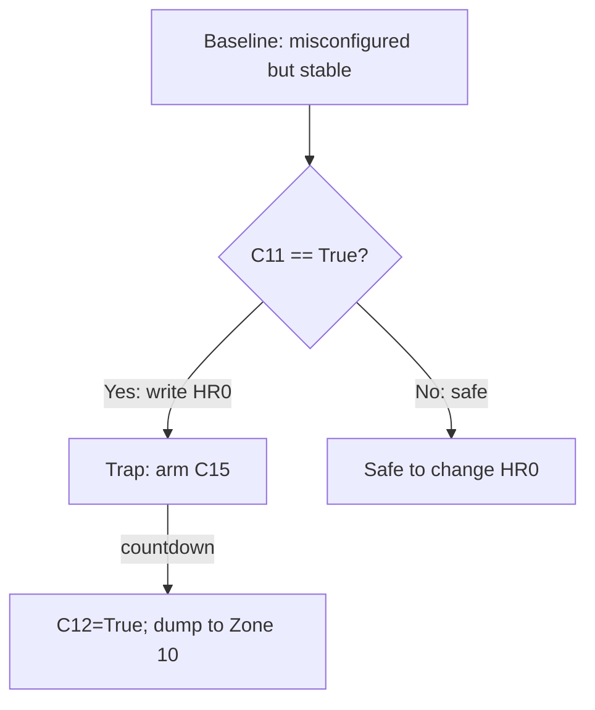

# THM Advent of Cyber Day 19 — ICS/SCADA Modbus Incident Response Notes

## Context

A drone-delivery warehouse is “working” but delivering the wrong items. The attacker bypassed any friendly UI and manipulated the control logic directly over **Modbus/TCP** (default TCP port **502**, MBAP). The system also includes a **trap**: an unsafe write order arms a self-destruct/dump routine.

## Scope / Rules of Engagement (ROE)

* This workflow is for **authorized lab environments only** (TryHackMe AttackBox + target VM).
* Industrial Control Systems (ICS) interact with physical processes; careless writes can cause real-world harm.

---

## Mental Model

### What you are actually dealing with

* **SCADA (Supervisory Control and Data Acquisition / 监控与数据采集)**: operator-facing monitoring + command layer.
* **PLC (Programmable Logic Controller / 可编程逻辑控制器)**: executes deterministic control logic; reads sensors, writes actuators.
* **Historian (历史库/日志库)**: stores operational data and audit trails.
* **Modbus (工业通信协议)**: simple request/response protocol; common in OT because it is easy and reliable.

### Why this is brittle

Modbus is “security-naive” by design:

* No authentication (no identity proof)
* No encryption (plaintext)
* No authorization model (no per-register permissions)

Result: if TCP/502 is reachable, reads/writes are possible at protocol level.

---

## Data Model

Modbus organizes data into types:

* **Holding Registers (HR / 保持寄存器)**: 16-bit values, typically read/write (configuration, setpoints)
* **Coils (C / 线圈)**: booleans, typically read/write (enable/disable behaviors)

In this scenario (register map from the “maintenance note”):

### Holding Registers

| Address | Name                     | Meaning                            |
| ------: | ------------------------ | ---------------------------------- |
|     HR0 | Package Type Selection   | 0=Gifts, 1=Eggs, 2=Baskets         |
|     HR1 | Delivery Zone            | 1–9 normal, 10 ocean dump          |
|     HR4 | System Signature/Version | Default 100; compromised shows 666 |

### Coils

| Address | Name                    | Meaning                                 |
| ------: | ----------------------- | --------------------------------------- |
|     C10 | Inventory Verification  | True=check stock; False=blind operation |
|     C11 | Protection/Override     | True=changes monitored/locked           |
|     C12 | Emergency Dump Protocol | True=dump inventory (ocean zone)        |
|     C13 | Audit Logging           | True=log changes; False=no logging      |
|     C14 | Christmas Restored Flag | auto-set when fixed                     |
|     C15 | Self-Destruct Armed     | armed if trap triggered                 |

---

## Recon Workflow

### 1) Service discovery

Use a narrow scan to save time:

```bash
# 01
nmap -sV -p 22,80,502 MACHINE_IP
```

Interpretation:

* `80/tcp` = CCTV web view (visual ground truth)
* `502/tcp` = Modbus/TCP (your real control surface)

### 2) Visual confirmation (SCADA monitoring)

Open `http://MACHINE_IP` and observe:

* the system is operational but performing the wrong selection (logic manipulation vs “broken system”).

### 3) Protocol-level reconnaissance (Modbus)

Install `pymodbus` if needed:

```bash
# 01
pip3 install pymodbus==3.6.8
```

Minimal read-only recon (safe):

```python
# 01  from pymodbus.client import ModbusTcpClient
# 02
# 03  PLC_IP = "MACHINE_IP"
# 04  PORT = 502
# 05  UNIT_ID = 1
# 06
# 07  client = ModbusTcpClient(PLC_IP, port=PORT)
# 08  assert client.connect(), "connect failed"
# 09
# 10  # Holding registers
# 11  hr0 = client.read_holding_registers(address=0, count=1, slave=UNIT_ID).registers[0]
# 12  hr1 = client.read_holding_registers(address=1, count=1, slave=UNIT_ID).registers[0]
# 13  hr4 = client.read_holding_registers(address=4, count=1, slave=UNIT_ID).registers[0]
# 14
# 15  # Coils
# 16  c10 = client.read_coils(address=10, count=1, slave=UNIT_ID).bits[0]
# 17  c11 = client.read_coils(address=11, count=1, slave=UNIT_ID).bits[0]
# 18  c15 = client.read_coils(address=15, count=1, slave=UNIT_ID).bits[0]
# 19
# 20  print({"HR0": hr0, "HR1": hr1, "HR4": hr4, "C10": c10, "C11": c11, "C15": c15})
# 21  client.close()
```

Expected compromise indicators:

* `HR0 == 1` (forced eggs)
* `HR4 == 666` (attacker signature)
* `C10 == False` (verification disabled)
* `C13 == False` (logging disabled)
* `C11 == True` (protection active; trap condition)

---

## Trap Logic

The note’s warning is the whole point:

* **Never write HR0 while C11 is True.**

A simple state sketch:



Operational meaning:

* The attacker weaponized “protection” as an anti-remediation booby trap.

---

## Safe Remediation (Order Matters)

Goal state:

* `HR0 = 0` (gifts)
* `C10 = True` (inventory verification enabled)
* `C13 = True` (audit logging enabled)
* `C14 = True` (restored flag)
* `C12 = False`, `C15 = False` (no dump, not armed)

Correct sequence:

1. Disable protection: `C11 = False`
2. Change package type: `HR0 = 0`
3. Re-enable controls:

   * `C10 = True`
   * `C13 = True`
4. Verify:

   * `C14 == True`, `C12 == False`, `C15 == False`

Minimal remediation snippet:

```python
# 01  from pymodbus.client import ModbusTcpClient
# 02
# 03  PLC_IP = "MACHINE_IP"
# 04  UNIT_ID = 1
# 05  client = ModbusTcpClient(PLC_IP, port=502)
# 06  assert client.connect(), "connect failed"
# 07
# 08  # Step 1: disarm protection first
# 09  client.write_coil(11, False, slave=UNIT_ID)
# 10
# 11  # Step 2: switch to Christmas gifts
# 12  client.write_register(0, 0, slave=UNIT_ID)
# 13
# 14  # Step 3: restore safety and visibility
# 15  client.write_coil(10, True, slave=UNIT_ID)   # inventory verification
# 16  client.write_coil(13, True, slave=UNIT_ID)   # audit logging
# 17
# 18  # Step 4: verify
# 19  c14 = client.read_coils(14, 1, slave=UNIT_ID).bits[0]
# 20  c12 = client.read_coils(12, 1, slave=UNIT_ID).bits[0]
# 21  c15 = client.read_coils(15, 1, slave=UNIT_ID).bits[0]
# 22  hr0 = client.read_holding_registers(0, 1, slave=UNIT_ID).registers[0]
# 23  print({"HR0": hr0, "C14": c14, "C12": c12, "C15": c15})
# 24
# 25  client.close()
```

After remediation:

* Re-check CCTV (`http://MACHINE_IP`) as a sanity check that the physical workflow matches the intended logic.

---

## Post-Incident Analysis

### What the attacker actually did (high-level)

* Used unauthenticated Modbus/TCP access (direct register/coil writes)
* Forced wrong business logic (HR0)
* Reduced safety and observability:

  * Disabled inventory verification (C10)
  * Disabled audit logging (C13)
* Deployed anti-remediation trap (C11 + write HR0 triggers C15 → C12)
* Left a signature (HR4=666) for psychological effect and attribution bait

### Why the “maintenance note” matters

It is essentially an **OT asset inventory + control mapping**:

* addresses, semantics, and a safety constraint (the trap precondition)

In real incidents, this knowledge often lives in:

* engineering binders, commissioning docs, PLC ladder logic comments, or tribal knowledge.

---

## Pitfalls

* Off-by-one addressing confusion: Modbus addressing is commonly **0-indexed** in code.
* “It works” fallacy: the plant can be operational while producing wrong outcomes.
* Assuming the web UI is authoritative: attacker can bypass HMI/SCADA screens.
* Writing before understanding interlocks: protection and safety logic can be weaponized.

---

## Defensive Recommendations (Real World)

* Network segmentation (IT/OT separation; strict ACLs to TCP/502)
* Asset inventory and visibility (what speaks Modbus? from where?)
* Allow-listing at OT boundaries (only approved masters can talk to PLC)
* Monitoring for unauthorized writes (protocol-aware IDS, baselining)
* Enable and protect logging (tamper-resistant audit pipelines)
* Secure remote access (VPN + MFA; eliminate direct internet exposure)

---

## Related Tools

* `nmap` (service discovery)
* `pymodbus` (Modbus client for reading/writing registers/coils)
* Browser + CCTV endpoint (physical ground truth)

## Further Reading

* NIST SP 800-82 (ICS Security)
* CISA ICS/OT best practices and mitigations
* Modbus/TCP basics (MBAP, register/coil addressing)
* MITRE ATT&CK for ICS (common techniques against OT environments)

---

## Chinese Glossary (Mini)

* SCADA: Supervisory Control and Data Acquisition（监控与数据采集）
* PLC: Programmable Logic Controller（可编程逻辑控制器）
* HMI: Human-Machine Interface（人机界面）
* Historian: 工业历史库/日志库
* Coil: 线圈（布尔量，可写）
* Holding Register: 保持寄存器（数值，可写）
* OT: Operational Technology（运营技术/工业控制域）
* Segmentation: 网络分区隔离（IT/OT分段）
