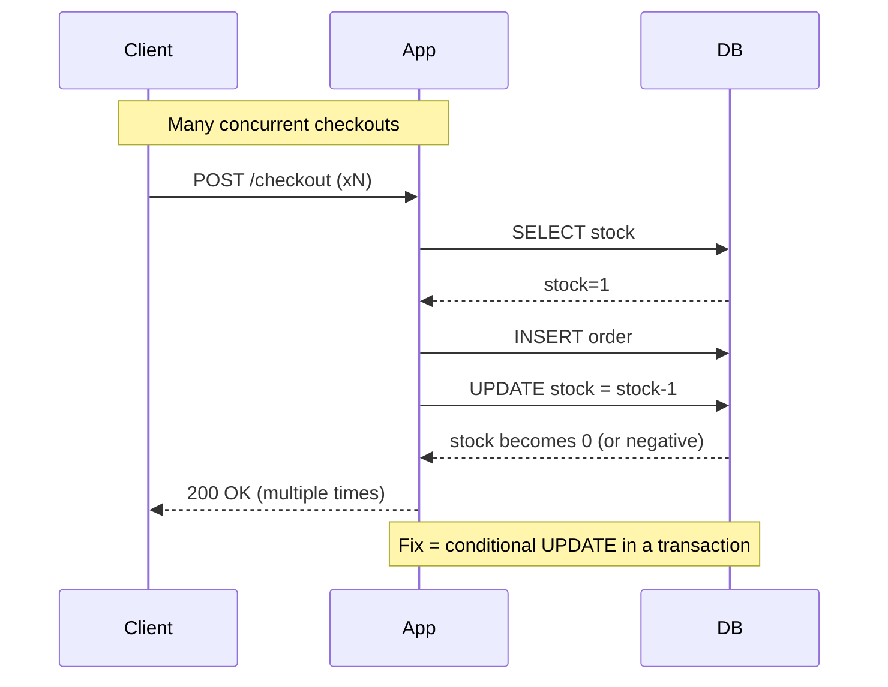

# AoC 2025 — Day 20: Race Conditions (Toy to The World)

## Summary

Race conditions are *timing bugs* (并发时序漏洞) where **two or more requests hit the same shared state** (库存、余额、订单状态) and the final outcome depends on the order in which the server processes them. In this lab, a limited-stock checkout flow oversells items because the application **trusts “one request at a time”**, but the attacker forces **many identical checkouts to execute concurrently**.

The security lesson is simple but brutal: **a correct workflow in serial execution can become wrong under concurrency**.

---

## Key concepts

### What a race condition is

A race condition happens when:

* multiple actions run “at the same time” (concurrent requests), and
* they **read/modify** the same resource, and
* the system **does not enforce synchronisation** (locking / atomic commit), so
* the result becomes inconsistent (oversell, double-spend, duplicate orders).

### Three common categories

1. **TOCTOU (Time-of-Check to Time-of-Use, 检查-使用时间差)**

* The app checks `stock > 0`, then later decrements stock.
* Another request “slips in” between check and update.

2. **Shared resource races (共享资源竞争)**

* Multiple requests update the same row (inventory) without coordination.
* “Last writer wins” can overwrite intermediate state.

3. **Atomicity violation (原子性破坏)**

* A multi-step operation (charge → create order → decrement stock) is not executed as one indivisible unit.
* Partial success creates inconsistent business state.

---

## The core bug (business logic view)

### Vulnerable logic pattern

Below is the *shape* of the vulnerability (not language-specific):

```text
01  if stock[item_id] > 0:          # check
02      create_order(user, item_id) # use
03      stock[item_id] -= 1         # update
04      return "paid"
```

Why it breaks:

* With concurrency, several requests can pass line 01 before any request reaches line 03.
* Result: multiple orders succeed even when there was only 1 unit left.

### Safer logic shape

The fix direction is: **make the check+decrement atomic**.

```text
01  begin_transaction()
02  rows = UPDATE inventory
03         SET stock = stock - 1
04         WHERE item_id = ? AND stock > 0
05  if rows == 0:
06      rollback(); return "out_of_stock"
07  create_order(...)
08  commit(); return "paid"
```

---

## Lab workflow (authorised training environment)

> Context: A demo shop (TBFC) sells a limited edition item (10 units). You first perform one legitimate checkout, then replay the same checkout request concurrently using Burp.

### 1) Establish a baseline

* Log in (lab-provided credentials).
* Add the limited item to cart → Checkout → Confirm & Pay.
* Verify one normal order exists.

Baseline matters because you need a *known-good* request to replay.

### 2) Capture the checkout request

* Ensure Burp **Intercept is OFF** (so your browser traffic flows).
* In **Proxy → HTTP history**, locate the POST request that performs checkout (e.g., an endpoint like `/process_checkout`).
* **Send to Repeater**.

### 3) Force concurrency in Repeater

Inside **Repeater**:

* Create a **tab group** (e.g., `cart`).
* Duplicate the same request many times (e.g., 10–15 copies).
* Use **Send group in parallel (last-byte sync)**.

Why “last-byte sync” helps: it maximises overlap so requests compete for the same stock check/update window.

### 4) Observe the outcome

* Return to the shop page / orders page.
* Typical vulnerable symptom set:

  * Many “successful” orders from one cart.
  * Stock drops below zero or below expected limits.

---

## How to recognise you’ve found a real race condition

Signals that are hard to explain without concurrency issues:

* **Negative inventory** (库存变负数).
* Two different order confirmations for the **same item when stock was 1**.
* In logs: multiple requests read identical “pre-update” stock.
* Payment/order mismatch: payment recorded multiple times while inventory update lags.

---

## Mitigation and defensive strategies

### 1) Make inventory updates atomic

* Use database transactions and row-level locking where appropriate.
* Prefer **single-statement conditional updates** (UPDATE … WHERE stock > 0) to avoid separate check + use steps.

### 2) Add idempotency to “checkout”

Use an **Idempotency Key (幂等键)** so the server treats repeated identical checkouts as the *same operation*.

* Client generates a unique key per checkout attempt.
* Server stores key → response mapping.
* Duplicate submissions return the original result instead of re-processing.

### 3) Concurrency controls at the application layer

* Per-user / per-session **concurrent checkout limit**.
* Rate limiting and burst control.
* Queue-based checkout (serialize critical section).

### 4) Validate as late as possible

* Perform a **final stock validation right before commit**.
* Don’t validate only in the UI or at “add to cart”.

---

## Practical impact beyond the lab

Race conditions are not “toy” bugs. Typical real-world equivalents:

* Ticketing platforms overselling seats.
* Coupon redemption being applied multiple times.
* Financial transfer double-spend / balance desync.
* Access control workflows where final step is reachable before required checks.

---

## Testing mindset

Race-condition testing is more like physics than syntax:

* You are manipulating **timing** and **overlap**.
* Results can be non-deterministic; repeat runs may differ.
* Your test tool is essentially a concurrency generator.

---

## Pitfalls

* **CSRF / one-time tokens**: some apps include a nonce per checkout; duplicates fail unless you refresh tokens.
* **Session coupling**: parallel requests might share cookies; if the server invalidates sessions after checkout, later requests fail.
* **False positives**: UI showing stale stock can mimic a race; confirm at database/response level.

---

## Mermaid: vulnerable vs fixed flow



---

## Takeaways

* Treat business workflows as **concurrent systems**, not linear scripts.

* The correct fix is rarely “validate earlier”; it is usually **make state changes atomic**.

* Idempotency is not optional for payment/checkout-like operations.


---

## Chinese glossary

* **Race condition**：竞态条件 / 并发时序漏洞
* **TOCTOU**：检查-使用时间差漏洞
* **Atomicity**：原子性（要么全做完，要么完全不做）
* **Idempotency key**：幂等键（重复提交不重复执行）
* **Row-level lock**：行级锁
* **Transaction**：事务

---

## Related tools

* Burp Suite: Proxy, Repeater (group parallel send)

* FoxyProxy (browser → Burp routing)

* Load generators: `hey`, `ab`, `wrk`, `k6`, `locust`


## Further reading

* OWASP Web Security Testing Guide (race condition / business logic testing)

* PortSwigger Web Security Academy: Race conditions; last-byte sync technique

* OWASP Business Logic Abuse Top 10 (workflow order bypass / race patterns)

