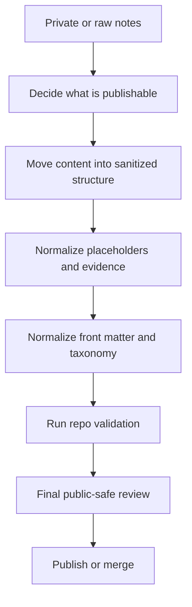

# Publication Workflow

Date: 2026-03-24

## Purpose

This workflow describes how to move from private or raw working notes to a public sanitized note that is safe to keep in this repository.

It is the publication hardening layer that sits on top of:

* taxonomy governance in [docs/taxonomy-closure.md](./taxonomy-closure.md)
* placeholder governance in [docs/placeholder-closure.md](./placeholder-closure.md)
* canonical placeholder rules in [docs/placeholder-policy.md](./placeholder-policy.md)
* the public scaffold in [templates/writeup_sanitized.md](../templates/writeup_sanitized.md)

## Publication Flow



## Step 1: Start From The Private Source

The private or raw note may contain:

* live targets
* secret-bearing evidence
* noisy command transcripts
* incomplete taxonomy or front matter
* internal-only investigative context

Do not publish directly from that state.

First decide whether the material is:

* authorized for publication
* safe to sanitize without changing meaning
* still useful after removing private evidence

## Step 2: Move Into The Public Shape

For new public writeups, start from [templates/writeup_sanitized.md](../templates/writeup_sanitized.md).

That template is the default public-safe shape for:

* summary
* scope and sanitization
* findings
* evidence handling
* defensive notes
* references

If you are editing an existing public note instead of creating a new one, bring it toward the same structure and publication standards without rewriting technical meaning.

## Step 3: Sanitize Identifiers And Evidence

Apply the canonical placeholder rules from [docs/placeholder-policy.md](./placeholder-policy.md).

Required behaviors:

* replace live identifiers with canonical placeholders
* use neutral redaction placeholders for hidden sensitive values
* do not invent note-local or challenge-themed placeholder names
* keep literal identifiers literal when the policy says they are the subject of the note

Also remove or neutralize:

* secrets and credentials
* session tokens and cookies
* customer-specific names
* unnecessary raw evidence that would not survive public release

Use [SANITIZATION_CHECKLIST.md](../SANITIZATION_CHECKLIST.md) as the final operational checklist.

## Step 4: Normalize Front Matter And Taxonomy

Public notes must stay aligned with the repo taxonomy rules.

Use [docs/taxonomy-closure.md](./taxonomy-closure.md) as the source of truth for:

* canonical taxonomy source
* derived tags document expectations
* future taxonomy-change process

That means:

* do not invent front matter tags locally
* keep active-note front matter converged with `schemas/taxonomy.json`
* treat `TryHackMe/_meta/TAGS.md` as derived output

## Step 5: Run Validation

Before publishing, run the repo checks used by normal maintenance work:

```text
python scripts/render_tags_doc.py --check
python scripts/render_readme_snapshot.py --check
python scripts/check_placeholders.py <changed files>
python scripts/check_markdown.py
python -m pre_commit run --files <changed files>
```

Optional maintainer checkpoint when you want a repo-wide markdownlint audit instead of changed-files-only validation:

```text
python scripts/generate_markdownlint_debt.py
```

These checks fit together as follows:

* `render_tags_doc.py --check` protects taxonomy-derived documentation
* `render_readme_snapshot.py --check` protects the derived repository snapshot in `README.md`
* `check_placeholders.py` protects the public-safe placeholder boundary
* `check_markdown.py` protects front matter and markdown consistency
* `pre_commit` runs the changed-files enforcement layer used by the repo workflow
* `generate_markdownlint_debt.py` provides a manual tracked-file repo-wide markdownlint baseline when needed

## Step 6: Perform A Human Publication Review

Automated checks are necessary but not sufficient.

Before publishing, perform one manual review focused on:

* real names
* IPs, domains, hostnames, URLs, and email addresses
* screenshots and attachments
* terminal output copied into prose or code blocks
* whether the note teaches safely instead of publishing a secret-bearing recipe

If a note still depends on private material to make sense, do not publish it yet.

## Future Changes

If publication work reveals a gap in the governance layer:

* placeholder gap: follow [docs/placeholder-closure.md](./placeholder-closure.md)
* taxonomy gap: follow [docs/taxonomy-closure.md](./taxonomy-closure.md)

Do not solve governance gaps by improvising one-off local conventions in the note itself.

## Maintainer Rule Of Thumb

The public version should preserve:

* technical accuracy
* reusable reasoning
* defensive value

The public version should not preserve:

* live identifiers
* secrets
* unnecessary raw exploit detail
* organization-specific private context
