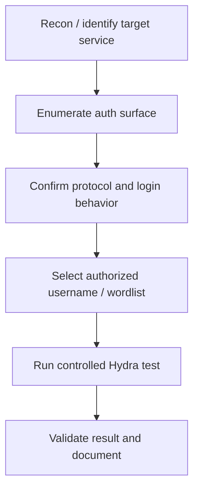
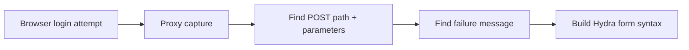

# Hydra

## Summary

* **Hydra (THC-Hydra)** is a fast network login cracker used to test authentication across many protocols.
* The room's real value is not "click button, get password." The value is understanding **how online authentication testing works**, how Hydra's syntax is structured, and why web forms require more context than simple service logins.
* Hydra is most useful in **authorized password auditing**, lab work, CTFs, and internal security validation.
* The two beginner patterns that matter most are:
  * **single-user + password list** testing,
  * **HTTP form brute forcing** where you must correctly map the login request and failure condition.
* Hydra belongs in the **enumeration / access-testing** part of a workflow, not as the first thing you launch at a target.
* Defensive takeaway: weak/default passwords, no lockout, and poor rate-limiting are what make tools like Hydra effective.

---

## 1. Context

This room introduces Hydra as a practical authentication-testing tool. In plain language, Hydra automates repeated login attempts against supported services so you can validate whether weak credentials are accepted.

That makes Hydra important for two reasons:

1. **Offensive education**: it teaches how authentication is actually tested.
2. **Defensive understanding**: it reveals exactly why weak passwords, no MFA, poor lockout policy, and exposed login surfaces are dangerous.

The room is intentionally basic. It focuses on syntax, core options, and two high-value use cases:

* SSH login testing
* HTTP POST form login testing

---

## 2. Scope / Rules of Engagement

Use Hydra only in:

* TryHackMe labs,
* CTFs,
* your own systems,
* explicitly authorized security assessments.

Do **not** use Hydra against third-party services or public targets without written permission.

This note uses placeholders only:

* `TARGET_IP`
* `TARGET_HOST`
* `USER_A`
* `/path/to/passwords.txt`
* `/login`
* `FAIL_MESSAGE`

---

## 3. What Hydra Is

Hydra is a **parallelized online authentication testing tool**. It works against many protocols by repeatedly attempting logins with supplied usernames and passwords.

Key idea:

```text
Hydra does not "break encryption."
Hydra tests whether the target accepts one of the credential guesses you provide.
```

So Hydra's effectiveness depends less on magic and more on:

* weak passwords,
* default credentials,
* reused credentials,
* poor login protections,
* exposed authentication services.

---

## 4. Where Hydra Fits in the Methodology

Hydra is not usually phase-one tooling.

A better workflow is:



Hydra belongs after you already know:

* what service exists,
* what username(s) are in scope,
* whether the service is rate-limited,
* what type of login flow you are dealing with.

This is why Hydra is better thought of as **credential validation automation**, not "hacking in one command."

---

## 5. Core Syntax Model

### 5.1 Minimal mental model

Hydra commands usually combine four parts:

1. **identity input**
2. **password input**
3. **target**
4. **service/module syntax**

### Common options beginners should know

* `-l` -> one username
* `-L` -> username list
* `-p` -> one password
* `-P` -> password list
* `-t` -> thread count
* `-V` -> verbose output

### Core distinction

```text
lowercase = single value
uppercase = wordlist / multiple values
```

That one distinction removes a lot of beginner confusion.

---

## 6. Two Core Room Workflows

### 6.1 SSH authentication testing

SSH is the simpler beginner case because the protocol is direct and Hydra already knows how to speak to it.

#### Generic safe syntax

```text
hydra -l USER_A -P /path/to/passwords.txt ssh://TARGET_IP
```

What this means:

* test one username,
* iterate over a password list,
* use the SSH module against the target.

#### Why SSH is conceptually easier

Hydra already understands:

* where the username goes,
* where the password goes,
* what a login success/failure looks like at the protocol layer.

So the human work is minimal.

### 6.2 HTTP POST form testing

Web forms are the more important beginner lesson because they force you to understand the structure of the request.

#### Why web forms are harder

Unlike SSH, Hydra cannot guess the exact form parameters unless you provide them.

You must identify:

* the login path,
* the parameter names,
* where `USER` and `PASS` should be inserted,
* what failed login looks like.

#### Generic safe syntax pattern

```text
hydra -l USER_A -P /path/to/passwords.txt TARGET_IP http-post-form "/login:user=^USER^&password=^PASS^:FAIL_MESSAGE"
```

#### Three parts inside the HTTP form module string

```text
/path:parameter_map:failure_indicator
```

##### Part 1 - path

Example placeholder:

```text
/login
```

##### Part 2 - parameter map

Example placeholder:

```text
user=^USER^&password=^PASS^
```

This tells Hydra where to substitute the tested username and password.

##### Part 3 - failure indicator

Example placeholder:

```text
Invalid credentials
```

Hydra needs a string that indicates the login failed. If that failure string appears, Hydra treats the attempt as unsuccessful.

#### Practical lesson

HTTP form brute forcing is really a **request-analysis task** before it becomes a Hydra task.

That is why tools like Burp Suite are often used first: not because Hydra is complicated, but because web applications are.

---

## 7. Why Capturing the Request Matters

For web authentication, the critical skill is not memorizing Hydra syntax. It is extracting the correct request shape.

A normal workflow looks like this:

1. submit a dummy login in the browser,
2. capture the request,
3. inspect the form field names,
4. inspect the response body for failure text,
5. translate that into Hydra module syntax.

### Mini diagram



This is the actual skill the room is trying to teach.

---

## 8. Threading and Performance

Hydra supports parallel attempts, which is why `-t` exists.

### What thread count changes

Higher concurrency can:

* speed up testing,
* create more load,
* trigger defenses faster,
* produce errors on unstable targets.

### Practical rule

If the service is unstable or the lab is slow:

* reduce thread count,
* favor clean results over artificial speed.

Hydra is fast enough already. Bad thread tuning mainly creates noisy failures.

---

## 9. Why Hydra Works When It Works

Hydra succeeds when the target's authentication design is weak.

Common causes:

* default credentials remain unchanged,
* weak passwords are allowed,
* no account lockout,
* poor throttling or no rate limits,
* no MFA,
* predictable username policy,
* exposed services reachable from the network.

### Defensive inversion

If you want Hydra to fail in the real world, fix those conditions.

---

## 10. Pattern Cards

### Pattern Card 1 - Protocol-aware difficulty

**Idea**
: some services are easy to test because the authentication flow is standardized.

**Example**
: SSH is simpler than a custom web login form.

**Lesson**
: difficulty is often about request structure, not about Hydra itself.

### Pattern Card 2 - Form analysis before automation

**Idea**
: web authentication testing starts with observing the request.

**Example**
: identify `/login`, `username=...`, `password=...`, and the failed-login text.

**Lesson**
: Burp first, Hydra second.

### Pattern Card 3 - Lowercase vs uppercase option logic

**Idea**
: Hydra distinguishes single values from lists by capitalization.

**Example**
: `-l` vs `-L`, `-p` vs `-P`.

**Lesson**
: this is one of the highest-value syntax rules to memorize.

### Pattern Card 4 - Authentication testing is not exploitation theater

**Idea**
: Hydra validates credential weakness. It is not a universal access tool.

**Example**
: if the password list is poor or the account is protected, Hydra gets you nowhere.

**Lesson**
: results are driven by target weakness, not tool mystique.

### Pattern Card 5 - Weak credentials are an application security issue

**Idea**
: successful brute force is often evidence of a policy failure.

**Example**
: no MFA + no lockout + common password.

**Lesson**
: Hydra findings should map directly to remediation.

---

## 11. Command Cookbook

> Authorized labs and internal testing only. All targets and values are placeholders.

### Single user + password list against SSH

```text
hydra -l USER_A -P /path/to/passwords.txt ssh://TARGET_IP
```

### One username + one password against a service

```text
hydra -l USER_A -p CANDIDATE_PASSWORD ssh://TARGET_IP
```

### Multiple users + password list

```text
hydra -L /path/to/users.txt -P /path/to/passwords.txt ssh://TARGET_IP
```

### Lower concurrency

```text
hydra -l USER_A -P /path/to/passwords.txt -t 4 ssh://TARGET_IP
```

### Verbose output

```text
hydra -l USER_A -P /path/to/passwords.txt -V ssh://TARGET_IP
```

### Generic HTTP POST form pattern

```text
hydra -l USER_A -P /path/to/passwords.txt TARGET_IP http-post-form "/login:user=^USER^&password=^PASS^:FAIL_MESSAGE"
```

### Generic HTTPS POST form pattern

```text
hydra -l USER_A -P /path/to/passwords.txt TARGET_HOST https-post-form "/login:user=^USER^&password=^PASS^:FAIL_MESSAGE"
```

### Interpretation checklist before running

```text
- correct path?
- correct parameter names?
- correct failure string?
- correct username scope?
- acceptable thread count?
- explicit authorization?
```

---

## 12. Evidence / Lab Notes

### Main learning objective of the room

The real conceptual jump in this room is:

```text
simple protocol login testing < web-form login testing
```

because web forms force you to think about:

* request verbs,
* parameter names,
* response-based failure detection.

### Most transferable skill

The most reusable skill from this room is not "Hydra syntax." It is:

> translating an observed authentication request into a tool-ready test case.

That transfer skill applies far beyond Hydra.

---

## 13. Defensive Takeaways

A Hydra success should trigger questions like:

* Why was this password allowed?
* Why was MFA absent?
* Why was there no lockout or delay?
* Why is this service publicly reachable?
* Why are default credentials still active?
* Why is monitoring not detecting rapid failures?

### Good mitigations

* strong password policy
* unique passwords
* MFA
* account lockout / backoff
* login throttling / rate limiting
* IP reputation / WAF rules where appropriate
* disable default credentials
* restrict service exposure
* monitor authentication logs

---

## 14. Common Pitfalls

### 14.1 Forgetting to extract or locate the wordlist

This is a trivial problem, but it blocks many beginners immediately.

### 14.2 Using the wrong failure string

If the failure indicator is wrong, Hydra may misread the result and produce nonsense.

### 14.3 Guessing parameter names instead of capturing the request

This is the classic web-form mistake.

### 14.4 Treating HTTP and HTTPS forms as interchangeable

The module and endpoint details must match reality.

### 14.5 Using too many threads on fragile targets

You end up stress-testing the service more than testing credentials.

---

## 15. Takeaways

* Hydra is best understood as a **fast, protocol-aware authentication testing tool**.
* The key syntax rule is the lowercase/uppercase distinction between single values and lists.
* SSH testing is straightforward because the service model is standardized.
* HTTP form testing is more valuable because it teaches request analysis.
* Hydra is only effective when the target's authentication controls are weak.
* The blue-team lesson is clear: strong passwords, MFA, lockout, throttling, and logging sharply reduce the value of tools like Hydra.

---

## 16. CN-EN Glossary

* Hydra / THC-Hydra - Hydra 登录爆破工具
* Brute Force - 暴力破解
* Password List / Wordlist - 密码字典 / 词表
* Username List - 用户名字典
* Authentication Surface - 认证攻击面
* HTTP POST Form - HTTP POST 登录表单
* Failure Indicator - 失败标识字符串
* Rate Limiting - 速率限制
* Account Lockout - 账户锁定
* Default Credentials - 默认凭据
* Multi-Factor Authentication (MFA) - 多因素认证
* Thread Count - 线程数 / 并发数
* Request Capture - 请求抓取
* Parameter Mapping - 参数映射
* Credential Validation - 凭据验证

---

## 17. References

* THC-Hydra official project documentation
* Kali Linux Hydra tool page
* OWASP guidance on brute force attacks and authentication defenses
