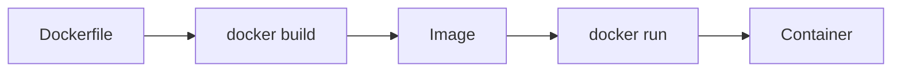
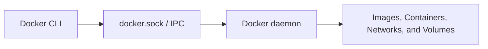
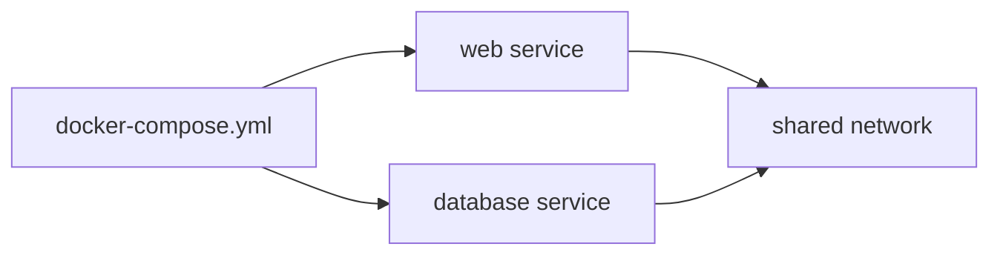

# Intro to Docker

## Summary

* Docker packages an application and its dependencies into a portable unit built from an **image** and executed as a **container**.
* The core workflow is simple: **pull image -> run container -> inspect state -> build your own image -> orchestrate multiple services with Compose**.
* A `Dockerfile` defines how an image is built. A `docker-compose.yml` or Compose file defines how multiple services run together.
* Docker works in a **client/server model**. The Docker CLI sends requests to the Docker daemon through a socket, which is a form of **IPC (Interprocess Communication)**.
* In the room practical, the already-running container is **CloudIsland**, and the webserver flag is **`FLAG_REDACTED`**.

---

## 1. Core Mental Model

```text
Dockerfile --> docker build --> Image --> docker run --> Container
```

A useful distinction:

* **Image**: a read-only blueprint
* **Container**: a running instance of that blueprint

Another useful distinction:

* **Single container**: one isolated application process
* **Compose application**: multiple related services managed together

---

## 2. Why Docker Matters

Docker solves a very old systems problem:

```text
"It works on my machine" -> package the exact runtime -> run it consistently elsewhere
```

This matters because an application rarely depends only on source code. It also depends on:

* OS assumptions
* package versions
* filesystem layout
* exposed ports
* environment variables
* runtime commands

Docker makes these dependencies explicit and portable.

---

## 3. Basic Docker Command Map

### 3.1 Image lifecycle

```bash
# pull an image
docker pull IMAGE

# list local images
docker image ls

# remove an image
docker image rm IMAGE:TAG
```

Examples:

```bash
docker pull tryhackme
docker pull tryhackme:1337
docker image ls
docker image rm ubuntu:22.04
```

### 3.2 Container lifecycle

```bash
# run interactively
docker run -it IMAGE /bin/bash

# run in background
docker run -d IMAGE

# publish a port
docker run -p LISTEN_PORT:TARGET_PORT IMAGE

# list running containers
docker ps

# list all containers, including stopped
docker ps -a
```

Examples:

```bash
docker run -it helloworld /bin/bash
docker run -d helloworld
docker run -p 80:80 webserver
docker ps
docker ps -a
```

---

## 4. High-Value Runtime Flags

| Flag | Meaning | Typical use |
| --- | --- | --- |
| `-it` | interactive terminal | shell access, debugging |
| `-d` | detached or background mode | services, daemons, web servers |
| `-p` | port publishing | expose container service to host |
| `-v` | volume mount | persist data or mount host files |
| `--rm` | auto-remove on exit | ephemeral lab containers |
| `--name` | friendly container name | easier management than random names |

Example:

```bash
docker run -d --name webserver -p 80:80 webserver
```

---

## 5. Dockerfile Fundamentals

A `Dockerfile` is an instruction file for building an image.

General format:

```dockerfile
INSTRUCTION argument
```

### 5.1 Most important instructions

| Instruction | Purpose |
| --- | --- |
| `FROM` | choose base image |
| `RUN` | execute build-time command |
| `COPY` | copy files into image |
| `WORKDIR` | set working directory |
| `CMD` | default runtime command |
| `EXPOSE` | document intended container port |

### 5.2 Minimal example

```dockerfile
FROM ubuntu:22.04
WORKDIR /
RUN touch helloworld.txt
```

Build it:

```bash
docker build -t helloworld .
```

### 5.3 Web server example

```dockerfile
FROM ubuntu:22.04
RUN apt-get update -y && apt-get install -y apache2
EXPOSE 80
CMD ["apache2ctl", "-D", "FOREGROUND"]
```

Build and run:

```bash
docker build -t webserver .
docker run -d --name webserver -p 80:80 webserver
```

---

## 6. Build-Time vs Run-Time Thinking

This distinction matters a lot.

### 6.1 Build-time

Executed while creating the image:

* `FROM`
* `RUN`
* `COPY`
* `WORKDIR`

### 6.2 Run-time

Executed when starting the container:

* `CMD`
* `docker run ...`
* port mapping
* volumes
* environment variables

A common beginner confusion:

```text
RUN installs or prepares things.
CMD starts the application.
```

---

## 7. Dockerfile Optimization

Every Dockerfile instruction creates a new layer. More layers usually mean slower builds and more clutter.

### 7.1 Less efficient

```dockerfile
FROM ubuntu:latest
RUN apt-get update -y
RUN apt-get upgrade -y
RUN apt-get install apache2 -y
RUN apt-get install net-tools -y
```

### 7.2 Better

```dockerfile
FROM ubuntu:latest
RUN apt-get update -y && apt-get upgrade -y && apt-get install -y apache2 net-tools
```

Optimization principles:

* install only what you need
* reduce layer count
* clean caches when reasonable
* prefer smaller base images when compatible
* keep one container focused on one main process

---

## 8. Docker Compose Fundamentals

Docker Compose is for **multi-container applications**.

Think:

```text
web app + database + shared network + config
```

instead of launching each container manually.

### 8.1 Core commands

```bash
docker-compose up
docker-compose down
docker-compose build
docker-compose stop
docker-compose start
```

Key points:

* `up` -> create, build, and start services
* `down` -> stop and remove services
* `build` -> build images only
* `stop` -> stop but do not remove
* `start` -> start existing stopped services

### 8.2 Compose file name

```text
docker-compose.yml
```

### 8.3 Minimal Compose example

```yaml
version: '3.3'
services:
  web:
    build: ./web
    networks:
      - ecommerce
    ports:
      - '80:80'

  database:
    image: mysql:latest
    networks:
      - ecommerce

networks:
  ecommerce:
```

### 8.4 Why Compose is useful

* one command starts the stack
* service networking is easier
* configuration is portable
* easier to version control and share
* less manual drift than one-off commands

---

## 9. Docker Client, Server, and Socket

Docker uses a **client/server architecture**.

```text
Docker CLI (client)
    -> sends request
Docker socket
    -> IPC channel
Docker daemon or server
    -> executes API request
```

The room explains Docker through the socket model.

### 9.1 Important terms

* **IPC** = **Interprocess Communication**
* Docker Server can be understood as an **API** interface exposed by the daemon

### 9.2 Why this matters for security

If the Docker socket is exposed incorrectly, another local or remote process may be able to control containers on the host.

That can lead to:

* starting containers
* stopping containers
* inspecting containers
* mounting host directories
* privilege escalation paths

This is why `docker.sock` exposure is a serious security topic.

---

## 10. Practical Task Notes

From the provided screenshots and room flow:

### 10.1 Existing running container

```text
CloudIsland
```

This came from `docker ps`.

### 10.2 Command to start the provided web server image

```bash
docker run -d -p 80:80 webserver
```

### 10.3 Practical flag

```text
FLAG_REDACTED
```

---

## 11. Command Cookbook

### 11.1 Images

```bash
docker pull nginx
docker pull ubuntu:22.04
docker image ls
docker image rm ubuntu:22.04
```

### 11.2 Containers

```bash
docker run -it helloworld /bin/bash
docker run -d helloworld
docker run -p 80:80 webserver
docker run -d --name webserver -p 80:80 webserver
docker ps
docker ps -a
```

### 11.3 Build

```bash
docker build -t helloworld .
docker build -t webserver .
```

### 11.4 Compose

```bash
docker-compose up
docker-compose down
docker-compose build
docker-compose stop
docker-compose start
```

---

## 12. Mini Q&A / Answer Bank

| Prompt | Answer |
| --- | --- |
| Pull an image | `docker pull` |
| List images | `docker image ls` |
| Pull `tryhackme` | `docker pull tryhackme` |
| Pull `tryhackme:1337` | `docker pull tryhackme:1337` |
| Run interactively | `docker run -it` |
| Run detached | `docker run -d` |
| Bind webserver to port 80 | `docker run -p 80:80` |
| List running containers | `docker ps` |
| List all containers | `docker ps -a` |
| Base image instruction | `FROM` |
| Run command in Dockerfile | `RUN` |
| Build image from Dockerfile | `docker build` |
| Name or tag image on build | `-t` |
| Compose start services | `up` |
| Compose delete services | `down` |
| Compose file name | `docker-compose.yml` |
| IPC meaning | `Interprocess Communication` |
| Docker Server equivalent | `API` |
| Existing running practical container | `CloudIsland` |
| Practical web flag | `FLAG_REDACTED` |

---

## 13. Common Pitfalls

### 13.1 Confusing image and container

An image is not running. A container is.

### 13.2 Forgetting port publishing

A web service inside a container is not automatically reachable from the host.

You often need:

```bash
-p host_port:container_port
```

### 13.3 Mixing `RUN` and `CMD`

* `RUN` = build phase
* `CMD` = container start phase

### 13.4 Assuming containers behave like full VMs

Containers are lighter and usually run one main process. They do not behave like a full desktop or server install with a complete init system.

### 13.5 Exposing Docker socket carelessly

This is a real security risk, especially in CI/CD, admin panels, or poorly isolated environments.

---

## 14. Visual Summary







---

## 15. Takeaways

* Learn the small command vocabulary first; Docker is much less scary after that.
* `docker run`, `docker ps`, `docker image ls`, and `docker build` are the core primitives.
* `Dockerfile` describes one image. Compose describes one multi-service application.
* The Docker socket is operationally powerful and security-sensitive.
* A clean mental model beats memorizing random flags.

---

## 16. Related Tools

* Docker CLI
* Docker daemon
* Docker Compose
* Apache2 (example service)
* MySQL (example service)

---

## 17. Further Reading

* Dockerfile reference
* Docker `run` reference
* Docker Compose manual
* Compose file reference
* Docker daemon and socket security guidance

---

## 18. CN-EN Glossary

* Container - 容器
* Image - 镜像
* Dockerfile - 镜像构建说明文件
* Compose file - 多容器编排配置文件
* Port publishing - 端口映射 / 端口发布
* Volume mount - 卷挂载 / 宿主机目录挂载
* Detached mode - 后台运行模式
* Interactive mode - 交互模式
* Docker daemon - Docker 守护进程
* Socket - 套接字
* IPC - 进程间通信
* Layer - 镜像层
* Base image - 基础镜像
* Runtime command - 运行时命令
* Build context - 构建上下文
* Orchestration - 编排
