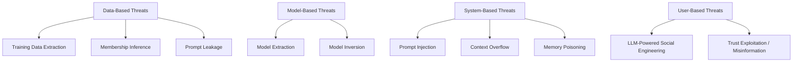

# LLM Security

## Summary

* LLMs create a **different attack surface** from traditional ML because they accept natural language, preserve context, and can be integrated into tools, memory, and user workflows.
* A practical way to organize the room is by **four threat families**: **data-based**, **model-based**, **system-based**, and **user-based**.
* The sharp distinction to remember is this: **training data extraction** leaks memorized content, while **membership inference** only tells you whether a known sample was in training.
* Model-side risk is not just "the model says weird things." It includes **model extraction** and **model inversion**.
* System-side risk comes from one brutal design fact: the LLM processes instructions, retrieved content, and user input as one token stream, so **prompt injection**, **context overflow**, and **memory poisoning** become realistic.
* User-side risk matters because LLMs scale old human-targeting attacks: they improve **social engineering** and enable **trust exploitation / misinformation**.



---

## 1. Why LLM Security Is Its Own Topic

Traditional ML security often focuses on things like:

* poisoning training data
* model evasion
* adversarial examples
* privacy leakage

LLM security keeps those concerns, but adds something qualitatively new:

```text
natural language as the universal interface
```

That one change produces several consequences:

* almost any text becomes potential control input
* boundaries between trusted and untrusted content become soft
* users can manipulate the system without technical exploit primitives
* outputs become persuasive social objects, not just labels or scores

This is why LLM security feels closer to a blend of:

* application security
* human factors / social engineering
* ML privacy/security
* secure systems design

---

## 2. Threat Family 1 - Data-Based Threats

LLMs are trained on huge corpora and may internalize patterns from them. That creates a reversal risk: instead of data flowing **into** the model, attackers try to make data flow **out of** it.

### 2.1 Training Data Extraction

**Definition**

The attacker tries to recover memorized snippets from the original training data by crafting prompts and analyzing outputs.

**Core logic**

The model is pushed into generating content that looks:

* unusually confident
* highly deterministic
* structured and realistic
* suspiciously specific

Then the attacker checks whether the output corresponds to real source material such as:

* emails
* credentials
* keys
* internal text
* personal data

**Key distinction**

This attack **generates unknown candidate content** and checks whether it appears memorized.

**Attack surface**

* confidentiality of training data

**Input / Output shape**

| Element | Meaning |
| --- | --- |
| Input | crafted prompts designed to trigger memorized content |
| Output | verbatim or near-verbatim training data |

### 2.2 Membership Inference

**Definition**

The attacker already has a candidate sample and wants to know whether that exact sample was part of training.

**Core logic**

This is not "give me the secret."
This is "did you see this before?"

The attacker measures signals like:

* confidence
* likelihood
* perplexity
* familiarity of response

A model often behaves differently on seen vs unseen examples.

**Key distinction**

This attack does **not reconstruct unknown text**. It tests whether a **known sample** influenced training.

**Attack surface**

* training set membership / privacy metadata

**Task anchor from the room**

From the demonstration transcript, the three candidate placeholders produced different confidence values, and the strongest candidate was the sample labeled `MI_SAMPLE_BRAVO`.

That is the member sample.

### 2.3 Prompt Leakage / System Prompt Exposure

**Definition**

The user coerces the model into revealing hidden system or developer instructions.

**Why this matters**

System prompts are often treated like hidden control logic or product IP. Once revealed, they may expose:

* safety rules
* response constraints
* tool descriptions
* hidden policies
* implementation hints

**Security reading**

This is a data-oriented disclosure issue, but it also overlaps heavily with prompt injection and broader architecture flaws.

**Mental model**

To the LLM, the system prompt and user text both become context tokens. The separation is intended, not hard-enforced.

---

## 3. Threat Family 2 - Model-Based Threats

These attacks target the **model itself** as the object of abuse.

### 3.1 Model Extraction

**Definition**

The attacker copies the model's capabilities by sending many queries and collecting input-output pairs, then trains a surrogate model to imitate the target.

**What is being stolen**

Usually not a perfect raw copy of weights, but something still valuable:

* behavior
* task capability
* decision boundaries
* effective functionality
* distilled model performance

**Why it matters**

This is mostly an **economic / intellectual property** problem.

If a company spent a lot of money building or fine-tuning an LLM, the attacker can parasitize that investment.

**Attack surface**

* model parameters / learned capability / intellectual property

**Input / Output shape**

| Element | Meaning |
| --- | --- |
| Input | many carefully chosen API queries |
| Output | surrogate model approximating target behavior |

### 3.2 Model Inversion

**Definition**

The attacker uses outputs or internal representations to reconstruct sensitive information encoded inside the model.

**The clean distinction from membership inference**

* **Membership inference** asks: *was this exact sample seen?*
* **Model inversion** asks: *what hidden data or attributes can I reconstruct from what the model learned?*

**Task anchor from the room**

The redacted record was reconstructed as:

* Employee ID: `7814`
* Department: `Research`
* Clearance: `C3`

So the employee ID answer is:

* **7814**

And the named model-based threat is:

* **model inversion**

**Attack surface**

* internal representations / encoded sensitive features

**Output style**

This can reconstruct:

* hidden attributes
* training-derived details
* previously unknown sensitive content

---

## 4. Threat Family 3 - System-Based Threats

This is where LLM security becomes an application-security problem.

The crucial architectural fact is:

```text
LLMs process system instructions, retrieved data, and user input as a single concatenated context.
```

That is the root enabler for several threat classes.

### 4.1 Prompt Injection

**Definition**

A malicious input alters the model's behavior by manipulating the shared context window.

**Why it works**

The model does not have a hard security boundary between:

* trusted instructions
* retrieved content
* untrusted user text

So attacker-controlled text can compete with or override intended behavior.

**Attack surface**

* instruction hierarchy inside the context window

**Output / effect**

* policy bypass
* altered model behavior
* unsafe tool use
* rule evasion

**Better framing**

Prompt injection is best understood as **context-window poisoning**.

### 4.2 Context Overflow / Unbounded Consumption

**Definition**

The attacker abuses token limits or context size to either:

* push important safeguards out of the window
* degrade service
* increase cost
* cause denial of service

**Core mechanism**

The room uses the FIFO analogy correctly:

* once the context is full, new tokens may cause earlier tokens to fall out
* if earlier tokens included system rules or security instructions, those protections weaken

**Attack surface**

* context window size
* inference resources
* token budget
* cost model

**Operational consequence**

This is both a quality problem and a security problem.

In hosted environments it also becomes a **financial abuse** problem.

### 4.3 Memory Poisoning

**Definition**

The attacker causes false or malicious information to be stored in persistent conversation memory, influencing future responses.

**Difference from prompt injection**

* prompt injection can be one-shot
* memory poisoning is persistent across turns or sessions

**Room demonstration**

The user repeatedly pushed the claim that cat equals dog, then explicitly confirmed persistence with a storage command.

The resulting flag was:

```text
THM{MEMORY_POISONED}
```

**What this teaches**

If the system stores user-supplied facts into long-term memory without strict validation, it becomes vulnerable to durable corruption.

**Attack surface**

* conversation state
* persistent memory
* retrieval of prior interactions

### 4.4 System Component to Remember

The room asks which system component combines system instructions, retrieved data, and user input into a single sequence.

That component is:

* **Prompt Construction**

This is a useful concept bridge from the previous room on Securing AI Systems.

---

## 5. Threat Family 4 - User-Based Threats

This section matters because the LLM is not just a target. It is also an **attack amplifier**.

### 5.1 LLM-Powered Social Engineering

**Definition**

LLMs help attackers generate more convincing manipulative content directed at humans.

**What changes**

Classical phishing often had telltale flaws:

* awkward grammar
* bad formatting
* generic tone
* weak personalization

LLMs reduce those weaknesses dramatically.

**Security interpretation**

This does not invent a new category from nothing. It mostly amplifies an existing one:

* **social engineering / phishing**

That is the correct answer logic for the task.

**Attack surface**

* human cognition
* trust
* decision-making

### 5.2 Trust Exploitation / Misinformation

**Definition**

Users over-trust confident but false outputs and act on them.

**Why this becomes a security issue**

Hallucination is often misframed as merely a reliability annoyance. It can become an attack vector when adversaries learn to exploit model tendencies.

**Example from the room**

A coding assistant recommends packages including:

* `requests`
* `rich`
* `robbco-llm-audit`

The suspicious / unsafe package is:

* **`robbco-llm-audit`**

That is the package the task says you should **not** download.

**Broader lesson**

The problem is not only the model is wrong.
The real problem is:

```text
the user may operationalize the wrong output
```

That is where misinformation becomes security-relevant.

---

## 6. The Four-Family Threat Matrix

| Family | Threat | Core target |
| --- | --- | --- |
| Data-Based | Training Data Extraction | confidentiality of training data |
| Data-Based | Membership Inference | membership privacy |
| Data-Based | Prompt Leakage | hidden system/developer instructions |
| Model-Based | Model Extraction | model IP / behavior |
| Model-Based | Model Inversion | encoded sensitive info in representations |
| System-Based | Prompt Injection | instruction hierarchy / context window |
| System-Based | Context Overflow / Unbounded Consumption | context size, resources, token budget |
| System-Based | Memory Poisoning | persistent conversation memory |
| User-Based | LLM-Powered Social Engineering | human trust / decision-making |
| User-Based | Trust Exploitation / Misinformation | user judgment |

---

## 7. Task Answers

### Task 2 - Data-Based Threats

* Member sample: **`MI_SAMPLE_BRAVO`**
* Attack that tests whether a known sample was in training: **Membership Inference**
* Threat involving reproduction of memorized snippets: **Training Data Extraction**

### Task 3 - Model-Based Threats

* Employee ID: **7814**
* Threat reconstructing hidden attributes from model representations: **Model Inversion**

### Task 4 - System-Based Threats

* Flag after convincing the model: **`THM{MEMORY_POISONED}`**
* Component that combines system instructions, retrieved data, and user input: **Prompt Construction**

### Task 5 - User-Based Threats

* Package you should NOT download: **`robbco-llm-audit`**
* LLM-powered social engineering amplifies which existing attack category: **Phishing / Social Engineering**

---

## 8. Distinctions You Must Not Mix Up

These are the exam traps and also the conceptual traps.

### 8.1 Extraction vs Membership Inference

| Question | Correct threat |
| --- | --- |
| Can I get the model to reproduce hidden training snippets? | Training Data Extraction |
| Was this exact known sample used in training? | Membership Inference |

### 8.2 Membership Inference vs Model Inversion

| Question | Correct threat |
| --- | --- |
| Did the model see this? | Membership Inference |
| What hidden attributes can I reconstruct from what the model learned? | Model Inversion |

### 8.3 Prompt Injection vs Memory Poisoning

| Question | Correct threat |
| --- | --- |
| Can I override behavior in the current context? | Prompt Injection |
| Can I corrupt what it remembers for future turns? | Memory Poisoning |

### 8.4 Hallucination vs Trust Exploitation

| Question | Correct framing |
| --- | --- |
| The model said something false | reliability issue |
| A user trusted the false output and acted on it | security issue / trust exploitation |

---

## 9. Practical Security Takeaways

### 9.1 Never treat the context window as a secure boundary

Because it is not one.

Anything concatenated into the prompt competes for influence.

### 9.2 Never trust model output operationally without validation

If the output becomes:

* package name
* code snippet
* shell command
* workflow instruction
* security judgment

it must be independently checked before use.

### 9.3 Memory is convenience plus risk

Persistent memory should not blindly store:

* user assertions
* unverified facts
* credentials
* secrets
* high-trust context

Memory without validation becomes poisonable state.

### 9.4 User-targeting risk rises even if the model itself is not breached

The model can be perfectly working and still help attackers write better phishing, fraud, impersonation, and coercive messaging.

### 9.5 Model-side privacy risk is real even without direct training data access

Attackers can infer, extract, or approximate what the model learned through interaction alone.

---

## 10. Where This Room Fits in the Larger Sequence

This room sits neatly between:

* **Securing AI Systems** - architecture and trust boundaries
* **Prompt Security** - deeper dive into instruction-hierarchy attacks
* **AI Supply Chain Security** - risks before deployment
* **Data Poisoning** - corrupting the data pipeline

A good progression is:

```text
AI system architecture -> LLM-specific threat classes -> prompt security -> supply chain / data layer -> threat modelling
```

---

## 11. CN-EN Glossary

* Large Language Model (LLM) - 大语言模型
* Attack surface - 攻击面
* Data-based threats - 数据层威胁
* Model-based threats - 模型层威胁
* System-based threats - 系统集成层威胁
* User-based threats - 用户层威胁
* Training data extraction - 训练数据提取
* Membership inference - 成员推断 / 训练集成员推断
* Prompt leakage - 提示泄露
* System prompt exposure - 系统提示暴露
* Model extraction - 模型提取 / 模型窃取
* Model inversion - 模型反演
* Prompt injection - 提示注入
* Context window - 上下文窗口
* Context overflow - 上下文溢出
* Unbounded consumption - 无界消耗
* Denial of Wallet (DoW) - 钱包拒绝服务 / 成本打击
* Memory poisoning - 记忆投毒
* Social engineering - 社会工程
* Trust exploitation - 信任利用
* Misinformation - 错误信息 / 虚假信息
* Prompt Construction - 提示构造层
* Surrogate model - 替代模型 / 代理模型
* Internal representations - 内部表示
* Hallucination - 幻觉生成

---

## 12. Takeaways

The cleanest way to remember the room is this:

```text
LLM risk is not one thing. It is four intertwined attack surfaces:
data, model, system, and user.
```

If I compress the whole room into six sentences:

1. Data-based threats ask what the model memorized and whether it will leak it.
2. Model-based threats ask whether the model itself can be copied or reversed.
3. System-based threats exist because all prompt material is merged into one context stream.
4. User-based threats matter because LLMs make old human-targeting attacks cheaper and more persuasive.
5. Confident output is never proof of correctness.
6. Any LLM integrated into production should be treated as both **a target** and **a force multiplier for attackers**.

---

## 13. Suggested Follow-Ups

* Prompt Security
* AI Threat Modelling
* Secure Tool-Using Agents
* AI Supply Chain Security
* Data Poisoning and Information Disclosure
* Validating LLM Recommendations in Developer Workflows
