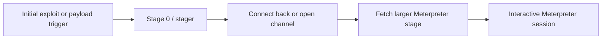
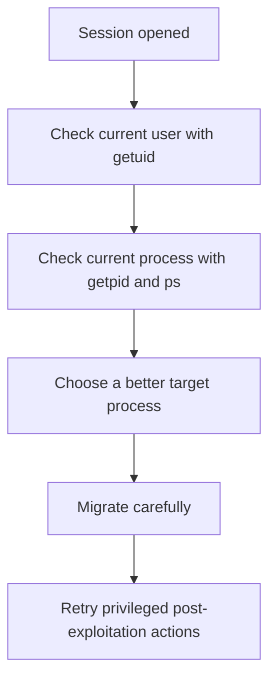
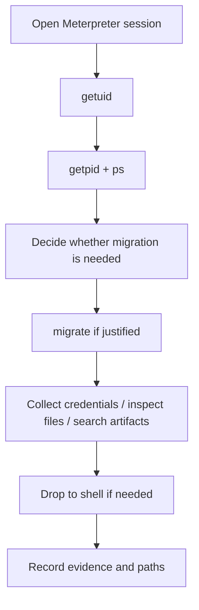

# Metasploit: Meterpreter

## Summary

* **Meterpreter** is Metasploit's advanced payload and session environment for post-exploitation work.
* The room's real subject is not just "what commands exist," but **how Meterpreter sessions behave, how they differ from simpler shells, and how you use them safely and methodically after initial access**.
* A key conceptual split is between **staged** and **stageless** payloads. Meterpreter is historically most often encountered in staged form, but Metasploit also documents stageless Meterpreter modes.
* Meterpreter is powerful because it integrates tightly with Metasploit for session handling, privilege-related actions, process migration, file/system/network interaction, and post-exploitation modules and extensions.
* The most important beginner skills in this room are understanding Meterpreter payload naming, navigating Meterpreter commands, checking identity and process context, using migration carefully, and locating files and extracting key evidence.
* The defensive lesson is equally important: once a Meterpreter session exists, the attack has already moved beyond simple code execution and into an **operator-friendly post-exploitation phase**.

---

## 1. Context

Meterpreter is best understood as Metasploit's **interactive post-exploitation payload** rather than just "a shell."

That distinction matters.

A normal command shell gives you:

* command execution,
* basic filesystem interaction,
* manual follow-on activity.

Meterpreter gives you an environment designed to work *with* the Metasploit Framework itself. That means your session is not isolated from the framework; it becomes part of a broader workflow involving:

* backgrounding and re-entering sessions,
* post modules,
* migration,
* extension loading,
* richer host interaction.

So the real subject of this room is **post-exploitation workflow discipline**.

---

## 2. What Meterpreter Is

### 2.1 Practical definition

Meterpreter is an advanced Metasploit payload that, after successful exploitation or payload execution, provides an in-memory interactive session for post-exploitation tasks.

### Why people like it

Compared with a simpler shell, Meterpreter usually provides:

* tighter Metasploit integration,
* richer built-in commands,
* session-aware tooling,
* easier privilege/context inspection,
* more convenient follow-on actions.

### 2.2 Why it matters operationally

Once a Meterpreter session is opened, the question changes from:

* "Can I get code execution?"

to:

* "What is my current context?"
* "Can I move to a better process?"
* "Can I gather credentials or evidence?"
* "What files or secrets matter?"

That is why Meterpreter belongs to **post-exploitation**, not initial discovery.

---

## 3. Payload Naming and Meterpreter Flavors

One of the most useful skills in this room is learning how to read payload names.

A payload name such as:

```text
windows/x64/meterpreter/reverse_tcp
```

can be read as:

* **platform**: `windows`
* **architecture**: `x64`
* **stage / final payload**: `meterpreter`
* **transport / stager**: `reverse_tcp`

This naming logic is consistent with Metasploit's payload model and is one of the highest-value abstractions to memorize.

---

## 4. Staged vs Stageless Meterpreter

### 4.1 Staged payloads

A **staged payload** uses a small first step to establish communication and then retrieve something larger.

Simple model:



Why staged payloads exist:

* initial shellcode space may be limited,
* a smaller first-stage is easier to fit into exploit constraints,
* transport and final payload can be separated.

### 4.2 Stageless payloads

A **stageless payload** packages what is needed more directly instead of splitting the functionality in the same classic staged way.

In practical terms, this can simplify some workflows and change how staging traffic appears from the framework's perspective.

### 4.3 Why this distinction matters

For a beginner, the most important lesson is:

```text
staged = small loader first, bigger payload later
stageless = more self-contained payload delivery
```

That helps explain why you may see different runtime behaviors and why some Meterpreter payloads appear under slightly different naming or delivery expectations.

---

## 5. Meterpreter Transport Concepts

Meterpreter supports multiple transport styles.

Common examples beginners will encounter:

* `reverse_tcp`
* `reverse_http`
* `reverse_https`

### High-level difference

* **reverse_tcp**: direct callback over TCP
* **reverse_http / reverse_https**: HTTP(S)-style communication models

The important conceptual point is not to memorize every transport detail. It is to understand that the session's communication mechanism is part of the payload design.

That is why choosing a payload is not just choosing "a shell." It is also choosing **how the session will talk**.

---

## 6. Meterpreter Command Model

Once inside a Meterpreter session, `help` is your map.

The command set is usually organized into categories such as:

* core commands,
* file system commands,
* networking commands,
* system commands,
* user-interface or privilege-related actions,
* extension-provided commands.

This organization matters because Meterpreter is not designed to be remembered all at once. It is designed to be **navigated**.

### Practical rule

When you forget a command, do not guess first. Use:

```text
help
```

and then narrow by category.

---

## 7. Core Post-Exploitation Commands in This Room

### 7.1 `getuid`

Purpose:

* show the current user context of the Meterpreter session.

Why it matters:

* post-exploitation without context is sloppy.
* you need to know whether you are a low-privileged user, administrator, or SYSTEM-equivalent context.

### 7.2 `getpid` and `ps`

Purpose:

* inspect the current process context and list processes.

Why it matters:

* Meterpreter runs in a process context.
* process choice affects stability, privileges, and operational options.

### 7.3 `migrate`

Purpose:

* move the Meterpreter session into another process.

Why it matters:

* some processes are more stable,
* some processes have more useful privileges,
* some processes are worse choices and may break the session.

#### Migration principle

```text
Migration is context management, not magic.
```

A bad migration target can reduce usefulness or kill the session.

### 7.4 `hashdump`

Purpose:

* retrieve Windows credential hash material from the appropriate context when privileges allow.

Why it matters:

* it is one of the most famous Meterpreter commands because it turns access into credential evidence.

#### Important caveat

This is context-sensitive:

* OS matters,
* privileges matter,
* process context matters.

Do not treat `hashdump` as a universal command that works the same way everywhere.

### 7.5 `search -f`

Purpose:

* locate files by name from within the target environment.

Why it matters:

* in labs and real operations alike, file discovery is a core post-exploitation task.

### 7.6 `shell`

Purpose:

* drop into a more conventional command shell from within Meterpreter.

Why it matters:

* sometimes you want Meterpreter-native commands,
* sometimes you just want a normal shell interaction.

That duality is one of Meterpreter's practical strengths.

---

## 8. Extensions and Loading More Capability

Meterpreter can load extensions or components that expand what the session can do.

Examples from the room logic include:

* loading additional command families,
* using integrated credential-oriented or post-exploitation capabilities.

### Practical meaning

Meterpreter is not only a static payload. It is also an extensible post-exploitation environment.

That is why `help` output can change after loading new functionality.

---

## 9. Process Context and Migration

This room spends meaningful time on process context, and that is the correct emphasis.

### 9.1 Why process context matters

A Meterpreter session is living in the context of some process.

That process determines things like:

* privilege level,
* stability,
* access scope,
* visibility to monitoring,
* what post-exploitation actions will work cleanly.

### 9.2 Migration as a workflow step

A common pattern is:



This is not a cosmetic action. It is often the difference between a useful and a frustrating session.

---

## 10. Post-Exploitation Challenge Logic

The room's challenge is effectively training the following habit:

1. establish or inherit a Meterpreter session,
2. inspect identity and environment,
3. enumerate contextual clues,
4. migrate when needed,
5. collect hashes or file-based evidence,
6. use search and shell pragmatically,
7. document the findings.

This is a good beginner model because it forces you to stop treating Meterpreter as a toy console and start treating it like an **operational workspace**.

---

## 11. Mini Workflow for a Meterpreter Session



This is the room in one picture.

---

## 12. Command Cookbook

> Lab-safe, placeholder-based examples only.

### Show current user context

```text
getuid
```

### Show current process ID

```text
getpid
```

### List running processes

```text
ps
```

### Migrate into another process by PID

```text
migrate TARGET_PID
```

### Search for a file by name

```text
search -f secret.txt
```

### Drop to a conventional shell

```text
shell
```

### Return from shell to Meterpreter

```text
exit
```

### Generic working rhythm

```text
getuid -> getpid -> ps -> migrate (if needed) -> search / shell / post-actions
```

---

## 13. Pattern Cards

### Pattern Card 1 - Meterpreter is a payload environment, not just a shell

**Problem**
: beginners think of Meterpreter as only a prettier command prompt.

**Better view**
: it is tightly integrated with Metasploit session handling and post-exploitation logic.

**Reason**
: this changes how you enumerate, migrate, and collect evidence.

### Pattern Card 2 - Context before action

**Problem**
: users start running commands without checking who they are or where they are running.

**Better view**
: begin with `getuid`, `getpid`, and `ps`.

**Reason**
: context determines whether the next command is useful or meaningless.

### Pattern Card 3 - Migration is selective, not automatic

**Problem**
: migration gets treated like a free upgrade.

**Better view**
: migration trades one process context for another and can help or hurt.

**Reason**
: bad migration targets reduce session quality.

### Pattern Card 4 - Search is evidence acceleration

**Problem**
: users manually wander the filesystem.

**Better view**
: use file search when you already know or suspect a filename.

**Reason**
: targeted search reduces noise and speeds up evidence collection.

### Pattern Card 5 - Shell and Meterpreter are complementary

**Problem**
: users try to solve everything in one interface style.

**Better view**
: Meterpreter-native commands and regular shell commands each have their place.

**Reason**
: operational fluency means switching modes when appropriate.

---

## 14. Common Pitfalls

### 14.1 Treating all Meterpreter payloads as identical

Transport and staging differences matter.

### 14.2 Ignoring architecture/platform in payload names

A payload name is not decorative. It encodes compatibility.

### 14.3 Running `hashdump` blindly

Privilege and process context matter. The command is not magic.

### 14.4 Migrating too early or to the wrong process

Migration is powerful but not consequence-free.

### 14.5 Forgetting that Meterpreter and shell commands are different layers

A command that works in a normal shell may not be a Meterpreter-native command, and vice versa.

---

## 15. Defensive Takeaways

Meterpreter is valuable for defenders to study because it shows what a mature post-exploitation environment looks like.

Defensive implications:

* initial exploitation is only the beginning,
* process context matters to the attacker,
* credential access often follows quickly once privilege is sufficient,
* session persistence and migration complicate simple "one process = one attacker" mental models,
* monitoring and EDR need to reason about post-exploitation behavior, not just initial payload delivery.

This is the point where "a compromised host" starts becoming "an operator-controlled host."

---

## 16. Takeaways

* Meterpreter is Metasploit's advanced post-exploitation payload environment.
* Understanding payload naming helps you understand what a Meterpreter session actually is.
* The staged vs stageless distinction is fundamental to how Meterpreter can be delivered.
* `getuid`, `getpid`, `ps`, `migrate`, `search`, and `shell` are core beginner commands because they establish context and operational control.
* Migration is one of the most important skills in this room because it teaches you that process context is part of exploitation quality.
* The room's challenge is really about disciplined post-exploitation workflow, not flashy commands.

---

## 17. CN-EN Glossary

* Meterpreter - Metasploit 高级后渗透载荷 / 会话环境
* Payload - 载荷
* Staged Payload - 分阶段载荷
* Stageless Payload - 非分阶段载荷
* Stager - 引导阶段 / 第一阶段小载荷
* Stage - 主阶段 / 第二阶段功能载荷
* Reverse TCP - 反连 TCP
* Reverse HTTP / HTTPS - 反连 HTTP / HTTPS 传输
* Session - 会话
* Post-Exploitation - 后渗透
* Process Migration - 进程迁移
* Process Context - 进程上下文
* `getuid` - 获取当前用户上下文
* `getpid` - 获取当前进程 ID
* `ps` - 列出进程
* `hashdump` - 导出哈希
* `search -f` - 按文件名搜索
* `shell` - 切换到常规命令 shell
* Extension Loading - 扩展加载

---

## 18. References

* TryHackMe room content: *Metasploit: Meterpreter*
* Metasploit documentation on payload naming, staged vs stageless payloads, Meterpreter transports, and msfvenom basics
