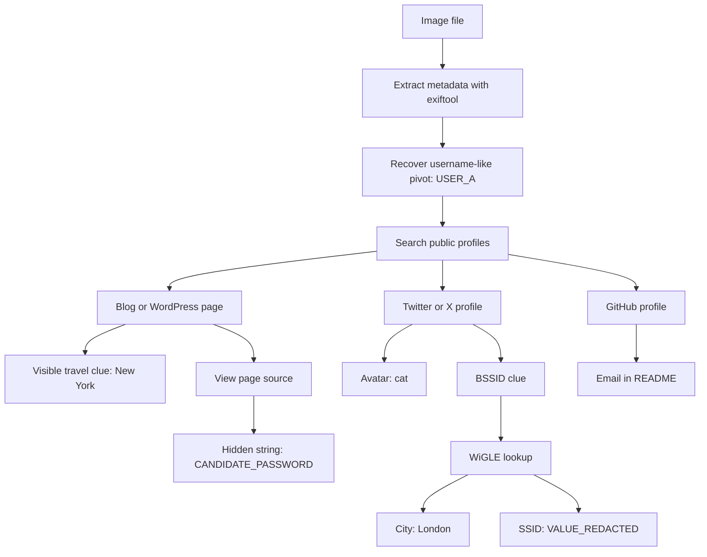

# OhSINT

## Summary

* This challenge starts with **one image file** and asks how much information can be derived from it using open-source intelligence.
* The workflow is a compact example of **pivot-based OSINT**: image -> metadata -> username -> public profiles -> blog source -> social media -> Wi-Fi database -> GitHub.
* The key lesson is structural: one small artefact can expose **identity, travel, approximate location, social accounts, email, and even password-like strings**.
* The room is simple technically, but it teaches an important investigative habit: **do not stare at the picture only; inspect the metadata, the source, the linked profiles, and the hidden context.**

---

## 1. Scenario

The challenge gives a single image, `WindowsXP.jpg` or `WindowsXP_1551719014755.jpg`, and asks the investigator to recover multiple pieces of information about the owner using only publicly available traces.

This is classic **OSINT chaining**:

```text
Image
 -> metadata
 -> username
 -> public web presence
 -> hidden page content
 -> social/media pivot
 -> infrastructure/location clue
 -> developer profile
 -> email disclosure
```

---

## 2. Core Investigation Workflow

### 2.1 Step 1 - Start with image metadata

The first useful move is not reverse image search. It is metadata extraction.

Example command:

```bash
exiftool WindowsXP.jpg
```

From the screenshots, `exiftool` reveals several valuable fields:

* `File Name: WindowsXP.jpg`
* `MIME Type: image/jpeg`
* GPS latitude and longitude
* `Copyright: USER_A`

The decisive pivot is the copyright or author-like string:

```text
USER_A
```

That becomes the first stable identifier.

#### Why this matters

A lot of beginner OSINT fails because people search visually first and structurally second. Metadata often gives you a **handle** before the image content itself does.

### 2.2 Step 2 - Search the username

Searching `USER_A` leads to several public-facing traces:

* a blog or WordPress page
* a Twitter or X profile
* a GitHub profile

This is the first major pivot expansion.

A useful principle here:

```text
Unique usernames collapse uncertainty.
```

The more unusual the handle, the more likely multiple services belong to the same person.

### 2.3 Step 3 - Inspect the blog

The screenshots show a blog branded to the same persona as `USER_A`.

On the author page, a post says:

```text
Im in New York right now, so I will update this site right away with new photos!
```

This supports the answer to the holiday question.

#### Step 3 derived answer

* **Where has the person gone on holiday?** -> **New York**

#### Why this is interesting

This is not a technical exploit. It is a reminder that people leak sensitive context casually.

Public travel disclosure can support:

* timeline correlation
* physical absence inference
* social engineering
* house occupancy assumptions

### 2.4 Step 4 - View page source, not just page content

The walkthrough then pivots from the visible page into the HTML source.

This is a crucial OSINT habit.

Inside the page source, a hidden string appears in white text:

```text
CANDIDATE_PASSWORD
```

This string is treated in the challenge as the password.

#### Step 4 derived answer

* **What is the password?** -> `CANDIDATE_PASSWORD`

#### Structural lesson

Hidden text in source is still public. "Invisible in the browser" does **not** mean secret.

### 2.5 Step 5 - Inspect the social profile

The linked social profile shows:

* a handle related to `USER_A`
* profile bio themes related to photography and open-source projects
* avatar image of a **cat**
* a post mentioning a BSSID or wireless clue

#### Derived answer

* **What is this user's avatar of?** -> **a cat**

This same profile also exposes the wireless pivot needed for geolocation.

### 2.6 Step 6 - Pivot through Wi-Fi or BSSID data

A post contains a BSSID-like identifier:

```text
MAC_A
```

That can be looked up in **WiGLE** to map observed wireless networks.

Using the BSSID in WiGLE leads to a location near **London** and an SSID recorded in the walkthrough as:

```text
VALUE_REDACTED
```

#### Derived answers

* **What city is this person in?** -> **London**
* **What is the SSID of the WAP he connected to?** -> `VALUE_REDACTED`

#### Step 6 why this matters

This is the strongest operational lesson in the room.

A posted BSSID can sometimes reveal:

* approximate location
* travel pattern
* home or work movement
* nearby organisation footprint

That is a very real OPSEC failure.

### 2.7 Step 7 - Pivot into GitHub

The GitHub screenshot shows a repository named:

```text
people_finder
```

The README contains self-description text and a public email address:

```text
user@example.com
```

It also clearly shows the site where the email was found.

#### Step 7 derived answers

* **What is his personal email address?** -> `user@example.com`
* **What site did you find his email address on?** -> **GitHub**

---

## 3. Consolidated Answers

| Question | Answer |
| --- | --- |
| User avatar | cat |
| City | London |
| SSID or WAP name | `VALUE_REDACTED` |
| Personal email | `user@example.com` |
| Site where email was found | GitHub |
| Holiday location | New York |
| Password | `CANDIDATE_PASSWORD` |

---

## 4. Investigation Logic as an Analyst Workflow



---

## 5. What This Room Actually Teaches

### 5.1 One artefact can be enough

A single image can expose much more than visual content:

* embedded metadata
* author naming patterns
* geolocation traces
* linked accounts
* behaviour clues
* operational mistakes

### 5.2 OSINT is mostly pivot discipline

The challenge is not difficult because the tools are advanced. It is difficult only if you do not know **where to pivot next**.

The real skill is:

1. find a stable clue
2. pivot carefully
3. validate identity overlap
4. collect only useful evidence

### 5.3 Public does not mean harmless

Every disclosed item in the room is "public," but in combination they become dangerous.

That is a core OSINT principle:

```text
Low-sensitivity fragments can become high-sensitivity intelligence when correlated.
```

### 5.4 Hidden-in-source is still exposed

Developers and casual users often assume that text hidden with styling is secret. It is not. If the browser receives it, the investigator can read it.

### 5.5 Wireless artefacts can leak location

Wi-Fi identifiers, especially BSSIDs, can support approximate real-world geolocation through public databases. This has real OPSEC implications.

---

## 6. Tooling Used

### 6.1 ExifTool

Used to extract metadata from the image.

Example:

```bash
exiftool WindowsXP.jpg
```

Useful fields in image OSINT:

* copyright or author
* GPS coordinates
* timestamps
* device or software name
* thumbnail or profile metadata

### 6.2 Browser view-source or inspect

Used to reveal hidden HTML text that is not clearly visible on the page.

### 6.3 Search engine pivoting

Used to correlate username reuse across platforms.

### 6.4 WiGLE

Used to pivot from BSSID to approximate location and SSID.

### 6.5 GitHub

Used as a public identity and disclosure source.

---

## 7. Reusable Mini-Checklist for Image-First OSINT

When given only an image, follow this order:

```text
1. Check filename
2. Extract metadata
3. Recover usernames, handles, or copyright strings
4. Search usernames across platforms
5. Inspect blog or profile text for travel, work, and contacts
6. View HTML source for hidden content
7. Check linked social accounts
8. Pivot on wireless, device, or geolocation clues
9. Inspect public code repos and READMEs
10. Correlate, then answer only what is supported
```

---

## 8. Analyst Notes and Pitfalls

### 8.1 Pitfall 1 - jumping straight to reverse image search

Useful sometimes, but structurally weaker than metadata if metadata exists.

### 8.2 Pitfall 2 - trusting a single profile too early

Always validate that the blog, social, and GitHub accounts are the same person through overlap:

* same handle
* same bio themes
* same photo or persona style
* cross-links between platforms

### 8.3 Pitfall 3 - ignoring page source

Some of the most important room data is hidden in the source, not in the visible page.

### 8.4 Pitfall 4 - treating password-like strings as confirmed real-world credentials

Inside a challenge room, the string is the answer. In real work, a discovered string is only a **candidate secret** until validated ethically and lawfully.

---

## 9. Security and OPSEC Lessons for Real Users

This room is really an OPSEC failure case study.

Do **not** casually expose:

* travel status
* personal email in public repos
* reused usernames everywhere
* Wi-Fi identifiers tied to your location
* hidden strings in web source
* passwords or password hints anywhere public

A practical rule:

```text
Assume strangers can correlate your public breadcrumbs better than you can.
```

---

## 10. Takeaways

* OSINT is not magic. It is disciplined correlation.
* Metadata is often the first crack in the wall.
* Username reuse is a powerful pivot.
* HTML source matters.
* Wi-Fi artefacts can leak location.
* Public repos leak identity information more often than people think.
* The room is simple, but the pattern is realistic.

---

## Related Tools

* `exiftool`
* browser `view-source:` and DevTools
* search engines
* WiGLE
* GitHub search

---

## Further Reading

* image metadata analysis
* username correlation in OSINT
* Wi-Fi or BSSID geolocation research
* OPSEC for public developer profiles
* HTML source and hidden content discovery

---

## CN-EN Glossary

* OSINT - 开源情报
* Metadata - 元数据
* EXIF - 可交换图像文件元数据
* Pivot - 情报跳转 / 枢纽线索
* BSSID - 无线接入点的 MAC 标识
* SSID - Wi-Fi 名称
* View Source - 查看网页源代码
* Handle or Username - 用户名 / 网名
* Correlation - 关联分析
* OPSEC - 行动安全 / 操作安全
* Public artefact - 公开痕迹
* Attribution clue - 归因线索
