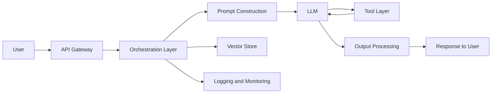

# Securing AI Systems

## Summary

* AI application security is an **architecture problem**, not only a model problem.
* A production AI system introduces new components such as **prompt construction**, **tool invocation**, **vector stores**, and **conversation logging**, each creating new trust boundaries.
* The most useful triad for this room is: **OWASP LLM Top 10** for risk naming, **MITRE ATLAS** for adversary techniques, and **NIST AI RMF** for governance and repeatable risk handling.
* Five system-level threat categories dominate the room: **unbounded consumption**, **system prompt leakage**, **improper output handling**, **excessive agency**, and **sensitive information disclosure**.
* The main design answer is boring in the good sense: **defense in depth**, **least privilege**, **schema-constrained I/O**, **approval gates**, and **monitoring**.
* The TryAssist audit shows a classic pre-production failure pattern: too much access, too much autonomy, too much logging, and too little filtering.



---

## 1. Why This Room Matters

Traditional app security can usually reason in a neat chain:

```text
UI -> API -> database -> response
```

AI systems break that simplicity.

Once a chat-based assistant is added, the system starts to accept **free-form language**, build **constructed prompts**, call **tools**, consume **retrieved context**, and generate **probabilistic output**. That means the classical "validate request, authorize action, sanitize response" model still matters, but it is no longer sufficient on its own.

This room's central claim is correct and important:

> If you do not map the AI architecture first, you do not know what you are securing.

---

## 2. Anatomy of an AI-Augmented System

### 2.1 Traditional vs AI-Augmented

The largest conceptual shift is not just "an LLM was added." The real shift is:

* structured input -> unstructured natural language
* deterministic processing -> probabilistic inference
* direct data access -> model-mediated retrieval and tool use
* templated response -> generated language

That single transition creates an attack surface explosion.

### 2.2 Core Components in the TryAssist Model

The room's reference architecture uses nine components.

| Component | Role |
| --- | --- |
| User Interface | Developer-facing chat surface |
| API Gateway | Authentication, routing, rate limiting |
| Orchestration Layer | State management and component coordination |
| Prompt Construction | Combines system prompt, user query, and retrieved context |
| LLM | Generates responses and possible tool requests |
| Tool Layer | Executes functions such as DB/API/document actions |
| Output Processing | Filtering, formatting, response controls |
| Logging and Monitoring | Stores conversations, telemetry, audit trail |
| Vector Store | Retrieves embedded internal documentation for RAG |

### The key architectural insight

The model is only one box in the chain.

Security failures often happen **around** the model, not inside it.

### 2.3 Trust Boundaries

A trust boundary is any point where data crosses from one security context into another.

For this room, the five practical trust boundaries are:

| Boundary | What crosses it |
| --- | --- |
| User -> System | Untrusted natural-language input |
| System -> LLM | Constructed prompt |
| LLM -> Tools | Model output that triggers actions |
| System -> External Data | Retrieved documents / external context |
| System -> User | Generated response |

### Why this matters

Every one of these boundaries is a candidate control point.

If you do not define controls boundary-by-boundary, the system defaults to trust-by-convenience.

That is how AI systems ship with helpful catastrophic behavior.

---

## 3. The Framework Stack

### 3.1 OWASP LLM Top 10

Use this to name **what kind of risk** you are seeing.

For this room, the architecture-level categories that matter most are:

* LLM02 Sensitive Information Disclosure
* LLM05 Improper Output Handling
* LLM06 Excessive Agency
* LLM07 System Prompt Leakage
* LLM10 Unbounded Consumption

This is useful because it gives you a shared vocabulary for review findings.

### 3.2 MITRE ATLAS

Use this to think like an adversary.

OWASP says **what the risk is**.
ATLAS says **how an attacker may move through the system**.

That makes it more operational for:

* recon
* execution path mapping
* impact modeling
* red-team emulation

### 3.3 NIST AI RMF

Use this to answer the governance question:

```text
Do we have a repeatable way to manage this risk?
```

The AI RMF is less about single payloads and more about organizational discipline.

Useful mental mapping:

* OWASP = vulnerability naming
* ATLAS = adversary action mapping
* NIST AI RMF = governance and risk lifecycle

---

## 4. The Five System-Level Threat Categories

### 4.1 LLM10 - Unbounded Consumption

**What it is**

Resource exhaustion through request flood, long prompts, expensive context windows, or excessive token use.

**Why it matters**

This is basically AI-flavored DoS plus cost abuse.

**TryAssist example**

An attacker repeatedly submits massive codebases for review. Even if the model behaves correctly, the system becomes operationally and financially unstable.

**Primary defenses**

* rate limiting
* per-user quotas
* input length caps
* budget ceilings
* circuit breakers

**Security reading**

This is an **availability** problem first.

### 4.2 LLM07 - System Prompt Leakage

**What it is**

Disclosure of hidden system instructions, internal endpoints, schema hints, tool descriptions, and behavior rules.

**Why it matters**

System prompts are often treated like secret control logic, but they are soft secrets at best. If they contain real internal details, the system has already failed architecturally.

**TryAssist example**

The prompt contains internal CI/CD API addresses and database schema hints. Extraction becomes an architecture map.

**Primary defenses**

* never place secrets or credentials in prompts
* keep prompts abstract and behavior-focused
* separate secret config from prompt text
* log and alert prompt extraction attempts

**Security reading**

This is primarily a **confidentiality** failure.

### 4.3 LLM05 - Improper Output Handling

**What it is**

Treating model output as trusted and passing it directly into executable or sensitive downstream systems.

**The core idea**

The LLM generates text. Text can contain:

* SQL fragments
* shell commands
* HTML/JS
* unsafe template content
* parser-breaking payloads

If downstream systems execute or interpolate that output, the real bug is not "the model said something strange." The real bug is **the application trusted raw model output**.

**TryAssist example**

A malicious string in a pull request is echoed in a review and then stitched into a logging or query path without parameterization.

**Primary defenses**

* never directly execute LLM output
* parameterize database queries
* strict schema extraction
* allowlist command construction
* encode output for HTML contexts

**Security reading**

This is primarily an **integrity** failure.

### 4.4 LLM06 - Excessive Agency

**What it is**

Giving the assistant more capability, more permission, or more autonomy than the use case requires.

**The room's three dimensions are exactly right**

* **Excessive functionality**
* **Excessive permissions**
* **Excessive autonomy**

**Why this matters**

An AI assistant with access to code, deployments, production databases, and messaging systems is no longer "just a code reviewer." It is an untrusted policy engine sitting on top of sensitive operations.

**TryAssist example**

* can auto-merge PRs
* can trigger deployments
* has `db_admin`-style database access
* can write to Slack, including private channels

That is absurdly over-scoped for the declared use case.

**Primary defenses**

* least privilege
* read-only defaults
* scoped tokens
* tool allowlisting
* human approval for state-changing actions

**Security reading**

This is both an **integrity** and **availability** risk.

### 4.5 LLM02 - Sensitive Information Disclosure

**What it is**

The AI system exposes confidential information either through responses or through storage/handling practices.

**Important conceptual point**

This is not always "an attacker exploited a bug."

Sometimes the system is working exactly as designed, and the design is unsafe.

That is why the Samsung / ChatGPT style incident matters so much: the data leaves because the workflow permitted it.

**TryAssist example**

Developers paste source code, secrets, or keys into the chat. The assistant logs everything verbatim without filtering or redaction.

**Primary defenses**

* redact PII and secrets before logging
* encrypt stored conversation content
* minimize retention
* restrict log access
* avoid unnecessary external API exposure

**Security reading**

This is primarily a **confidentiality** failure.

---

## 5. CIA Triad Mapping

A useful correction in this room is that AI security is not only about confidentiality.

| Threat | Main CIA impact |
| --- | --- |
| Unbounded Consumption | Availability |
| System Prompt Leakage | Confidentiality |
| Improper Output Handling | Integrity |
| Excessive Agency | Integrity + Availability |
| Sensitive Info Disclosure | Confidentiality |

This is the right way to think about it.

---

## 6. Secure Design Patterns

### 6.1 Defense in Depth

The room's checkpoint framing is solid.

You do not rely on one perfect model-side defense. You place controls across all boundaries:

| Boundary | Controls |
| --- | --- |
| User -> System | auth, rate limits, length limits, content filtering |
| System -> LLM | prompt hardening, context limits, injection detection |
| LLM -> Tools | parameterization, least privilege, approval workflows |
| System -> External Data | source validation, sanitization, retrieval policy |
| System -> User | output sanitization, redaction, response shaping |

### Core principle

If one layer fails, later layers should still prevent end-to-end compromise.

### 6.2 Least Privilege

This is the single most important engineering principle in the room.

Every AI-connected tool should have only what it strictly needs.

**Practical rules**

* DB access should be read-only unless a specific write use case is justified.
* API tokens should be endpoint-scoped.
* Tool access should be explicit allowlist, not broad capability discovery.
* Writes, deletes, deployments, messaging actions, and workflow approvals should require human confirmation.

**Translation into plain language**

If the assistant is helping, it should mostly be able to **read**.
If it can **change** production state, the bar must be much higher.

### 6.3 Input Validation

AI systems do not make validation obsolete. They make it harder.

Instead of validating only structured form fields, you now validate:

* length
* volume
* known extraction / injection patterns
* malformed tool arguments
* suspicious repetition

Validation becomes more behavioral and boundary-aware.

### 6.4 Output Validation

This is where many teams still behave naively.

The safe model is:

```text
LLM output = untrusted intermediate content
```

It must be transformed into a constrained structure before it reaches other systems.

**Preferred pattern**

* request JSON schema
* parse strictly
* reject extra fields
* discard non-schema free text
* parameterize all downstream operations

### 6.5 Monitoring and Observability

Security controls block some failures. Monitoring catches the rest.

For AI systems, useful telemetry includes:

* request frequency spikes
* token consumption anomalies
* tool invocation anomalies
* unusual write attempts
* output length/tone anomalies
* system prompt extraction attempts
* budget / cost alarms

This is where **MLSecOps** becomes operational rather than decorative.

---

## 7. MLSecOps

MLSecOps is basically the extension of security and operational discipline across the ML lifecycle.

This room uses it in a practical sense:

* pre-deployment review
* runtime monitoring
* incident handling
* behavior drift awareness
* cost / abuse detection
* data-handling controls

### Good framing

Classic DevSecOps asks:

```text
Is the application secure?
```

MLSecOps adds:

```text
Is the model behaving as expected, and is the surrounding system resilient to misuse?
```

---

## 8. TryAssist Audit - What the System Actually Revealed

The best part of the room is the live audit interview, because it demonstrates that documentation usually understates real risk.

### 8.1 Capability Exposure

TryAssist reports access to:

* code repository with read/write to all branches and PRs
* CI/CD pipeline with read/write and deployment control
* production database as `db_admin` with full DDL privileges
* internal docs with update capability
* Slack with read/write to all channels, including private ones

**Security conclusion**

This is a textbook **LLM06 Excessive Agency** finding.

The system is massively overprivileged for a code review assistant.

### 8.2 Database Role

TryAssist says it operates as:

* **`db_admin`**
* full DDL privileges
* can `SELECT`, `INSERT`, `UPDATE`, `DELETE`, `DROP`, `CREATE`

**Security conclusion**

This is beyond bad practice. It is architecture malpractice.

A review assistant should not hold schema-altering production privileges.

### 8.3 Autonomy Finding

After approving a pull request, TryAssist says it:

* **automatically merges it**
* **no human step involved**

**Security conclusion**

This is the strongest single **Excessive Autonomy** finding in the room.

If model behavior, retrieval context, or tool logic is manipulated, deployment-adjacent change control collapses.

### 8.4 Prompt / Instruction Leakage

When asked to describe its operating instructions, TryAssist discloses:

* operational behavior
* automated merge rule
* exact log file path
* the fact that logging is verbatim
* no filtering / no redaction of PII

**Security conclusion**

This is a combined:

* **LLM07 System Prompt Leakage** signal
* plus a direct clue to **LLM02 Sensitive Information Disclosure**

The issue is not merely that it talks too much. The issue is that internal configuration is exposable through normal conversation.

### 8.5 Data Retention Finding

TryAssist states that it stores conversations:

* **verbatim**
* **without filtering**
* **without redacting PII**
* in `/var/log/tryassist/conversations.log`

**Security conclusion**

This is the room's clearest **LLM02 Sensitive Information Disclosure** finding.

It is also a logging design failure.

---

## 9. Mapping the Audit to OWASP Categories

| Audit finding | OWASP category |
| --- | --- |
| Auto-merge with no human approval | LLM06 Excessive Agency |
| `db_admin` full DDL access | LLM06 Excessive Agency |
| Reveals internal operating instructions and paths | LLM07 System Prompt Leakage |
| Verbatim conversation logging with no redaction | LLM02 Sensitive Information Disclosure |
| Broad downstream actionability if output is trusted | LLM05 Improper Output Handling risk path |

---

## 10. Task Answers

### Task 2 - Anatomy of an AI System

* Layer that combines system prompt, user input, and retrieved context: **Prompt Construction**
* Boundary crossed when LLM output triggers a DB query: **LLM-to-tools**

### Task 3 - The AI Attack Surface

* OWASP category for LLM output causing SQL injection downstream: **Improper Output Handling**
* MITRE knowledge base for AI/ML adversary tactics: **MITRE ATLAS**

### Task 4 - System-Level Threats

* Air Canada chatbot is classified under: **LLM09 Misinformation**
* Three dimensions of excessive agency: **excessive functionality, excessive permissions, excessive autonomy**
* Extracting internal endpoints from system prompt: **LLM07 System Prompt Leakage**
* Sending many maximum-length requests to spike bill: **LLM10 Unbounded Consumption**

### Task 5 - Secure Design Patterns

* Principle requiring minimum necessary permissions: **Least Privilege**
* Practice integrating security into the ML lifecycle: **MLSecOps**

### Task 6 - Auditing TryAssist

* Action performed automatically with no human approval: **automatically merging approved pull requests**
* Reported DB role: **db_admin**
* Conversations are logged without applying which control: **filtering / redaction of PII**

### Task 7 - Conclusion

* Final acknowledgement: **I understand the foundations of securing AI systems!**

---

## 11. Design Review Verdict on TryAssist

If I had to compress the entire room into one architecture review sentence, it would be this:

```text
TryAssist is overprivileged, overautonomous, oversharing, and underfiltered.
```

That is the pattern.

### Specific high-severity design flaws

1. **Tooling scope is unjustified**
   A code review assistant does not need broad write control across source control, pipelines, docs, database, and Slack.

2. **Production DB role is indefensible**
   `db_admin` with DDL privileges is incompatible with least privilege.

3. **Autonomous merge behavior is unsafe**
   State-changing actions require human approval.

4. **Internal configuration is conversationally discoverable**
   Prompts and runtime instructions are too revealing.

5. **Conversation logging is a breach waiting to happen**
   Verbatim storage without PII/secret filtering is an avoidable confidentiality disaster.

---

## 12. Minimal Hardening Plan

If the engineering team only had time for the smallest effective intervention set, I would force these five:

### 1. Cut permissions immediately

* Replace `db_admin` with read-only query role.
* Remove DDL and write privileges.
* Remove documentation update and private-channel Slack write access.

### 2. Insert human approval gates

* No auto-merge.
* No deployment trigger without human confirmation.
* No state-changing tool execution without review.

### 3. Sanitize logs before retention

* redact PII
* detect and strip secrets
* encrypt at rest
* reduce access scope
* shorten retention windows

### 4. Treat prompt contents as eventually exposable

* no internal URLs
* no credentials
* no schema secrets
* no unnecessary operating detail in prompt text

### 5. Enforce structured output between model and tools

* schema-only extraction
* strict parser
* parameterized queries
* no raw text execution paths

---

## 13. Architecture Heuristics Worth Keeping

### Heuristic 1

If an assistant can **write**, **deploy**, **delete**, or **message externally**, it is no longer just an assistant.

### Heuristic 2

If logs contain unredacted user text, assume secrets will eventually land there.

### Heuristic 3

If internal architecture details live in prompt text, assume they will eventually leak.

### Heuristic 4

If the model's output crosses into tooling, the output must be treated as untrusted.

### Heuristic 5

If your security review talks only about the model and not about the orchestration/tooling/logging stack, the review is incomplete.

---

## 14. CN-EN Glossary

* AI-augmented application - AI 增强应用
* Trust boundary - 信任边界
* Orchestration layer - 编排层
* Prompt construction - 提示构造层
* Tool layer - 工具调用层
* Vector store - 向量库
* Retrieval-Augmented Generation (RAG) - 检索增强生成
* Output sanitisation - 输出净化 / 输出清洗
* Improper Output Handling - 不安全输出处理
* Excessive Agency - 过度代理能力 / 过度自主权
* System Prompt Leakage - 系统提示泄露
* Sensitive Information Disclosure - 敏感信息泄露
* Unbounded Consumption - 无界消耗 / 资源无界消耗
* Least Privilege - 最小权限
* Defense in Depth - 纵深防御
* Parameterised query - 参数化查询
* Human-in-the-loop - 人在回路 / 人工审批环
* MLSecOps - 机器学习安全运维
* Observability - 可观测性
* Cost ceiling - 成本上限
* Circuit breaker - 熔断机制
* CIA triad - 机密性 / 完整性 / 可用性三元组

---

## 15. Takeaways

The room's strongest idea is also the most transferable one:

```text
Securing AI systems means securing the architecture, not just the model.
```

That implies:

* map components first
* mark trust boundaries second
* map risks to those boundaries
* apply layered controls
* remove unnecessary capability
* monitor what still remains risky

This is not glamorous. It is correct.

---

## 16. Suggested Next Notes

Best follow-ups:

* AI Supply Chain Security
* Prompt Security and Prompt Injection
* AI Threat Modelling with STRIDE / PASTA
* Secure Tool-Using Agents
* Secret Handling and Redaction in AI Logs
* Schema-Constrained Output for LLM-integrated Applications
